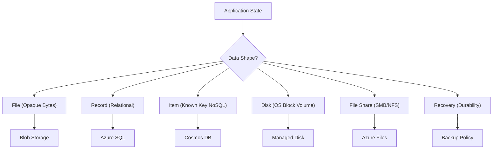

## Table of Contents

1. [What Is Data Storage](#what-is-data-storage)
2. [Declaring Storage Infrastructure with Bicep](#declaring-storage-infrastructure-with-bicep)
3. [Data Shape](#data-shape)
4. [Files](#files)
5. [Records](#records)
6. [Items](#items)
7. [Disks](#disks)
8. [File Shares](#file-shares)
9. [Recovery](#recovery)
10. [Sample Data Map](#sample-data-map)
11. [Putting It All Together](#putting-it-all-together)
12. [What's Next](#whats-next)

## What Is Data Storage

Azure data storage is where application state lives after the running code stops, moves, or restarts. More precisely, it is the virtualized platform layer that preserves application state outside the volatile running processes of your compute infrastructure. A virtual machine can experience hardware degradation, a container can be dynamically recycled, and a serverless function invocation will terminate after its execution window ends. Data storage resources move application facts, files, and database records out of these ephemeral compute host boundaries, guaranteeing that your data remains durable, consistent, and reachable across host migrations and restarts.

:::expand[Under the Hood: Storage Data Planes and Control Planes]{kind="design"}
Behind Azure's storage PaaS interfaces sits a managed storage platform that separates two jobs. The data plane accepts reads and writes for blobs, files, disks, and database pages. The control plane, exposed through Azure Resource Manager, creates resources, changes configuration, assigns identities, applies tags, and updates policies.

The public contract you design against is the Azure Storage redundancy model, not a specific cabinet or network card layout. Locally redundant storage keeps three synchronous copies of data in a single physical location in the primary region. Zone-redundant storage keeps synchronous copies across three availability zones in supported regions. Geo-redundant options add asynchronous replication to a secondary region.

That separation matters operationally. A blob upload, SQL transaction, Cosmos DB item write, or managed disk I/O request follows the service's data plane. Creating the storage account, changing its replication setting, assigning RBAC, or adding a private endpoint follows the control plane. When you debug storage, first ask which plane is failing: the data request, the resource configuration, or the network and identity path between them.
:::

### Declaring Storage Infrastructure with Bicep

To deploy a standard, multi-tier data architecture using Infrastructure as Code, you declare the Blob Storage account, Azure SQL Database, and Cosmos DB accounts in a Bicep template. This matches a standard production orders system where unstructured assets, relational records, and key-value items are separated:

```bicep
resource storageAccount 'Microsoft.Storage/storageAccounts@2022-09-01' = {
  name: 'stportaldata456'
  location: resourceGroup().location
  sku: {
    name: 'Standard_ZRS'
  }
  kind: 'StorageV2'
  properties: {
    supportsHttpsTrafficOnly: true
    minimumTlsVersion: 'TLS1_2'
  }
}

resource sqlServer 'Microsoft.Sql/servers@2022-05-01-preview' = {
  name: 'sql-portal-transactional'
  location: resourceGroup().location
  properties: {
    administratorLogin: 'cloudadmin'
    administratorLoginPassword: 'vaultedSecretPassword123'
  }
}

resource sqlDatabase 'Microsoft.Sql/servers/databases@2022-05-01-preview' = {
  parent: sqlServer
  name: 'db-orders'
  location: resourceGroup().location
  sku: {
    name: 'GP_S_Gen5_1'
    tier: 'GeneralPurpose'
    family: 'Gen5'
    capacity: 1
  }
}

resource cosmosAccount 'Microsoft.DocumentDB/databaseAccounts@2022-08-15' = {
  name: 'cosmos-portal-items'
  location: resourceGroup().location
  kind: 'GlobalDocumentDB'
  properties: {
    databaseAccountOfferType: 'Standard'
    locations: [
      {
        locationName: resourceGroup().location
        failoverPriority: 0
        isZoneRedundant: true
      }
    ]
    consistencyPolicy: {
      defaultConsistencyLevel: 'Session'
    }
  }
}
```

### Under the Hood: Redundancy Physics and SLAs

Storage redundancy is the copy policy that decides how many replicas Azure keeps and where those replicas live. When selecting storage SKU parameters in your Bicep templates, your choice directly alters the underlying physical data replication topology, write path synchronization locks, and service-level agreement (SLA) promises.

Under Locally Redundant Storage (LRS), the platform synchronously replicates your data three times inside a single physical datacenter building. If a server rack power supply or storage drive array fails, the local platform switches to a hot replica attached to the same power grid. However, if a major facility hazard occurs, all copies can be lost. LRS provides a base tier suitable for non-critical caches or temporary build directories, guaranteeing an annual durability SLA of 99.999999999% (11 nines).

Under Zone-Redundant Storage (ZRS), the platform synchronously replicates your data across three physically separate Availability Zones within the primary region. A write request is not acknowledged as successful until it is successfully committed to disk across at least two distinct zonal facilities connected by low-latency fiber rings. If an entire zone experiences a power utility failure, your application continues running uninterrupted as the control plane redirects read and write requests to the active zones. ZRS provides a robust foundation for active workloads, promising an annual durability SLA of 99.9999999999% (12 nines).

Under Geo-Redundant Storage (GRS), the platform performs synchronous Locally Redundant Storage replication inside the primary region, and then asynchronously streams replica bytes to a paired secondary region located hundreds of miles away. Because the cross-region link is asynchronous, write latency remains identical to LRS, but a complete primary region failure requires an administrative DNS failover and can result in minor data loss representing the Recovery Point Objective lag. GRS secures critical long-term records from geographic disasters, promising an annual durability SLA of 99.99999999999999% (16 nines).

If you host infrastructures on AWS, Azure's storage portfolio maps cleanly to the Amazon Web Services portfolio. Azure Blob Storage serves as the regional object storage equivalent of Amazon S3, Azure SQL Database serves as the managed relational equivalent of Amazon RDS, and Azure Cosmos DB maps directly to the known-key access pattern model of Amazon DynamoDB. For virtual machine block storage, Azure Managed Disks serve the same role as Amazon EBS volumes, and Azure Files maps to the managed shared directory structure of Amazon EFS.

Rather than choosing a storage service based on generic service names, evaluate the structural shape of your data. The shape of the data - whether it is a whole file, a relational table row, a NoSQL key-value document, or a mounted operating system volume - determines the access performance, billing rates, and permission scopes your system will inherit.

| Operational Question | Architectural Role inside Data Design |
| --- | --- |
| What is the primary data shape? | Whole files, database records, partition key documents, or raw OS disks dictate your database modeling and query syntax. |
| How does the application read the data? | Primary key searches, complex relational joins, full-text index lookups, or file-system directory mounts determine the engine capabilities needed. |
| How frequently does the data change? | Read-heavy archives, balanced transaction logs, or ultra-fast in-memory cache updates change your resource sizing. |
| What does Azure manage? | Managed database updates, documented redundancy behavior, platform patching, and automatic backup schedules remove infrastructure chores. |
| What must the team still own? | Schema design, indexing strategies, partition key choices, SAS token issuance, and recovery validations remain your responsibility. |

## Data Shape

Data shape is the access contract your application expects from stored state: whole file, relational record, known-key item, OS disk, or shared filesystem. To select the correct cloud data host, evaluate each application state requirement against that shape. A single large enterprise application (such as an e-commerce platform) rarely relies on a single database. Different components within the system require different consistency guarantees and access patterns.


*The storage choice starts with the access pattern: object file, relational row, document item, or shared filesystem.*

A file shape represents a bundle of raw bytes that the application reads, writes, and deletes as a single, opaque block. Product images, generated PDF receipts, support attachments, CSV report exports, and log archives are all file-shaped.

A record shape represents structured business facts that possess clear relationships, consistency rules, and schemas. Order tables linked to line-item tables, customer profiles linked to address tables, and transaction payment logs belong to this shape. They require strict ACID (Atomicity, Consistency, Isolation, Durability) transactional integrity to guarantee that an order is never recorded without its matching line items.

An item shape represents semi-structured data linked to a known lookup key. Idempotency checks, session tokens, user preferences, and real-time job status flags are item-shaped. They do not require complex relational joins or multi-table constraints; they require fast, predictable read/write operations and automated time-to-live (TTL) expiration policies.

A disk shape represents block storage attached to an operating system. Virtual machine boot disks, localized database data paths, and system swap files are disk-shaped. They require a VM-attached block device that the guest operating system can format and mount.

A file share shape represents a mounted network folder that must be concurrently read and written by multiple distinct compute instances using standard file system protocols (such as SMB or NFS). Shared template directories, legacy migrations, and common document shares belong to this shape.



This classification separates state by its access protocol and transaction boundary. Start by mapping each data asset to its core shape, and avoid the anti-pattern of forcing all data into a single database.

## Files

A file is a collection of binary data stored as a single object. Receipt PDFs, CSV reports, and software logs do not have database-like relationships inside their bytes; they are generated as units and must be served to users as units.

In Azure, Blob Storage is the standard PaaS resource for hosting files. If your application code attempts to write a generated receipt PDF directly to the local filesystem of an App Service instance, that file is tied to that specific virtual machine's ephemeral drive. If the App Service scales out, another VM instance will not see the file. If the process recycles, the local directory mounts reset, and the file is permanently lost.

Blob Storage decouples the file from the compute process. Your checkout API writes the receipt PDF directly to a Blob Storage container, receives a stable URL pointer, and writes that pointer to your customer database. When a customer requests a download, your API generates a secure download link, separating the storage from your application's RAM and local disk limits.

To create a target container using the Azure CLI, you allocate a container under your active storage account:

```bash
az storage container create \
  --name orders-invoices \
  --account-name stportaldata456 \
  --auth-mode login
```

## Records

A business record is a table-shaped fact that must stay valid alongside related facts. In an orders database, an order table must connect to a customer table, a line-items table, and a payment-attempts table.

This relational structure requires a database engine that enforces schema rules, primary key constraints, foreign key referential integrity, and transactions. Azure SQL Database provides a managed relational home equipped with Microsoft's SQL Server engine, bringing mature indexing, SQL query analysis, and transactional safety to your backend services.

The primary role of a relational database is protecting your business domain models. A checkout workflow must guarantee that if a customer's payment succeeds, the order state is updated, the inventory is decremented, and the payment record is written together within an atomic transaction. If any step fails, the entire transaction rolls back. Relational databases are designed to enforce these strict physical constraints.

To guarantee ACID transactions under the hood, relational databases like Azure SQL write change metadata to a sequential transaction log on disk (known as a Write-Ahead Log, or WAL) before committing modified data pages to the database files. If the physical host VM experiences a sudden hardware crash or power loss, the recovery engine reads the sequential log on startup. It replays completed transactions that were logged but not yet written to database files (Roll Forward), and reverses uncommitted, partial transactions to return the database to a clean, consistent state (Roll Back).

To provision a serverless SQL database attached to an existing logical server, you specify edition and capacity bounds:

```bash
az sql db create \
  --resource-group rg-portal-prod \
  --server sql-portal-transactional \
  --name db-orders \
  --edition GeneralPurpose \
  --compute-model Serverless \
  --family Gen5 \
  --capacity 1
```

## Items

An item is a document-like record that is usually read or written by a known key instead of joined across many tables. An idempotency check (which maps a request token to an order status) or a session token (which maps a session ID to user profile fields) are item-shaped.

These workloads are a strong fit for Azure Cosmos DB, a globally distributed, multi-model NoSQL database. Cosmos DB stores data as JSON documents and scales horizontally by partitioning data across logical partitions using partition keys. It is designed for low-latency reads and writes when the partition key, request units, consistency level, indexing policy, and regional placement match the workload.

However, Cosmos DB is not a shortcut to avoid schema planning. Operating a NoSQL database requires designing around your primary access patterns. You must select a partition key that distributes writes evenly across physical hardware nodes, monitor Request Unit (RU) costs, and select one of five tunable consistency levels to balance replication speeds with data accuracy.

Under the hood, Cosmos DB optimizes NoSQL lookups by writing data to an internal Log-Structured Merge-tree (LSM tree) database engine. In an LSM engine, writes are buffered in memory as sequential, append-only logs, avoiding random disk writes. When the buffer fills, it flushes to sorted string table (SSTable) files on disk. Background compaction loops continuously merge these SSTables, purging old versions. Additionally, the platform automatically indexes every JSON attribute path by default using an inverted index structure, ensuring that query parsers can evaluate custom lookups without full document scans.

To provision a NoSQL container under a Cosmos database, you declare a partition key and throughput bounds:

```bash
az cosmosdb sql container create \
  --resource-group rg-portal-prod \
  --account-name cosmos-portal-items \
  --database-name db-portal \
  --name container-sessions \
  --partition-key-path "/sessionId" \
  --throughput 400
```

## Disks

A disk is VM-attached block storage that the guest operating system mounts as a local drive. The guest operating system formats it with a standard filesystem (such as ext4 or NTFS) and reads or writes blocks through the OS storage stack.

Azure Managed Disks provide persistent block storage for Virtual Machines. They are designed for VM-bound workloads and inherit durability from the disk type and redundancy option you choose. You should never use a managed disk as a generic file store for a web application. If your App Service or container needs to store generated PDFs, writing them to a disk attached to a single VM creates severe architectural bottlenecks and prevents horizontal scaling.

Always utilize the ephemeral temporary disk provided by your VM size exclusively for swap files, volatile caches, and scratch directories. Any data that must survive VM recycles and host hardware failures must be written to remote managed disks or PaaS storage resources.

When mounting a Managed Disk block device to a VM, you must configure Host-Caching to match your database engine characteristics. ReadOnly caching stores read requests in volatile host hypervisor memory, accelerating subsequent reads without hitting the disk fabric. ReadWrite caching buffers both reads and writes in host RAM, which speeds up operations but introduces data loss risk if the host hypervisor crashes before writing the cache to persistent disk. For transaction-heavy logs, you must set caching to None to ensure that every write is written directly and durably to the SSD blocks, bypassing volatile memory entirely.

To provision a standalone Managed Disk using CLI, you specify size and SSD SKU parameters:

```bash
az disk create \
  --resource-group rg-portal-prod \
  --name disk-db-data-prod \
  --size-gb 128 \
  --sku Premium_LRS
```

## File Shares

A file share is a managed network-mounted directory that multiple clients can access concurrently using standard network protocols, specifically Server Message Block (SMB) for Windows/Linux and Network File System (NFS) for Linux.

Azure Files provides fully managed cloud file shares that can be mounted directly by virtual machines, container apps, or on-premises servers. This is highly effective when migrating legacy workloads that rely on traditional file system APIs and assume a shared directory path like `/var/shares/templates`.

Avoid using Azure Files as a replacement for Blob Storage. Writing files to a mounted file share introduces network file-locking latency, session tracking overhead, and complex ACL permission controls. If your application code is modern and can connect to storage using REST APIs or SDKs, Blob Storage is the simpler, faster, and more cost-effective object storage choice.

Under the hood, Azure Files supports two distinct physical file sharing transport protocols, each tailored to different guest operating systems. SMB (Server Message Block) is the native protocol for Windows and Active Directory-integrated Linux workloads. It supports robust file-locking mechanisms, metadata ACL (Access Control List) synchronization, and transport-level encryption via SMB 3.x. Conversely, NFS (Network File System) is the standard protocol for native Unix and Linux systems. NFS file shares in Azure Files run on premium SSD tiers connected to VNets privately, providing high-performance POSIX-compliant file handles but requiring subnet-level security rules as they lack user-level credential handshakes.

To create an active shared network directory under a storage account, you use standard CLI commands:

```bash
az storage share create \
  --account-name stportaldata456 \
  --name templates-share \
  --quota 100
```

## Recovery

A data architecture is only as reliable as its recovery plan. Mistakes, security breaches, and hardware failures happen after data is successfully committed: a buggy automated cleanup script deletes a container of customer blobs, a bad migration script corrupts a database column, or a rogue administrator deallocates a VM disk.


*Backup strategy depends on how long the state must survive and which platform boundary owns it.*

Relying on a vague statement about having backups introduces immense operational risk. You must design and configure a specific, recovery strategy tailored to the physical data shape of each cloud resource.

For relational tables inside Azure SQL Database, utilize Point-in-Time Restore (PITR) which streams transaction logs continuously to read-only backup storage. If a software bug corrupts a production table at 14:05, you can restore a separate, fully operational clone database settled to the exact millisecond before the corruption (say, 14:04:59).

For unstructured objects in Azure Blob Storage, configure Soft Delete and Object Versioning. Soft Delete keeps deleted blobs recoverable for a retention window (like 14 days) before permanently unlinking the blocks. Object Versioning assigns a unique, immutable string ID to every modification, allowing you to roll back an overwritten document without restoring the entire database.

For Cosmos DB JSON document collections, configure Continuous Backups and specify Time to Live (TTL) values. Continuous Backups record database modifications to a secure, independent recovery workspace. TTL properties automatically delete temporary documents (like user sessions or transient caches) after a specific age, reducing storage bloat and minimizing active recovery scopes.

For Managed Disks attached to virtual machines, take Incremental Snapshots before executing major system changes. Incremental Snapshots are redirect-on-write block maps that capture the disk state at a single point in time. The snapshot records only the blocks that have changed since the last snapshot, saving cost and allowing an administrative rollback in minutes.

Under the hood, recovery policies alter your storage billing footprint and storage replication networks. Standard SQL backups are charged based on the total gigabytes of backup storage consumed beyond your active database allocation. If you configure a long-term monthly snapshot retention for seven years, these historical database snapshots are written to geo-redundant standard storage, consuming subscription budget. In Blob storage, versioning writes a complete new block set when a file is modified, which means that active modifications on very large files (like container images or virtual machine disks) can cause silent storage cost inflation unless you define automated lifecycle policies to prune older file versions. Design your recovery rules to match your organization's financial constraints and audit retention mandates.

These recovery mechanisms must be documented and tested regularly. A recovery plan is only verified when your team has successfully restored data to an active, operational target environment.

:::expand[Replication Is Not a Backup]{kind="pitfall"}
A common cloud database misconception is assuming that configuring geo-replication (such as GRS in Storage Accounts or active geo-replication in Azure SQL) constitutes a complete backup strategy. Replication protects availability when infrastructure or a region has a problem, but it can also replicate logical mistakes. If a software bug deletes table rows, or a compromised CI/CD pipeline script deletes a blob container, replication is not the same thing as a point-in-time copy you can choose independently later.

This behaves identically to AWS, where **RDS Multi-AZ replication** or **S3 Cross-Region Replication (CRR)** mirrors every database `DROP TABLE` or bucket object deletion immediately to the replica. High availability (HA) replication keeps your system running during hardware failures, but does nothing to prevent logical data loss.

To design a durable data protection layer, separate their operational capabilities:

| What Replication Provides (High Availability) | What Backup & Recovery Provides (Data Protection) |
| :--- | :--- |
| **Datacenter hardware resilience:** Auto-failover when an SSD block decays. | **Logical corruption recovery:** Point-in-Time Restore (PITR) to recover a database to 5 minutes before a bad migration. |
| **Availability Zone isolation:** Survives a physical power grid outage in Zone 1. | **Accidental deletion safety:** Storage Account Soft Delete to recover deleted blobs within a 14-day retention window. |
| **Regional disaster recovery:** Geo-replication to a secondary region. | **Immutable auditing:** Versioning, immutability policies, and locked backup policies to protect compliance records from overwrite or early deletion. |

**Rule of thumb:** High availability replication and backup recovery are completely orthogonal. Configure zone-redundant storage (ZRS) or geo-replication (GRS) to meet your system's RTO/RPO SLA commitments, but always enable service-specific backup mechanisms (such as Blob soft delete, SQL PITR, and Cosmos DB continuous backups) to protect your records from logical human and software errors.
:::

## Sample Data Map

To organize data decisions during architecture reviews, construct a data map. This map separates each component by its shape, target service, and operational rationale.

In production systems, this data map operates as the architectural reference for your team's access control boundaries, networking configurations, and backup schedules. By mapping every cloud data resource to its precise physical shape and service, you prevent resource footprint drift and security boundary leakage. For instance, knowing that invoice PDFs are file-shaped prevents developers from attempting to write binary blobs to database rows, which is a major database anti-pattern that slows down transactional database page reads and inflates backups storage costs.

Furthermore, a clear data map simplifies network mapping. Since each database and storage service is separated, you can apply distinct private connectivity rules. You can lock your transactional SQL database down to accept traffic only from your private application subnet, while allowing public, temporary SAS link traffic directly to your Blob storage container. This ensures least privilege network routing across your entire data tier.

| Data Asset | Physical Shape | Azure Service | Architectural Rationale |
| --- | --- | --- | --- |
| Customer Profile & Orders | Relational Records | Azure SQL Database | Requires relational integrity, foreign key constraints, and transactional ACID guarantees. |
| Customer Invoice PDF | File | Blob Storage | Opaque binary file that must be durable and served securely via SAS links to public browsers. |
| Session Token cache | Known-Key Item | Azure Cosmos DB (Session) | Requires fast, known-key lookups with auto-expiring TTLs and a partition key that spreads traffic evenly. |
| VM Operating System | Disk | Managed Disk (Premium SSD) | Raw virtual block volume attached to a VM hypervisor for guest OS booting. |
| Legacy Invoice Template | File Share | Azure Files (SMB mounted) | Required by a legacy VM-bound daemon that expects a shared network directory mount. |
| Deleted Assets Bin | Recovery | Soft Delete & Snapshots | Provides operational protection against accidental deletions without database restores. |

## Putting It All Together

Choosing Azure storage and database services requires matching your state requirements to the correct data shape.

* **Abstracted Infrastructure**: Ephemeral compute runtimes must decouple application state by writing data to managed storage services with documented durability and redundancy options.
* **Files as Blobs**: Unstructured binary files (receipts, CSVs, logs) belong in Blob Storage containers, decoupled from local VM drives and secured using dynamic SAS tokens issued through managed identities.
* **Relational Records**: High-integrity business transactions belong in Azure SQL Database tables, leveraging referential constraints and ACID transaction logs.
* **Known-Key Items**: Semi-structured documents accessed by predictable key lookups belong in Cosmos DB, scaling horizontally using hashed partition keys.
* **Durable Disks & Shares**: VM-bound virtual block volumes use Managed Disks, and legacy directory templates mount over Azure Files SMB/NFS protocols.
* **Tested Recovery**: All data resources must configure shape-specific recovery mechanisms (PITR, Soft Delete, snapshots) to protect state from deletion and corruption.

## What's Next

In the next chapter, we will explore Azure Blob Storage. We will configure a storage account, compare LRS, ZRS, and geo-redundant replication options, establish hierarchical namespaces, generate secure User Delegation SAS tokens, and set up automated lifecycle tier shifts.


*Use this as the data shape checklist: choose storage by object, row, item, block, file, and recovery behavior before comparing individual Azure services.*


---

* [Introduction to Azure Storage](https://learn.microsoft.com/en-us/azure/storage/common/storage-introduction) - Official guide to Azure storage account capabilities, services, and core concepts.
* [Azure SQL Database Overview](https://learn.microsoft.com/en-us/azure/azure-sql/database/) - Technical documentation on managed SQL Server relational databases, vCore sizing, and elasticity.
* [Azure Cosmos DB Introduction](https://learn.microsoft.com/en-us/azure/cosmos-db/) - Comprehensive guide to globally distributed multi-model NoSQL databases, APIs, and consistency models.
* [Azure Managed Disks Overview](https://learn.microsoft.com/en-us/azure/virtual-machines/managed-disks-overview) - Complete reference for Azure-managed block storage volumes, IOPS tiers, and encryption.
* [Azure Files Introduction](https://learn.microsoft.com/en-us/azure/storage/files/storage-files-introduction) - Architectural guide on deploying managed SMB and NFS network file shares across VMs and containers.
* [Azure Database Redundancy and Replication Physics](https://learn.microsoft.com/en-us/azure/storage/common/storage-redundancy) - Systems-level guide to Locally Redundant, Zone-Redundant, and Geo-Redundant storage write-path synchronization.
* [Azure Business Continuity and Recovery Architectures](https://learn.microsoft.com/en-us/azure/architecture/framework/resiliency/overview) - Microsoft Cloud Framework blueprints on designing reliable backup, snapshot, and recovery strategies.
