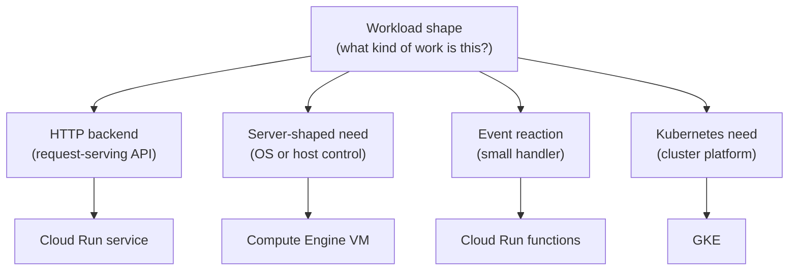

## Table of Contents

1. [A Good Runtime Choice Makes Debugging Clearer](#a-good-runtime-choice-makes-debugging-clearer)
2. [Start With The Workload Shape](#start-with-the-workload-shape)
3. [The Orders API Decision](#the-orders-api-decision)
4. [When Cloud Run Is The First Answer](#when-cloud-run-is-the-first-answer)
5. [When Compute Engine Is The Honest Answer](#when-compute-engine-is-the-honest-answer)
6. [When A Function Is The Smallest Clear Answer](#when-a-function-is-the-smallest-clear-answer)
7. [When GKE Is Worth The Extra Platform](#when-gke-is-worth-the-extra-platform)
8. [The Decision Table](#the-decision-table)
9. [Avoid Mixed Signals](#avoid-mixed-signals)
10. [Failure Scenarios That Reveal The Choice](#failure-scenarios-that-reveal-the-choice)
11. [A Runtime Review Template](#a-runtime-review-template)
12. [The Operating Habit](#the-operating-habit)

## A Good Runtime Choice Makes Debugging Clearer

Runtime decisions are easy to overcomplicate. A team opens the GCP product list and sees
Cloud Run, Compute Engine, Cloud Run functions, GKE, Batch, App Engine, and more. Suddenly
the question feels like a vocabulary exam. A product list does not tell the team which
runtime will make the next failure understandable.

A good runtime choice makes the next failure easier to understand. If the orders API does
not start, the team should know whether to inspect a Cloud Run revision, a VM process
manager, a function invocation, or a Kubernetes Pod. If the app cannot read a secret, the
team should know which runtime identity is being checked. If users cannot reach the app, the
team should know where traffic enters and where health is measured.

This article keeps the first decision small. For the current roadmap, the main options are
Cloud Run services, Compute Engine VMs, Cloud Run functions, and GKE. Those four choices
cover the beginner runtime shapes well enough to operate a real backend without pretending
every GCP compute product belongs in the first pass.

Pick the runtime whose responsibility shape matches the workload, even when another option
looks more advanced.



Read the diagram as a question path. Do not start by asking what is popular. Start by asking
what kind of work the system is doing.

## Start With The Workload Shape

A workload is a piece of work your system needs to run. The workload may be a public API, a
background worker, a scheduled cleanup, a legacy server process, or a Kubernetes-managed
service. Each shape has a natural runtime.

The first split is whether the workload is request-driven, event-driven, server-shaped, or
platform-shaped:

| Workload Shape | Plain-English Meaning | Likely First Runtime |
|---|---|---|
| Request-driven service | It receives HTTP requests and responds | Cloud Run service |
| Event-driven handler | It runs because one event happened | Cloud Run functions |
| Server-shaped workload | It needs OS control, host agents, or legacy process setup | Compute Engine VM |
| Platform-shaped workload | It needs Kubernetes APIs, cluster policies, or shared Kubernetes standards | GKE |

Treat this table as a starting point. Some request-driven services can run on VMs or GKE,
and some event work can become a Cloud Run worker service. The table helps you explain why
you would leave the simplest matching shape.

The dangerous pattern is choosing a runtime because the team already knows one tool, not
because the workload asks for it. A VM can host an HTTP API, but that does not mean the team
should accept OS patching, process management, and disk cleanup for a normal containerized
backend. GKE can run a simple service, but that does not mean the team should learn cluster
operations to ship one orders API.

## The Orders API Decision

`devpolaris-orders-api` has a clear first shape. It is a Node.js HTTP backend. It handles
checkout requests, talks to Cloud SQL, reads secrets, writes receipt objects, and emits
logs. It can be packaged as a container. It does not need a custom operating system. It does
not need Kubernetes-specific behavior.

That points to Cloud Run as the first runtime:

```text
workload: devpolaris-orders-api
shape: request-driven HTTP backend
package: container image
runtime identity: orders-api-prod service account
state: Cloud SQL and Cloud Storage, not local instance disk
first runtime: Cloud Run service
```

The decision says, "this workload matches the Cloud Run service shape." That wording matters
because it keeps the team honest when a new requirement appears.

For example, if a later requirement says the API must use a host-level security agent, a VM
or GKE node-based platform may enter the discussion. If a new workflow says "create one
receipt export after a message arrives," a function or worker job may fit better than adding
another route to the API. Runtime choices can differ inside the same product.

## When Cloud Run Is The First Answer

Cloud Run is a strong first answer when the workload is a stateless HTTP service or a
containerized backend. Stateless does not mean the app has no data. It means the running
container instance does not hold the only copy of important state. The app stores durable
records in Cloud SQL, Cloud Storage, Firestore, BigQuery, or another data service.

Cloud Run is a good fit when the team can say:

| Question | Good Cloud Run Answer |
|---|---|
| Can the app run as a container? | Yes, the image starts the Node API |
| Does it listen on a clear port? | Yes, it uses the runtime `PORT` value |
| Is state outside the instance? | Yes, orders and receipt files live in managed data services |
| Can it scale by request traffic? | Yes, more instances can handle more HTTP requests |
| Can it use a service account? | Yes, runtime access is attached to the Cloud Run service |
| Do logs go to stdout or stderr? | Yes, Cloud Logging can capture useful app logs |

Cloud Run also gives useful deployment behavior. Revisions make changes inspectable.
Traffic assignment lets the team control which revision serves users. Logs and metrics are
close to the service. The operating surface is smaller than a VM because the team is not
patching hosts.

Choose Cloud Run first when the app wants a managed service home and does not need to own
the server below it.

## When Compute Engine Is The Honest Answer

Compute Engine is the honest answer when the workload needs a VM-shaped home. Honest is the
important word. A VM is not bad. It simply makes the team responsible for more server work.

A VM may be the right choice when the app needs:

| Need | Why Cloud Run May Not Be Enough |
|---|---|
| Custom operating system packages | The runtime depends on host-level setup |
| Long-lived host agents | Monitoring, security, or vendor tools expect a normal machine |
| Legacy deployment path | The team must move an existing server before repackaging the app |
| Host-level network behavior | The workload needs server-specific networking control |
| Direct process manager behavior | `systemd`, local daemons, or special boot behavior are part of the design |

The review must include the responsibilities that come with the choice. Who patches the OS?
How is the process restarted? Where do local logs go? What happens when the VM is replaced?
Where is product state stored? How does the load balancer know the backend is healthy?

If the team can answer those questions and still needs a server, Compute Engine is a valid
choice. If the team cannot answer them, a VM may only be hiding complexity behind a familiar
SSH prompt.

## When A Function Is The Smallest Clear Answer

Cloud Run functions are a good fit when one event should trigger one small handler. The
function should have a narrow job, a clear trigger, a bounded runtime, a runtime service
account, and a plan for retry-safe behavior.

For the orders system, these are function-shaped tasks:

| Task | Event | Function Output |
|---|---|---|
| Generate receipt export | Pub/Sub message requests export | Object written to Cloud Storage |
| Cleanup expired drafts | Schedule event fires hourly | Old draft records removed or marked expired |
| Index uploaded product image | Storage object event arrives | Metadata record updated |
| Notify analytics path | Order-created event arrives | Internal event or record sent onward |

Functions become less clear when the job grows. If the handler needs many routes, long
coordination, or heavy batch processing, choose another shape. A Cloud Run service, Cloud
Run job, VM, or workflow may be easier to operate depending on the work.

The function decision should always include idempotency. If a retry happens, can the handler
run again without creating duplicates or corrupting state? If the answer is no, fix the
design before relying on the function.

## When GKE Is Worth The Extra Platform

GKE is worth considering when the team needs Kubernetes, not merely when the team needs
containers. Cloud Run already runs containers without teaching the team Kubernetes objects.
GKE becomes useful when the Kubernetes layer is itself part of the product or platform
strategy.

Good reasons to consider GKE include:

| Reason | What It Means |
|---|---|
| Shared Kubernetes platform | Many services already use cluster standards and tooling |
| Kubernetes-native dependencies | Operators, controllers, or custom resources are required |
| Advanced traffic and sidecar patterns | Service mesh or sidecar architecture is part of the design |
| Cluster-level policy | Platform team enforces deployment, security, and networking standards through Kubernetes |
| Multi-service orchestration | The system benefits from Kubernetes APIs and conventions |

For a single beginner backend API, GKE is usually not the shortest path. It adds Pods,
Deployments, Services, node behavior, cluster permissions, release channels, and cluster
observability. Those are useful topics when the roadmap reaches Kubernetes. They are extra
weight if the current goal is to run one service safely.

The mature Kubernetes decision sounds boring and specific: "We choose GKE because our
platform is Kubernetes-based and this service needs the same deployment, policy, and
operating model as the rest of the fleet." If the reason is only "containers are serious,"
Cloud Run is probably the better first stop.

## The Decision Table

Use this table when the team is reviewing a new workload:

| Workload Need | Choose First | Avoid Choosing It When |
|---|---|---|
| HTTP API packaged as a container | Cloud Run service | The app needs host-level control or Kubernetes-specific behavior |
| Existing server app with OS dependencies | Compute Engine VM | The app is already a clean stateless container with no server requirement |
| Small event reaction | Cloud Run functions | The job has many routes, long processing, or unclear retry behavior |
| Kubernetes platform workload | GKE | The team does not need Kubernetes and only wants to run one container |

The phrase "choose first" matters. It means "start the review here." It does not mean the
answer can never change. If the first choice creates awkward workarounds, that is evidence
that the workload may have a different shape than you thought.

For example, if a Cloud Run service needs a host agent, persistent local disk, and direct VM
network behavior, you are fighting the runtime. If a VM deployment mostly copies a container
image and runs it behind a simple HTTP endpoint, you may be carrying server work that Cloud
Run could remove. If a function needs to act like a mini application with many routes, a
service may be clearer.

## Avoid Mixed Signals

Bad runtime decisions often show mixed signals. The team says one thing, but the workload
shape says another.

Here are common mixed signals:

| Mixed Signal | What It Suggests |
|---|---|
| "It is a simple API, but we need SSH to fix it weekly." | The deployment or logging contract is weak |
| "It is a function, but it has ten unrelated routes." | The workload may be a service |
| "It is on GKE, but nobody knows Kubernetes." | The platform choice may be ahead of the team's operating model |
| "It is on a VM, but all state is external and the app is containerized." | Cloud Run may reduce server chores |
| "It is on Cloud Run, but it requires local disk to survive replacement." | The app state model is wrong for the runtime |

Mixed signals show where the design and the runtime contract disagree. The fix might be
changing the app, changing the runtime, or writing down the real reason for the exception.

## Failure Scenarios That Reveal The Choice

Failures reveal whether the runtime is a good match.

Cloud Run failure:

```text
symptom: latest revision never becomes ready
first checks:
  container startup
  port binding
  environment variables
  revision logs
runtime lesson: service contract failed
```

VM failure:

```text
symptom: API down after host reboot
first checks:
  instance status
  systemd unit
  environment file
  disk and startup logs
runtime lesson: server operating contract failed
```

Function failure:

```text
symptom: duplicate receipt exports
first checks:
  retry behavior
  event ID handling
  deterministic output key
  idempotency check
runtime lesson: event handler was not safe to retry
```

GKE failure:

```text
symptom: service deploys but receives no traffic
first checks:
  Pod readiness
  Service selector
  Ingress or Gateway route
  namespace and network policy
runtime lesson: Kubernetes routing contract failed
```

Each failure points to a different operating surface. That is the reason to choose
intentionally. The runtime choice decides what "first check" means.

## A Runtime Review Template

Before choosing a runtime for a new GCP workload, fill out this template:

```text
workload name:
  devpolaris-orders-api

workload shape:
  request-driven HTTP backend

first runtime choice:
  Cloud Run service

why this shape fits:
  containerized Node API, no host-level requirement, external durable state

what starts the code:
  container image revision

what calls it:
  HTTPS customer traffic through the approved entry path

runtime identity:
  orders-api-prod service account

state location:
  Cloud SQL for order records, Cloud Storage for exports

first evidence:
  revision status, request logs, health path, Cloud Monitoring metrics

first rollback target:
  previous healthy Cloud Run revision

reason to revisit:
  host agent requirement, Kubernetes platform requirement, or workload becomes event-only
```

The template is plain on purpose. It forces the decision into words a junior engineer can
read during a review. If the team cannot explain the runtime in this format, more diagrams
or product names will not fix the confusion.

## The Operating Habit

Choose the runtime that makes the workload easiest to operate honestly. For the main orders
API, that is Cloud Run. For a legacy server migration, it may be Compute Engine. For a small
event reaction, it may be a Cloud Run function. For a Kubernetes platform, it may be GKE.

The provider gives you several good tools because application work has several shapes. The
team's job is to match the shape, write down the tradeoff, and keep the first debugging path
clear. When the next failure arrives, the runtime choice should tell you where to look first.

---

**References**

- [What is Cloud Run](https://cloud.google.com/run/docs/overview/what-is-cloud-run) - Explains the managed service shape used for request-driven container workloads.
- [Compute Engine instances](https://cloud.google.com/compute/docs/instances) - Describes the VM runtime option and its instance model.
- [Cloud Run functions documentation](https://cloud.google.com/functions/docs) - Documents the function option for single-purpose event-driven work.
- [GKE overview](https://cloud.google.com/kubernetes-engine/docs/concepts/kubernetes-engine-overview) - Explains when managed Kubernetes becomes the relevant runtime surface.
