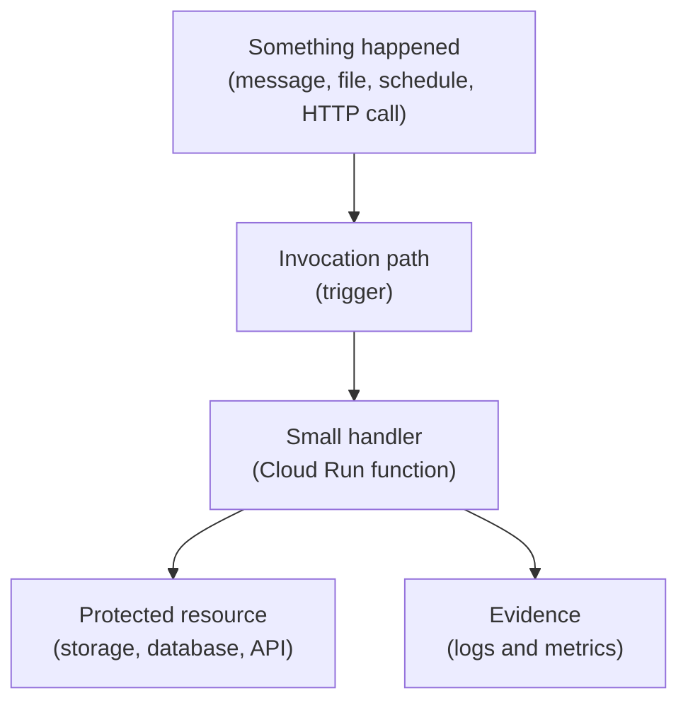
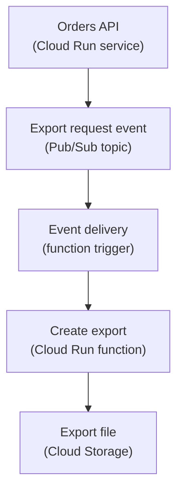

## Table of Contents

1. [Some Backend Work Starts From An Event](#some-backend-work-starts-from-an-event)
2. [What Cloud Run Functions Are](#what-cloud-run-functions-are)
3. [If Lambda Or Azure Functions Are Familiar](#if-lambda-or-azure-functions-are-familiar)
4. [The Orders System Event Examples](#the-orders-system-event-examples)
5. [Triggers Decide Why The Code Runs](#triggers-decide-why-the-code-runs)
6. [A Function Is Not A Small Server You Forget About](#a-function-is-not-a-small-server-you-forget-about)
7. [Retries Make Idempotency Necessary](#retries-make-idempotency-necessary)
8. [Identity Still Controls Access](#identity-still-controls-access)
9. [Logs Need Event Context](#logs-need-event-context)
10. [Timeouts And Work Size Shape The Design](#timeouts-and-work-size-shape-the-design)
11. [When Not To Use A Function](#when-not-to-use-a-function)
12. [Failure Modes And First Checks](#failure-modes-and-first-checks)
13. [A Practical Function Review](#a-practical-function-review)

## Some Backend Work Starts From An Event

The orders API receives user traffic. A customer clicks checkout, the frontend sends an HTTP
request, and `devpolaris-orders-api` responds. That is request-driven work. A normal backend
service such as Cloud Run is a good fit because the API is the front door for that flow.

Some backend work starts differently. A receipt file is uploaded. A Pub/Sub message arrives.
A scheduled cleanup should run every hour. An export job finishes and another step needs to
send a notification. No customer is waiting on the original HTTP connection anymore. The
system is reacting to an event.

Cloud Run functions are useful for these small event-driven jobs. They let you write a
single-purpose handler without operating a server or keeping a whole API process alive for
one background reaction. The function still runs on cloud infrastructure, still needs
permissions, still emits logs, and still has failure behavior. It is smaller, not less real.

Here is the first mental model:



The event starts the story. The trigger delivers the event. The function handles one piece
of work. If that work touches protected resources, IAM still decides whether it is allowed.

## What Cloud Run Functions Are

Cloud Run functions are a lightweight compute option for single-purpose functions that
respond to HTTP requests or CloudEvents. A CloudEvent is a standard event format used to
describe something that happened, such as a storage object change or a message event. You
write the handler. GCP handles much of the deployment and invocation path.

The current GCP naming can be confusing because Cloud Functions and Cloud Run functions are
closely related in the docs and product history. For this beginner module, use the practical
model: a function is a small piece of code deployed into the Cloud Run-based function
environment and invoked by a trigger. The important operating questions are trigger,
identity, timeout, retries, logs, and duplicate safety.

That is different from a Cloud Run service. A Cloud Run service is a long-lived service
shape for request-serving containers. It may have many routes and a full application
surface. A function should have a smaller job. If your "function" starts to look like the
entire orders API, you are probably using the wrong shape.

## If Lambda Or Azure Functions Are Familiar

If you know AWS Lambda, the broad idea transfers. Code runs because an event invokes it. You
think about handler logic, event payload, permissions, timeout, logs, retries, and duplicate
processing. If you know Azure Functions, the broad idea also transfers. A trigger decides
when the function runs, and bindings or SDK calls connect the function to other services.

Do not assume the exact platform behavior is identical. GCP has its own trigger paths,
Eventarc integration, deployment flow, IAM model, logs, and Cloud Run-based resource model.
The bridge is the operating question, not the service internals.

For `devpolaris-orders-api`, the best use of functions is around the API, not instead of the
API. The API handles checkout requests. Functions handle small reactions that do not need a
full web service route.

## The Orders System Event Examples

The orders system has several event-shaped jobs:

| Event | Function Job | Why It Fits |
|---|---|---|
| Receipt export requested | Generate a CSV or PDF export record | Work starts from a message, not a user waiting on the API |
| Object uploaded to a bucket | Validate or index the uploaded object | Storage event naturally starts the job |
| Cleanup schedule fires | Remove expired draft checkout records | Timer starts a small maintenance task |
| Order created message arrives | Notify an internal analytics path | Pub/Sub message carries the event |

These jobs are not all the same size. Some may be better as Cloud Run jobs or worker
services if they are long-running or heavy. The function shape is strongest when the work is
small, event-scoped, and easy to retry safely.

A simple event record can look like this:

```text
event: order.receipt_export_requested
source: devpolaris-orders-api
transport: Pub/Sub topic orders-export-events
handler: create-receipt-export
output: Cloud Storage object in devpolaris-orders-exports-prod
identity: orders-export-worker@devpolaris-orders-prod.iam.gserviceaccount.com
```

This record names more than code. It names the event source, delivery path, output, and
identity. Those are the parts you debug when the function fails.

## Triggers Decide Why The Code Runs

A trigger is the reason a function runs. An HTTP trigger runs the function when an HTTP
request arrives. An event trigger runs the function when a cloud event arrives, often
through Eventarc or a specific service integration. A Pub/Sub event can run code after a
message is published. A storage event can run code after an object changes.

The trigger shapes reliability and debugging. If no event reaches the
trigger, the function code never starts. If the trigger receives events but the function
times out, the problem is inside execution or work sizing. If the function succeeds but the
output is wrong, the handler logic or downstream permissions need inspection.

Here is a small trigger map for receipt exports:



If the export file is missing, this diagram gives you a debug path. Did the API publish the
message? Did the trigger deliver it? Did the function run? Did it have permission to write
the object?

## A Function Is Not A Small Server You Forget About

Functions remove server management work, but they do not remove operating work. You still
need to know who owns the function, which project and region it lives in, which service
account it runs as, which event invokes it, what timeout is acceptable, and where logs go.

The small size can actually hide risk. A team might create many functions because each one
looks easy. Later, nobody remembers which function writes to which bucket, which one handles
retries, or which one owns a sensitive secret. The system becomes a pile of tiny invisible
dependencies.

Treat each function as a production workload:

```text
function: create-receipt-export
project: devpolaris-orders-prod
region: us-central1
trigger: Pub/Sub topic orders-export-events
runtime identity: orders-export-worker@devpolaris-orders-prod.iam.gserviceaccount.com
inputs: order_id, export_format, requested_by
output: object in devpolaris-orders-exports-prod
safe retry: yes, output key is deterministic
```

The `safe retry: yes` line carries one of the most important parts of event work.

## Retries Make Idempotency Necessary

Event-driven systems often retry. A retry means the same event may be delivered again after
a failure, timeout, or unclear result. That behavior helps reliability because temporary
problems can recover. It also creates a design requirement: the handler should be safe when
the same event appears twice.

Idempotency means repeated handling produces the same final result without double-charging,
double-emailing, or corrupting records. In plain English: doing it again should not make a
mess. For receipt exports, the function can use a deterministic object key based on the
order ID and export request ID:

```text
exports/order_9281/request_44d2/receipt.pdf
```

If the function receives the event twice, it can check whether that output already exists or
write the same object path safely. That is different from creating a random filename on each
attempt, which could create duplicates.

A bad event handler is optimistic in the wrong place:

```text
event arrives
function creates random output file
function times out before recording success
event retries
function creates another random output file
```

Design the work so retrying is safe before you reach for retry settings. After the handler
is safe to repeat, set retry behavior intentionally.

## Identity Still Controls Access

A function runs as an identity. That identity needs permissions for the resources it touches.
For receipt exports, the function may need to read order data, write an object to Cloud
Storage, and write logs. It should not receive broad project editor access.

The runtime service account might be:

```text
orders-export-worker@devpolaris-orders-prod.iam.gserviceaccount.com
```

That identity can have a narrow permission set:

| Resource | Permission Shape |
|---|---|
| Pub/Sub topic or subscription path | Receive or be triggered by export events |
| Cloud SQL or API endpoint | Read only the data needed for export |
| Cloud Storage bucket | Write export files to one bucket or prefix |
| Secret Manager | Read only secrets the function truly needs |

When a function fails with `PermissionDenied`, do not assume the developer's local access
matters. Inspect the function's runtime service account. GCP checks that identity when the
function calls protected resources.

## Logs Need Event Context

Function logs should include the event context needed to debug one invocation. A vague log
line like "export failed" leaves the team missing the function name, event ID, order ID,
output key, and failure layer. Avoid printing secrets or full private payloads, but do
include safe identifiers.

A useful failure log might look like this:

```text
severity=ERROR
function=create-receipt-export
event_id=8b7d0e
order_id=9281
output_key=exports/order_9281/request_44d2/receipt.pdf
message="failed to write export object"
error="PermissionDenied: storage.objects.create"
```

This log points to the right layer. The handler ran. The event had an order ID. The output
key was known. The failure happened when writing to storage. The next check is IAM on the
bucket or the runtime service account, not the Pub/Sub topic.

## Timeouts And Work Size Shape The Design

Functions are best for bounded work. Bounded means the job has a reasonable expected size
and can finish within the configured timeout. If the job may run for a long time, process a
large batch, or need multiple coordinated steps, a function may become the wrong shape.

For example, "create one receipt export for one order" can be a function. "Rebuild every
receipt for the last three years" is probably not a single function invocation. That larger
job may belong in a Cloud Run job, a worker service, or a data processing path.

Many things can be forced into a function. The better design question is whether the work
will be easy to retry, observe, and operate when it fails halfway.

## When Not To Use A Function

Do not use a function just because the code file is small. Use a function when the work is
event-shaped. Avoid functions when the workload needs a full API surface, long-running
coordination, heavy local state, or many routes that share complex application context.

For `devpolaris-orders-api`, these are weaker function fits:

| Workload | Better First Shape |
|---|---|
| Main checkout API with many routes | Cloud Run service |
| Long-running export rebuild | Cloud Run job or worker design |
| Server needing custom packages and agents | Compute Engine VM |
| Kubernetes-native platform workload | GKE |

The function should make the system easier to reason about. If it makes the request path
harder to follow, step back and choose a clearer runtime.

## Failure Modes And First Checks

Function failures usually point to one of four places: trigger, execution, permission, or
duplicate-safety design.

The function never runs:

```text
symptom: no invocation logs
first checks:
  trigger configuration
  source event exists
  topic or event route
  project and region
```

The function runs and times out:

```text
symptom: invocation timeout
first checks:
  handler duration
  downstream API latency
  work size
  timeout setting and runtime logs
```

The function cannot write the export:

```text
symptom: PermissionDenied storage.objects.create
first checks:
  function runtime service account
  bucket IAM
  bucket name and project
```

The function creates duplicates:

```text
symptom: repeated export files for one request
first checks:
  event ID handling
  deterministic output key
  idempotency check
  retry behavior
```

These checks keep the team away from random fixes. Event-driven work is easier when each
failure is tied to the part of the event path that produced it.

## A Practical Function Review

Before shipping a production function, write the review as a small contract:

| Review Item | Example Answer |
|---|---|
| Function name | `create-receipt-export` |
| Project and region | `devpolaris-orders-prod`, `us-central1` |
| Trigger | Pub/Sub event from `orders-export-events` |
| Input fields | `order_id`, `request_id`, `format` |
| Runtime identity | `orders-export-worker` service account |
| Resources touched | Order data source, Cloud Storage export bucket |
| Retry safety | Deterministic output key and existing-output check |
| Timeout expectation | One export request, not a batch rebuild |
| Logs | Event ID, order ID, output key, failure layer |
| Owner | Orders team |

That review is short because a good function has a small job. If the table becomes large
and tangled, the function may be trying to own too much. The best event functions are easy
to explain, easy to retry safely, and easy to remove when the workflow changes.

---

**References**

- [Cloud Run functions documentation](https://cloud.google.com/functions/docs) - Describes Cloud Run functions as single-purpose functions that respond to HTTP or cloud events.
- [Cloud Run functions overview](https://cloud.google.com/run/docs/functions/overview) - Explains the deployment path and relationship between source, build, image, and Cloud Run.
- [Write event-driven Cloud Run functions](https://cloud.google.com/functions/docs/writing/write-event-driven-functions) - Shows the event-driven function model and CloudEvent handling.
- [Eventarc documentation](https://cloud.google.com/eventarc/docs) - Documents event delivery paths used by many GCP event-driven workflows.
- [Pub/Sub documentation](https://cloud.google.com/pubsub/docs) - Covers the message service commonly used for event-driven backend work.
