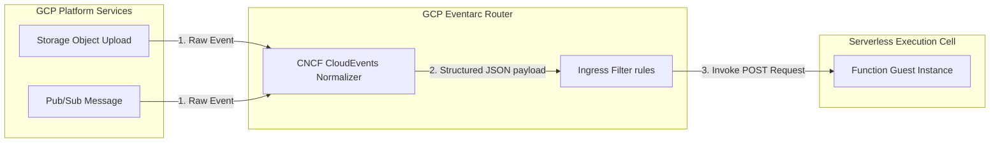

## Table of Contents

1. [Cloud Run Functions](#cloud-run-functions)
2. [The At-Least-Once Delivery and Idempotency Gotcha](#the-at-least-once-delivery-and-idempotency-gotcha)
3. [Event Trigger Architecture](#event-trigger-architecture)
4. [The Bounded Handler Pattern](#the-bounded-handler-pattern)
5. [Timeout Thresholds and Runtime Limits](#timeout-thresholds-and-runtime-limits)
6. [Least-Privilege Workload Principal Isolation](#least-privilege-workload-principal-isolation)
7. [Unified Logging and Attempt Auditing](#unified-logging-and-attempt-auditing)
8. [Sample Function Shape](#sample-function-shape)
9. [Putting It All Together](#putting-it-all-together)
10. [What's Next](#whats-next)

## Cloud Run Functions

Cloud Run functions are managed event handlers: you provide one small handler, and Google invokes it when an HTTP request, Pub/Sub message, Cloud Storage event, scheduler tick, or other configured trigger arrives. Rather than managing VM operating systems, container orchestration, or persistent network listeners, Cloud Run functions can remain idle until an active trigger invokes the runtime, starts execution capacity, runs your code, and completes the attempt.

A common design pitfall is over-architecting background tasks, forcing simple, asynchronous jobs (like sending a receipt email, validating a file upload, or purging temporary database records) directly into the main, customer-facing request path. Cloud Run functions decouple this event-shaped work from your primary services, protecting the core application API from downstream latencies and ensuring that background tasks execute independently.

For developers coming from other cloud ecosystems, Cloud Run functions are the direct GCP equivalent of AWS Lambda and Azure Functions. In modern Google Cloud, functions are built and deployed on Cloud Run, so the function receives Cloud Run-style service identity, logs, and scaling behavior while keeping the authoring model focused on one handler.

:::expand[Under the Hood: Eventarc and the CloudEvents Standard]{kind="design"}
To understand how Cloud Run functions process events from multiple disparate services across your project, you must look at **Eventarc**, Google's software-defined event routing backbone.

Rather than requiring your application code to manage custom API integrations or poll message queues continuously, Eventarc captures state changes across GCP services (such as Cloud Storage bucket uploads, Cloud Logging audit trails, or Pub/Sub messages) and routes them programmatically to your function.

As illustrated above, Eventarc unifies event ingestion under the CloudEvents standard through three core phases:

1.  **Event Normalization**: When a platform state change occurs, Eventarc intercepts the raw, provider-specific metadata event and normalizes it to adhere strictly to the CNCF **CloudEvents** specification.
2.  **Structured JSON Payload**: The event is converted into a standard HTTP JSON payload containing consistent routing headers, including `ce-id` (a unique event identifier), `ce-source` (the resource path that generated the event), and `ce-type` (the specific action, such as `google.cloud.storage.object.v1.finalized`).
3.  **Dynamic POST Invocation**: Eventarc routes this structured JSON payload to the function's regional endpoint via a standard HTTP POST request. By standardizing all event routing around the CloudEvents specification, Cloud Run functions can process events from hundreds of distinct Google APIs using a single, unified input signature.
:::

## The At-Least-Once Delivery and Idempotency Gotcha

At-least-once delivery means an event platform may deliver the same event more than one time, so the handler must recognize repeated work. Operating event-triggered handlers introduces this critical systems engineering reality because Google Cloud's underlying messaging platforms (like Pub/Sub and Eventarc) operate on an **At-Least-Once Delivery** contract.

*At-least-once delivery is safe only when the side effect is repeatable.*

This means that while the platform guarantees your function will receive the event at least once, network latency, microsecond timeouts, or failed acknowledgments can cause the system to deliver the exact same event multiple times. If your function handles financial transactions or updates inventory records, duplicate deliveries will result in corrupted database states or double-charges.

To secure your workflows, you must enforce a strict **Idempotency Guard** inside your handler code:

| Step | Handler action | Why it matters |
| :--- | :--- | :--- |
| Receive event | Read `ce-id: 7a8c-9b2f` from the CloudEvents envelope | The event ID becomes the duplicate-detection key. |
| Check state | Look up the `ce-id` in a unique database index | A previous successful attempt can be recognized. |
| Claim work | Insert the `ce-id` before sending the email | Only one attempt wins the right to perform the side effect. |
| Finish safely | Return success for already-processed events | Retries stop without duplicating the customer action. |

The idempotency guard process detailed above protects your systems:

1.  **Unique Identifier Lookup**: When the function is invoked, the application code reads the unique `ce-id` from the CloudEvents metadata envelope.
2.  **State Check**: The handler queries a transactional, high-speed database (such as Redis or Firestore) to check if this specific `ce-id` has already been processed.
3.  **Atomic Lock**: If the ID exists, the function immediately terminates with an HTTP `200 OK` response, preventing duplicate processing. If the ID is new, the handler writes the `ce-id` to the database atomically (using a unique constraint index) before executing any external side effects (like sending emails or charging credit cards).

## Event Trigger Architecture

A trigger is the routing rule that decides what input starts a function attempt. Cloud Run functions support distinct event triggers, matching the incoming signal to your workload requirements:

*   **HTTP Triggers**: Expose a direct public or internal web endpoint. This fits webhook integrations (such as Stripe payment callbacks) where an external system must invoke your handler immediately over HTTPS.
*   **Pub/Sub Triggers**: Bind the function directly to a message topic. This is the optimal trigger for decoupling heavy internal APIs, allowing background tasks to process asynchronously as soon as a message is published.
*   **Cloud Storage Triggers**: React instantly to object finalization or deletion events inside specific buckets, initiating downstream image resizing or metadata extraction pipelines as soon as files are uploaded.
*   **Scheduled Triggers**: Utilize Cloud Scheduler to publish a periodic event to a target topic, invoking your function on a strict cron schedule (e.g. every hour at midnight) to purge temporary system states.

## The Bounded Handler Pattern

The bounded handler pattern treats a function as one small unit of event work with a clear input, side effect, timeout, and log trail. A critical operational habit when writing serverless handlers is adhering to this pattern. A function must perform exactly one, highly isolated, atomic task.

*Small handlers are easier to retry, audit, and protect from timeout drift.*

A common anti-pattern is allowing a single function to grow systematically into a large, multi-route web application. If a function begins parsing complex URL paths, managing extensive session cache structures, or coordinating multiple distinct database writes, it violates the serverless model. This results in heavy cold starts, complex IAM permission configurations, and extremely high debugging friction.

If your code requires shared routing middleware, extensive state management, or handles multiple distinct domain entities, it has evolved into a microservice. You must transition this code to **Cloud Run**, where it can run as a managed service with revisions and traffic routing.

## Timeout Thresholds and Runtime Limits

Timeouts are the maximum execution windows a function attempt may consume before the platform stops it. Because functions are billed by active execution time, Google Cloud enforces strict runtime limits to protect you from runaway resource bills:

*   **Default Timeouts**: Cloud Run functions have a default timeout, and long downstream waits still cause failed invocations. Treat the default as a prompt to keep handlers small, not as a target duration.
*   **Maximum Timeouts**: Current Cloud Run functions quotas allow longer HTTP functions than event-driven functions. At review time, Google documents a 60 minute maximum for HTTP functions, 1800 seconds for scheduled and task queue functions, and 540 seconds for event-driven functions.
*   **Processing Gotcha**: If a function times out while handling an event from a trigger with retries enabled, the platform can deliver the event again. Retry defaults and behavior vary by how the function and trigger were created, so verify the deployed trigger configuration instead of assuming all failed events retry forever.

## Least-Privilege Workload Principal Isolation

A function runtime service account is the principal used by that handler when it calls Google APIs or other protected resources. Every Cloud Run function runs with a dedicated **Runtime Service Account**. In experienced serverless designs, you never share a single service account across multiple separate functions.

If a cleanup function and a receipt delivery function share the same identity, an attacker who exploits a dependency vulnerability in the cleanup handler gains immediate authorization to access database secrets and send unauthorized emails.

By attaching an isolated, custom runtime service account to each function, you secure the boundary: the cleanup function possesses only deletion permissions on temp directories, while the receipt function possesses only send permissions on the email API, completely isolating your blast radiuses.

## Unified Logging and Attempt Auditing

Attempt auditing is the evidence trail that connects each function invocation to the original event and downstream side effect. Because event-driven execution is entirely asynchronous, monitoring failures requires structured logging. The developer who initiated the primary checkout request has already received a success response; if the downstream receipt function fails, the failure is invisible unless recorded properly.

Your function logs must always correlate with the parent checkout request. By extracting the **`correlation-id`** from the CloudEvents payload and injecting it into every structured `stdout` JSON log statement, you enable operators to run simple, unified queries across Cloud Logging, instantly tracing the lifecycle of a request from the initial user click down to the final background function execution.

## Sample Function Shape

A sample function shape is a compact review of trigger, handler, identity, retry, and logging boundaries. An idiomatic Cloud Run function configuration for the Orders receipt handler isolates triggers, identities, and retry configurations:

| Function Parameter | Configuration Value | Operational Purpose |
| :--- | :--- | :--- |
| **Function Name** | `send-order-receipt` | Bounded, single-purpose worker hostname. |
| **Trigger Type** | Pub/Sub topic `checkout-events` | Decoupled, asynchronous background execution. |
| **Input Schema** | Standard CloudEvents JSON payload | Standardized network routing envelope. |
| **Runtime Identity**| `receipt-worker-runtime@prod...` | Least-privilege principal for email API access. |
| **Idempotency Guard**| PostgreSQL unique `ce-id` index | At-Least-Once delivery collision protection. |
| **Log Format** | Structured JSON with correlation ID | Fast, cross-service incident search. |

## Putting It All Together

Operating serverless handlers requires establishing highly resilient, duplicate-safe code boundaries.

When the Orders API commits a transaction, it publishes a `checkout-completed` message. Eventarc captures this state change, normalizes the metadata into the standard CloudEvents JSON envelope, and invokes the `send-order-receipt` function over an HTTPS POST request.

The function boots, extracts the unique `ce-id`, and queries the database's idempotency index. Finding no matching record, the handler writes the lock atomically, fetches the order details using its least-privilege runtime identity, and calls the email API. If the email provider is temporarily offline, the trigger retries the handshake, and the idempotency guard ensures the customer never receives duplicate receipts.

## What's Next

Cloud Run functions provide highly cost-effective, event-triggered runtimes for isolated tasks. However, when your containerized platform scales to dozens of interconnected microservices that require standardized platform policies, native service discovery, and declarative cluster resource scheduling, a managed container orchestrator is required. In the next article, we analyze GKE, detailing Standard and Autopilot scheduling modes, Kubernetes objects, Services, Ingress, and Workload Identity Federation for GKE.

*Use this summary as the quick mental checklist before designing or debugging the service.*

---

**References**

- [Google Cloud: Cloud Run functions](https://cloud.google.com/functions/docs) - Architectural guide for serverless background handlers.
- [Google Cloud: Cloud Run functions overview](https://cloud.google.com/run/docs/functions/overview) - Explains the Cloud Run-backed function model.
- [Google Cloud: Cloud Run function triggers](https://cloud.google.com/run/docs/function-triggers) - Specification for Eventarc and Pub/Sub triggers.
- [Google Cloud: Cloud Run functions quotas](https://cloud.google.com/functions/quotas) - Documents current timeout limits and quota boundaries.
- [Google Cloud: Function retries](https://cloud.google.com/run/docs/tips/function-retries) - Explains retry behavior and API-specific defaults.
- [Google Cloud: Best practices for functions](https://cloud.google.com/run/docs/tips/functions-best-practices) - Guide to designing idempotent, retry-safe serverless handlers.
- [CNCF: CloudEvents specification](https://cloudevents.io/) - Open standard for describing event data structure across platforms.
