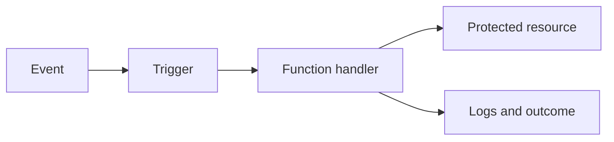

## Table of Contents

1. [The Problem](#the-problem)
2. [What Are Cloud Run Functions](#what-are-cloud-run-functions)
3. [Events](#events)
4. [Triggers](#triggers)
5. [Handlers](#handlers)
6. [Invocations](#invocations)
7. [Retries](#retries)
8. [Timeouts](#timeouts)
9. [Identity](#identity)
10. [Logs](#logs)
11. [When A Service Is Simpler](#when-a-service-is-simpler)
12. [Sample Function Shape](#sample-function-shape)
13. [Putting It All Together](#putting-it-all-together)
14. [What's Next](#whats-next)

## The Problem

The Orders API handles checkout requests. That service should stay predictable: receive a request, validate it, write the order, and return a response. But extra work starts collecting around it.

- After checkout, a receipt email should be sent without making the customer wait.
- When an export file lands in Cloud Storage, a small handler should validate it.
- A scheduled cleanup should remove expired temporary records.
- A Pub/Sub message should update a search index, and failures should retry safely.

These jobs are real compute, but they are not always long-running services. Cloud Run functions give event-shaped work a smaller runtime shape.

## What Are Cloud Run Functions

Cloud Run functions are single-purpose functions that run in the Cloud Run environment. You write a handler. GCP runs it when the trigger invokes it. The function may respond to HTTP or to events such as Pub/Sub messages and Cloud Storage changes.

The useful mental model is:



The event is the reason work exists. The trigger delivers the event. The handler runs the code. If the code touches Google APIs, the function identity needs IAM permission. If the trigger retries, the handler must be safe to run again.

## Events

An event is something that happened. A message was published. A file was created. A schedule fired. An HTTP request arrived. Event-driven compute starts with that fact instead of with a process waiting all day.

For the Orders system, the checkout API should not send receipt email inline if the email provider is slow. The API can publish an event or message after the order is created. A function can handle the side work separately.

The event should carry enough context to do the job, but not so much that it becomes a fragile copy of the database. A receipt event might include order ID, customer ID, and correlation ID. The function can look up details using its own identity and permissions.

## Triggers

A trigger defines why the function runs. In GCP, Cloud Run functions can be triggered by HTTP requests or by events routed through services such as Eventarc and Pub/Sub.

The trigger is part of the design and deployment shape. It decides who can invoke the function, what event format the handler receives, and what retry behavior may occur. If the trigger is too broad, the function runs for events it should ignore. If it is too narrow, real work is missed.

| Trigger shape | Good use |
| --- | --- |
| HTTP | Small explicit endpoint or webhook-style handler |
| Pub/Sub | Message-driven background work |
| Cloud Storage event | Object-created or object-changed reactions |
| Scheduled event | Cleanup or periodic maintenance |

Start with the event source. Then choose the trigger that delivers that event clearly.

## Handlers

The handler is the function code. It receives the event or request, does one bounded job, and returns an outcome.

Bounded matters. A function should not quietly grow into the whole Orders API. If it owns many routes, keeps complex request state, and acts like a web service, Cloud Run service is probably simpler. If it needs host-level control, a VM may be clearer. If it depends on Kubernetes APIs and cluster policy, GKE may be the right platform.

Good function handlers are small enough to review:

```text
function: send-order-receipt
trigger: Pub/Sub message after checkout
input: order ID and correlation ID
work: load order, send receipt, record outcome
output: success or retryable failure
```

The handler should name the job in one sentence.

## Invocations

An invocation is one run of the function. One event can lead to one invocation, but retries or duplicate deliveries can create more than one attempt for the same logical work.

That distinction matters for logs and side effects. If the receipt function sends an email, a retry after a partial failure might send it twice unless the handler checks whether the receipt was already sent. If the function writes a database row, it should use an idempotent key or safe update pattern.

The logs should include event ID, order ID, and correlation ID where possible. Otherwise a retry looks like a separate mystery instead of another attempt at the same work.

## Retries

Retries are useful because temporary failures happen. An email provider times out. A database is briefly unavailable. A downstream API returns a transient error. A retry can turn a temporary failure into a later success.

Retries are dangerous when the handler is not idempotent. Idempotent means running the same logical work more than once does not create the wrong result. Sending two receipts, charging twice, or creating duplicate rows are not acceptable retry outcomes.

The function article should leave the reader with one strong habit: before enabling retries, ask what happens if the same event is handled twice.

| Side effect | Safer retry habit |
| --- | --- |
| Send receipt | Store receipt-sent state by order ID |
| Write export result | Use deterministic object or record key |
| Call external API | Use idempotency key when supported |
| Update status | Make updates conditional on current state |

Retries are not a checkbox. They are a design contract.

## Timeouts

Functions should do bounded work. Timeout settings make that boundary visible. If a job needs to run for a long time, stream large data, maintain a warm connection pool, or coordinate many steps, a function may become the wrong shape.

Timeouts also affect retries. If a function times out after partially completing work, the platform may treat the invocation as failed. The next attempt must be safe.

The first design question is not "how high can we set the timeout?" It is "is this job small enough to be a function?" If the answer keeps getting awkward, use a service, job, workflow, or another runtime shape.

## Identity

A function runs with an identity. That identity controls access to Google APIs and resources. If the receipt function reads an order from a database, publishes another message, or writes to Cloud Storage, IAM decides whether the runtime identity can do that.

Keep function identity narrow. A receipt function does not need to deploy services. A cleanup function does not need broad project administration. Event-driven code is still production code, and its service account should match the job.

Network reachability can still matter, especially for private destinations, but IAM remains a separate check. A reachable API can still reject the function if the identity lacks permission.

## Logs

Logs are the main evidence for event-shaped work. A user may never see the function directly. The original API request may have finished before the function ran. Without good logs, the side work disappears.

Useful function logs name the event and the outcome:

```text
function: send-order-receipt
event: pubsub message
order: order-7342
correlation: checkout-5f31
attempt: 2
outcome: receipt sent
```

Notice the attempt number. Retried work needs retry-aware evidence.

## When A Service Is Simpler

Functions are not the smallest answer to every problem. A Cloud Run service can be simpler when the code needs many HTTP routes, shared middleware, streaming behavior, long-lived request patterns, or complex application state.

A function is best when the job is specific and event-shaped. A service is better when the job is a normal application surface. A VM is better when the host matters. GKE is better when Kubernetes is already the operating platform.

This choice is about making the next failure easy to understand.

## Sample Function Shape

For the Orders system, the receipt function might look like this:

| Part | Example |
| --- | --- |
| Function | `send-order-receipt` |
| Trigger | Pub/Sub message after checkout |
| Event fields | Order ID, customer ID, correlation ID |
| Runtime identity | `orders-receipt-runtime` |
| Permissions | Read order, send email through approved API, write outcome |
| Retry design | Idempotency by order ID |
| Evidence | Event ID, attempt, order ID, outcome logs |

This is small enough to fit in one handler and important enough to deserve production evidence.

## Putting It All Together

Return to the opening problems.

Receipt email should not slow checkout. A function can react after the order event, as long as the handler is retry-safe.

Storage export validation starts when a file lands. A storage event trigger gives that work a clear reason to run.

Scheduled cleanup belongs in a bounded handler when the job is small. If cleanup grows into a long workflow, another runtime may be clearer.

Pub/Sub retries help with temporary failures, but they make idempotency necessary. A function is smaller than a service, not less serious.

## What's Next

Cloud Run services and functions cover many beginner GCP workloads. The last compute article covers GKE, where the requirement is running on Kubernetes.

---

**References**

- [Google Cloud: Functions overview](https://cloud.google.com/functions/docs/concepts/overview)
- [Google Cloud: Cloud Run function triggers](https://cloud.google.com/run/docs/function-triggers)
- [Google Cloud: Configure retries for event-driven functions](https://cloud.google.com/run/docs/tips/functions-best-practices)
- [Google Cloud: Cloud Run service identity](https://cloud.google.com/run/docs/securing/service-identity)
