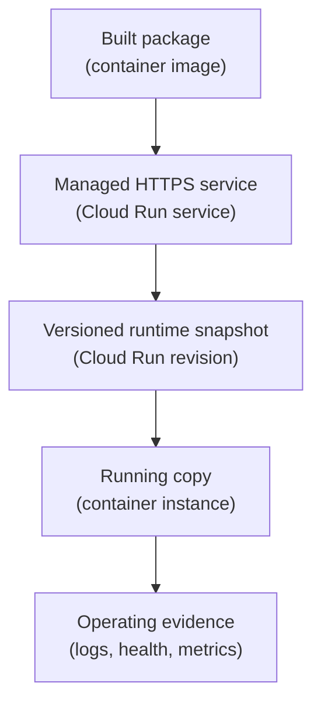

## Table of Contents

1. [A Container Is Not A Running Service Yet](#a-container-is-not-a-running-service-yet)
2. [What Cloud Run Adds Around The Container](#what-cloud-run-adds-around-the-container)
3. [The Orders API Contract](#the-orders-api-contract)
4. [The Container Must Listen Where Cloud Run Expects](#the-container-must-listen-where-cloud-run-expects)
5. [Revisions Make Deployments Inspectable](#revisions-make-deployments-inspectable)
6. [Traffic Is A Runtime Decision](#traffic-is-a-runtime-decision)
7. [Service Identity Decides Runtime Access](#service-identity-decides-runtime-access)
8. [Environment Variables And Secrets Are Runtime Inputs](#environment-variables-and-secrets-are-runtime-inputs)
9. [Logs And Health Are The First Debugging Surface](#logs-and-health-are-the-first-debugging-surface)
10. [Scaling Changes How You Think About State](#scaling-changes-how-you-think-about-state)
11. [Failure Modes And First Checks](#failure-modes-and-first-checks)
12. [A Practical Cloud Run Review](#a-practical-cloud-run-review)

## A Container Is Not A Running Service Yet

A container image is a package. It can contain your Node.js app, its dependencies, and the
command that starts the process. A production service adds the runtime shape around that
package: a URL, a region, a service account, configuration values, logs, health checks, and
a way to move traffic between versions.

Cloud Run turns a container into a managed service. You give Cloud Run something runnable,
usually a container image from Artifact Registry or source code that becomes an image. Cloud
Run starts container instances, sends requests to them, collects logs, and records revisions
when the service changes.

The beginner mistake is thinking, "the image built, so the service is ready." The image is
only one part of the contract. The service can still fail because the app listens on the
wrong port, crashes during startup, lacks permission to read a secret, points at the wrong
database, or receives no traffic because the new revision was not routed.

For `devpolaris-orders-api`, the useful mental model is:



The image starts the story. Cloud Run supplies the service shape around it. When something
breaks, you inspect both the image and the service settings around the image.

## What Cloud Run Adds Around The Container

Cloud Run is a managed application platform for services, jobs, and functions. In this
article we focus on Cloud Run services, because a backend API usually receives HTTP requests.
The service is the stable thing your team talks about. Revisions are the immutable snapshots
created when the service code or configuration changes. Container instances are the running
copies that handle actual requests.

Those nouns are worth separating. A service can have several revisions. A revision can have
zero, one, or many running instances depending on traffic and settings. A running instance
can disappear and be replaced. Your app should not assume that one container instance is the
only home for state.

For a beginner, Cloud Run adds these jobs around the container:

| Job | What Cloud Run Gives You | What You Still Must Provide |
|---|---|---|
| Start the app | Starts container instances from the revision | Container starts reliably and listens on the expected port |
| Receive requests | HTTPS endpoint and request routing | App handles HTTP paths and returns correct responses |
| Track versions | Immutable revisions | Meaningful image tags, release notes, and config review |
| Route traffic | Traffic assignment between revisions | Decision about which revision should serve users |
| Capture evidence | Logs, metrics, revision status | Useful application logs and health behavior |
| Authorize calls out | Runtime service account support | Correct IAM roles on target resources |

This split is the reason Cloud Run is beginner-friendly without being vague. It removes VM
chores, but it does not remove application responsibility.

## The Orders API Contract

Before deploying `devpolaris-orders-api`, the team should write down what the runtime expects.
This small record prevents vague debugging later:

```text
service: devpolaris-orders-api
region: us-central1
image: us-central1-docker.pkg.dev/devpolaris-orders-prod/apps/orders-api:2026-05-04.1
port: 8080
health path: /healthz
runtime service account: orders-api-prod@devpolaris-orders-prod.iam.gserviceaccount.com
required settings:
  NODE_ENV=production
  DATABASE_NAME=orders
  RECEIPT_BUCKET=devpolaris-orders-receipts-prod
required secrets:
  ORDERS_DB_URL
```

That record does not need every flag. It needs the things that decide whether the service
can start and serve users. The image tells Cloud Run what to run. The port tells the
platform where the process listens. The service account tells GCP which identity is calling
other services. Settings and secrets tell the app how to find its dependencies.

A backend API is often simple in code and still precise in runtime. That precision is what
makes a Cloud Run service easy to inspect.

## The Container Must Listen Where Cloud Run Expects

Cloud Run sends requests to the ingress container on the configured port. For many services,
the platform provides a `PORT` environment variable, and the app should listen on that value.
Hardcoding a different port is one of the easiest ways to turn a good image into a failed
revision.

The Node server should use the runtime port:

```js
const port = Number(process.env.PORT || 8080);

app.listen(port, () => {
  console.log(JSON.stringify({
    level: "info",
    service: "devpolaris-orders-api",
    message: "orders API listening",
    port
  }));
});
```

This snippet is small because the idea is small. The app listens where the platform expects.
If the app only listens on `localhost:3000` because that worked during development, Cloud
Run cannot route production traffic to it.

A startup failure might look like this:

```text
revision: devpolaris-orders-api-00012
status: not ready
message: container failed to start and listen on the port provided by PORT=8080
first check: server startup command and port binding
```

The right fix is to make the container obey the runtime contract, not to change IAM or the
database while the port binding is still wrong.

## Revisions Make Deployments Inspectable

A Cloud Run revision is created when you deploy a new image or change certain service
configuration. Think of a revision as a snapshot of "what Cloud Run would run now." It can
include the image, environment variables, service account, scaling settings, and other
runtime configuration.

Revisions matter because they make deployment evidence visible. When the orders team says,
"production is running version `2026-05-04.1`," it should be able to point at the revision
that proves it. Without that evidence, release conversations become guesswork.

A simple release record might look like this:

```text
release: orders-api-2026-05-04.1
image: us-central1-docker.pkg.dev/devpolaris-orders-prod/apps/orders-api@sha256:71ac...
cloud run service: devpolaris-orders-api
revision: devpolaris-orders-api-00018
traffic: 100%
runtime identity: orders-api-prod@devpolaris-orders-prod.iam.gserviceaccount.com
```

The digest matters because tags can move. A digest identifies the exact image content. The
revision matters because it connects that image and configuration to a running service. The
traffic value matters because a revision can exist without serving users.

## Traffic Is A Runtime Decision

Cloud Run lets traffic point at revisions. That means deployment and exposure are related
but not identical. A team can create a revision and choose whether it receives all traffic,
some traffic, or no traffic. That is useful for safe rollouts and direct testing.

For a beginner, the important lesson is that "deployed" does not always mean "serving
users." Inspect traffic assignment. A revision can be healthy and still receive no customer
requests. Another revision can keep serving users because traffic still points at the older
version.

Here is a practical traffic snapshot:

```text
service: devpolaris-orders-api
revision                         traffic
devpolaris-orders-api-00017       0%
devpolaris-orders-api-00018       100%
latest ready revision             devpolaris-orders-api-00018
```

If the team deploys a fix and users still see the old behavior, check both the image build
and Cloud Run traffic. Confirm that a new revision exists and that traffic points to it
before debugging the app again.

## Service Identity Decides Runtime Access

Cloud Run runs as a service account. That service account is the runtime identity. When the
Node process calls Secret Manager, Cloud SQL, Cloud Storage, Pub/Sub, or another GCP API,
GCP checks the permissions of that runtime identity.

For the orders API, the runtime identity might be:

```text
orders-api-prod@devpolaris-orders-prod.iam.gserviceaccount.com
```

This identity should have narrow access. It may read the specific database secret. It may
write receipt objects to one bucket. It may publish one event type. It should not become a
project owner because a startup error was annoying.

The useful failure clue is permission shape:

```text
PermissionDenied: Permission 'secretmanager.versions.access' denied
principal: orders-api-prod@devpolaris-orders-prod.iam.gserviceaccount.com
resource: projects/devpolaris-orders-prod/secrets/orders-db-url
```

That error names the actor and the target. The fix direction is to grant the runtime service
account the smallest role on the correct secret, or to correct the service account attached
to the Cloud Run service if the wrong identity is being used.

## Environment Variables And Secrets Are Runtime Inputs

Environment variables are runtime inputs. Secrets are sensitive runtime inputs. Both can
change the behavior of the same container image. This is why Cloud Run revisions should be
reviewed as image plus configuration, not image alone.

For `devpolaris-orders-api`, a safe review separates ordinary settings from secret values:

| Runtime Input | Example | Review Question |
|---|---|---|
| Environment variable | `NODE_ENV=production` | Does the app use the intended mode? |
| Environment variable | `RECEIPT_BUCKET=devpolaris-orders-receipts-prod` | Does the name point at the production bucket? |
| Secret reference | `ORDERS_DB_URL` | Can the runtime service account read this secret? |
| Service account | `orders-api-prod` | Does this revision run as the expected identity? |

Many production bugs come from runtime input changes rather than code changes. The image can
be correct while a missing setting makes the app fail. The image can be correct while a
secret reference points at the wrong environment. Treat runtime input changes with the same
seriousness as code changes.

## Logs And Health Are The First Debugging Surface

Cloud Run captures container logs written to standard output and standard error. That is a
gift only if your app logs useful events. A startup line, request correlation ID, dependency
failure, and health-check result are much more useful than a vague "something went wrong."

A healthy startup log might look like this:

```text
timestamp=2026-05-04T09:18:22.410Z
severity=INFO
service=devpolaris-orders-api
revision=devpolaris-orders-api-00018
message="orders API ready"
port=8080
database_check=ok
```

The health endpoint should answer a specific question: can this instance accept work? A
basic `/healthz` endpoint might only prove the process is alive. A stronger readiness path
may also check critical dependencies. The right depth depends on the app, but the team must
know what the health path promises.

Do not hide every startup problem behind a generic `500`. If the app cannot read a required
secret, log the missing dependency name without printing the secret value. If the app cannot
connect to the database, log the database name or connection target without leaking
credentials. Good logs are careful, not silent.

## Scaling Changes How You Think About State

Cloud Run can run multiple container instances for the same service. That changes how the
app should think about memory, files, and background work. Each instance has its own memory,
so a value stored in one instance is invisible to the others. Local files belong to a
replaceable instance, not to the durable product record. A background loop inside an HTTP
service may run in more copies than you expected.

For the orders API, durable state belongs in managed data services. Order records belong in
Cloud SQL or another chosen database. Receipt exports belong in Cloud Storage. Runtime
configuration belongs in environment variables and Secret Manager. Logs belong in Cloud
Logging. The container instance should be replaceable.

That replaceability is a strength. It lets Cloud Run start, stop, and replace instances as
traffic changes. But it only works cleanly when the app does not treat one container as a
special long-lived machine.

## Failure Modes And First Checks

Cloud Run failures are easier to debug when you ask which contract failed.

The revision does not become ready:

```text
symptom: latest revision not ready
first checks:
  container startup command
  port binding
  required environment variables
  startup logs
```

The service is healthy but users still see old behavior:

```text
symptom: old response after deploy
first checks:
  latest revision name
  image digest on revision
  traffic assignment
  frontend or CDN cache if relevant
```

The service starts but cannot read a secret:

```text
symptom: PermissionDenied from Secret Manager
first checks:
  runtime service account on revision
  IAM binding on the secret
  secret name and project
```

The service returns timeouts to the database:

```text
symptom: connect timeout to private database address
first checks:
  Cloud Run VPC egress setting
  Cloud SQL private path
  database region and address
  firewall or private access design
```

These failures are different. A good operator does not change random settings until the app
works. A good operator identifies the failed contract and changes the smallest correct layer.

## A Practical Cloud Run Review

Before sending production traffic to a Cloud Run service, the orders team should be able to
fill out this review:

| Review Item | Example Answer |
|---|---|
| Service name | `devpolaris-orders-api` |
| Region | `us-central1` |
| Image digest | `sha256:71ac...` |
| Listening port | `8080` through `PORT` |
| Runtime identity | `orders-api-prod` service account |
| Required settings | `NODE_ENV`, `DATABASE_NAME`, `RECEIPT_BUCKET` |
| Required secrets | `ORDERS_DB_URL` through Secret Manager |
| Health path | `/healthz` |
| Traffic target | Intended ready revision |
| First rollback target | Previous healthy revision |
| Evidence | Startup logs, request logs, revision status, traffic split |

This review table maps the first incident response. If the service fails, each row becomes a
place to inspect. That is the real value of Cloud Run: less server work, more visible
service contracts, and a clearer path from code to runtime.

---

**References**

- [What is Cloud Run](https://cloud.google.com/run/docs/overview/what-is-cloud-run) - Explains Cloud Run services, jobs, functions, and managed application hosting.
- [Cloud Run container runtime contract](https://cloud.google.com/run/docs/container-contract) - Documents the container expectations that affect startup, ports, and request handling.
- [Manage Cloud Run revisions](https://cloud.google.com/run/docs/managing/revisions) - Explains revision creation, traffic assignment, gradual rollout, and rollback behavior.
- [Configure Cloud Run services](https://cloud.google.com/run/docs/configuring/services/overview) - Collects service configuration topics such as environment variables, resources, and runtime settings.
