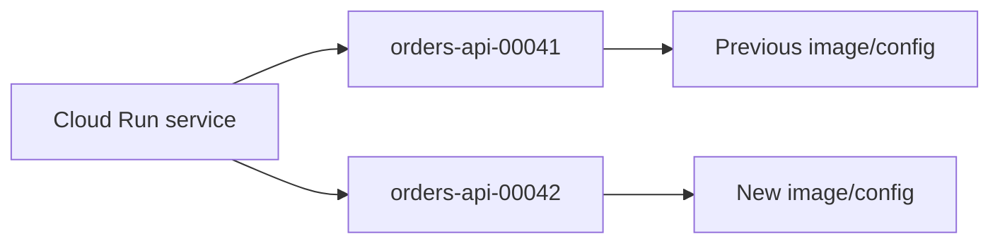

## Table of Contents

1. [The Problem](#the-problem)
2. [What Is Cloud Run](#what-is-cloud-run)
3. [Container Contract](#container-contract)
4. [Services](#services)
5. [Revisions](#revisions)
6. [Traffic](#traffic)
7. [Scaling](#scaling)
8. [Runtime Identity](#runtime-identity)
9. [Environment And Secrets](#environment-and-secrets)
10. [Logs And Health](#logs-and-health)
11. [Sample Service Shape](#sample-service-shape)
12. [Putting It All Together](#putting-it-all-together)
13. [What's Next](#whats-next)

## The Problem

The Orders API is packaged as a container image. It starts on a laptop, listens on a port, reads environment variables, and returns a health response. The image is pushed to Artifact Registry. It feels ready.

Then production asks for more than a package:

- What stable service receives HTTPS requests?
- Which version is serving traffic right now?
- Which identity does the app use when it reads a secret or calls Cloud SQL?
- Where do startup errors, request logs, health failures, and rollbacks appear?

Cloud Run answers those questions by wrapping the container in a managed service model. The image is still important. It is just not the whole runtime.

## What Is Cloud Run

Cloud Run is a managed runtime for containers, services, jobs, functions, and worker pools. In this article, the focus is Cloud Run services because the Orders API is an HTTP backend.

A Cloud Run service is the stable resource users and operators talk about. A revision is an immutable snapshot created when code or configuration changes. A container instance is a running copy that handles requests. Traffic settings decide which revision receives requests.

Those nouns prevent confusion:

| Noun | Plain-English job |
| --- | --- |
| Service | Stable application entry and configuration surface |
| Revision | Versioned snapshot of code and settings |
| Instance | Running container copy created from a revision |
| Traffic split | Runtime decision about which revision receives requests |

When someone says "Cloud Run is broken," ask which noun they mean.

## Container Contract

Cloud Run can manage the service only if the container follows the runtime contract. The app must start reliably, listen on the expected port, handle HTTP requests, and avoid depending on local machine state that disappears when instances stop.

The port is a classic beginner problem. A local app might listen on `3000` because that is what the framework uses. Cloud Run provides a `PORT` environment variable, and the container should listen on that value. If it ignores the expected port, the image can build successfully and still fail as a service.

The contract is small but serious:

```text
image: us-docker.pkg.dev/orders-prod/apps/orders-api:2026-05-17
process: starts without manual shell steps
port: listens on PORT
state: durable state outside the container
health: startup and request failures visible in logs
```

Cloud Run removes server management. It does not remove the need for a well-behaved process.

## Services

The service is the stable Cloud Run resource. It has a name, region, URL or entry path, runtime service account, environment configuration, scaling settings, and traffic allocation.

For the Orders API, the service might be `devpolaris-orders-api` in `us-central1`. The public entry module decides whether users call a load balancer, custom domain, or service URL. The networking module decides ingress and egress. This article focuses on the compute shape around the running container.

The service is where operators should expect to answer:

| Question | Service-level evidence |
| --- | --- |
| Which app is this? | Service name and labels |
| Where does it run? | Region |
| What identity does it use? | Runtime service account |
| Which config is active? | Environment variables and secrets |
| Which version serves traffic? | Revision traffic split |

Treat the service as the application runtime surface with its deployment target attached.

## Revisions

A revision is created when a Cloud Run service's code or configuration changes. It is immutable: once created, that revision represents a specific snapshot of the service.

That makes deployment easier to reason about. If a new image crashes, the failing revision has a name. If a secret configuration changed, the revision records the change. If a rollout goes badly, traffic can move back to an older healthy revision.



The important gotcha is that a revision can exist without receiving traffic. Creating a revision and serving users from it are related but separate events.

## Traffic

Traffic decides which revision handles requests. Cloud Run can send all traffic to one revision, split traffic between revisions, or keep a new revision at zero traffic while it is inspected.

This is powerful because deployment and rollout are not the same moment. The team can create `orders-api-00042`, check that it starts, and then move traffic gradually. If errors rise, traffic can move back to `orders-api-00041`.

| Traffic shape | What it means |
| --- | --- |
| 100 percent to one revision | Simple stable serving |
| Split between revisions | Gradual rollout or comparison |
| New revision with no traffic | Deploy for inspection before serving users |
| Rollback | Move traffic back to a known healthy revision |

The public URL or load balancer may still be healthy while the wrong revision serves traffic. That is why traffic split belongs in every Cloud Run review.

## Scaling

Cloud Run scales instances around demand. When requests arrive, instances can be created. When demand falls, instances can shrink, sometimes to zero depending on settings. This saves operation effort and can reduce cost, but it changes how you design the app.

An instance is not a durable home. Local memory can disappear. Local files should not be the source of truth. Startup must be quick and reliable enough for new instances. Database connections should be handled with scaling in mind.

Minimum instances can reduce cold starts, but they cost more because capacity stays warm. Maximum instances can protect downstream systems, but they can also throttle the service if set too low.

Cloud Run scaling is a tradeoff between cost, latency, and downstream protection.

## Runtime Identity

Cloud Run services run with a service account. That runtime identity is what the app uses when it calls Google APIs such as Secret Manager, Cloud Storage, or Cloud SQL connection helpers.

This should be separate from the deploy identity. A CI/CD pipeline may need permission to deploy a service and shift traffic. The running Orders API may only need to read a secret, write logs, and connect to a database. Giving the runtime identity deploy-level power creates unnecessary blast radius.

The healthy sentence is:

```text
The deploy identity updates the service.
The runtime identity is attached to the service and has only the app's needed permissions.
```

The identity module already taught the IAM side. Here, remember that runtime identity is part of the compute shape.

## Environment And Secrets

Configuration is part of the service, not part of the container image. The same image might run in dev and prod with different database names, feature flags, or secret references.

Environment variables are useful for non-sensitive settings. Secrets should come from Secret Manager or another approved secret path, then be made available to the service through Cloud Run configuration. Do not bake production secrets into the image. The image should be reusable; the service configuration should explain the environment.

This split makes rollbacks cleaner. If code changed, inspect the image and revision. If configuration changed, inspect the revision settings. If secret access fails, inspect runtime identity and secret permissions.

## Logs And Health

Cloud Run collects container logs and request evidence. This is the first place to look when a service fails to start, returns errors, or behaves differently after a rollout.

Useful Cloud Run evidence is compact:

```text
service: devpolaris-orders-api
region: us-central1
revision: orders-api-00042
image: orders-api:2026-05-17
traffic: 10 percent
runtime identity: orders-api-runtime
startup: healthy
request errors: increasing on /checkout
```

Health is more than a single endpoint. Startup behavior, request logs, revision readiness, and traffic allocation together tell the story.

## Sample Service Shape

For the Orders API, a simple Cloud Run service shape looks like this:

| Part | Example |
| --- | --- |
| Service | `devpolaris-orders-api` |
| Region | `us-central1` |
| Image | `orders-api:2026-05-17` |
| Port | `PORT` from Cloud Run |
| Runtime identity | `orders-api-runtime@orders-prod-123.iam.gserviceaccount.com` |
| Config | Database name, feature flags, secret references |
| Traffic | Gradual shift from revision `00041` to `00042` |
| Evidence | Request logs, startup logs, metrics, revision status |

This shape is small enough for a new engineer to review and complete enough to debug the first rollout.

## Putting It All Together

Return to the opening problems.

The stable service is the Cloud Run service, not the image tag. The service owns region, identity, configuration, scaling, and traffic.

The active version is visible through revisions and traffic splits. A new revision can exist before users see it, and rollback means moving traffic back.

The app's Google API access comes from the runtime service account. That identity should be narrower than the deploy identity.

Startup errors, request failures, and health evidence live in Cloud Run logs, revision status, and metrics. The image matters, but the runtime shape around the image tells the production story.

## What's Next

Cloud Run is the managed-service answer for many APIs. The next article covers Compute Engine, where choosing a virtual machine gives more server control and keeps more server responsibility with the team.

---

**References**

- [Google Cloud: What is Cloud Run](https://cloud.google.com/run/docs/overview/what-is-cloud-run)
- [Google Cloud: Manage revisions](https://cloud.google.com/run/docs/managing/revisions)
- [Google Cloud: Configure containers for services](https://cloud.google.com/run/docs/configuring/services/containers)
- [Google Cloud: Service identity](https://cloud.google.com/run/docs/securing/service-identity)
