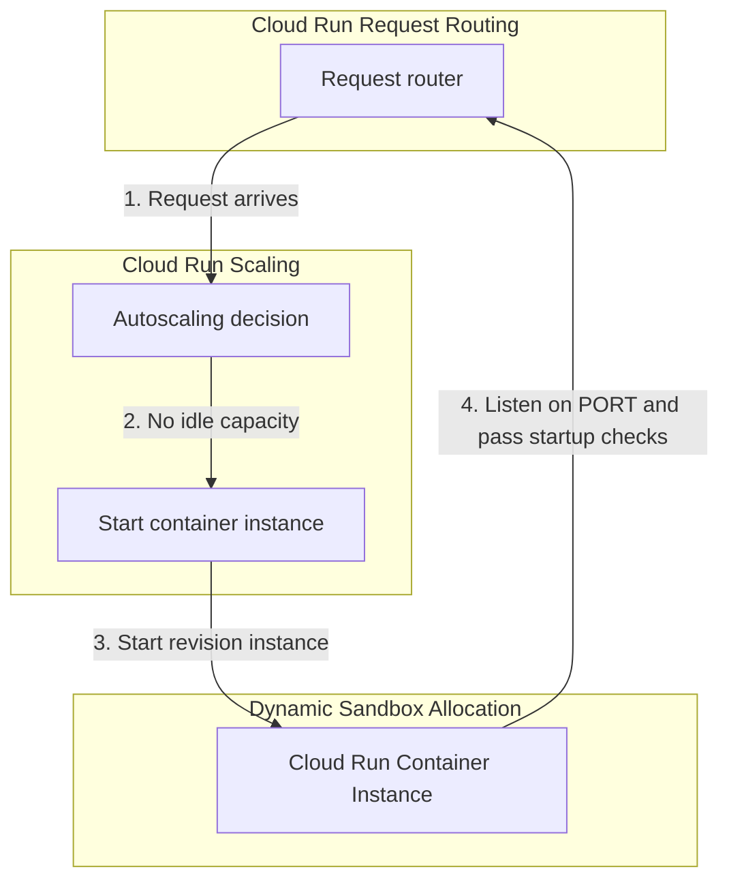

## Table of Contents

1. [Cloud Run Services](#cloud-run-services)
2. [The Container Network Port Contract](#the-container-network-port-contract)
3. [Revisions and Traffic Splits](#revisions-and-traffic-splits)
4. [Scaling Boundaries and Downstream Protection](#scaling-boundaries-and-downstream-protection)
5. [Runtime Identity and Least-Privilege IAM](#runtime-identity-and-least-privilege-iam)
6. [Environment Configuration and Secrets Access](#environment-configuration-and-secrets-access)
7. [Logs, Health, and Revision Verification](#logs-health-and-revision-verification)
8. [Sample Service Shape](#sample-service-shape)
9. [Putting It All Together](#putting-it-all-together)
10. [What's Next](#whats-next)

## Cloud Run Services

Cloud Run is Google Cloud's fully managed, API-driven serverless container runtime designed to run HTTP-based applications, microservices, and background jobs. By abstracting the operating system, virtual machine provisioning, and cluster administration surfaces, Cloud Run allows developers to deploy a containerized application directly from Artifact Registry and instantly receive a secure, auto-scaled public HTTPS endpoint.

A common operational error is treating a container image as the complete running service. In production environments, the container image is merely the immutable package containing your application binaries and dependencies. Cloud Run wraps this package in a robust service model that governs ingress routing, revisions, traffic splits, IAM workload identities, secrets access, and auto-scaling boundaries.

For teams coming from other cloud platforms, Cloud Run serves as the GCP equivalent of AWS App Runner or AWS ECS Fargate, and Azure Container Apps. Cloud Run can scale from zero and add instances quickly, but scaling is still governed by container startup time, configured maximum instances, regional capacity, concurrency, and downstream dependency limits.

:::expand[Design Detail: Scale-to-Zero and Cold Starts]{kind="design"}
The most powerful operational characteristic of Cloud Run is its ability to scale container instances to zero when no traffic is present, reducing compute charges for idle services. The documented behavior to teach is the service contract: Cloud Run starts container instances when traffic or work arrives, routes requests to healthy instances, and scales within the limits you configure.

When a Cloud Run service scales to zero, there is no active container instance waiting for traffic. Cloud Run still keeps the service route and revision configuration. When traffic arrives again, the platform starts an instance for the selected revision and routes requests only after the container is ready.

As traced above, the beginner-visible lifecycle is simple:

1.  **Request Arrival**: A request reaches the Cloud Run service.
2.  **Capacity Check**: Cloud Run decides whether an existing instance can handle the request based on concurrency and current load.
3.  **Instance Start**: If more capacity is needed, Cloud Run starts an instance of the selected revision.
4.  **Readiness**: Your container must start, listen on the expected port, and pass startup behavior before it can serve traffic.
5.  **Scaling Limits**: If max instances, startup time, or downstream systems become the bottleneck, scaling cannot make the service infinitely fast.
:::

## The Container Network Port Contract

To successfully run inside Cloud Run, your application container must adhere to a strict network port contract. Cloud Run injects a `PORT` environment variable into the ingress container, and your server must listen on that port.

*A healthy container still fails if it listens on the wrong port.*

The port defaults to `8080` unless you configure it. Your application server code should read `PORT` and bind its listener to that exact port, rather than assuming that a hardcoded local development port is the deployed contract.

Furthermore, your application must listen on the network interface address **`0.0.0.0`** rather than `127.0.0.1` (localhost). Binding strictly to localhost keeps the socket inside the container loopback interface, so Cloud Run cannot route incoming requests to your process.

## Revisions and Traffic Splits

Every time you deploy a new container image or modify a service's configuration settings (such as environment variables, secret mappings, or memory limits), Cloud Run creates an immutable snapshot called a **Revision**. Revisions represent a precise historical record of your application state and cannot be modified.

*Rollback is fast because the old revision still exists as a known target.*

This immutability allows security and operations teams to decouple deployment from release:

*   **Zero-Traffic Canary**: You can deploy a new container image to create a revision, but keep its traffic allocation set to `0%`. This allows your team to verify that the container boots and passes health checks securely in production without exposing it to live users.
*   **Gradual Rollouts**: You can configure a traffic split, routing `90%` of requests to the stable revision and `10%` to the new canary revision.
*   **Fast Rollbacks**: If application monitoring logs expose an elevated error rate on the new revision, you can shift `100%` of traffic back to a previous revision. The rollback is a traffic change to a known revision, but traffic movement, instance startup, and dependency behavior still need monitoring.

## Scaling Boundaries and Downstream Protection

Cloud Run autoscaling is highly responsive, dynamically adding container instances as concurrent request volume increases. However, unconstrained auto-scaling is a dangerous architectural hazard that can easily trigger cascading failures across downstream databases and APIs.

If a sudden burst of public traffic arrives, Cloud Run can scale your service to hundreds of concurrent container instances within seconds. If each container instance opens a pool of 10 persistent TCP connections to a relational database like Cloud SQL, the database engine will quickly exhaust its file descriptor limit, lock active connections, and crash under the socket surge.

To defend your downstream systems, you must configure strict scaling boundaries:

*   **Concurrency limits**: Define the maximum number of concurrent requests a single container instance can handle simultaneously before a new instance is provisioned (e.g. `80` requests).
*   **Max Instances**: Set an absolute limit on the maximum number of container instances Cloud Run is permitted to provision (e.g. `20` instances). This acts as a circuit breaker, capping the maximum database connection socket usage.
*   **Min Instances**: Maintain a warm baseline pool of instances (e.g. `1` or `2`) to eliminate cold-start latencies for critical user paths, balancing latency requirements against minimum billing costs.

## Runtime Identity and Least-Privilege IAM

Securing your containerized applications requires strict separation between your deployment pipelines and your running workloads. In GCP, this boundary is enforced by attaching a dedicated **Runtime Service Account** to your Cloud Run service.

Your CI/CD deployment pipeline utilizes a highly privileged *Deploy Identity* (often federated via Workload Identity Federation) to write code, create revisions, and modify service configurations. However, when the container executes, it inherits the permissions of the attached *Runtime Identity*.

This runtime service account must adhere strictly to least-privilege principles. For example, the runtime account for an Orders API requires only the `roles/secretmanager.secretAccessor` role on its specific database credential secret and connect permissions on its Cloud SQL database. It must never possess project-level Editor or Owner privileges, ensuring that a compromised container filesystem cannot be leveraged by an attacker to alter network configurations or delete adjacent cloud resources.

## Environment Configuration and Secrets Access

To maintain environment-portable container images, you must decouple configuration values from your application binaries. A healthy container image is built once, tagged with a unique git SHA, and promoted systematically through development, staging, and production environments.

*   **Environment Variables**: Use Cloud Run environment variables to inject non-sensitive settings (such as database names, logging levels, or feature flags) that differ across environments.
*   **Secret Manager Integration**: Never bake sensitive credentials, API tokens, or cryptographic private keys directly into your container image, and avoid injecting them as raw environment variables. Instead, reference the secure paths in Secret Manager. Cloud Run resolves these paths dynamically at boot time, mounting the payload either as an environment variable or as a read-only file inside a transient in-memory volume, ensuring raw keys never touch physical storage disks.

## Logs, Health, and Revision Verification

Because Cloud Run executes container instances within a sandboxed, serverless fabric, debugging application failures requires relying entirely on structured logging and health metrics. You cannot SSH into a Cloud Run container to inspect file state or run diagnostic utilities.

To ensure your application's operational health is visible:

*   **Standard Output (`stdout`) Logging**: Configure your application's logging framework to write structured JSON logs directly to the standard output and standard error streams. Cloud Run automatically captures these streams, injects metadata (such as the active revision name, instance ID, and severity level), and routes them to Cloud Logging.
*   **Startup Probes**: Configure explicit startup probes to instruct Cloud Run when the container is ready to accept traffic. If the startup probe fails to complete within the configured timeout window, the platform immediately marks the instance unhealthy and stops routing requests, preventing a broken deployment from disrupting live traffic.

## Sample Service Shape

An idiomatic Cloud Run service shape for the Orders API unifies these parameters into a secure, predictable configuration block:

| Service Parameter | Configuration Value | Operational Purpose |
| :--- | :--- | :--- |
| **Service Name** | `devpolaris-orders-api` | Stable regional address for the microservice. |
| **Region** | `us-central1` | Regional datacenter placement for low latency. |
| **Active Image** | `orders-api:git-a3f8c2d` | Immutable container snapshot tagged by git SHA. |
| **Port Binding** | Read `PORT` dynamically, listen on `0.0.0.0` | Lets Cloud Run route traffic into the container process. |
| **Max Instances** | `20` | Database connection scaling circuit breaker. |
| **Runtime Identity**| `orders-api-runtime@prod-project.iam...` | Least-privilege principal for resource access. |
| **Secret Mounts** | Mount `orders-db-url` secret as file | Secure, diskless database credential resolution. |

## Putting It All Together

Decoupling web API execution from virtual servers requires establishing a clean, containerized contract.

When a user issues a checkout request, the public entry load balancer routes the HTTP request to the `devpolaris-orders-api` Cloud Run service. If the service was idle, Cloud Run starts an instance of the active revision and waits for the container to satisfy the runtime contract.

The container boots, programmatically reads the injected `PORT` variable, and binds its server process to interface `0.0.0.0`. Once the startup probe passes, Cloud Run can route requests to the instance. The application code uses the attached least-privilege service account to retrieve its database secret and commits the transaction, routing its logs directly to `stdout` for unified operational monitoring.

## What's Next

Cloud Run represents the standard runtime for stateless, containerized HTTP applications. However, some workloads do not fit managed container models, requiring direct operating system control, custom host monitoring agents, or persistent virtual disks. In the next article, we analyze Compute Engine, detailing virtual machines, custom machine types, disks, zones, and maintenance behavior.

*Use this summary as the quick mental checklist before designing or debugging the service.*

---

**References**

- [Google Cloud: Cloud Run documentation](https://cloud.google.com/run/docs) - Complete architectural guidelines for serverless container deployment.
- [Google Cloud: Cloud Run autoscaling](https://cloud.google.com/run/docs/about-instance-autoscaling) - Explains instance scaling, concurrency, and scale-to-zero behavior.
- [Google Cloud: Maximum instance limits](https://cloud.google.com/run/docs/configuring/max-instances-limits) - Documents scaling limits and downstream protection controls.
- [Google Cloud: Configure container ports](https://cloud.google.com/run/docs/configuring/services/containers) - Guide to PORT environment variables and interface binding contracts.
- [Google Cloud: Service identity](https://cloud.google.com/run/docs/securing/service-identity) - Standard security protocols for attaching workload service accounts.
