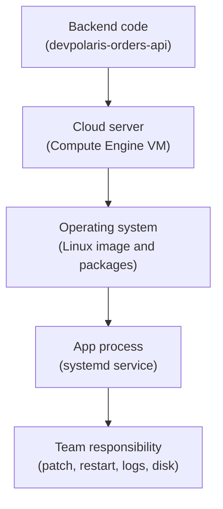

## Table of Contents

1. [A VM Is A Cloud Server, Not A Managed App Platform](#a-vm-is-a-cloud-server-not-a-managed-app-platform)
2. [If EC2 Or Azure VMs Are Familiar](#if-ec2-or-azure-vms-are-familiar)
3. [The Orders API VM Scenario](#the-orders-api-vm-scenario)
4. [What A Compute Engine Instance Includes](#what-a-compute-engine-instance-includes)
5. [Zone Placement Matters More On VMs](#zone-placement-matters-more-on-vms)
6. [Boot Disks And Persistent State](#boot-disks-and-persistent-state)
7. [Startup Scripts And Process Managers](#startup-scripts-and-process-managers)
8. [Service Accounts On VMs](#service-accounts-on-vms)
9. [Network Access Is Still Explicit](#network-access-is-still-explicit)
10. [Logs Need A Shipping Plan](#logs-need-a-shipping-plan)
11. [When A VM Is The Right Choice](#when-a-vm-is-the-right-choice)
12. [Failure Modes And First Checks](#failure-modes-and-first-checks)
13. [A Practical VM Review](#a-practical-vm-review)

## A VM Is A Cloud Server, Not A Managed App Platform

Compute Engine gives you virtual machines in Google Cloud. A virtual machine, usually called
a VM, is a server-shaped resource. It has an operating system, CPU, memory, disks, network
interfaces, firewall exposure, startup behavior, and credentials for calling Google APIs.
That shape feels familiar if you have run Linux servers before.

The important beginner truth is that a VM is not a managed application platform. GCP
provides the infrastructure for the machine, but your team still owns much of the server
story. Something must install packages. Something must start the Node process. Something must
restart it if it crashes. Something must patch the operating system. Something must ship
logs where the team can read them.

That control can be exactly what you need. It can also be extra work you did not mean to
keep. A VM is a good choice when the server shape matters. It is a weaker first choice when
the app only needs to run a normal HTTP container and your team wants fewer operating
surfaces.

For `devpolaris-orders-api`, this article treats Compute Engine as a realistic migration
option. Maybe the first version of the app already runs on a Linux VM outside GCP. Maybe the
team needs a special agent on the host. Maybe a legacy dependency expects a normal server.
Those are believable reasons. The point is to know the tradeoff before choosing it.



The diagram is intentionally plain. When you choose a VM, the operating system enters the
application story. That is the main difference from Cloud Run.

## If EC2 Or Azure VMs Are Familiar

If you know AWS EC2, Compute Engine will feel familiar. You create an instance, choose a
machine shape, attach disks, place it in a zone, put it on a network, and decide what can
reach it. If you know Azure Virtual Machines, the same broad idea applies.

The GCP details still matter. Compute Engine instances live in zones. The project decides
where the instance belongs for billing, IAM, APIs, and inventory. Firewall rules are tied to
VPC network behavior. A service account can be attached to the instance so software on the
VM can call Google APIs without storing a human password.

Use the bridge, but do not copy habits blindly. A VM in any provider has the same basic
responsibility shape: the cloud gives you a server, and your team operates more of the
runtime. The provider-specific details decide which logs, permissions, network paths, and
metadata services you inspect.

## The Orders API VM Scenario

Imagine the orders team has an older deployment path. The app runs on a Linux server with
`systemd`, reads an environment file, and logs to standard output and a local app log file.
The team wants to move it into GCP without changing the app packaging yet.

The target VM record might look like this:

```text
instance: vm-orders-api-01
project: devpolaris-orders-prod
zone: us-central1-a
machine type: small general-purpose VM
boot disk: Debian image with persistent boot disk
network: devpolaris-prod-vpc
service account: orders-api-prod@devpolaris-orders-prod.iam.gserviceaccount.com
process manager: systemd
unit: devpolaris-orders.service
public entry: HTTPS load balancer or internal caller, not direct SSH from the internet
```

This record is not a command list. It is the shape of responsibility. The app does not run
because an image was deployed to Cloud Run. It runs because a server boots, installs or
receives the app, starts a process, and keeps that process alive.

That makes debugging more server-like. If checkout fails, you may inspect the load balancer,
the firewall, the process, the service account, the disk, the journal, and guest logs. None
of those checks are strange. They are the price of server-shaped control.

## What A Compute Engine Instance Includes

A Compute Engine instance is not only a name and an IP address. It is a bundle of choices:

| Instance Piece | Beginner Meaning | Why It Matters |
|---|---|---|
| Project | The ownership and billing workspace | Wrong project means wrong IAM, APIs, and cost owner |
| Zone | The physical placement area inside a region | Zonal disks and failure behavior depend on it |
| Machine type | CPU and memory shape | Too small causes pressure, too large wastes money |
| Boot disk | The disk used to start the OS | App files, packages, and logs may depend on it |
| Network interface | How the VM joins a VPC | Traffic depends on subnet, routes, and firewall rules |
| Service account | The VM workload identity | Apps on the VM use it to call Google APIs |
| Metadata and startup behavior | Values and scripts available at boot | Bad startup logic can break every replacement |

This is why VMs are both flexible and easy to misconfigure. There are more moving pieces
than a managed container service. A VM can run almost anything, but "almost anything" means
your team must make the operating contract clear.

## Zone Placement Matters More On VMs

Compute Engine instances are zonal resources. That means a VM lives in one zone, such as
`us-central1-a`. Some resources it uses may also be zonal. A boot disk is tied to the VM's
placement. If you attach extra persistent disks, placement compatibility matters.

This is different from the first feeling many beginners have about "the cloud." A cloud VM
is not floating everywhere. It is placed somewhere. That placement affects latency,
availability, disk attachment, and recovery planning.

For the orders API, the VM and database plan should be reviewed together:

```text
app VM:
  zone: us-central1-a
  subnet: us-central1 private app subnet

database:
  Cloud SQL region: us-central1
  access path: private IP through approved network path

load balancer:
  health check path: /healthz
  backend: VM instance group or named backend
```

The exact architecture can vary. The habit does not. Put the VM, load balancer, database,
and storage location on the same review page. If a connected resource is far away or in an
incompatible zone, decide intentionally instead of discovering it during an incident.

## Boot Disks And Persistent State

A VM has disks. That sounds obvious, but it changes application behavior. A Cloud Run
container should treat local instance storage as replaceable. A VM often has a boot disk
that persists with the instance unless you delete it. That can be useful, but it can also
hide state that should belong somewhere else.

For `devpolaris-orders-api`, the order records should not live in a file on the VM. They
belong in the chosen database. Receipt exports should not live only under `/var/app/receipts`
on one machine. They belong in Cloud Storage. Local files may be fine for temporary work,
cache, or logs before shipping, but they should not become the only source of product truth.

The dangerous VM pattern is accidental state:

```text
/opt/devpolaris/orders-api/current
  application files

/var/log/devpolaris/orders-api.log
  local log file

/var/lib/devpolaris/orders.db
  accidental SQLite production data
```

The first path may be normal. The second needs a log shipping plan. The third should raise
questions immediately. If state matters to users, put it in a managed data service or design
a clear backup and restore plan.

## Startup Scripts And Process Managers

VM-based applications need a startup story. A startup script can install packages, fetch an
artifact, write configuration, or register the machine with a deployment system. A process
manager such as `systemd` can start the app and restart it when it fails.

The process manager is not a boring detail. It is what turns "the file exists on disk" into
"the app is running." A simple `systemd` unit record might look like this:

```text
unit: devpolaris-orders.service
working directory: /opt/devpolaris/orders-api/current
command: /usr/bin/node src/server.js
environment file: /etc/devpolaris/orders.env
restart policy: restart on failure
health endpoint: http://127.0.0.1:8080/healthz
```

If the app fails after a reboot, the first question is not "did the code compile?" The first
question is whether the machine booted into the expected state. Did the unit file exist?
Did the environment file exist? Did the service account have access to the secret fetch
step? Did the process bind the expected port?

This is the heart of VM work. The runtime contract lives partly in the operating system.

## Service Accounts On VMs

A VM can have a service account attached. Software running on that VM can use the attached
service account to call Google APIs. That keeps human credentials out of the application and
fits the identity model from the previous module.

For the orders API VM, the attached service account might be:

```text
orders-api-prod@devpolaris-orders-prod.iam.gserviceaccount.com
```

That identity may read selected secrets, write logs, and access specific storage buckets.
It should not receive broad project ownership just because the VM is a server. A VM with too
much access is still too much access.

There is one extra caution with VMs. If several VMs share the same service account, changing
the roles on that service account affects all of them. That can be useful for a fleet, but
it can also surprise a team. If the app VM and a maintenance VM share one identity, a
permission added for one may accidentally apply to the other.

Use service accounts as workload identities, not as convenience buckets.

## Network Access Is Still Explicit

A VM has network interfaces, but that does not mean every request can reach it. Traffic
depends on VPC subnets, routes, firewall rules, load balancer configuration, and the app's
listening port. The VM might be perfectly healthy and still unreachable from users.

For a public API, the team usually wants a front door in front of the VM rather than direct
internet traffic to a random instance. The front door can handle HTTPS, health checks, and
routing. The VM should accept only the traffic it needs from the approved path.

A practical network review might be:

| Path | First Check |
|---|---|
| User to HTTPS entry | DNS and certificate point at the intended front door |
| Front door to VM | Backend health check reaches `/healthz` on the expected port |
| VM to database | Private path, database allow rules, and app credentials are correct |
| VM to Google APIs | Service account permissions and API access path are correct |
| Operator to VM | SSH or admin path is restricted and logged |

The VM does not remove the networking model from the previous module. It makes the network
model more visible because the machine has a real interface and port.

## Logs Need A Shipping Plan

On a VM, logs can stay local unless you plan otherwise. That is dangerous during incidents.
If the only useful error line lives in `/var/log/devpolaris/orders-api.log` on one machine,
the team must reach that machine at exactly the moment it is unhealthy. That is a bad
support experience.

The app should write structured logs. The VM should have a plan to send useful logs to Cloud
Logging or another central log system. Guest system logs, startup logs, process manager
logs, and application logs may all matter.

A first diagnostic record might look like this:

```text
instance: vm-orders-api-01
app process: devpolaris-orders.service
system logs: journalctl -u devpolaris-orders
startup logs: guest startup script output
central logs: Cloud Logging filter service=devpolaris-orders-api
```

The exact tool can differ. The habit should not. Production logs should be findable without
depending on one person's terminal access to one sick machine.

## When A VM Is The Right Choice

VMs are not a failure of cloud learning. They are the right answer for some workloads. The
mistake is using them by habit when the app would be simpler on a managed runtime.

Choose Compute Engine when at least one of these is true:

| Reason | Example |
|---|---|
| The operating system matters | Custom packages, kernel behavior, or host agent requirements |
| The migration path matters | Existing server deployment can move before the app is repackaged |
| The process model is unusual | Long-lived process, local daemon, or special runtime setup |
| The network shape is server-specific | Appliance-like software or host-level network control |
| The team intentionally accepts server operations | Patch, monitor, restart, and harden the VM as part of the plan |

Do not choose a VM because it is the only shape you recognize. Familiarity can reduce
learning pressure today and increase operating pressure tomorrow. A good VM decision names
the control you need and the chores you accept.

## Failure Modes And First Checks

VM failures often look like ordinary server failures. That is a feature and a warning.

The app is not responding after reboot:

```text
symptom: load balancer reports backend unhealthy
first checks:
  VM instance status
  systemd unit state
  app listening port
  boot or startup script logs
```

The app starts but cannot read a secret:

```text
symptom: PermissionDenied from Secret Manager
first checks:
  service account attached to VM
  IAM binding on secret
  project and secret name
```

The VM is healthy but the load balancer cannot reach it:

```text
symptom: health check fails
first checks:
  firewall rule for health check path
  app listening address and port
  backend group membership
  health endpoint response
```

The disk fills:

```text
symptom: app writes fail or service crashes
first checks:
  log growth
  temporary file cleanup
  boot disk size
  central log shipping
```

These checks are practical because they match the VM surface. You are not debugging a Cloud
Run revision. You are debugging a cloud server and the app running on it.

## A Practical VM Review

Before choosing Compute Engine for `devpolaris-orders-api`, the team should be able to fill
out this review:

| Review Item | Example Answer |
|---|---|
| Why VM instead of Cloud Run | Existing server package and host agent requirement |
| Project | `devpolaris-orders-prod` |
| Zone | `us-central1-a` with recovery plan noted |
| Machine shape | Sized for expected traffic and monitored for pressure |
| Boot image | Approved Linux image with patch process |
| App start method | `systemd` unit named `devpolaris-orders.service` |
| Runtime identity | `orders-api-prod` service account |
| Network exposure | Load balancer path only, restricted admin access |
| Logs | Application and system logs shipped centrally |
| State | Product data in Cloud SQL and Cloud Storage, not local disk |
| Recovery | Rebuild from image or startup process, restore data from managed stores |

This review does not make VMs harder. It makes the responsibility visible. Compute Engine
is a strong tool when you need server-shaped control. It is also honest about what the team
must operate.

---

**References**

- [Compute Engine instances](https://cloud.google.com/compute/docs/instances) - Defines Compute Engine instances and the VM instance model.
- [Compute Engine overview](https://cloud.google.com/compute/docs/overview) - Places Compute Engine as infrastructure for self-managed VMs and related resources.
- [Service accounts on Compute Engine](https://cloud.google.com/compute/docs/access/service-accounts) - Explains how service accounts are attached to VMs for Google API access.
- [VPC firewall rules](https://cloud.google.com/firewall/docs/firewalls) - Documents the firewall behavior that controls VM network reachability.
