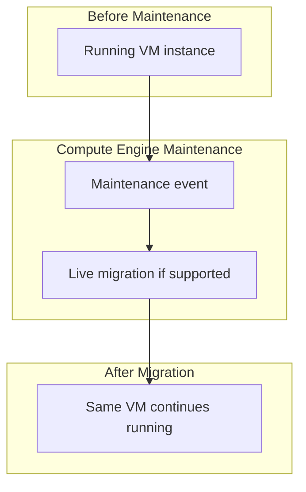

## Table of Contents

1. [Compute Engine Virtual Machines](#compute-engine-virtual-machines)
2. [Virtual Machine Machine Families](#virtual-machine-machine-families)
3. [OS Images and Snowflake Server Prevention](#os-images-and-snowflake-server-prevention)
4. [Persistent Disks and Storage Decoupling](#persistent-disks-and-storage-decoupling)
5. [Zonal Placement and Availability Boundaries](#zonal-placement-and-availability-boundaries)
6. [Automated Startup and Metadata Bootstrap](#automated-startup-and-metadata-bootstrap)
7. [Guest Process Supervision with systemd](#guest-process-supervision-with-systemd)
8. [VPC Network Interface Attachment](#vpc-network-interface-attachment)
9. [Sample Server Shape](#sample-server-shape)
10. [Putting It All Together](#putting-it-all-together)
11. [What's Next](#whats-next)

## Compute Engine Virtual Machines

Compute Engine is GCP's virtual server service. It gives your team a VM with configurable CPU, memory, operating system image, disks, network interfaces, startup behavior, and process supervision responsibility. Rather than abstracting the hardware layer completely like serverless container runtimes, Compute Engine allows you to provision, configure, and operate virtual servers with direct root control over the operating system kernel, filesystem configurations, network adapters, and running background processes.

A common architectural trap is choosing a virtual machine out of operational familiarity rather than technical necessity. Compute Engine is the correct runtime only when a workload requires raw server-shaped capabilities, such as running a database engine that requires dedicated block storage, hosting legacy vendor software with hardcoded OS requirements, or executing background daemons that require persistent host-level monitoring agents.

For engineers transitioning from other cloud platforms, Compute Engine virtual machines are the direct equivalent of Amazon EC2 instances and Azure Virtual Machines. While the underlying virtualization concepts are familiar, GCP differentiates its environment with customizable machine configurations, durable Persistent Disk storage, and live migration for many planned maintenance events.

:::expand[Design Detail: Maintenance and Live Migration]{kind="design"}
A primary risk when operating virtual machines is planned host maintenance. If the platform needs to maintain the physical host running your VM, your workload may experience disruption unless the instance type and maintenance policy support live migration.

Live migration is a Compute Engine feature that can move many running VM instances during planned maintenance with minimal disruption. The beginner contract is important: live migration reduces planned-maintenance downtime for supported instances, but it is not a guarantee that every VM survives every hardware failure. Multi-zone application design is still the reliability boundary for production services.



As traced above, live migration is designed to move supported running VMs during maintenance with minimal disruption:

1.  **Maintenance Event**: Google Cloud schedules maintenance for the host infrastructure.
2.  **Eligibility Check**: Compute Engine checks whether the instance supports live migration and whether its maintenance policy allows it.
3.  **Migration**: If eligible, Compute Engine moves the running instance while trying to keep disruption low.
4.  **Application Monitoring**: Your app should still use health checks, retries, and multi-zone capacity because live migration is not a substitute for application-level resilience.
:::

## Virtual Machine Machine Families

A machine family is a VM hardware profile category for a particular CPU, memory, accelerator, or cost shape. GCP organizes Compute Engine virtual machines into distinct, workload-optimized machine families. Choosing the correct family is critical for matching your workload's hardware requirements to the correct pricing tier:

*   **General-Purpose (`E2`, `N2`, `C3`)**: The standard workhorses designed for web applications, background utilities, and medium-scale databases. They run on shared or dedicated physical CPU cores, balancing cost and performance.
*   **Compute-Optimized (`C2`, `H3`)**: Hardened machine families that bind your virtual CPUs directly to high-frequency physical processor cores. These are designed for CPU-heavy tasks like high-performance computing (HPC) or real-time gaming servers.
*   **Memory-Optimized (`M1`, `M2`, `M3`)**: Specialized instances with massive RAM footprints (up to 12 terabytes), designed for running in-memory databases like SAP HANA or highly complex analytical workloads.

## OS Images and Snowflake Server Prevention

An OS image is the boot template that gives a VM its operating system, default packages, and startup baseline. Every virtual machine starts from an **OS Image** containing the bootloader, operating system kernel, and pre-installed system packages. While GCP provides standard public images (such as Debian, Ubuntu, and Red Hat Enterprise Linux), relying on manual configuration post-boot is a severe operational risk.


*Repeatable boot turns a VM from a handcrafted server into replaceable infrastructure.*

If an operator SSHs into a running VM to manually install dependencies, modify configurations, or update code, that VM becomes a **snowflake server**—an undocumented, fragile system that cannot be reproduced. If the physical host experiences a catastrophic crash or a developer accidentally deletes the VM, the configuration is lost permanently.

To prevent snowflake servers, you must enforce automation:

*   **Custom Machine Images (Golden Images)**: Build custom templates using tools like Packer. You install all security agents, runtime dependencies, and application binaries onto a VM, then snapshot its disk to create a custom image. When you deploy a new VM, it boots instantly with all code pre-installed.
*   **Infrastructure as Code (IaC)**: Standardize all VM deployments using Terraform or Bicep, ensuring that machine types, disk configurations, and VPC attachments are version-controlled and reproducible.

## Persistent Disks and Storage Decoupling

Persistent Disk is managed block storage that attaches to a VM as a disk device while keeping its own lifecycle. Compute Engine virtual machines store data on **Persistent Disks (PD)**. Unlike a physical boot drive that is inseparable from one machine, a Persistent Disk is managed separately from the VM. The VM sees it as block storage, but the disk can have its own lifecycle, placement rules, and snapshot strategy.


*The disk can outlive a VM, but it still has zonal placement rules.*

This network-decoupled architecture provides critical advantages:

*   **Dynamic Resizing**: You can expand a persistent disk's capacity (e.g. from 100GB to 500GB) dynamically while the VM is running and mounting the filesystem, without requiring a reboot.
*   **Independent Lifecycle**: A persistent disk can outlive the VM that uses it, and you can detach and attach disks within documented limits. This is useful for repair and replacement, but it should not be described as instant failover for every host failure.

Persistent disks include options such as standard, balanced, SSD, and newer Hyperdisk families. To reduce operational burden for most application teams, store primary relational data in managed engines like Cloud SQL when you want Google to handle backups, patching, and high availability. Use VM disks when the workload specifically needs block storage attached to an operating system.

## Zonal Placement and Availability Boundaries

Zonal placement means a VM is created in one specific zone and depends on that zone's capacity and availability. While GCP VPC networks are natively global, Compute Engine virtual machines are strictly **zonal** resources. A VM is provisioned within a single zone inside a region, such as `us-central1-a`.

Because a VM belongs to one zone, deploying a single VM introduces a single failure boundary. If that zone has a serious outage, the workload can go offline.

To secure highly available applications, you must deploy VMs across multiple zones behind a regional Application Load Balancer. By grouping these VMs into **Managed Instance Groups (MIGs)**, GCP's control plane can monitor VM health dynamically, automatically terminating and recreating any unhealthy instances across zonal boundaries to maintain your desired scale.

## Automated Startup and Metadata Bootstrap

The metadata server is the local runtime information endpoint a VM uses to read configuration, identity, and startup data. To automate VM provisioning, Compute Engine uses this endpoint to pass runtime configurations and scripts to the guest operating system at boot time.

When a VM boots, the Google Guest Agent running inside the OS queries the link-local metadata address `http://metadata.google.internal/computeMetadata/v1/` to fetch configuration parameters, including the user-supplied **`startup-script`**.

A startup script is a collection of shell commands or configuration scripts executed automatically by the root user during the final stages of the VM's boot process. The script acts as the bootstrap mechanism: it reads environment variables from metadata, pulls application configuration files, verifies database connectivity, and initializes your guest processes, ensuring that a freshly booted VM becomes a fully operational application server without human intervention.

## Guest Process Supervision with systemd

`systemd` is the Linux process supervisor that keeps services running after the boot script finishes. Once a virtual machine's startup script completes, the guest operating system needs a persistent process supervisor to keep the application running. In modern Linux distributions like Debian or Ubuntu, this is managed by **`systemd`**.

Relying on raw background processes (like executing `node server.js &` inside a terminal session) is an operational hazard: the shell will eventually close, and if the process crashes due to an unhandled exception, it remains terminated.

To configure systemd to supervise your application, you write a standard service unit file (e.g., `/etc/systemd/system/orders-worker.service`):

```ini
[Unit]
Description=Orders Import Worker Daemon
After=network.target

[Service]
Type=simple
User=orders-app
WorkingDirectory=/opt/orders-worker
ExecStart=/usr/bin/node dist/index.js
Restart=always
RestartSec=5
EnvironmentFile=/etc/orders/environment.env
StandardOutput=journal
StandardError=journal

[Install]
WantedBy=multi-user.target
```

The systemd unit configuration above guarantees process reliability:

*   **`ExecStart`**: Defines the precise binary path and arguments to launch your application securely.
*   **`Restart=always`**: Instructs the Linux kernel to monitor the process ID dynamically. If the application exits with an error code or crashes, systemd waits 5 seconds (`RestartSec=5`) and automatically spawns a fresh process.
*   **`StandardOutput=journal`**: Routes all application `stdout` and `stderr` streams directly to the system journal (`journald`), allowing the Google Ops Agent to capture and stream logs to Cloud Logging automatically.

## VPC Network Interface Attachment

A network interface is the VM attachment point to a VPC subnet and private IP range. Compute Engine virtual machines attach directly to private VPC subnets through network interfaces. Unlike serverless runtimes that hide most backend networking details, a VM is a persistent, addressable node within your private network topology.

This direct attachment requires precise network planning:

*   **Subnet CIDR Reservation**: Ensure your subnet CIDR ranges are sized adequately to support the maximum scale of your Managed Instance Groups.
*   **Private Google Access (PGA)**: Keep your VM subnets isolated from the public internet. By enabling Private Google Access on the subnet, VMs lacking public IP addresses can still resolve and securely access Google APIs (such as Cloud Storage or Secret Manager) over Google's private network backplane.
*   **IAM Target-Based Firewalls**: Attach a dedicated service account to the VM instance, and target your VPC firewall rules directly to that service account principal rather than relying on volatile, user-controlled network tags.

## Sample Server Shape

A sample server shape is a compact review of the VM's runtime contract. An idiomatic Compute Engine server shape for the Orders background worker isolates machine sizing, operating system templates, and process execution:

| Server Parameter | Configuration Value | Operational Purpose |
| :--- | :--- | :--- |
| **Instance Name** | `orders-worker-prod-01` | Unique zonal hostname within the VPC. |
| **Machine Type** | `e2-standard-2` | Balanced 2 vCPU, 8GB RAM general-purpose instance. |
| **OS Image** | `debian-12-hardened-v2026` | Pre-built custom golden image with Ops Agent active. |
| **Persistent Disk** | `30GB Balanced SSD` | Low-latency boot disk network-decoupled from hardware. |
| **Identity Account**| `orders-worker-runtime@prod-project...` | Least-privilege IAM service account principal. |
| **Bootstrap Script**| Metadata `startup-script` | Automates config fetching and env file writing. |
| **Process Manager** | `systemd` daemon unit | Supervises process execution and restarts on crash. |

## Putting It All Together

Operating virtual machines requires establishing automated, reproducible bootstrap configurations.

When your deployment pipeline provisions a new background worker VM, Compute Engine creates the instance from the selected machine type, image, disks, network interface, and metadata. The VM boots using a hardened custom image, and the Google Guest Agent queries `metadata.google.internal` to fetch and execute the startup script.

The script writes localized environment configurations and launches the systemd supervisor daemon. Systemd executes the application binary, monitors its process ID dynamically to recover from runtime crashes, and streams all logging output directly to the local journal. Finally, the local Ops Agent captures the journal log stream and forwards it to Cloud Logging, ensuring your server-shaped workload remains fully secure, automated, and observable.

## What's Next

Compute Engine virtual machines provide comprehensive operating system control for persistent, server-shaped workloads. However, many background tasks are highly ephemeral and event-driven, requiring a runtime that scales immediately to zero when idle. In the next article, we analyze Cloud Run functions, detailing Eventarc CloudEvents triggers and at-least-once idempotency guards.


*Use this summary as the quick mental checklist before designing or debugging the service.*


---

**References**

- [Google Cloud: Compute Engine VM instances](https://cloud.google.com/compute/docs/instances) - Specification for virtual machine provisioning.
- [Google Cloud: Machine families resource guide](https://cloud.google.com/compute/docs/machine-resource) - Resource allocation and CPU/RAM sizing standards.
- [Google Cloud: About startup scripts](https://cloud.google.com/compute/docs/instances/startup-scripts) - Documentation for automated metadata-driven bootstrapping.
- [Google Cloud: Persistent disk storage](https://cloud.google.com/compute/docs/disks) - Guide to software-defined network persistent storage.
- [Google Cloud: Live migration process](https://cloud.google.com/compute/docs/instances/live-migration-process) - Explains live migration behavior, support boundaries, and disruption expectations.
