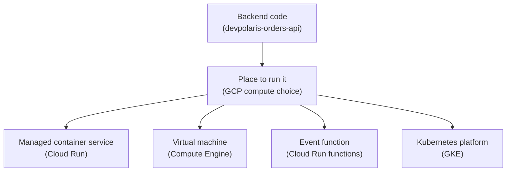

## Table of Contents

1. [The Runtime Choice Comes After The Cloud Shape](#the-runtime-choice-comes-after-the-cloud-shape)
2. [If AWS Or Azure Compute Is Familiar](#if-aws-or-azure-compute-is-familiar)
3. [The Example: devpolaris-orders-api](#the-example-devpolaris-orders-api)
4. [Four Runtime Shapes](#four-runtime-shapes)
5. [Cloud Run: A Managed Container Service](#cloud-run-a-managed-container-service)
6. [Compute Engine: A Virtual Machine You Operate](#compute-engine-a-virtual-machine-you-operate)
7. [Cloud Run Functions: Event Code With A Small Job](#cloud-run-functions-event-code-with-a-small-job)
8. [GKE: Kubernetes When Kubernetes Is The Requirement](#gke-kubernetes-when-kubernetes-is-the-requirement)
9. [The Five Questions Before You Choose](#the-five-questions-before-you-choose)
10. [What The First Failure Usually Teaches](#what-the-first-failure-usually-teaches)
11. [A Practical First Choice](#a-practical-first-choice)
12. [The Review Habit](#the-review-habit)

## The Runtime Choice Comes After The Cloud Shape

The earlier GCP articles gave the orders API a cloud shape. The app has a project. It has a
region. It has a service account. It has network paths. It has private configuration and
places to send logs. Now the next question is simpler and more concrete: what actually runs
the code?

GCP compute means the services that execute application code. A compute service might run a
container, boot a virtual machine, invoke a small function, or operate a Kubernetes cluster.
Those choices are not just different names for the same thing. Each one changes what Google
Cloud manages for you and what your team still owns.

That responsibility split is the useful beginner model. You are not only choosing a runtime.
You are choosing where startup failures appear, where logs are collected, how traffic reaches
the app, how scaling happens, and how much operating system work your team must keep doing.
The compute choice becomes very real the first time production says, "the API is down."

For `devpolaris-orders-api`, the first production version does not need a complicated
platform. It needs to receive HTTPS requests, read a few secrets, connect to a database,
write logs, and roll out new versions safely. That makes Cloud Run a strong default thread
for this module. The other compute services still matter because real teams often meet them
when requirements change.

Here is the first map. Read it top to bottom. The plain-English job comes before the GCP
service name because the job is what you are trying to remember.



This diagram leaves out many details on purpose. A first mental model should help you ask a
better question, not show every service at once. The question is: which runtime shape matches
the work and the team's current operating skill?

## If AWS Or Azure Compute Is Familiar

If you have learned AWS, you already know the main shape of the problem. AWS has EC2 for
servers, ECS or Fargate for containers, Lambda for functions, and EKS for Kubernetes. GCP has
similar categories, but the boundaries do not line up perfectly.

If you have learned Azure, the same warning applies. App Service, Container Apps, Functions,
and Virtual Machines are useful bridges, but they are not exact copies of GCP services. The
goal is to transfer the question, not memorize a translation chart.

Use this bridge carefully:

| Beginner Question | GCP Shape | AWS Bridge | Azure Bridge | Careful Difference |
|---|---|---|---|---|
| I want to run an HTTP container without managing servers | Cloud Run service | ECS on Fargate is the closest beginner bridge | Container Apps is the closest beginner bridge | Cloud Run has its own revision, traffic, and request model |
| I want a server I can log into and shape directly | Compute Engine VM | EC2 | Azure Virtual Machines | You own OS-level work, startup scripts, disks, and process management |
| I want code to run because an event happened | Cloud Run functions | Lambda | Azure Functions | The current GCP function model is closely tied to Cloud Run infrastructure |
| I need Kubernetes APIs and cluster behavior | GKE | EKS | AKS | Kubernetes knowledge becomes part of operating the app |

This comparison is meant to reduce fear, not flatten the providers into one vocabulary list.
When you read GCP docs, stay alert for GCP-specific nouns such as project, region, revision,
service account, Artifact Registry, and Cloud Logging. Those details decide what you inspect
when something fails.

## The Example: devpolaris-orders-api

The running example is a Node.js backend named `devpolaris-orders-api`. It receives checkout
requests from a frontend, writes order records, stores receipt exports, and emits logs for
support. Locally, the app looks ordinary:

```bash
$ npm ci
$ npm run start

> devpolaris-orders-api@1.0.0 start
> node src/server.js

2026-05-04T09:15:11.130Z INFO service=devpolaris-orders-api port=8080
2026-05-04T09:15:11.144Z INFO health path=/healthz status=ready
```

That local output is useful, but it proves only a local fact. The process starts on one
developer machine. Production asks for a stronger contract. The runtime must know which port
to use, which service account to run as, which region owns the service, how to expose HTTPS,
where to send logs, and how to prove the app is ready.

A small runtime record keeps the conversation practical:

```text
service: devpolaris-orders-api
runtime shape: HTTP backend
language: Node.js
port: 8080
health path: /healthz
project: devpolaris-orders-prod
region: us-central1
runtime identity: orders-api-prod@devpolaris-orders-prod.iam.gserviceaccount.com
private dependencies: Cloud SQL, Secret Manager, Cloud Storage
```

Notice that this record does not choose a compute service yet. That is intentional. Before
you choose Cloud Run, a VM, a function, or GKE, you should know what the app needs from any
runtime. A service choice is easier when the app contract is clear.

## Four Runtime Shapes

Most beginner GCP compute decisions can start with four shapes. Cloud Run is the managed
container service shape. Compute Engine is the virtual machine shape. Cloud Run functions is
the event function shape. GKE is the Kubernetes shape.

Each shape is useful, but each one asks the team to own a different kind of work:

| Runtime Shape | You Bring | GCP Provides | You Still Own |
|---|---|---|---|
| Cloud Run service | Container image or source deployment path | Managed request-serving container runtime | App startup, port, health, IAM, config, revisions |
| Compute Engine VM | Server image, startup script, package setup, or installed app | Cloud VM infrastructure | OS patching, process manager, firewall fit, disk, agent setup |
| Cloud Run functions | Function code and trigger | Function deployment and event invocation path | Event design, retries, idempotency, permissions |
| GKE | Containerized workloads and Kubernetes objects | Managed Kubernetes control plane and cluster features | Kubernetes manifests, service model, cluster operating choices |

The table should not make the decision feel abstract. The operating difference shows up
when a deploy fails. On Cloud Run, you inspect revision status, container startup, service
logs, and traffic. On a VM, you inspect boot, packages, process manager, disk, firewall
rules, and guest logs. In a function, you inspect trigger delivery, invocation logs, timeout,
and retry behavior. In GKE, you inspect Pods, Services, Deployments, nodes, and cluster
events.

## Cloud Run: A Managed Container Service

Cloud Run is often the friendliest first home for a small HTTP backend on GCP. You package
the app as a container, or use a source deployment path that produces a container, and Cloud
Run runs it as a service. The service receives HTTPS requests, creates container instances
as needed, collects logs, and gives you revisions when you deploy changes.

The useful beginner phrase is: Cloud Run runs containers as services without making you
operate the servers underneath. That does not mean there is no infrastructure. It means the
server layer is not your first operating surface. Your first checks are service settings,
revision status, container startup, request logs, IAM, and networking.

For `devpolaris-orders-api`, Cloud Run fits because the app is an HTTP API with a clear
port and a clear health path. It does not need a custom operating system. It does not need
to keep local disk state. It can handle more traffic by running more instances of the same
container. It can read secrets and call other GCP services through a service account.

Cloud Run is not magic. The container still must follow the runtime contract. The app must
listen on the expected port. Startup must finish before Cloud Run gives up. Logs should go
to standard output or standard error so Cloud Logging can capture them. If the app assumes a
local file path that does not exist, the platform cannot guess the missing design.

## Compute Engine: A Virtual Machine You Operate

Compute Engine gives you virtual machines. A VM is the most familiar shape if you have run
Linux servers before. You choose a machine type, boot disk, image, zone, network interface,
and service account. Then software runs on that machine because you install it, configure
it, and keep it alive.

This control is useful when the app needs a server-shaped home. Maybe the workload depends
on an old package. Maybe it needs a background agent that expects a normal host. Maybe the
team needs custom OS hardening or a special network setup. Maybe the migration path from an
existing server is more important than adopting a managed runtime on day one.

The cost of that control is responsibility. If the Node process dies, something on the VM
must restart it. If a security update is needed, the team must patch or rebuild the image.
If disk fills, the VM feels it. If logs are not shipped, the evidence stays on the machine
or disappears during replacement. Compute Engine is not wrong. It is a tradeoff with more
server ownership.

For a beginner cloud path, use VMs when you can explain why the app needs a VM-shaped
runtime. Do not choose VMs only because they feel familiar. Familiar can be helpful during a
migration, but familiar also means carrying operating chores that managed services are built
to remove.

## Cloud Run Functions: Event Code With A Small Job

Cloud Run functions are for small pieces of code that run because something happened. A
message arrives. A file lands in a bucket. A scheduled task fires. An HTTP request calls a
single-purpose function. The point is not to host a full application with many routes. The
point is to handle one event path cleanly.

For the orders system, a function might create a thumbnail after a product image upload,
clean expired checkout sessions on a schedule, or react when an order-export message lands
on a topic. That work does not need the full orders API process. It needs a small handler,
clear permissions, and careful retry behavior.

The main trap is forgetting that event-driven code can run more than once. If a function
processes a message and then crashes before the platform records success, the event may be
delivered again. That means handlers should be idempotent where possible. Idempotent means
the same event can be handled twice without corrupting state, charging twice, or creating
duplicate records.

Functions are excellent when the job is naturally event-shaped. They are awkward when you
force a normal backend API into many tiny functions before the team understands the request
flow. Start with the shape of the work. Use functions for reactions, glue, and background
steps, not as a reflex.

## GKE: Kubernetes When Kubernetes Is The Requirement

GKE is Google Kubernetes Engine, GCP's managed Kubernetes service. Kubernetes is a platform
for running containerized workloads with objects such as Pods, Deployments, Services, and
Ingress. GKE manages important cluster pieces for you, but it does not remove Kubernetes
from the learning path.

GKE makes sense when the team needs Kubernetes itself. Maybe the company already runs many
services on Kubernetes. Maybe the app needs Kubernetes-native operators, custom networking,
sidecars, service mesh behavior, or a platform team that standardizes on Kubernetes APIs.
Those are real reasons.

For a first small orders API, GKE is usually not the simplest starting point. The app needs
to receive HTTP requests, read configuration, connect to data services, and emit logs. Cloud
Run can teach those cloud basics without also teaching Pods, Services, node pools, and
cluster upgrades. That is a kindness to the learner and to the operating team.

Keep GKE in the map, but do not use it as a badge of seriousness. Kubernetes is useful when
the system needs Kubernetes-shaped control. If the main requirement is "run this container
as an HTTPS API," Cloud Run is often the clearer first answer.

## The Five Questions Before You Choose

A compute choice becomes practical when you ask the same five questions every time.

| Question | Why It Matters |
|---|---|
| What starts the code? | Startup failures are different for containers, VMs, functions, and Pods |
| What receives traffic or events? | HTTP request paths and event triggers fail in different places |
| What identity does the workload use? | The runtime service account decides what GCP APIs the code can call |
| What evidence appears when it fails? | Logs, health checks, revision status, and VM guest logs point to different surfaces |
| What scaling shape matches the work? | Request-driven, server-driven, event-driven, and cluster-driven scaling have different tradeoffs |

These questions prevent the most common product-list mistake. Instead of asking "Which GCP
compute service is best?", ask "What does this workload need from its runtime?" The answer
is usually less fancy and more useful.

For `devpolaris-orders-api`, the answers are friendly to Cloud Run. The app starts as a
containerized HTTP service. It receives HTTPS requests. It uses a service account. It should
emit logs to Cloud Logging. It scales by request traffic. None of those answers require a
VM or Kubernetes on day one.

## What The First Failure Usually Teaches

The first failure often teaches which runtime surface you actually chose. Imagine the new
production deploy fails with this log:

```text
Cloud Run revision devpolaris-orders-api-00012 failed to become ready
container failed to start and listen on the port defined by PORT=8080
```

That is a Cloud Run-shaped failure. You inspect the container startup path, the port, the
Dockerfile, and the app logs. You do not SSH into a host because that is not the operating
surface you chose.

A VM-shaped failure looks different:

```text
instance: vm-orders-api-01
systemd unit: devpolaris-orders.service
state: failed
reason: missing environment file /etc/devpolaris/orders.env
```

That failure sends you toward the machine, the unit file, the filesystem, and the startup
script. The code may be fine. The server setup may be wrong.

A function-shaped failure points somewhere else:

```text
function: orders-export-created
trigger: pubsub topic orders-export-events
result: retrying after timeout
first check: handler timeout, duplicate-safe processing, topic permissions
```

Each runtime gives you a different first place to look. That is why the compute choice is an
operations decision, not only a deployment choice.

## A Practical First Choice

For this roadmap, the practical first choice for a new GCP backend API is Cloud Run unless
the requirements clearly point elsewhere. That recommendation is not because Cloud Run is
the newest or most interesting service. It is because Cloud Run keeps the beginner focused
on the application contract: container, port, request path, service account, logs, health,
revisions, and traffic.

Choose Compute Engine when the server matters. Choose Cloud Run functions when the work is a
small event reaction. Choose GKE when Kubernetes is truly part of the requirement. If none
of those reasons are true, start with the managed container service and learn the surrounding
GCP pieces well.

The decision can be written as a short review:

| Workload Need | First Runtime To Consider |
|---|---|
| Public HTTP backend with a container image | Cloud Run service |
| Legacy server process or custom OS requirement | Compute Engine VM |
| One event creates one small unit of work | Cloud Run functions |
| Kubernetes APIs, operators, or cluster platform standards | GKE |

This review keeps the team from treating every compute service as equally likely. Most
services have a natural shape. A good runtime choice follows that shape.

## The Review Habit

Before choosing a GCP runtime, write one paragraph in plain English. Name what starts the
code, what calls it, what identity it uses, what evidence it produces, and what operating
work the team accepts. If that paragraph sounds confused, the architecture is probably
confused too.

For `devpolaris-orders-api`, the paragraph might say: The orders API runs as a Cloud Run
service in `us-central1`. A container image from Artifact Registry starts the Node process
on port `8080`. Customer traffic reaches it through HTTPS. The service runs as the
`orders-api-prod` service account, reads its secrets from Secret Manager, connects to Cloud
SQL, writes logs to Cloud Logging, and uses revisions for deploy evidence.

That paragraph is not decoration. It is the runtime contract. Later, when the app fails, the
team can inspect each sentence instead of guessing which cloud product to blame.

---

**References**

- [What is Cloud Run](https://cloud.google.com/run/docs/overview/what-is-cloud-run) - Defines Cloud Run as the managed application platform used for the main service example.
- [Compute Engine instances](https://cloud.google.com/compute/docs/instances) - Explains Compute Engine instances as virtual machine or bare metal instances.
- [Cloud Run functions documentation](https://cloud.google.com/functions/docs) - Describes Cloud Run functions as single-purpose functions that respond to events.
- [GKE overview](https://cloud.google.com/kubernetes-engine/docs/concepts/kubernetes-engine-overview) - Explains GKE as managed Kubernetes for containerized applications.
