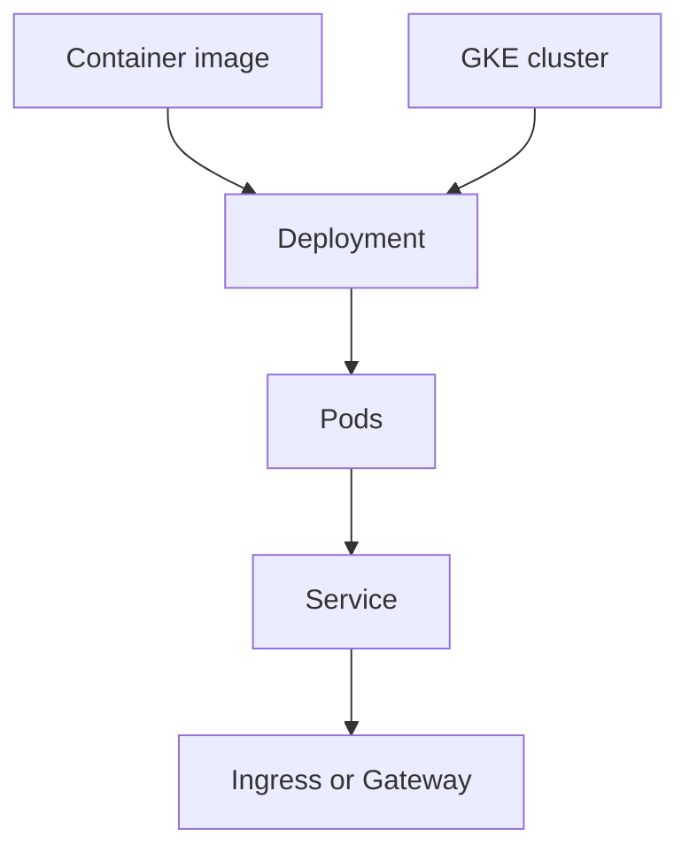

## Table of Contents

1. [The Problem](#the-problem)
2. [What Is GKE](#what-is-gke)
3. [Clusters](#clusters)
4. [Autopilot And Standard](#autopilot-and-standard)
5. [Pods](#pods)
6. [Deployments](#deployments)
7. [Services](#services)
8. [Ingress](#ingress)
9. [Workload Identity](#workload-identity)
10. [Node Responsibility](#node-responsibility)
11. [When GKE Fits](#when-gke-fits)
12. [Sample Cluster Shape](#sample-cluster-shape)
13. [Putting It All Together](#putting-it-all-together)

## The Problem

The Orders API runs nicely on Cloud Run. A container image becomes a managed HTTPS service. Revisions, traffic, scaling, identity, and logs are understandable. For one backend, that is a good shape.

Then the platform grows:

- Several teams want one shared deployment model across many services.
- The platform team needs Kubernetes policies, operators, and admission controls.
- Some workloads need sidecars, custom rollout behavior, or Kubernetes-native service discovery.
- The organization already has engineers who operate Kubernetes and wants the same model on GCP.

This is the moment to consider GKE. The reason is not "we have containers." Cloud Run already runs containers. The reason is that Kubernetes has become part of the operating requirement.

## What Is GKE

Google Kubernetes Engine, usually called GKE, is Google's managed Kubernetes service. Kubernetes is an open source platform for running containerized workloads. GKE provides the cluster environment on Google Cloud infrastructure and manages important control-plane pieces for you.

Kubernetes changes the unit of thinking. A container image is not deployed directly as "the app" in the same way as Cloud Run. It is placed into Kubernetes objects. Pods run containers. Deployments manage sets of Pods. Services give Pods a stable network identity. Ingress or Gateway resources can shape external entry.



The cluster is the platform. The Kubernetes objects describe desired state inside that platform.

## Clusters

A cluster is the Kubernetes environment where workloads run. It includes a control plane and worker capacity. The control plane exposes the Kubernetes API and coordinates cluster state. Worker capacity runs Pods.

In GKE, Google manages the control plane. That is a major help, but it does not erase Kubernetes operations. Your team still needs to understand namespaces, workloads, services, access, upgrades, networking, observability, and how changes roll through the cluster.

The cluster boundary matters because many decisions happen at that level:

| Cluster question | Why it matters |
| --- | --- |
| Which project and region own the cluster? | Cost, IAM, quotas, network placement |
| Which mode is used? | Node responsibility and operating surface |
| Which namespaces separate teams or environments? | Workload organization and policy scope |
| Which network and private access paths apply? | Service entry, egress, and dependencies |
| Which release channel and upgrade policy apply? | Kubernetes version and maintenance behavior |

GKE is managed, but it is still a platform you design.

## Autopilot And Standard

GKE has two main operating modes: Autopilot and Standard. Autopilot is the more managed mode. Google manages more of the cluster infrastructure, including nodes, scaling, and many security defaults. Standard gives the team more direct control over node pools and cluster infrastructure.

For beginners, Autopilot is often the clearer first GKE mental model because it keeps attention on workloads. You write Kubernetes manifests that request CPU, memory, and other resources. GKE provisions and manages the infrastructure needed to run them.

Standard is useful when the team needs more control over node configuration, node pools, special scheduling, or infrastructure-level behavior. That control can be necessary. It also means the team is choosing more platform administration.

| Mode | Good fit | Tradeoff |
| --- | --- | --- |
| Autopilot | Most teams that want Kubernetes without managing nodes directly | Less direct infrastructure control |
| Standard | Teams that need node-level control or custom platform behavior | More node and cluster operations |

The mode choice should come from requirements, not habit.

## Pods

A Pod is the smallest Kubernetes workload unit. It can run one or more containers that share a network namespace and lifecycle. Most beginner services use one main application container per Pod, sometimes with sidecars for support behavior.

Pods are meant to be replaceable. If a Pod dies, Kubernetes can create another one. That means the same lesson from Cloud Run returns: do not put durable application state only in the container filesystem. Use databases, object storage, persistent volumes, or managed services for durable state.

For the Orders API, a Pod might run the API container and expose port `8080` inside the cluster. The Pod IP can change. A Service gives the workload a stable network name.

## Deployments

A Deployment describes desired state for a set of Pods. It says which container image to run, how many replicas should exist, and how updates should roll out.

This is where Kubernetes becomes powerful and more complex. You do not manually start three containers. You declare that three replicas should exist, and Kubernetes works to make actual state match desired state. During a rollout, the Deployment can create new Pods and remove old ones according to strategy.

The deployment object becomes a key evidence surface:

```text
deployment: orders-api
image: orders-api:2026-05-17
desired replicas: 3
available replicas: 2
rollout: waiting for readiness
```

If the app is down, inspect desired state and actual state. Kubernetes is always comparing the two.

## Services

A Kubernetes Service gives a stable network identity to a changing set of Pods. Pods can be replaced, rescheduled, or scaled, but the Service remains the name other workloads use.

This is one of the biggest differences from a single VM mindset. You do not want callers chasing individual Pod IPs. The Service selects Pods by labels and sends traffic to the matching backends.

For internal traffic, a Service can let one workload call another inside the cluster. For external traffic, Services can participate in load balancing patterns. The exact exposure choice depends on whether the traffic is internal, public, HTTP-based, or lower-level TCP/UDP.

## Ingress

Ingress is one way to manage external HTTP(S) traffic into Kubernetes workloads. It can route traffic by host or path to Services. In GKE, Ingress can integrate with Google Cloud load balancing.

The networking articles already covered public entry points at the GCP layer. In GKE, the extra idea is that Kubernetes objects can declare how cluster services should be exposed. The public path may involve DNS, a load balancer, certificates, Ingress, Services, and Pods.

That is a lot of moving parts. It is worth it when the team needs Kubernetes-managed entry behavior across many services. It is unnecessary complexity when one simple API could live on Cloud Run.

## Workload Identity

Kubernetes has service accounts. GCP has IAM service accounts. Workload Identity Federation for GKE helps Kubernetes workloads access Google Cloud APIs without storing service account keys in Pods.

This is another reason GKE is a platform. The team must map workload identity carefully. A Pod that reads a secret or writes to Cloud Storage should have only the permissions that workload needs.

The identity sentence should be explicit:

```text
Kubernetes workload: orders-api service account in namespace prod
Google access: mapped to orders-api-runtime IAM service account
Permissions: read specific secret, connect to database, write logs
```

Without that mapping, teams often fall back to broad credentials or long-lived keys, which defeats the point of a managed platform.

## Node Responsibility

GKE reduces Kubernetes infrastructure work, but node responsibility depends on mode.

In Autopilot, Google manages the nodes and much of the node-level configuration. The team focuses more on workload requests, manifests, policies, and application behavior. In Standard, the team has more direct control over node pools and node configuration, so node sizing, upgrades, repairs, and capacity planning become more visible.

Node responsibility is the cost of flexibility. If the team needs custom node behavior, Standard may be the right answer. If the team mainly wants Kubernetes APIs with less infrastructure operation, Autopilot may be the cleaner starting point.

Do not choose Standard just because it feels more powerful. Choose it when the extra control has a named use.

## When GKE Fits

GKE fits when Kubernetes is part of the product or platform requirement.

Good reasons include a platform team that already standardizes on Kubernetes, workloads that need Kubernetes operators, policy controllers, sidecars, service mesh patterns, custom rollout behavior, or a multi-service platform where Kubernetes is the shared operating language.

Weak reasons include "we have a container image" or "Kubernetes sounds more production." Cloud Run also runs containers and removes much of the cluster surface. If the team cannot name the Kubernetes feature it needs, Cloud Run may be the better first answer.

| Requirement | Runtime to consider first |
| --- | --- |
| Simple HTTP container service | Cloud Run |
| Event-shaped small handler | Cloud Run functions |
| Host-level server control | Compute Engine |
| Kubernetes APIs, policies, operators, or shared cluster platform | GKE |

GKE is a strong tool. It should arrive with a strong reason.

## Sample Cluster Shape

A beginner GKE shape for a platform-managed Orders API might look like this:

| Part | Example |
| --- | --- |
| Cluster | `gke-orders-prod` |
| Mode | Autopilot |
| Region | `us-central1` |
| Namespace | `orders-prod` |
| Deployment | `orders-api`, three replicas |
| Service | `orders-api` internal service |
| Entry | GKE Ingress or Gateway behind public DNS and TLS |
| Identity | Kubernetes service account mapped to IAM service account |
| Evidence | Pod status, Deployment rollout, Service endpoints, Ingress status, logs |

This is more platform than Cloud Run. It earns its place when the organization wants Kubernetes to be the operating layer.

## Putting It All Together

Return to the opening problems.

Several teams wanting one shared deployment model is a platform question. GKE can provide that Kubernetes platform when the organization is ready to operate it.

Policies, operators, sidecars, and custom rollout behavior are Kubernetes-shaped reasons. They are stronger than "we have containers."

Autopilot and Standard express how much infrastructure control the team needs. Autopilot keeps more focus on workloads. Standard exposes more node responsibility.

GKE is the right compute choice when Kubernetes itself is part of the answer. Otherwise, Cloud Run, Compute Engine, or Cloud Run functions may give the workload a simpler home.

---

**References**

- [Google Cloud: GKE overview](https://cloud.google.com/kubernetes-engine/docs/concepts/kubernetes-engine-overview)
- [Google Cloud: GKE Autopilot overview](https://cloud.google.com/kubernetes-engine/docs/concepts/autopilot-overview)
- [Google Cloud: About GKE modes of operation](https://cloud.google.com/kubernetes-engine/docs/concepts/choose-cluster-mode)
- [Google Cloud: Workload Identity Federation for GKE](https://cloud.google.com/kubernetes-engine/docs/concepts/workload-identity)
