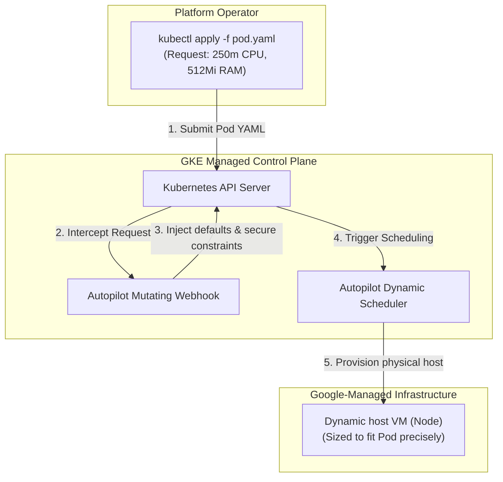

## Table of Contents

1. [Google Kubernetes Engine](#google-kubernetes-engine)
2. [Standard vs. Autopilot Clusters](#standard-vs-autopilot-clusters)
3. [Kubernetes Object Hierarchy: Pods and Deployments](#kubernetes-object-hierarchy-pods-and-deployments)
4. [Cluster Network Identity: Services and Ingress](#cluster-network-identity-services-and-ingress)
5. [Workload Co-location and Sidecar Containers](#workload-co-location-and-sidecar-containers)
6. [When GKE Fits (and Sibling Runtimes)](#when-gke-fits-and-sibling-runtimes)
7. [Sample Cluster Shape](#sample-cluster-shape)
8. [Putting It All Together](#putting-it-all-together)

## Google Kubernetes Engine

Google Kubernetes Engine (GKE) is managed Kubernetes on Google Cloud. Google runs the cluster control plane, and your team declares how containers should run, connect, scale, and receive policy through Kubernetes objects. That makes GKE a shared platform boundary for teams that need Kubernetes itself, not merely a place to run one container.

*The cluster is a platform boundary, not a single server.*

A common platform mistake is standardizing on GKE simply because your workloads are containerized. Because Cloud Run already runs stateless containers with minimal operational surface, deploying GKE is only justified when your platform architecture requires Kubernetes itself as the primary operating layer. This need arises when applications require native Kubernetes APIs, custom resource operators, sidecar containers for service mesh pathing, or complex, multi-service traffic policy boundaries.

For platform teams coming from other cloud networks, GKE is the direct equivalent of Amazon Elastic Kubernetes Service (EKS) and Azure Kubernetes Service (AKS). The important difference for beginners is not a secret network mechanism. It is the operating model: Google manages the Kubernetes control plane, and your team chooses how much node responsibility to keep through Standard or Autopilot mode.

:::expand[Under the Hood: Autopilot Mutating Admission Webhooks and Dynamic Scheduling]{kind="design"}
To understand how GKE simplifies Kubernetes operations, you must examine how the cluster schedules and provisions physical machines. GKE is split into two operating modes: **Standard** (where you manually configure and scale virtual machine node pools) and **Autopilot** (where Google manages all worker node provisioning, node security, and operating system updates for you).

In GKE Autopilot, you do not think about servers or capacity planning. You deploy standard Kubernetes manifests that declare precisely the CPU, memory, and ephemeral storage resources your Pods require. GKE handles node allocation under the hood using a powerful, API-driven process called **Mutating Admission Webhooks**.

As traced above, the Autopilot dynamic provisioning lifecycle executes across five core phases:

1.  **Manifest Submission**: The operator issues a standard deployment manifest to GKE's managed Kubernetes API server.
2.  **Webhook Interception**: Before the API server writes the resource to etcd storage, GKE's proprietary **Autopilot Mutating Admission Webhook** intercepts the request.
3.  **Default Injection and Hardening**: The control plane validates resource requests and applies Autopilot constraints. Autopilot blocks privileged mode and most host-level access, while still allowing containers to run as root when the workload configuration permits it.
4.  **Dynamic Scheduling**: GKE's scheduler evaluates the exact CPU and memory specifications.
5.  **Dynamic Node Allocation**: If no active worker node has capacity, GKE automatically provisions a new virtual machine host designed to fit the Pod's resource requirements precisely, attaching it to the cluster dynamically and scheduling the workload without human intervention.
:::

## Standard vs. Autopilot Clusters

GKE operating mode decides how much node and infrastructure responsibility your team keeps. Choosing the correct GKE operating mode is a major architectural decision because you must balance the team's capacity to manage platforms against the workload's need for infrastructure control:

*The mode changes the operational surface before the first workload is deployed.*

*   **Autopilot (Highly Recommended)**: Google manages the master control plane, worker nodes, and scaling boundaries. You pay strictly for the CPU, memory, and storage requested by your running Pods. This is the optimal mode for application teams that want standard Kubernetes APIs and namespaces without the high administrative overhead of managing OS patching, virtual machines, and capacity planning.
*   **Standard**: Google manages only the control plane. Your team remains fully responsible for provisioning virtual machine node pools, sizing disk capacities, managing OS patch windows, and configuring cluster autoscaling parameters. This control is necessary when workloads require custom Linux kernel features, special GPU hardware attachments, or highly specialized daemonsets.

:::expand[Design Detail: Workload Identity Federation for GKE]{kind="design"}
A critical security requirement when running containers inside a shared cluster is authentication. Your workloads must be able to call GCP APIs (such as reading secrets or databases) without baking long-lived, static service account private key JSON files into container images.

GKE solves this using **Workload Identity Federation for GKE**. A Kubernetes workload can act as a Kubernetes workload principal in IAM, and your team can optionally allow it to impersonate a Google service account when that pattern fits your governance model.

The token exchange executes a secure, multi-party handshake:

1.  **Pod Request**: The application code initialized inside the Pod calls a standard Google client library to request access to a GCP resource (such as calling the Secret Manager API).
2.  **Metadata Request**: The client library uses the GKE metadata server path exposed to the Pod.
3.  **Workload Principal**: GKE identifies the Kubernetes service account and workload identity pool context.
4.  **IAM Check**: IAM evaluates whether that workload principal has the requested Google Cloud role directly or has permission to impersonate a Google service account.
5.  **Token Use**: The workload receives short-lived credentials for the allowed access path.

Because this flow uses short-lived credentials, your Pods can call Google APIs without baking static service account key files into container images.
:::

## Kubernetes Object Hierarchy: Pods and Deployments

Kubernetes objects are the API records that describe desired runtime state inside the cluster. Operating GKE requires shifting your unit of deployment from individual containers to standard Kubernetes resource objects:

*   **Pods**: A Pod is the smallest deployable unit in Kubernetes, containing one or more containers that share a local network loopback interface, storage volumes, and lifecycle. In typical microservice patterns, you run a single application container per Pod, keeping them lightweight and replaceable.
*   **Deployments**: You never manage or deploy Pods individually. Instead, you declare your desired state inside a **Deployment** object. The Deployment specifies which container image to run, the CPU/RAM limits, and the exact replica count (e.g. `3` pods). The GKE control plane monitors this declaration continuously, automatically creating or replacing Pods across different node hosts to ensure actual state always matches your desired state.

## Cluster Network Identity: Services and Ingress

Services and Ingress provide stable network entry points for changing Pod backends. Because Pods are highly volatile and replaceable, their internal network IP addresses change continuously when they are rescheduled or scaled. To provide stable network interfaces:

*   **Services**: A Kubernetes Service provides a stable DNS hostname and internal IP address mapped dynamically to a changing pool of Pods using label selectors. Internal services allow Pod A to call `http://orders-api` reliably, and the Service handles TCP load balancing across active backends.
*   **Ingress and Gateway**: To route public user traffic from the internet into your cluster services, you deploy an Ingress or Gateway resource. In GKE, an Ingress manifest can provision and configure a Google Cloud external Application Load Balancer and map URL paths to your internal cluster Services. Certificates require the appropriate certificate resource or TLS configuration rather than appearing automatically for every Ingress.

## Workload Co-location and Sidecar Containers

A sidecar container is a supporting process that runs in the same Pod as the main application container and shares local networking or volumes with it. This is a unique architectural capability of Kubernetes. Because multiple containers inside a single Pod share the same local network namespace (`localhost`) and storage volumes, you can co-locate supporting utilities alongside your primary application process.

For instance, you can run a **Service Mesh proxy** (such as Envoy) or a database connection proxy (such as the Cloud SQL Auth Proxy) as a sidecar container inside your Orders API Pod. The application container connects to the database locally over `127.0.0.1:5432`, and the sidecar container transparently intercepts the socket, encrypts the payload, and manages the secure TLS connection to the backing database engine, keeping your primary code clean and focused on business logic.

## When GKE Fits (and Sibling Runtimes)

GKE fits when the application platform needs Kubernetes APIs or cluster-wide policies more than it needs the simplicity of a single managed service. Decoupling application hosting from serverless constraints requires choosing a runtime that aligns with your team's operational capabilities and architecture complexity:

*   **Cloud Run**: The ideal fit for simple, stateless HTTP microservices that package cleanly into standard containers. It provides a serverless environment with minimal administrative overhead.
*   **Cloud Run Functions**: The best fit for event-triggered, single-purpose handlers that run asynchronously in response to platform state changes.
*   **Compute Engine**: The correct home for legacy vendor applications that require direct operating system kernel control or attached block persistent storage.
*   **GKE**: The necessary choice when your organization runs a multi-service platform requiring unified Kubernetes policies, admission webhooks, sidecar proxies, or custom resource operators.

## Sample Cluster Shape

A sample cluster shape is a compact review of the Kubernetes platform contract. An idiomatic GKE Autopilot shape for a platform-managed Orders API unifies namespaces, admission gates, and OIDC workload identities:

| Cluster Component | Configuration Value | Operational Purpose |
| :--- | :--- | :--- |
| **Cluster Name** | `gke-orders-prod` | Unified managed regional Kubernetes cluster. |
| **Operating Mode** | `Autopilot` | Google-managed node pool provisioning and scaling. |
| **Namespace** | `orders-app` | Isolated policy and workload boundary. |
| **Deployment** | `orders-api` (3 replicas) | Continuous actual-to-desired state reconciliation. |
| **Service Account**| `orders-api-ksa` | Localized Kubernetes workload identity. |
| **IAM Access** | Workload principal or optional service account impersonation | Keyless Google API access. |
| **Network Entry** | GKE Ingress behind Anycast IP | Automated global HTTP load balancing. |

## Putting It All Together

Transitioning to GKE establishes a robust, orchestrator-driven platform for containerized services.

When the platform team deploys the Orders API manifest, GKE Autopilot validates resource allocations and manages the worker capacity needed to run the Pods.

The API server schedules three replica Pods across node hosts. Each Pod uses Workload Identity Federation for GKE to access Secret Manager without a static key file. GKE Ingress or Gateway routes incoming user checkouts through Google Cloud load balancing to internal cluster Services and then to healthy, running Pods.

*Use this summary as the quick mental checklist before designing or debugging the service.*

---

**References**

- [Google Cloud: GKE documentation](https://cloud.google.com/kubernetes-engine/docs) - Complete architectural guidelines for managed Kubernetes.
- [Google Cloud: GKE Autopilot overview](https://cloud.google.com/kubernetes-engine/docs/concepts/autopilot-overview) - Details of admission-driven node scheduling.
- [Google Cloud: GKE Autopilot security measures](https://cloud.google.com/kubernetes-engine/docs/concepts/autopilot-security) - Documents Autopilot security constraints and root behavior.
- [Google Cloud: Workload Identity Federation for GKE](https://cloud.google.com/kubernetes-engine/docs/concepts/workload-identity) - Explains keyless Google API access for GKE workloads.
- [Google Cloud: GKE Ingress](https://cloud.google.com/kubernetes-engine/docs/concepts/ingress) - Explains how Ingress configures Google Cloud load balancing.
- [Kubernetes: Deployments documentation](https://kubernetes.io/docs/concepts/workloads/controllers/deployment/) - Specification for desired-state workload reconciliation.
