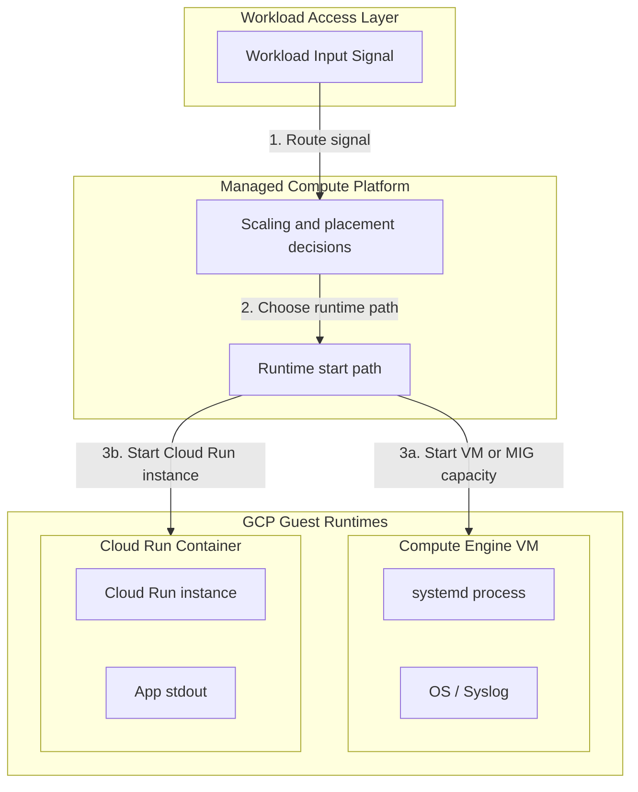

## Table of Contents

1. [GCP Compute Runtimes](#gcp-compute-runtimes)
2. [Workload Shapes and Responsibilities](#workload-shapes-and-responsibilities)
3. [Compute Engine (Virtual Machines)](#compute-engine-virtual-machines)
4. [Cloud Run (Serverless Containers)](#cloud-run-serverless-containers)
5. [Cloud Run Functions (Event-Driven Handlers)](#cloud-run-functions-event-driven-handlers)
6. [Google Kubernetes Engine (Managed Orchestration)](#google-kubernetes-engine-managed-orchestration)
7. [Scaling and Failure Evidence](#scaling-and-failure-evidence)
8. [Putting It All Together](#putting-it-all-together)
9. [What's Next](#whats-next)

## GCP Compute Runtimes

Google Cloud compute is where your application code gets a place to run. Instead of buying physical servers, you choose a runtime that gives your code CPU, memory, network access, startup behavior, scaling behavior, identity, logs, and failure boundaries. Choosing the correct compute runtime is not a matter of selecting the most advanced service; it requires matching your application's operational shape, deployment frequency, scaling behavior, and security boundaries to the runtime that fits those requirements.

This spectrum matches the compute runtime tiering found in other major cloud providers. Engineers transitioning from AWS or Azure will recognize Compute Engine virtual machines as the direct counterpart to Amazon EC2 and Azure Virtual Machines, offering bare-metal operating system control at the cost of high administrative overhead. Conversely, Cloud Run provides a serverless container hosting environment comparable to AWS App Runner or Azure Container Apps, while Cloud Run functions handle event-driven, pay-per-execution payloads similar to AWS Lambda or Azure Functions. Finally, Google Kubernetes Engine (GKE) serves as the managed Kubernetes platform equivalent to Amazon EKS and Azure AKS, designed for complex, orchestrator-driven architectures.

:::expand[Design Detail: Responsibility Boundaries]{kind="design"}
The most useful way to compare GCP compute products is to ask which layer your team operates. Compute Engine exposes virtual machines, so your team owns the guest operating system and process supervision. Cloud Run exposes services, jobs, and worker pools, so your team owns the container or source code contract while Google manages the surrounding infrastructure. Cloud Run functions expose event handlers, so your team owns a small function and its retry-safe behavior. GKE exposes Kubernetes clusters, so your team owns Kubernetes objects and platform policy while Google manages the GKE control plane.

This boundary matters more than the implementation names underneath the platform. Official product docs describe the service contracts, limits, and operational responsibilities you can rely on. A beginner should first learn those contracts, then read deeper architecture material only when a documented behavior depends on it.
:::

## Workload Shapes and Responsibilities

Every compute runtime establishes a distinct division of labor between your engineering team and Google Cloud. While you always retain ownership of your application code and configuration, the runtime defines who handles operating system patching, process supervision, network ingress routing, and instance scaling.

*The service map is easier to use when each product owns a clear application job.*

| Runtime | Plain-English Job | Team Responsibility | Google Responsibility |
| :--- | :--- | :--- | :--- |
| **Compute Engine** | Direct VM server hosting | OS patching, startup, processes, disk configuration | Physical hardware, virtualization layer, global network |
| **Cloud Run** | Serverless container services | Container contract, application code, IAM identity | OS patching, container scheduling, automatic scaling, ingress |
| **Cloud Run Functions** | Event-triggered handlers | Trigger architecture, idempotency, event parsing | Runtime bootstrapping, scaling-to-zero, trigger routing |
| **GKE** | Orchestrated container platforms | Pod manifests, cluster scaling policies, platform policies | Control plane availability, Kubernetes API host updates |

Forcing a workload into an incompatible runtime shape out of familiarity leads to high operational costs and severe scaling limits. An HTTP API that handles steady traffic all day does not benefit from being divided into dozens of event-driven functions. Similarly, a simple background script does not require a dedicated virtual machine running continuously, consuming billing resources while sitting idle.

## Compute Engine (Virtual Machines)

Compute Engine is the GCP runtime designed for server-shaped workloads that require direct access to the operating system kernel, specialized kernel modules, host-level monitoring agents, or legacy processes that do not fit containerized contracts.

When you boot a Compute Engine virtual machine (VM), you receive a dedicated software-defined server. You select the CPU and memory capacity (machine type), the operating system (image), and the attached virtual hard drives (persistent disks). This control is valuable when migrating legacy applications, running stateful databases, or installing custom host daemons. However, this flexibility places the operational burden on your team: you must configure process managers like `systemd` to keep applications alive, execute OS security patching, and manage the scaling of VM instances manually.

## Cloud Run (Serverless Containers)

Cloud Run is the default runtime for stateless HTTP backend services, microservices, and web applications. It abstracts the virtual machine layer entirely, allowing you to deploy container images directly from Artifact Registry without managing underlying server nodes.

The core abstraction of Cloud Run is the application contract: you provide a container that starts without manual shell steps, listens on a dynamically injected `PORT` environment variable, and handles stateless HTTP requests. Cloud Run handles the scheduling, provisions instances dynamically to meet incoming traffic demands, and automatically routes packets from its public HTTPS entry points. Because the environment is stateless, any data written to the container's local directory is volatile, requiring you to decouple durable state and store it in managed databases or object storage.

## Cloud Run Functions (Event-Driven Handlers)

Cloud Run functions are designed for small, single-purpose handlers that execute asynchronously in response to system events. You write source code for the handler, and Google builds and deploys it as a Cloud Run-backed function so you do not manage the container image directly.

A function operates on an event-driven lifecycle: it remains completely idle (scaling to zero instances) until a configured trigger routes a platform event (such as a file upload to Cloud Storage, a Pub/Sub message, or a scheduled timer) to the runtime. The function boots instantly, processes the single payload, and terminates. Because the trigger model operates on an "at-least-once" delivery contract, temporary network interruptions can cause the same event to be delivered multiple times. Therefore, you must design function handlers to be strictly idempotent, ensuring that duplicate execution attempts do not corrupt database records or duplicate billing transactions.

## Google Kubernetes Engine (Managed Orchestration)

Google Kubernetes Engine (GKE) is the managed orchestration platform designed for organizations that standardize their operations around the Kubernetes API. GKE provides a highly integrated environment to run containerized workloads across a shared pool of machine nodes.

GKE shifts the deployment unit from simple container services to Kubernetes-native objects like Pods, Deployments, and Services. The GKE control plane coordinates cluster state dynamically, matching your desired replica counts and rollout strategies to the physical worker nodes. GKE is exceptionally powerful when managing complex, multi-service platforms that require specialized network policies, service mesh integrations, sidecar containers, or custom resource operators. The tradeoff is architectural complexity: your team must possess the expertise to manage Kubernetes manifests, network interfaces, cluster upgrades, and Workload Identity mapping.

## Scaling and Failure Evidence

The choice of compute runtime dictates how your application scales under load and where you must look to gather evidence when an outage occurs.

*Capacity decisions need evidence from the runtime and the dependency it protects.*

As illustrated above, the input signal dictates the initialization path. If a Compute Engine VM is chosen, scaling is static or managed via instance groups, and debugging requires inspecting guest OS logs and `systemd` process states. If Cloud Run is chosen, the platform scales instances according to request pressure and configuration limits, and operational evidence is consolidated at the application `stdout` stream and revision health gate.

## Putting It All Together

Decoupling application code from local hardware requires choosing a compute runtime that matches the structural requirements of the workload:

*   **HTTP APIs**: A customer-facing checkout API belongs on **Cloud Run**, where the container is wrapped in a managed service model that scales dynamically with traffic, manages revisions securely, and isolates host operations.
*   **Legacy Systems**: A legacy background worker that requires a specific OS kernel module belongs on **Compute Engine**, allowing the team to manage the operating system directly while utilizing startup scripts to automate bootstrapping.
*   **Asynchronous Pipelines**: A post-checkout email task belongs on a **Cloud Run function**, reacting to a Pub/Sub event asynchronously so the customer request is not delayed by downstream API latencies.
*   **Enterprise Platforms**: A large-scale platform utilizing standardized admission controllers and sidecar proxies belongs on **GKE**, utilizing Kubernetes APIs to manage cross-service communication policies.

By matching the workload shape to the correct runtime responsibility boundary, you bypass the common mistake of choosing a cloud service out of habit, establishing a highly scalable and easily managed compute layer.

## What's Next

Because Cloud Run represents the premier managed home for stateless backend containers, our next step is to analyze its configuration. In the next article, we follow a container image as it is deployed into a Cloud Run service, detailing revisions, traffic routing policies, and runtime identity boundaries.

*Use this summary as the quick mental checklist before designing or debugging the service.*

---

**References**

- [Google Cloud: Cloud Run overview](https://cloud.google.com/run/docs/overview/what-is-cloud-run) - Architectural guide for serverless container execution.
- [Google Cloud: Compute Engine documentation](https://cloud.google.com/compute/docs) - Specification for virtual machine instances.
- [Google Cloud: Cloud Run Functions overview](https://cloud.google.com/run/docs/functions/overview) - Explains how functions are built and deployed on Cloud Run.
- [Google Cloud: GKE overview](https://cloud.google.com/kubernetes-engine/docs/concepts/kubernetes-engine-overview) - Reference for managed Kubernetes clusters and Autopilot scheduling.
