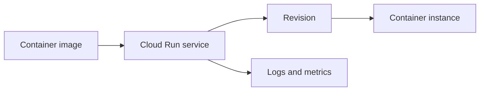

## Table of Contents

1. [The Problem](#the-problem)
2. [What Is Compute](#what-is-compute)
3. [Workload Shape](#workload-shape)
4. [Cloud Run](#cloud-run)
5. [Compute Engine](#compute-engine)
6. [Cloud Run Functions](#cloud-run-functions)
7. [GKE](#gke)
8. [Traffic And Events](#traffic-and-events)
9. [Scaling And Failures](#scaling-and-failures)
10. [Sample Compute Map](#sample-compute-map)
11. [Putting It All Together](#putting-it-all-together)
12. [What's Next](#whats-next)

## The Problem

The Orders API works on a laptop. It listens on a port, reads a database URL, writes logs, and handles checkout requests. Moving it to GCP sounds like one decision: where should we run it?

Then the decision becomes several smaller questions:

- The checkout API needs to answer HTTP requests all day, even when traffic rises and falls.
- A receipt email should be sent after checkout, but the customer should not wait for the email provider.
- A legacy worker needs host-level packages and an agent that expects a normal Linux server.
- A platform team already runs Kubernetes policies and wants some services to use that platform.

This is the compute question. Compute is where your code becomes running work. The right runtime is not the most advanced service. It is the place where the workload shape, operating responsibility, network path, identity, and failure evidence make sense together.

## What Is Compute

Compute is the part of GCP that gives application code CPU, memory, startup behavior, network access, identity, logs, and scaling. A compute choice might run a container, boot a virtual machine, invoke a small function, or run Kubernetes workloads.

The useful beginner model is responsibility. Every runtime divides work between Google Cloud and your team. The code still belongs to you. The runtime decides who manages the server, who restarts work, who scales capacity, where traffic enters, and what evidence you inspect when something fails.

| Runtime | Plain-English job | Team still owns |
| --- | --- | --- |
| Cloud Run | Run a containerized service without managing servers | Container contract, config, identity, traffic, app behavior |
| Compute Engine | Run a cloud VM with server-shaped control | OS patching, startup, process management, disks, logs |
| Cloud Run functions | Run small handlers when events happen | Trigger design, retries, idempotency, permissions |
| GKE | Run containers on Kubernetes | Kubernetes objects, cluster mode choices, platform operations |

The table is not a final decision. It is a way to stop asking "which product is best?" and start asking "which responsibility shape fits this work?"

## Workload Shape

A workload is a piece of work the system needs to run. The workload might be an HTTP API, a background event handler, a long-running server process, a scheduled job, or a Kubernetes-managed service.

Start with shape before service name:

| Workload shape | What it means | First runtime to consider |
| --- | --- | --- |
| Request service | Receives HTTP requests and responds | Cloud Run |
| Server-shaped workload | Needs OS control, host agents, or legacy process setup | Compute Engine |
| Event handler | Runs because one event happened | Cloud Run functions |
| Kubernetes workload | Needs Kubernetes APIs, policies, operators, or platform consistency | GKE |

This avoids a common cloud mistake: choosing a runtime because it sounds modern, then forcing the app to behave like that runtime. A normal checkout API does not become better because it is squeezed into a tiny event function. A small receipt handler does not need a whole server waiting all day. A Kubernetes cluster is not the first answer unless Kubernetes is part of the requirement.

## Cloud Run

Cloud Run is the strongest default for many GCP backend APIs. You give it a container or source that becomes a container, and it runs the service without your team managing VM instances.

That does not mean there is nothing to operate. Cloud Run still has a service, revisions, traffic routing, scaling settings, runtime identity, environment variables, secrets, logs, and health behavior. The difference is that you operate the application contract rather than the server operating system.

For the Orders API, Cloud Run fits when the app is an HTTP service:

The container is only the package. Cloud Run turns it into a managed service that can receive requests, create revisions, scale instances, and expose evidence.

## Compute Engine

Compute Engine gives you virtual machines. A VM is a cloud server: operating system, machine type, boot disk, network interface, service account, startup behavior, and processes you manage.

This control is valuable when the server shape matters. Maybe the workload needs a host agent, a special OS package, a migration path from an existing VM, or a process model that does not fit a managed container service yet. Compute Engine is also a good teaching bridge for people who already understand Linux servers.

The cost is responsibility. Someone must patch the OS, install packages, start the app, restart it after crashes, ship logs, watch disk space, and replace unhealthy machines. GCP gives infrastructure. Your team keeps more of the server story.

Choose Compute Engine when the server-shaped requirement is real, not because it feels familiar.

## Cloud Run Functions

Cloud Run functions are for smaller pieces of code that run because something happened. A message arrives. A file is uploaded. A schedule fires. An HTTP call reaches a small handler. The function handles one bounded job and then stops.

The important word is event. A function should have a clear trigger and a small job. It still has runtime identity, logs, timeout limits, and retry behavior. It also needs duplicate-safe design because event delivery and retries can run the same logical work more than once.

For the Orders system, a function might send a receipt after checkout or process a storage event after an export lands. That work belongs near the API, but it does not need to live inside the request path where the customer is waiting.

## GKE

Google Kubernetes Engine, or GKE, is managed Kubernetes on GCP. It is the runtime to consider when Kubernetes itself is the operating layer your team needs.

GKE is a Kubernetes platform, while Cloud Run already runs containers with much less platform surface. GKE belongs when the team needs Kubernetes APIs, Pods, Deployments, Services, Ingress, operators, policy controllers, service mesh patterns, or a shared cluster platform across many workloads.

The tradeoff is that Kubernetes becomes part of the system. Even with GKE managing the control plane, the team must understand manifests, scheduling, workload identity, cluster mode, network exposure, upgrades, and observability. Autopilot reduces node management for many workloads. Standard gives more infrastructure control. Both are Kubernetes-shaped choices.

## Traffic And Events

Runtime choice changes how work starts.

Cloud Run services usually start from HTTP requests. A public entry point or internal caller sends a request, Cloud Run routes it to a service revision, and an instance handles it.

Cloud Run functions usually start from triggers. The trigger might be Pub/Sub, Cloud Storage, Eventarc, a schedule, or an HTTP request. The event is the reason the function runs.

Compute Engine VMs start when the machine boots and the process manager starts the app. GKE workloads start when Kubernetes schedules Pods and controllers keep desired state.

| Start signal | Good fit | Failure evidence |
| --- | --- | --- |
| HTTP request | Cloud Run service | Request logs, revision, traffic split, app logs |
| Event | Cloud Run function | Event context, retry attempts, function logs |
| Machine boot | Compute Engine | Startup script logs, process manager, VM health |
| Kubernetes desired state | GKE | Pod status, Deployment rollout, Service or Ingress state |

This is why compute choice matters during incidents. It tells you where the first useful evidence should be.

## Scaling And Failures

Scaling changes how the app behaves.

Cloud Run can scale container instances up and down around request load. That is useful for traffic that changes over time, but it means instances can appear and disappear. Store durable state outside the container, and make startup reliable.

Functions scale around events. That is useful for bursts of background work, but retries and duplicate delivery mean the handler must be safe to run more than once.

Compute Engine scales like servers unless you add managed instance groups and automation. The team has more control, but also more to build.

GKE scales at the Kubernetes layer. Pods, Deployments, autoscalers, and cluster capacity all matter. Autopilot can reduce node management, but the team still owns Kubernetes workload design.

The first failure often reveals whether the runtime choice fits. If every issue sends the team into server patching, maybe Cloud Run would have been simpler. If every container change requires Kubernetes expertise the team does not have, maybe GKE arrived too early. If the function now has five routes, database connection pooling, and long request paths, maybe it became a service.

## Sample Compute Map

For a small Orders system, the first compute map might look like this:

| Work | Runtime | Why |
| --- | --- | --- |
| Checkout API | Cloud Run | HTTP service, containerized app, managed scaling |
| Receipt email after checkout | Cloud Run function | Event-driven side work with retry-safe handler |
| Legacy import worker with host agent | Compute Engine | Needs server-level control for now |
| Shared Kubernetes platform service | GKE | Team already needs Kubernetes APIs and policies |

The map can evolve. The point is that each runtime has a reason tied to the workload, not to a product popularity contest.

## Putting It All Together

Return to the opening questions.

The checkout API needs to answer HTTP requests all day. Cloud Run is the natural first runtime because it turns a container into a managed service with revisions, traffic, scaling, identity, logs, and health evidence.

The receipt email should run after checkout without slowing the customer request. Cloud Run functions fit event-shaped side work, as long as retries and duplicate safety are part of the design.

The legacy worker needs host-level control. Compute Engine is honest about that server-shaped requirement, but it keeps OS and process responsibility with the team.

The platform team needs Kubernetes. GKE is the right conversation when Kubernetes APIs and platform patterns are the requirement.

## What's Next

The best first home for the Orders API is Cloud Run, so the next article follows a container image as it becomes a managed HTTPS service with revisions, traffic, runtime identity, logs, and health.

---

**References**

- [Google Cloud: What is Cloud Run](https://cloud.google.com/run/docs/overview/what-is-cloud-run)
- [Google Cloud: Compute Engine instances](https://cloud.google.com/compute/docs/instances)
- [Google Cloud: Functions overview](https://cloud.google.com/functions/docs/concepts/overview)
- [Google Cloud: GKE overview](https://cloud.google.com/kubernetes-engine/docs/concepts/kubernetes-engine-overview)
