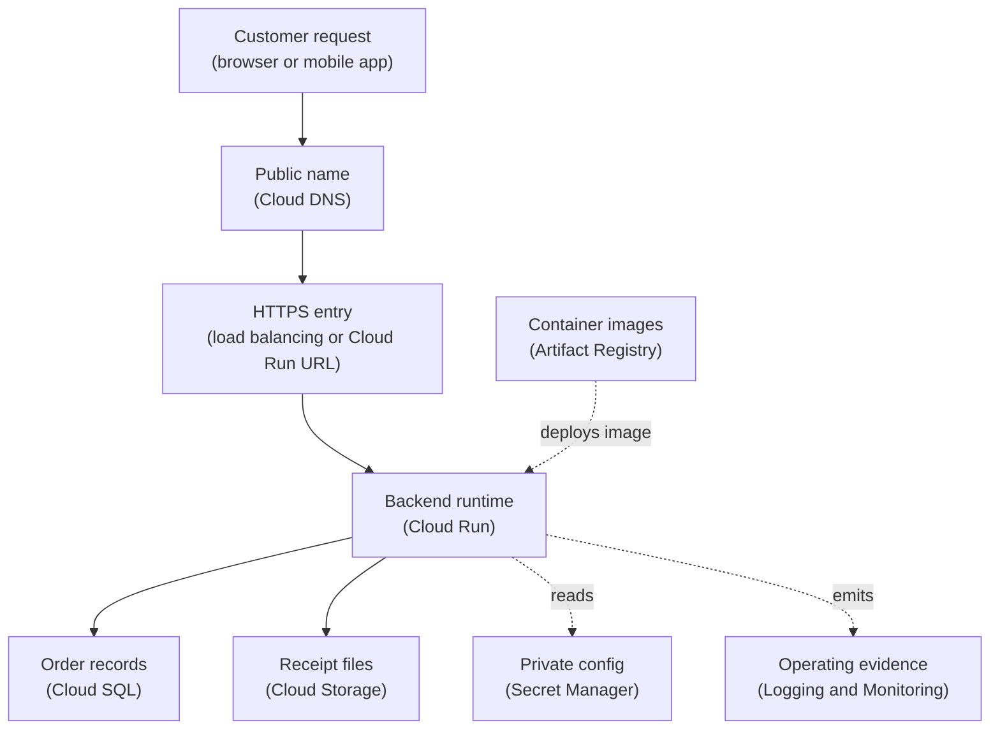

## Table of Contents

1. [A Product List Is Not A Mental Model](#a-product-list-is-not-a-mental-model)
2. [If You Know AWS Or Azure Service Maps](#if-you-know-aws-or-azure-service-maps)
3. [The Orders API Needs A Small GCP System](#the-orders-api-needs-a-small-gcp-system)
4. [Compute Runs The Application](#compute-runs-the-application)
5. [Storage And Databases Remember State](#storage-and-databases-remember-state)
6. [Networking Moves Traffic Safely](#networking-moves-traffic-safely)
7. [Identity And Security Decide Access](#identity-and-security-decide-access)
8. [Observability Leaves Evidence](#observability-leaves-evidence)
9. [Deployment Services Move Code Into Runtime](#deployment-services-move-code-into-runtime)
10. [Cost And Resilience Keep The System Operable](#cost-and-resilience-keep-the-system-operable)
11. [A First Service Review](#a-first-service-review)
12. [Failure Modes And First Checks](#failure-modes-and-first-checks)

## A Product List Is Not A Mental Model

GCP has many services, and the product list can get noisy quickly.
Compute, storage, databases, networking, security, observability,
analytics, AI, and developer tools all have their own names. That list
is useful later, after you know what job you are trying to fill.

The useful starting point is simpler: what does the app need the cloud
to do?

`devpolaris-orders-api` needs a place to run. It needs a database for
orders. It needs object storage for receipt files. It needs a public
HTTPS path. It needs private configuration. It needs logs, metrics, and
alerts. It needs a place for container images. It needs cost ownership
and recovery habits.

Once you group services by job, the map becomes easier to read.

| Job in the system | GCP services to inspect first |
|---|---|
| Run a containerized backend | Cloud Run |
| Run a VM-shaped workload | Compute Engine |
| Run event-triggered code | Cloud Functions |
| Store relational records | Cloud SQL |
| Store file-like objects | Cloud Storage |
| Store document or key-based data | Firestore |
| Handle public HTTP entry | Cloud Load Balancing, Cloud DNS, certificates |
| Store secrets | Secret Manager |
| Observe the system | Cloud Logging, Cloud Monitoring, Cloud Trace |
| Store container images | Artifact Registry |
| Build or deploy from source | Cloud Build, CI/CD tools |
| Track spend | Cloud Billing, budgets, labels |

This article is a map, not a deep dive. The later GCP modules will walk
through compute, identity, networking, storage, observability, runtime
operations, cost, and resilience in more detail.

## If You Know AWS Or Azure Service Maps

If you learned AWS or Azure first, you already have the right instinct:
cloud services are easier when you group them by job.

Do not build a fake dictionary where every AWS service must have one GCP
service and every Azure service must have one GCP service. That is how
people make bad designs. Compare the job first.

Start with this comparison, then check the GCP behavior before you
design around it:

| Job | AWS starting point | Azure starting point | GCP starting point |
|---|---|---|---|
| Container backend | ECS or App Runner | Container Apps | Cloud Run |
| Virtual machines | EC2 | Azure Virtual Machines | Compute Engine |
| Event-driven function | Lambda | Azure Functions | Cloud Functions |
| Object storage | S3 | Blob Storage | Cloud Storage |
| Relational database | RDS | Azure SQL Database | Cloud SQL |
| NoSQL document or key data | DynamoDB | Cosmos DB | Firestore |
| Container image registry | ECR | Container Registry | Artifact Registry |
| Logs and metrics | CloudWatch | Azure Monitor | Cloud Logging and Cloud Monitoring |
| Secrets | Secrets Manager | Key Vault | Secret Manager |

The table is only a starting map. Use AWS ECS or Azure Container Apps as
orientation for Cloud Run, then learn Cloud Run's own revision, scaling,
traffic, identity, and networking model. Use RDS or Azure SQL Database
as orientation for Cloud SQL, then learn Cloud SQL's own configuration
and operations.

Use the bridge to get oriented. Then learn the GCP behavior.

## The Orders API Needs A Small GCP System

The first GCP version of `devpolaris-orders-api` can stay simple. The
team has a Node backend packaged as a container image. The app receives
checkout requests, writes order records, creates receipt files, and
emits logs and metrics.

A practical first system might look like this:



The solid arrows are user and app flow. The dotted arrows are supporting
relationships. Secret Manager does not receive customer checkout
traffic. It provides private values to the runtime. Logging and
Monitoring do not process orders. They collect evidence. Artifact
Registry does not serve users. It stores images that Cloud Run can
deploy.

This separation matters because it helps debugging. If users cannot
reach checkout, start with entry path and runtime. If the app cannot
read a database URL, inspect Secret Manager and runtime identity. If the
new image did not deploy, inspect Artifact Registry and the deployment
record.

## Compute Runs The Application

Compute services run code. GCP gives several choices because not every
workload has the same shape.

For the orders API, Cloud Run is the natural first thread. It runs
containerized services. You deploy a container image, choose a region,
configure runtime settings, and Cloud Run manages serving requests. It
also supports revisions, which makes later rollout articles clean.

Compute Engine is the VM service. Use it when the workload really needs
a virtual machine shape: operating-system control, long-running machine
state, custom agents, or software that does not fit a managed container
or function model.

Cloud Functions runs event-driven code. It is useful when the job is a
small handler for an event, such as reacting to a file upload or message.

Google Kubernetes Engine, usually shortened to GKE, is managed
Kubernetes. It is important, but it should not become the beginner path
unless the module is specifically about Kubernetes. For this GCP
foundation, GKE is a later option.

| Workload need | GCP compute service to inspect first |
|---|---|
| Public containerized API | Cloud Run |
| Event handler or small background action | Cloud Functions |
| VM-shaped workload | Compute Engine |
| Kubernetes platform | GKE |

The useful first question is "what shape does this workload have?"

## Storage And Databases Remember State

State is anything the app must remember after a request ends. The orders
system has several kinds of state, so it needs several data services.

Cloud Storage stores object data. Think receipt PDFs, CSV exports,
product images, and other file-like objects. A bucket is the top-level
container for objects. Object storage is usually a better home for
generated files than a VM disk or database column.

Cloud SQL is a managed relational database service. It is the normal
first place to inspect for order records that need SQL, joins,
transactions, and relational constraints.

Firestore is a NoSQL document database. It can fit document-shaped data
and known access patterns, such as simple status documents or app data
that does not need relational joins.

Persistent Disk is block storage for Compute Engine VMs. Filestore is
managed file storage for workloads that need a mounted file share.

For `devpolaris-orders-api`, the first map could be:

| Data need | GCP service to inspect first | Why |
|---|---|---|
| Orders, payments, receipt metadata | Cloud SQL | Relational data and consistency rules |
| Receipt PDFs and exports | Cloud Storage | Durable object storage |
| Simple job status by ID | Firestore or Cloud SQL | Access pattern decides |
| VM boot or app disk | Persistent Disk | VM-shaped storage |
| Shared folder for legacy workers | Filestore | Mounted file path behavior |

Do not choose a database by product logo. Describe the data first. What
does the app write? How does it read? What must stay consistent? What
must be easy to recover?

## Networking Moves Traffic Safely

Networking services decide how traffic reaches the app and how private
resources talk to each other.

At the foundation level, focus on a few names:

| Networking job | GCP service or concept |
|---|---|
| Private cloud network | VPC network |
| Regional placement area inside a VPC | Subnet |
| Allow or deny traffic | Firewall rules |
| Public or private name lookup | Cloud DNS |
| Public HTTP entry and routing | Cloud Load Balancing |
| Secure custom domains | Managed certificates or certificate services |
| Private access to managed services | Private Service Connect or private access patterns |

GCP has a networking detail that learners should notice early: VPC
networks are global resources, while subnets are regional. That differs
from how many people first picture private networks in other clouds.

For a Cloud Run-first app, the earliest networking questions are:

- How do users reach the service?
- Does the service need a custom domain?
- Does the app need private access to the database?
- Which outbound calls are allowed?
- Which resources should never be public?

The deeper networking module will handle VPCs, subnets, routing,
firewall rules, load balancing, DNS, and private service access more
carefully. For now, the mental model is enough: networking is the path
and rule system for traffic.

## Identity And Security Decide Access

Identity decides who or what is making a request. Security decides
whether that request should be allowed.

GCP IAM is the main access system. IAM grants roles to principals on
resources. A principal can be a user, group, service account, or other
supported identity. A role is a bundle of permissions. A resource is the
thing being protected.

Service accounts are especially important in GCP. A service account is
an identity for a workload or automation. The Cloud Run service for
`devpolaris-orders-api` might run as:

```text
orders-api-prod@devpolaris-orders-prod.iam.gserviceaccount.com
```

That identity may need to read selected secrets, connect to Cloud SQL,
write objects to Cloud Storage, and emit logs. It should not have broad
owner access to the project.

Secret Manager stores sensitive configuration values, such as database
connection strings or API tokens. Cloud KMS, short for Key Management
Service, manages encryption keys for cases where the team needs more
control over keys.

The foundation question is:

> Start with the actor, the target resource, and the role that connects them.

If you can answer that, later IAM articles will feel much less
abstract.

## Observability Leaves Evidence

Observability is the habit of leaving enough evidence to understand a
running system. GCP has services for that evidence.

Cloud Logging stores log entries. Cloud Monitoring stores metrics,
dashboards, and alerting behavior. Cloud Trace helps follow requests
through distributed work. Error Reporting can help surface application
errors depending on setup and runtime.

For the orders API, useful evidence includes:

| Signal | Question it answers |
|---|---|
| Request logs | What happened for this request? |
| Error logs | What failed and where? |
| Request count | How much traffic is arriving? |
| Latency metrics | Is checkout getting slower? |
| Cloud SQL metrics | Is the database under pressure? |
| Trace spans | Where did one slow request spend time? |
| Alerts | Should a human look now? |

Focus on the signal type before memorizing service names. Logs tell you
what happened. Metrics tell you how much or how often. Traces tell you
where time went. Alerts tell humans when to look.

Those questions will transfer from AWS CloudWatch and Azure Monitor into
GCP. The GCP tools are different, but the operating need is the same.

## Deployment Services Move Code Into Runtime

The app needs a path from source code to running service.

For a Cloud Run-based backend, the deployment path often includes:

| Deployment job | GCP service to inspect first |
|---|---|
| Store container images | Artifact Registry |
| Build container images | Cloud Build or external CI |
| Run container images | Cloud Run |
| Manage revisions and traffic | Cloud Run revisions and traffic splitting |
| Store deploy-time secrets | Secret Manager |
| Record release evidence | Cloud Logging, Cloud Monitoring, release notes |

The team may use GitHub Actions or another CI system to build and
deploy. That is fine. GCP services still receive the image, run the
service, and hold the runtime evidence.

For `devpolaris-orders-api`, a simple deployment story might be:

```text
GitHub Actions builds image
  -> pushes image to Artifact Registry
  -> deploys Cloud Run revision
  -> Cloud Run routes traffic
  -> Logging and Monitoring collect evidence
```

That story matters because runtime operations continue after the first
deploy. The team also needs rollbacks, traffic shifts, config reviews,
and post-release checks. Later articles will use Cloud Run revisions as
the main deployment example.

## Cost And Resilience Keep The System Operable

Cost and resilience are part of the service map, not extra topics at the
end.

Cost starts with projects, billing accounts, budgets, labels, and
resource sizing. A Cloud Run service that scales too high, a Cloud SQL
instance that is oversized, or a logging setup that stores too much data
can all surprise a team. Labels and budgets help turn surprise into a
visible signal.

Resilience starts with location, backups, redundancy, and recovery
plans. A database needs backup and restore thinking. A bucket may need
retention or lifecycle rules. A Cloud Run service may need health,
rollback, and region planning. A project may need clear ownership so
somebody can act when something fails.

For the orders API, a first cost and resilience review might ask:

| Area | First question |
|---|---|
| Billing | Which billing account pays for production? |
| Labels | Can cost be grouped by team and service? |
| Budgets | Who is notified if cost crosses a threshold? |
| Database | What backup and restore plan exists? |
| Storage | How long do receipt files and exports stay? |
| Runtime | Can the team roll back a bad revision? |
| Region | What failure does one-region design tolerate? |

These questions are practical. They help the team operate the service
after the first happy-path demo works.

## A First Service Review

Before the team builds the deeper GCP modules, it should be able to read
this simple service map:

```text
project:
  devpolaris-orders-prod

runtime:
  Cloud Run service for devpolaris-orders-api

image storage:
  Artifact Registry repository

database:
  Cloud SQL for order records

object storage:
  Cloud Storage for receipt PDFs and exports

private config:
  Secret Manager

network entry:
  Cloud DNS and HTTPS entry path

identity:
  dedicated service account for the runtime

signals:
  Cloud Logging, Cloud Monitoring, Cloud Trace

cost and recovery:
  billing account, labels, budgets, backups, rollback plan
```

This map is small enough to keep in your head. That is the point. You
can add details later because the first boxes are already stable.

If a new GCP service appears later, place it in the map before trying to
memorize it. Ask: does this run code, store data, move traffic, decide
access, collect evidence, deploy changes, control cost, or improve
recovery?

Once the job is clear, the product name becomes much less intimidating.

## Failure Modes And First Checks

A service map helps you debug because failures usually point at one job.

Users cannot reach checkout:

```text
symptom: public request fails
first checks:
  DNS record
  HTTPS entry path
  Cloud Run service health
  traffic routing
```

The app starts but cannot read the database URL:

```text
symptom: missing database config
first checks:
  Secret Manager secret exists
  runtime service account can read it
  Cloud Run environment config references the right secret
```

The new deploy did not change production behavior:

```text
symptom: old code still serves users
first checks:
  image pushed to Artifact Registry
  Cloud Run revision created
  traffic points at the intended revision
```

Checkout is slow:

```text
symptom: latency increased
first checks:
  Cloud Run metrics
  Cloud SQL metrics
  trace spans
  app and database region
```

The bill grew unexpectedly:

```text
symptom: monthly cost spike
first checks:
  billing report by project and label
  Cloud Run request and instance metrics
  Cloud SQL size
  log ingestion and retention
  storage growth
```

The map turns "GCP is broken" into a better question. Which job is
failing: entry, runtime, data, identity, evidence, deployment, cost, or
recovery?

That is enough for the foundation module. Now each later article can
zoom into one part without losing the whole system.

---

**References**

- [Google Cloud products](https://cloud.google.com/products) - Google lists the main product families and services.
- [Google Cloud products at a glance](https://cloud.google.com/docs/product-list) - Google provides a compact product list grouped by category.
- [What is Cloud Run](https://docs.cloud.google.com/run/docs/overview/what-is-cloud-run) - Google explains Cloud Run as a managed platform for running services and jobs.
- [Cloud SQL documentation](https://cloud.google.com/sql/docs) - Google documents the managed relational database service.
- [Cloud Storage documentation](https://cloud.google.com/storage/docs) - Google documents object storage concepts, buckets, objects, and locations.
