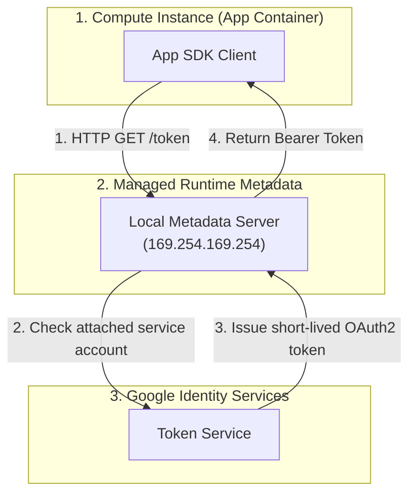
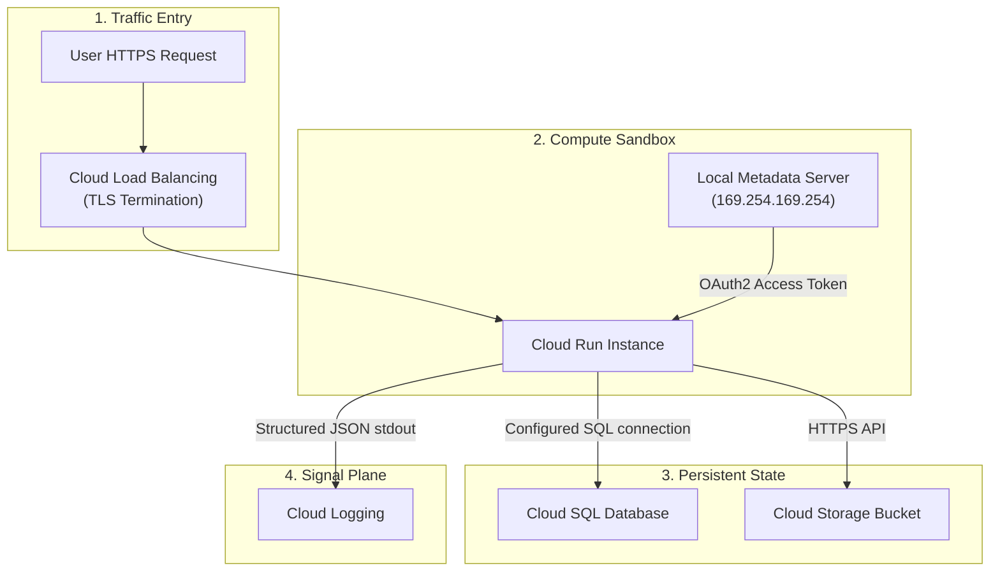

## Table of Contents

1. [Job-Centric Mapping over Service Inventories](#job-centric-mapping-over-service-inventories)
2. [Compute Choices and Responsibility](#compute-choices-and-responsibility)
3. [Persistence and State: Relational vs. Object](#persistence-and-state-relational-vs-object)
4. [Service Identity and Metadata Tokens](#service-identity-and-metadata-tokens)
5. [Observability Signals and Release Operations](#observability-signals-and-release-operations)
6. [Tracing a Single Request](#tracing-a-single-request)

## Job-Centric Mapping over Service Inventories

A GCP core services map is a practical routing guide from an application job to the managed service family that performs that job. Instead of learning product names as isolated facts, you first identify whether the system needs traffic entry, compute runtime, transactional storage, object storage, document state, analytics, credentials, monitoring, or deployment flow. The GCP service name becomes useful only after that job is clear.

Looking at a public cloud provider's product catalog for the first time can be an overwhelming experience. If you want to deploy a simple web application to Google Cloud, you are immediately confronted with names such as Cloud Run, Compute Engine, Google Kubernetes Engine, Cloud SQL, Cloud Storage, Firestore, BigQuery, and Secret Manager. The natural temptation is to try to memorize what each product does, or attempt a mechanical, product-by-product translation from another cloud provider you already know.

*The service map is easier to use when each product owns a clear application job.*

Rather than trying to memorize arbitrary brand names, the key to mastering cloud architecture is to focus on the actual engineering job your application needs help with. Most applications need a request entry point, a runtime for code, a durable place for files, a structured database for business records, a protected credential store, and an evidence layer for logs and metrics. Once you group cloud services around these core responsibilities, the product catalog becomes a reviewable architecture map:

| App Job | AWS Equivalent | Azure Equivalent | GCP Primary Service |
| :--- | :--- | :--- | :--- |
| HTTPS Traffic Entry | Application Load Balancer | Azure Front Door / Application Gateway | Cloud Load Balancing |
| Containerized Runtime | Amazon ECS / AWS Fargate | Azure Container Apps | Cloud Run |
| Virtual Machine Infrastructure | Amazon EC2 | Azure Virtual Machines | Compute Engine |
| Relational Storage | Amazon RDS | Azure SQL Database | Cloud SQL |
| Object Storage | Amazon S3 | Azure Blob Storage | Cloud Storage |
| Configuration Secrets | AWS Secrets Manager | Azure Key Vault | Secret Manager |

By framing your architecture around these functional jobs before selecting services, you ensure that every resource you launch has a defined role in your system's design.

## Compute Choices and Responsibility

Compute is the runtime layer where application code receives CPU, memory, networking, identity, startup behavior, and logs. You can loosely think of each GCP compute choice as a different responsibility contract between your team and Google Cloud. GCP offers three primary models for running your backend code:

*   **Virtual Machines (Compute Engine)**: Provides raw, virtualization-level control. You configure the virtual CPU cores, memory limits, and operating system kernels. This is a fit when you must manage custom OS kernels, run legacy stateful software, or require direct hardware access.
*   **Kubernetes (Google Kubernetes Engine / GKE)**: Houses complex, microservice-based clusters. GKE gives you deep control over container orchestrations, service meshes, and shared cluster networking, but introduces significant administrative and configuration complexity.
*   **Serverless Containers (Cloud Run)**: Runs containerized web applications and APIs without managing underlying host systems or scaling parameters. It automatically scales your instance pools up to handle spikes and down to zero when idle.

The practical difference between these services is responsibility. Compute Engine gives you the operating system, so you own patching, process supervision, startup scripts, disk layout, and many scaling choices. GKE gives you Kubernetes, so you own the workload objects and cluster design while Google manages the control plane. Cloud Run gives you a service or job boundary, so you supply source code or a container image and Google manages placement, request routing, and autoscaling within the documented service limits.

For beginners, the best first question is not which product is most powerful. Ask what part of the runtime your team truly needs to control. A normal HTTPS API that can listen on a port, read environment variables, and write logs to standard output usually fits Cloud Run. A legacy daemon that expects direct OS access or custom kernel settings usually fits Compute Engine. A platform that needs Kubernetes APIs, sidecars, admission policies, or shared cluster networking usually fits GKE.

## Persistence and State: Relational vs. Object

Persistence is the part of the system that keeps state after a request or process ends. GCP divides persistence services by data shape and access pattern, so the first decision is whether the data behaves like relational records, file-like objects, document state, analytical history, or attached disk:

*   **Relational Records (Cloud SQL)**: Manages transactional database engines like PostgreSQL, MySQL, and SQL Server. Cloud SQL takes over automated backups, cross-zone high availability replication, and kernel patching, while exposing standard SQL sockets to your application.
*   **Object Storage (Cloud Storage)**: Stores unstructured binary files (such as customer receipts, images, or log archives) within regional Buckets. Data is accessed via HTTPS API calls rather than file system paths, enabling near-infinite horizontal scale.
*   **Document Databases (Firestore)**: Persists unstructured, JSON-style document schemas. It is designed for high-concurrency client applications that require simple key-value or document searches without relational joins.

A critical trade-off in cloud persistence is the split between local disk I/O and network-attached storage. In Compute Engine, virtual machines attach to Persistent Disks. Under the hood, these disks are not local hardware drives; they are network-attached storage blocks cabled across Google's datacenter routers.

This means disk write performance is affected by the machine type, disk type, disk size, and service limits instead of a single local drive. Cloud SQL and Compute Engine expose different storage controls, so avoid copying an AWS-style “provisioned IOPS” mental model into every GCP service. The beginner rule is simpler: keep transactional data in a managed database when you want Google to own backups, patching, and high availability, and use Persistent Disk when a VM needs durable block storage attached to its operating system.

## Service Identity and Metadata Tokens

Service identity is the runtime principal your application uses when it calls Google APIs. Rather than hardcoding private keys or access tokens inside application configuration files, GCP runtimes can use an attached service account. Google client libraries usually discover this identity through Application Default Credentials and request short-lived tokens when the app calls Google APIs.

*The credential path is local first, then globally validated.*

Many runtimes expose a metadata server that the workload can query for information and credentials tied to its attached service account. Compute Engine documents this metadata server at `metadata.google.internal`, and Cloud Run also provides metadata access for service identity. The important contract is that the app receives short-lived credentials for the service account without storing a long-lived key file.

When your application startup script or SDK client needs to access a secret in Secret Manager or read an object from Cloud Storage, it negotiates access through a secure local handshake:

1.  **Local Query**: The application or Google client library requests a token for the attached service account.
2.  **Runtime Check**: The managed runtime knows which service account is attached to the workload.
3.  **Token Generation**: Google returns a short-lived OAuth2 token for that service account.
4.  **Credential Return**: The application uses the token when calling Google APIs such as Secret Manager or Cloud Storage.

## Observability Signals and Release Operations

Observability and release operations are the feedback layer that connects a deployed artifact to logs, metrics, traces, and rollout evidence. A production system is easier to operate when the service map shows not only where code runs, but also where images are stored, where logs land, and where release health is measured.

*   **Artifact Registry**: Serves as your central repository for container images and language packages, acting as the bridge between build tools and compute environments.
*   **Cloud Logging**: Aggregates structured logs emitted to standard output (`stdout`) and standard error (`stderr`) by your container engines. Logging parses JSON logs automatically to extract severity levels, making error tracing highly searchable.
*   **Cloud Monitoring**: Collects system metrics (such as CPU consumption, memory allocation, request latency, and container instance scaling counts) to feed alerting dashboards.

By ensuring that your deployment pipeline builds container images directly into Artifact Registry and deploys them as immutable Cloud Run revisions, you establish a clear audit trail. If a release degrades performance, you can quickly correlate monitoring metrics with log traces to identify the exact change that triggered the failure.

## Tracing a Single Request

Tracing a single request is a way to test whether the service map describes a real runtime path. Follow one HTTPS call from public entry to compute, identity, state, secrets, logs, and cost signals:

1.  **Traffic Entry**: A user initiates a checkout request. The request is intercepted by Google Cloud Load Balancing, which terminates the TLS session at the global edge and routes the HTTP payload to the active region.
2.  **Compute Execution**: The load balancer hands off the request to your Cloud Run service. Cloud Run runs the configured revision on managed infrastructure and applies the service's scaling settings.
3.  **Identity Negotiation**: The application SDK queries the local Metadata Server (`169.254.169.254`) to fetch an OAuth2 Bearer token for its runtime Service Account.
4.  **Database Transaction**: The app connects to Cloud SQL through a configured connection path and still uses the database authentication model you chose.
5.  **File Persistence**: The app writes a backup copy of the transaction receipt to a regional Cloud Storage Bucket.
6.  **Evidence Emission**: The container writes a structured JSON log entry to standard output. The local container host forwards this log to Cloud Logging, rendering it immediately searchable for troubleshooting.

By tracing this execution path, you verify that every service has a logical place in the request lifecycle, ensuring your system remains secure, observable, and highly resilient.

*Use this summary as the quick mental checklist before designing or debugging the service.*

---

**References**

- [What Is Cloud Run](https://cloud.google.com/run/docs/overview/what-is-cloud-run) - Explains Cloud Run services, jobs, worker pools, and managed infrastructure.
- [Cloud Run Execution Environments](https://cloud.google.com/run/docs/about-execution-environments) - Describes execution environment choices and sandbox differences.
- [Cloud Run Service Identity](https://cloud.google.com/run/docs/securing/service-identity) - Explains attached service accounts for Cloud Run workloads.
- [Application Default Credentials](https://cloud.google.com/docs/authentication/application-default-credentials) - Explains how client libraries find credentials in local and managed runtimes.
- [Connect from Cloud Run to Cloud SQL](https://cloud.google.com/sql/docs/postgres/connect-run) - Describes supported Cloud SQL connection paths from Cloud Run.
