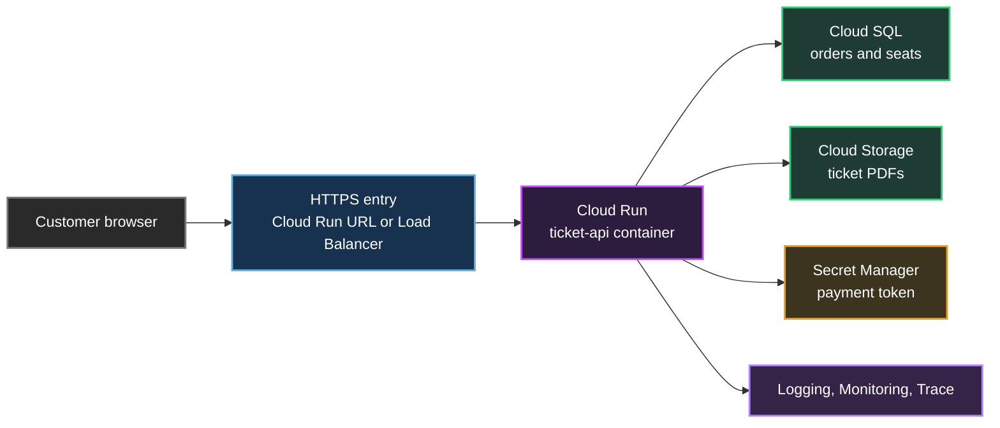
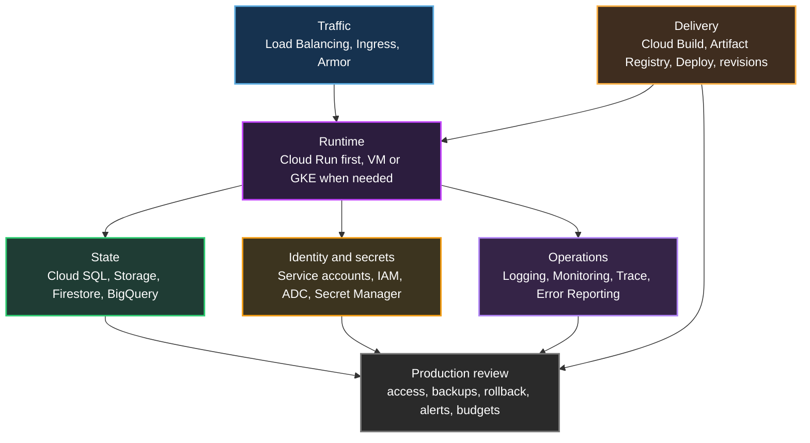

## Table of Contents

1. [The Map We Are Building](#the-map-we-are-building)
2. [Traffic: Getting the Request to the Backend](#traffic-getting-the-request-to-the-backend)
3. [Runtime: Choosing Where the Code Runs](#runtime-choosing-where-the-code-runs)
4. [State: Choosing Where the Data Lives](#state-choosing-where-the-data-lives)
5. [Identity and Secrets: Letting the Code Call GCP Safely](#identity-and-secrets-letting-the-code-call-gcp-safely)
6. [Delivery: Turning Source Code Into a Safe Release](#delivery-turning-source-code-into-a-safe-release)
7. [Operations: Logs, Metrics, Traces, and First Production Review](#operations-logs-metrics-traces-and-first-production-review)
8. [What's Next](#whats-next)

## The Map We Are Building
<!-- section-summary: A GCP service map connects each job in one real application request to the service family that usually owns that job. -->

A **GCP service map** is a beginner-friendly way to answer one practical question: which Google Cloud service usually handles each job in my application? Google Cloud has many products, and the product list can feel huge on day one. A service map gives the list a shape by tying every service name to a real job, like receiving traffic, running code, storing data, protecting secrets, shipping releases, and seeing production behavior.

We will use one concrete application for the whole article: `ticket-api`, the backend for a small event-ticketing company. A customer chooses two seats, presses Buy, and waits for a ticket with a QR code. That single request needs HTTPS traffic, a place for the API code to run, a database transaction for the seat reservation, object storage for the ticket PDF, protected payment configuration, permission to call Google Cloud services, and enough production evidence for debugging, alerts, and rollback.

One phrase shows up across the whole map: **managed service**. A managed service means Google operates part of the platform for you, such as the servers, scaling system, routing system, database maintenance workflow, or logging pipeline. The team still owns the application design, security choices, data model, cost review, and release process, but the team has fewer low-level machines and background processes to maintain directly.

The first service names also need a quick first pass before the table. **Cloud Run** runs a container, which is a packaged application process with its runtime files, and gives it an HTTPS endpoint. **Ingress** means entry into a service, and **Cloud Load Balancing** sits in front of backends to route user traffic to the right place. **Cloud SQL** stores table-shaped business records such as orders and seats, while **Cloud Storage** stores file-like objects such as PDFs, images, exports, and backups.

A few access, release, and operations names also show up early. A **service account** is a workload identity, which means it represents application code instead of a human user. **Application Default Credentials** is the standard way Google client libraries find credentials, and a **Cloud Run revision** is a named version of a Cloud Run service created by a deploy. **Logs** are records of events, **metrics** are numbers tracked over time, and **traces** follow one request across several steps.

Here is the full map before we zoom in. The table gives the product names a reading path, and the sections below explain the names in more detail as the request reaches each part of the system. Each row connects a service name to the job it performs, so the next time you see a GCP architecture diagram, you can follow the request instead of staring at a cloud-product catalog.

| Application job | Common GCP services | What the team checks first |
|---|---|---|
| Accept web or mobile traffic | **Cloud Load Balancing**, **Cloud Run ingress**, **Cloud Armor** | domain, TLS, routing rule, allowed callers, protection policy |
| Run backend code | **Cloud Run**, **Compute Engine**, **Google Kubernetes Engine** | container contract, scaling behavior, operating-system ownership |
| Store relational business data | **Cloud SQL**, **AlloyDB**, **Spanner** | transactions, backups, high availability, connection path |
| Store files, exports, and backups | **Cloud Storage** | bucket location, access control, lifecycle rule, retention rule |
| Store document-style app state | **Firestore** | document shape, indexes, query pattern, consistency needs |
| Analyze historical data | **BigQuery** | dataset location, partitioning, query cost, dashboard access |
| Give workloads an identity | **Service accounts**, **IAM**, **Application Default Credentials** | least privilege, attached service account, key-file avoidance |
| Store secrets and config safely | **Secret Manager**, **Cloud KMS** | secret versions, runtime access, rotation path, encryption needs |
| Build and release software | **Cloud Build**, **Artifact Registry**, **Cloud Deploy**, **Cloud Run revisions** | image tag, provenance, approval, rollout, rollback |
| See what happened in production | **Cloud Logging**, **Cloud Monitoring**, **Cloud Trace**, **Error Reporting** | logs, metrics, alerts, latency traces, error groups |

The request path for the first version of `ticket-api` can stay small. The browser calls a public HTTPS endpoint. The request reaches a Cloud Run service. The service writes an order transaction to Cloud SQL, saves the ticket PDF in Cloud Storage, reads a payment secret from Secret Manager, and emits logs, metrics, and traces for the operations team.



This first map gives us a route through the rest of the article. Traffic reaches the platform first, so we start at the public entry point. After that, the request needs running code, and the runtime choice decides how much infrastructure the team owns.

## Traffic: Getting the Request to the Backend
<!-- section-summary: Traffic services receive callers, apply the first routing and protection decisions, and send the request to the backend runtime. -->

**Traffic** means the path a request takes before it reaches your application code. For `ticket-api`, traffic starts in a browser or mobile app and arrives as an HTTPS request. The first GCP decision is about the entry point: a simple Cloud Run HTTPS endpoint, or a Cloud Load Balancer in front of the service for custom routing, TLS certificates, shared domains, private patterns, and extra protection.

**TLS certificates** are the certificate files browsers use to verify and encrypt HTTPS connections. In a small service, Cloud Run can provide a direct HTTPS endpoint. In a larger production setup, the load balancer often owns the public domain and certificate, then forwards clean traffic to the backend service.

**Cloud Run** is Google Cloud's managed way to run a containerized web service. A **container** is a packaged application process with its runtime files and dependencies, so the same package can run in development, CI, and production. **Ingress** means the entry path into that service, so **Cloud Run ingress** is the built-in way Cloud Run receives requests and controls which callers can reach the service.

**Cloud Load Balancing** is Google Cloud's managed load balancer service. A load balancer sits in front of one or more backends and decides where each request should go. In a production ticketing system, the same domain might route `/api/*` to Cloud Run, `/assets/*` to a cached static-file bucket, and `/admin/*` to a different service.

**Cloud Armor** adds web security policy at the edge, which means it can inspect or block traffic before that traffic reaches the backend service. It can help with allowlists, denylists, rate-based controls, preconfigured web attack rules, and DDoS-related protection patterns, where DDoS means a flood of traffic intended to overwhelm a service. For a ticketing site, this matters because a launch day can bring real buyers, bots, scraping traffic, and sudden request spikes through the same public endpoint.

A first Cloud Run service can start with a direct deploy. A **container image** is the packaged version of the application that Cloud Run will start when traffic arrives. The command below gives the service an image, a region, public invocation, and a runtime identity, which already covers the first traffic and runtime decisions for a beginner API.

```bash
gcloud run deploy ticket-api \
  --image=us-central1-docker.pkg.dev/ticket-prod/apps/ticket-api:2026-06-14-8f31c2a \
  --region=us-central1 \
  --allow-unauthenticated \
  --service-account=ticket-api@ticket-prod.iam.gserviceaccount.com
```

That command places one container behind a managed HTTPS endpoint. The image comes from Artifact Registry, the region tells GCP where the service runs, and the service account gives the runtime its GCP identity. In a more mature setup, the team may put an external Application Load Balancer in front of Cloud Run through a serverless network endpoint group, which is the load balancer's way to point traffic at a serverless backend such as Cloud Run.

Traffic gets the customer request to the backend boundary. The next question is what actually runs the backend code. GCP gives several compute shapes, and each one changes the amount of platform work the team accepts.

## Runtime: Choosing Where the Code Runs
<!-- section-summary: Runtime services run the application code, and the main choice is how much infrastructure control the team needs. -->

**Runtime** means the place where your application process runs. For `ticket-api`, that process might be a Node.js, Go, Java, Python, or Rust HTTP server. GCP can run that code as a managed container service, as a virtual machine process, or as a Kubernetes workload.

**Cloud Run** is the natural first runtime for many backend APIs because it runs containers on managed infrastructure. The team provides a container image, sets CPU and memory, configures environment variables and secrets, and Cloud Run handles request routing to running instances. The container needs to follow the Cloud Run container contract, which includes listening on the port from the `PORT` environment variable and writing logs to standard output and standard error.

The Cloud Run deploy grows as the service map fills in. The next version connects the runtime to Cloud SQL, environment variables, and Secret Manager. The command still deploys one service, but it now shows how compute, data, identity, and configuration meet at runtime.

```bash
gcloud run deploy ticket-api \
  --image=us-central1-docker.pkg.dev/ticket-prod/apps/ticket-api:2026-06-14-8f31c2a \
  --region=us-central1 \
  --service-account=ticket-api@ticket-prod.iam.gserviceaccount.com \
  --add-cloudsql-instances=ticket-prod:us-central1:ticket-db \
  --set-env-vars=ENV=prod,RECEIPT_BUCKET=ticket-receipts-prod \
  --set-secrets=PAYMENT_API_KEY=payment-api-key:latest
```

This command shows several runtime responsibilities in one place. The container image names the exact build. The service account decides what GCP APIs the code can call. The Cloud SQL connection, environment variables, and mounted secret connect the runtime to the data and configuration services that the request needs.

**Compute Engine** runs virtual machines. A **virtual machine** is a software server with its own operating system, CPU, memory, disk, and network settings. Teams usually pick it for workloads that need operating-system control, special agents, custom startup scripts, unusual networking, licensed software, persistent local processes, or migration compatibility with existing servers. That control also brings patching, image hygiene, process supervision, and VM-level capacity planning back onto the team.

**Google Kubernetes Engine**, usually shortened to **GKE**, runs Kubernetes clusters on Google Cloud. **Kubernetes** is a platform for running many containers across a group of machines with deployment, networking, and scheduling rules. Teams usually pick GKE when they already need Kubernetes APIs, many services sharing one cluster platform, admission policies, sidecars, custom controllers, service meshes, or fine-grained pod scheduling. GKE fits platform teams that already want Kubernetes as the shared operating layer for many services.

The ticketing company can start with Cloud Run because `ticket-api` has a clean container boundary and request-based traffic. Later, the team might keep the API on Cloud Run, move long-running stream processors to GKE, and keep a legacy batch service on Compute Engine. The service map stays useful because each runtime has a job instead of every workload going to the newest service name.

At this point, the API can receive a request and run code. The request still needs durable state, because checkout data must survive container restarts and scale-downs. Customers expect the seat reservation and ticket PDF to exist after the runtime instance disappears.

## State: Choosing Where the Data Lives
<!-- section-summary: Data services split by data shape, so each part of the application state goes to the service that matches how the app reads and writes it. -->

**State** means data the system must remember after one request finishes. In `ticket-api`, the order row, seat reservation, payment status, ticket PDF, customer support notes, and sales dashboard history all count as state. GCP has several data services because each kind of state has a different shape and access pattern.

**Relational data** means data organized in tables with relationships between records, such as `orders`, `customers`, `seats`, and `payments`. A **transaction** is a group of database changes that succeeds or rolls back as one unit, which matters when two customers try to buy the same seat. **Cloud SQL** is Google Cloud's managed relational database service for PostgreSQL, MySQL, and SQL Server, so it fits ordinary application records that need SQL, transactions, indexes, constraints, and familiar database tooling.

```bash
gcloud sql instances create ticket-db \
  --database-version=POSTGRES_16 \
  --region=us-central1 \
  --availability-type=REGIONAL \
  --tier=db-custom-2-7680

gcloud sql databases create tickets \
  --instance=ticket-db
```

That first command creates the managed database instance, and the second creates the application database inside it. A real production review would also check automated backups, point-in-time recovery, maintenance windows, database flags, user management, connection limits, and whether the application reaches the database through an approved private or managed connection path. Cloud SQL removes much of the database operations burden, but the team still owns schema design, indexes, query behavior, migrations, and capacity choices.

**Cloud Storage** stores objects in buckets. An object is file-like data plus metadata, such as `tickets/2026/06/order-88421.pdf` or `exports/daily-sales-2026-06-14.csv`. The ticketing API can store generated ticket PDFs in Cloud Storage because a PDF works as durable object data with metadata, lifecycle rules, and bucket access policies.

```bash
gcloud storage buckets create gs://ticket-receipts-prod \
  --location=us-central1 \
  --uniform-bucket-level-access
```

That bucket should have a clear location, lifecycle policy, access policy, and retention decision. For example, ticket PDFs may need to stay available for customer support for one year, while temporary export files may expire after seven days. The same storage service can hold both, but lifecycle rules and naming conventions help the team treat them differently.

**Firestore** is a document database. It fits data that naturally lives as documents and collections, such as user preferences, shopping-cart drafts, notification state, or mobile app sync data. For `ticket-api`, Firestore could hold a short-lived checkout session document while the customer moves through the payment flow, especially if the frontend needs fast reads of a changing document shape.

**BigQuery** is an analytics data warehouse. It fits historical questions such as "Which shows sold out fastest?", "Which campaign produced refunds?", or "What was checkout latency during the launch hour?" The application can keep the source-of-truth order in Cloud SQL and send clean event data into BigQuery for reporting, dashboarding, and later analysis.

**Pub/Sub** and **Memorystore** often appear near the data layer, even though they serve different jobs. Pub/Sub moves messages between systems, such as sending `ticket.purchased` events to an email worker after checkout. Memorystore provides managed Redis or Valkey-style caching, which can help with hot read paths such as event metadata that many buyers request at the same time.

The important move is to place each kind of state by how the application uses it. Cloud SQL owns transactional order data. Cloud Storage owns files. Firestore can own document-style session data. BigQuery owns analytics history. Pub/Sub moves follow-up work out of the request path, and Memorystore can reduce repeated reads during busy events.

The API can now run and save data, but one question remains before it can safely call these services. The code needs permission. In GCP, that leads directly to service accounts, IAM roles, Application Default Credentials, and Secret Manager.

## Identity and Secrets: Letting the Code Call GCP Safely
<!-- section-summary: Identity and secret services give the runtime scoped access to GCP APIs without storing long-lived keys inside the application. -->

**Identity** answers which caller is making a request to Google Cloud. For a running application, the caller should usually be a **service account**, which is a special Google Cloud account meant for workloads instead of humans. The `ticket-api` service account can receive only the permissions needed to read its secret, connect to Cloud SQL, write ticket PDFs, and emit telemetry.

**IAM**, or Identity and Access Management, grants permissions through roles on resources. A **principal** is the identity that receives access, and a **role** is a bundle of permissions such as reading secrets or connecting to Cloud SQL. A binding connects a principal to a role on a project, folder, organization, or individual resource, so the ticketing API can receive `roles/cloudsql.client` on the project and a narrower Storage role on the ticket bucket.

```bash
gcloud projects add-iam-policy-binding ticket-prod \
  --member=serviceAccount:ticket-api@ticket-prod.iam.gserviceaccount.com \
  --role=roles/cloudsql.client

gcloud storage buckets add-iam-policy-binding gs://ticket-receipts-prod \
  --member=serviceAccount:ticket-api@ticket-prod.iam.gserviceaccount.com \
  --role=roles/storage.objectUser
```

Those bindings let the runtime call the database connection path and manage objects in one bucket. A beginner mistake is granting broad project-level editor-style access because the app fails on the first permission error. The better production habit is to grant the role that matches the job, run the real workflow, read the missing-permission evidence, and narrow the binding to the smallest useful scope.

**Application Default Credentials**, often called **ADC**, is the strategy Google client libraries use to find credentials automatically. In local development, ADC can use credentials created by `gcloud auth application-default login`. In production on Cloud Run, ADC can use the attached service account through the metadata server, which is a local runtime endpoint that gives the workload short-lived identity information without putting downloaded key files in the application.

The application code can stay simple because the library handles credential lookup. The example below writes a ticket PDF to the bucket named in the runtime configuration. The same code can run locally with developer ADC and in production with the attached service account.

```js
import {Storage} from "@google-cloud/storage";

const storage = new Storage();

export async function saveTicketPdf(orderId, pdfBuffer) {
  await storage
    .bucket(process.env.RECEIPT_BUCKET)
    .file(`tickets/${orderId}.pdf`)
    .save(pdfBuffer, {
      contentType: "application/pdf",
      resumable: false
    });
}
```

The code leaves JSON key files out of the application path. The library asks ADC for credentials, and the runtime provides the attached service account in production. That keeps long-lived private keys out of the container image, out of environment variables, and out of source control.

**Secret Manager** stores sensitive values such as API tokens, webhook signing secrets, database passwords for legacy clients, and private certificates. A secret has versions, so rotation can add a new version without changing the secret name the app uses. For `ticket-api`, the payment provider key belongs in Secret Manager rather than directly in the deploy command, the repository, or a dashboard screenshot.

```bash
printf "%s" "$PAYMENT_API_KEY" | gcloud secrets create payment-api-key \
  --data-file=- \
  --replication-policy=automatic

gcloud secrets add-iam-policy-binding payment-api-key \
  --member=serviceAccount:ticket-api@ticket-prod.iam.gserviceaccount.com \
  --role=roles/secretmanager.secretAccessor
```

The first command creates the secret from standard input, and the second command lets only the runtime service account read it. Cloud Run can then expose the secret to the container as an environment variable or a mounted file. The team should also document who can add new secret versions, who can read secret payloads, and how payment-key rotation reaches production safely.

Identity and secrets give the running service scoped access to the rest of GCP. After that, the team needs a repeatable way to build the container, store the artifact, release it, and move traffic. That delivery path matters because every production incident eventually asks one simple thing: which version is running?

## Delivery: Turning Source Code Into a Safe Release
<!-- section-summary: Delivery services create a chain from source code to image, deployed revision, traffic movement, and rollback evidence. -->

**Delivery** means the path from source code to a running production version. For `ticket-api`, a healthy delivery path builds a container image, stores it in a registry, deploys it to Cloud Run, records the new revision, moves traffic in a controlled way, and leaves enough evidence for a reviewer during an incident. A **registry** is a storage place for build artifacts, and a **revision** is a named Cloud Run version created from one deploy.

**Artifact Registry** stores build artifacts such as container images and language packages. A production Cloud Run deployment should point at a clear image tag, digest, commit SHA, or build number. Tags like `latest` make operations work harder because the running service no longer points clearly to one build.

**Cloud Build** runs build steps. It can build a container from source, run tests, scan or sign artifacts depending on the pipeline design, and push the image to Artifact Registry. A small team might start with one build command, then move the same steps into a trigger that runs after a merge to the main branch.

```bash
gcloud artifacts repositories create apps \
  --repository-format=docker \
  --location=us-central1

gcloud builds submit \
  --tag=us-central1-docker.pkg.dev/ticket-prod/apps/ticket-api:2026-06-14-8f31c2a
```

The first command creates a Docker repository in Artifact Registry. The second command builds the current source tree and pushes one tagged image. In a real pipeline, the tag would usually include a commit SHA or build ID, and the build logs would connect that image back to the exact source version and test result.

**Cloud Run revisions** are the deploy history for a Cloud Run service. Every configuration change creates a new revision, including a new image, environment variable, secret mount, CPU setting, memory setting, or service account. This gives the team a built-in release record and a direct traffic target.

```bash
gcloud run services update-traffic ticket-api \
  --region=us-central1 \
  --to-revisions=ticket-api-00042-good=100
```

That rollback command sends all traffic back to a known good revision. The exact revision name will come from the service history, so the team should know where to find it before an incident. Cloud Run can also split traffic between revisions, which supports canary releases where a small percentage of users reaches the new version first.

**Cloud Deploy** is Google Cloud's managed continuous delivery service. It can define targets, delivery pipelines, approvals, and promotion flow across environments. For a beginner service, direct Cloud Build to Cloud Run may be enough, but a team with dev, staging, and production usually benefits from a delivery tool that records promotion decisions and standardizes the release path.

The release path connects back to everything we have covered. A new image changes what code runs. A new revision may use a different service account, secret version, or database connection. A safe delivery process gives the team one place to answer what changed, who approved it, and how to roll back.

After the release reaches production, the service still needs evidence. The team needs to see errors, latency, traffic, saturation, and request traces without logging into containers or guessing from customer reports. That evidence comes from the operations services attached to the running system.

## Operations: Logs, Metrics, Traces, and First Production Review
<!-- section-summary: Operations services turn production behavior into evidence, and a first production review checks access, data safety, release safety, reliability, and cost. -->

**Operations** means the everyday work of understanding and improving a running system. For `ticket-api`, operations includes reading logs after a failed checkout, watching error rate during a launch, tracing a slow request through Cloud Run and Cloud SQL, and receiving alerts before customers flood support. Google Cloud groups much of this under Cloud Operations, especially Cloud Logging, Cloud Monitoring, Cloud Trace, and Error Reporting.

The first operations words are simple. A **log** is a record of something that happened, such as a checkout error or payment-provider response. A **metric** is a number over time, such as request count, error rate, latency, CPU, or memory. A **trace** follows one request across several steps, which helps the team see where time went during a slow checkout.

**Cloud Logging** collects logs from Google Cloud services and from application output. Cloud Run automatically captures standard output and standard error from the container, so a structured log line from the application can show up with resource labels such as service name, revision, project, and region. The team should include useful fields such as `order_id`, `request_id`, `payment_provider`, and `release_sha`, while keeping payment tokens, passwords, and unnecessary personal data out of logs.

```bash
gcloud logging read \
  'resource.type="cloud_run_revision" AND resource.labels.service_name="ticket-api" AND severity>=ERROR' \
  --limit=20 \
  --project=ticket-prod
```

That query asks for recent Cloud Run error logs for one service. During an incident, this gives the team a fast first view of stack traces, failed dependencies, bad input patterns, and revision-specific failures. Good logs should help a developer find the failing path without exposing secrets or turning every request into a giant unreadable document.

**Cloud Monitoring** collects metrics and powers dashboards and alerting policies. For a Cloud Run API, first metrics usually include request count, request latency, error count, container instance count, CPU usage, memory usage, and database connection pressure. A ticket launch needs alerts on user-facing symptoms such as high 5xx rate or checkout latency, because those symptoms show customer impact better than a single CPU graph.

**Cloud Trace** helps follow request latency across services. If checkout takes four seconds, Trace can show time spent in the handler, payment call, database query, and object upload when the application emits trace context correctly. Trace matters more as the system adds workers, events, and multiple services, because one customer request can spread across several places.

**Error Reporting** groups application errors so the team can see repeated failures without reading every log line manually. A single bad null reference might produce hundreds of logs during a launch. Error grouping helps the team find the main failure pattern, assign ownership, and connect it to a release or dependency issue.

A first production review should walk through the service map and ask concrete questions. The traffic layer needs a domain, TLS, allowed caller rules, and Cloud Armor decisions. The runtime needs CPU, memory, concurrency, min or max instances, region choice, and a known service account. The data layer needs backups, restore tests, lifecycle rules, retention choices, indexes, and connection limits.

The identity review should confirm that humans and workloads have separate identities. The Cloud Run service should use a dedicated service account, and that service account should have only the roles needed for Cloud SQL, Cloud Storage, Secret Manager, and telemetry. Service account keys should be absent unless a documented legacy integration truly requires them.

The delivery review should confirm that every production revision points to a traceable image. The team should know how to find the active revision, compare it with the previous one, move traffic back, and explain who approved the release. A rollback path needs practice before the team depends on it during an incident.

The operations review should confirm that the team can answer customer-impact questions quickly. What is the current error rate? Which revision produced the errors? Did latency rise after the deploy? Did Cloud SQL reach connection limits? Did the payment provider fail, or did the application fail before calling it?

The cost and quota review should also happen early. Budgets and budget alerts help catch unexpected spend, especially after a launch, a load test, or a broken loop that writes too many logs or queries too much data. Quotas matter because a service can fail from hitting a limit even though the code and permissions look correct.

The compact version of the map now includes production review work. The diagram below ties the service families back to the request path. Review crosses traffic, runtime, state, identity, delivery, and operations.



The service map now has a full request path. A customer request enters through traffic services, runs on a compute service, reads and writes data services, uses a workload identity, depends on secrets, ships through a delivery path, and leaves operational evidence. That is the first practical map of Google Cloud for application builders.

## What's Next

This article stayed at the application-service level. We named the core services and connected them to one request, because that gives every later GCP topic a practical anchor. The next foundation step is the account structure underneath those services: projects, billing accounts, regions, zones, APIs, and the resource hierarchy.

Those pieces decide where the services live, who pays for them, which APIs can run, and how teams separate development, staging, and production. After that, service maps get much easier to apply because every resource has a project boundary, a location decision, and a billing trail.

---

**References**

- [What is Cloud Run](https://cloud.google.com/run/docs/overview/what-is-cloud-run) - Explains Cloud Run services, jobs, worker pools, containerized workloads, scaling, revisions, and managed runtime behavior.
- [Cloud Run container runtime contract](https://cloud.google.com/run/docs/container-contract) - Documents how Cloud Run containers receive ports, requests, signals, filesystems, and logs.
- [Cloud Run service identity](https://cloud.google.com/run/docs/securing/service-identity) - Explains how Cloud Run uses service accounts as runtime identities.
- [Cloud Run rollbacks and traffic migration](https://cloud.google.com/run/docs/rollouts-rollbacks-traffic-migration) - Documents gradual rollouts, traffic splits, revision tags, and rollback patterns.
- [Cloud Load Balancing overview](https://cloud.google.com/load-balancing/docs/load-balancing-overview) - Describes Google Cloud load balancing families and traffic distribution patterns.
- [Cloud Armor overview](https://cloud.google.com/armor/docs/cloud-armor-overview) - Explains edge security policies, WAF rules, and DDoS-related protection features.
- [Cloud SQL overview](https://cloud.google.com/sql/docs/introduction) - Defines Cloud SQL as a managed relational database service for MySQL, PostgreSQL, and SQL Server.
- [Connect from Cloud Run to Cloud SQL for PostgreSQL](https://cloud.google.com/sql/docs/postgres/connect-run) - Documents Cloud Run connection options and IAM requirements for Cloud SQL.
- [Cloud Storage overview](https://cloud.google.com/storage/docs/introduction) - Explains buckets, objects, locations, storage classes, lifecycle management, and access control.
- [Firestore overview](https://cloud.google.com/firestore/docs/overview) - Describes Firestore as a document database for mobile, web, and server development.
- [BigQuery overview](https://cloud.google.com/bigquery/docs/introduction) - Explains BigQuery as a serverless analytics data warehouse.
- [Pub/Sub overview](https://cloud.google.com/pubsub/docs/overview) - Describes topics, subscriptions, and asynchronous message delivery.
- [Service accounts overview](https://cloud.google.com/iam/docs/service-account-overview) - Defines service accounts and common workload identity use cases.
- [How Application Default Credentials works](https://cloud.google.com/docs/authentication/application-default-credentials) - Documents how Google authentication libraries find credentials in development and production.
- [Secret Manager overview](https://cloud.google.com/security/products/secret-manager) - Describes managed storage and access control for secrets.
- [Artifact Registry overview](https://cloud.google.com/artifact-registry/docs/overview) - Explains managed repositories for container images and build artifacts.
- [Cloud Build overview](https://cloud.google.com/build/docs/overview) - Describes managed build steps, triggers, and CI/CD workflows.
- [Cloud Deploy overview](https://cloud.google.com/deploy/docs/overview) - Describes delivery pipelines, targets, promotion, and deployment automation.
- [Cloud Logging overview](https://cloud.google.com/logging/docs/overview) - Explains log collection, querying, routing, and analysis.
- [Cloud Monitoring overview](https://cloud.google.com/monitoring/docs/monitoring-overview) - Documents metrics, dashboards, alerting, and observability workflows.
- [Cloud Trace overview](https://cloud.google.com/trace/docs/overview) - Explains distributed tracing for latency analysis.
- [Cloud Billing budgets and alerts](https://cloud.google.com/billing/docs/how-to/budgets) - Documents budgets and alerts for cost monitoring.
