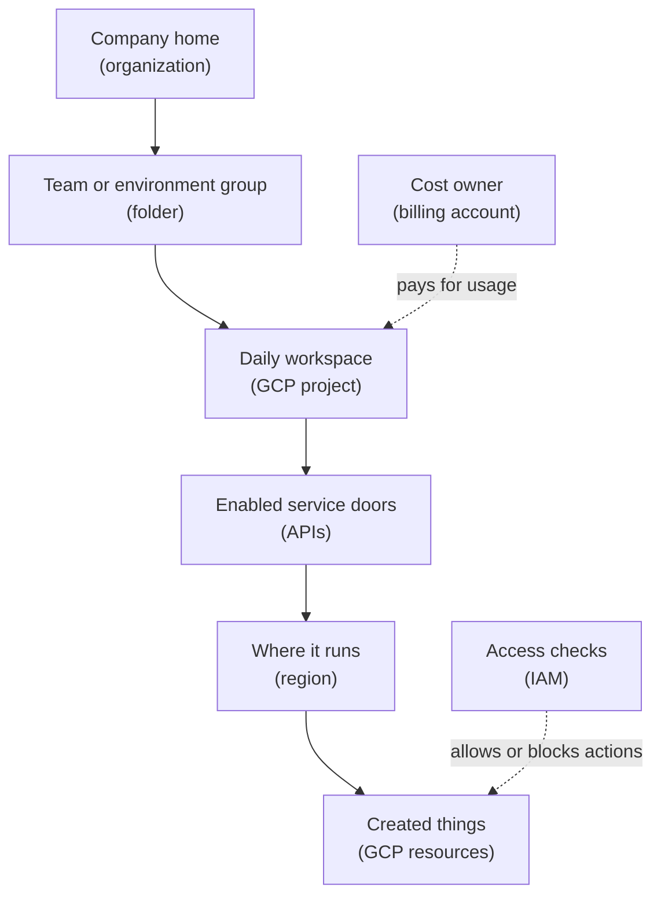

## Table of Contents

1. [What GCP Is Trying To Organize](#what-gcp-is-trying-to-organize)
2. [The AWS And Azure Translation](#the-aws-and-azure-translation)
3. [The Example: One Orders API Needs A Project](#the-example-one-orders-api-needs-a-project)
4. [Projects Are The Daily Workspace](#projects-are-the-daily-workspace)
5. [APIs Must Be Enabled Before Services Can Be Used](#apis-must-be-enabled-before-services-can-be-used)
6. [Regions And Zones Put Resources On The Map](#regions-and-zones-put-resources-on-the-map)
7. [Resources Have Names, Labels, And Paths](#resources-have-names-labels-and-paths)
8. [Identity Decides Who And What Can Act](#identity-decides-who-and-what-can-act)
9. [Billing Belongs To Projects Through A Billing Account](#billing-belongs-to-projects-through-a-billing-account)
10. [Managed Services Still Leave You Responsible](#managed-services-still-leave-you-responsible)
11. [Failure Modes For Beginners](#failure-modes-for-beginners)
12. [The Mental Checklist Before You Deploy](#the-mental-checklist-before-you-deploy)

## What GCP Is Trying To Organize

If you have seen AWS first, you may think in accounts, regions, IAM
roles, and services. If you have seen Azure first, you may think in
tenants, subscriptions, resource groups, and Azure RBAC. GCP has the
same broad goal, but it asks you to build a slightly different picture
in your head.

The center of that picture is the project. A GCP project is the main
workspace for an app, environment, or team. It is where resources are
created, APIs are enabled, permissions are attached, quotas are counted,
logs are collected, and billing is connected.

That project-centered shape makes more sense when you remember where
Google Cloud comes from. Google was already operating huge services
like Search, Gmail, and YouTube before most developers were thinking
about public cloud. The public GCP experience grew from that
platform-and-API mindset. Instead of thinking about owned servers, GCP
pushes you toward API calls inside a selected project.

The console is only one way to make that API request. The `gcloud` CLI,
Terraform, CI/CD pipelines, and application SDKs all talk to Google
Cloud APIs too. When the DevPolaris team deploys `devpolaris-orders-api`
to Cloud Run, creates a Cloud SQL database, or grants a service account
access to a secret, those actions go through the Google Cloud control
plane.

So before memorizing the product list, learn the few ideas that almost
every GCP service depends on: projects, APIs, regions, resources,
identity, billing, and operating evidence. Once those ideas are clear,
names like Cloud Run, Cloud SQL, Cloud Storage, IAM, and Cloud Logging
are much easier to place.

Here is the first map. A GCP project is not exactly an AWS account or
an Azure subscription, but it carries several concerns you already care
about:

| Daily concern | Project-level answer |
|---|---|
| Deployment target | The project selected by the console, CLI, pipeline, or Terraform |
| Resource ownership | The app, environment, and team boundaries around created resources |
| Service readiness | The APIs enabled for this project |
| Access | The IAM bindings attached to the project or resources |
| Cost | The billing account connected to the project |

This article follows one running example: `devpolaris-orders-api`, a
Node backend for checkout, is moving into Google Cloud. We will use
Cloud Run as the easiest first runtime to picture. You give Google
Cloud a container image, and Cloud Run runs the service for you. We will
not go deep into Cloud Run here. The goal is to learn the map before we
walk into each service.

## The AWS And Azure Translation

If you have learned AWS or Azure, reuse the instinct, but do not copy
every assumption.

In AWS, the account often feels like the main workspace. In Azure, the
tenant, subscription, and resource group split that job into clearer
layers. In GCP, the project is the work area most app teams touch
again and again.

Use this table as orientation, not as a word-for-word dictionary:

| AWS or Azure idea | GCP idea to learn | What changes |
|---|---|---|
| AWS account | GCP project | A project is a daily resource, API, IAM, quota, and billing boundary, but organizations can contain many projects |
| Azure subscription | GCP project plus billing account | A project holds resources, while the billing account pays for one or more projects |
| Azure resource group | Usually project plus labels | GCP does not have the same universal resource group container |
| AWS Organizations or Azure tenant | Organization and folders | These organize projects and policies above the project |
| IAM role or Azure RBAC role | IAM role on a resource | GCP IAM is granted to principals on projects, folders, resources, or organizations |
| ARN or Azure resource ID | Resource path or full resource name | GCP resources have path-like names that include service and parent information |
| Tags or labels | Labels and tags | Labels help with organization and cost, while tags can be used for policy conditions |

The biggest GCP difference is the project. You will see project IDs in
commands, logs, resource names, billing reports, and API calls. The
project becomes part of the language of daily work.

The second difference is API enablement. In GCP, many services must be
enabled for a project before you can use them. If Cloud Run is not
enabled in the production project, a deployment can fail even if the
container image and IAM role are correct.

The third difference is the lack of an Azure-style resource group. A GCP
project can contain many resources, and labels help humans group them by
team, environment, service, and cost owner. That means a sloppy labeling
habit becomes painful quickly.

The cloud habit is portable. The exact boxes are not. Bring the habit
of checking ownership, access, location, and cost, then learn how GCP
stores those answers.

## The Example: One Orders API Needs A Project

Imagine the DevPolaris team owns `devpolaris-orders-api`. It receives
checkout requests, validates carts, stores orders, writes receipt files,
and emits signals for support and operations.

In local development, the flow is intentionally small:

```text
developer machine
  -> npm run dev
  -> http://localhost:3000/orders
  -> local test database
```

That setup is useful for learning and quick feedback. It is not a
production home. The service needs cloud resources that the team can
inspect, secure, deploy, and pay for together.

A first GCP shape might look like this:

```text
users
  -> public HTTPS URL
  -> Cloud Run service
  -> Cloud SQL database
  -> Cloud Storage bucket
  -> Cloud Logging and Cloud Monitoring
  -> Secret Manager for private config
```

Those names are useful, but the team still needs an owner boundary. For
GCP, that boundary is usually a project.

The team might create or choose a project like this:

```text
project id: devpolaris-orders-prod
purpose: production resources for devpolaris-orders-api
billing: DevPolaris production billing account
primary region: us-central1
labels: team=orders, env=prod, service=orders-api
```

Now the product names have a home. Cloud Run, Cloud SQL, Cloud Storage,
Secret Manager, logging, monitoring, IAM bindings, and quotas all sit in
or attach to that project.

Here is the beginner map:



Read the solid line as the main placement story. A company can have
folders. A folder can contain a project. A project enables services.
Resources are created in the project, often in a region. The dotted
lines are not places where the app runs. They are supporting rules.
Billing decides where cost lands. IAM decides who or what can act.

That distinction prevents many beginner mistakes. A billing account does
not run your app. A permission role is not a network path. An enabled
API is not a deployed service. A region is not a project. Each box has a
job.

## Projects Are The Daily Workspace

A GCP project is the base organizing unit for most hands-on work. It is
where you create resources, enable APIs, attach billing, set IAM
permissions, and inspect quotas.

The project has three names learners often confuse:

| Project field | What it means | Beginner note |
|---|---|---|
| Project name | Human-readable label | Can be changed and does not need to be globally unique |
| Project ID | Globally unique string | Shows up in commands, URLs, logs, and resource references |
| Project number | Automatically assigned numeric ID | Often appears in service accounts and backend systems |

For daily work, the project ID is the one you will feel most often. A
command might deploy to `devpolaris-orders-prod`. A log entry might
include that project. A Cloud Storage bucket name or service account may
carry the project identity in some form.

That is why project naming matters. A project called `test-123` might be
fine for a personal experiment. It is a bad production home for an app
that another engineer must debug at 10:00 on a Monday morning.

For `devpolaris-orders-api`, the team may choose separate projects for
separate environments:

```text
devpolaris-orders-dev
devpolaris-orders-staging
devpolaris-orders-prod
```

That layout is not the only possible design, but it is easy for
beginners to reason about. Staging resources are not mixed with
production resources. Production IAM can be stricter. Billing can still
roll up through the same billing account or folder reports.

The practical habit is simple: before you create anything in GCP, check
the current project. A correct command in the wrong project is still a
wrong change.

## APIs Must Be Enabled Before Services Can Be Used

GCP has a small step that surprises many learners: most Google Cloud
services must be enabled in a project before you use them.

Think of an enabled API as opening the service door for that project. If
the Cloud Run API is disabled, the project is not ready to create Cloud
Run services. If the Secret Manager API is disabled, the app cannot use
Secret Manager resources in the normal way. Some services are enabled by
default, but the safe beginner habit is to verify the service you need.

For the orders project, the team may need service doors like this:

| Need | GCP service or API to inspect |
|---|---|
| Run the containerized API | Cloud Run |
| Store container images | Artifact Registry |
| Store order records | Cloud SQL |
| Store receipt files | Cloud Storage |
| Store private config | Secret Manager |
| Collect logs and metrics | Cloud Logging and Cloud Monitoring |

API enablement is not the same as permission. A project can have the
Cloud Run API enabled while a developer still lacks permission to deploy
a service. A developer can have the right IAM role while the API is
still disabled. Both must be true.

This failure shape is common enough to remember:

```text
deploy target: devpolaris-orders-prod
action: deploy Cloud Run service
result: API not enabled for project
first check: is run.googleapis.com enabled in this project?
```

The fix is not to give the pipeline broader permissions first. The first
fix is to inspect the project setup. Is the service enabled? Is billing
attached? Is the identity allowed to deploy? Separate those questions
and debugging becomes more direct.

## Regions And Zones Put Resources On The Map

Projects answer "which workspace?" Regions and zones answer "where in
the world?"

A region is a geographic area, such as `us-central1` or `europe-west1`.
A zone is a smaller isolated location inside a region, such as
`us-central1-a`. Some GCP resources are regional, some are zonal, and
some are global or multi-region.

That scope changes the design. A Cloud Run service is deployed to a
region. A Compute Engine VM is usually placed in a zone. A VPC network
is global, while its subnets are regional. A Cloud Storage bucket can
use location choices such as region, dual-region, or multi-region
depending on the storage design.

For a first production version of `devpolaris-orders-api`, the team
might choose one main region:

```text
primary region: us-central1
Cloud Run service: us-central1
Cloud SQL database: us-central1
Cloud Storage bucket: us-central1 or a reviewed storage location
```

The point is not that `us-central1` is always the right answer. The
point is that app, database, storage, latency, compliance, and recovery
all connect to location. A backend in one region talking to a database
in another region may work, but it can add latency, cost, and failure
paths.

If you know AWS or Azure, the basic region idea transfers. The service
scope details do not. Always ask whether the specific GCP resource is
global, regional, zonal, dual-region, or multi-region.

## Resources Have Names, Labels, And Paths

After the project and location come the actual resources.

A GCP resource is a managed thing the platform knows about. For the
orders API, that might include:

| Resource | Job |
|---|---|
| Cloud Run service | Runs the Node backend |
| Cloud SQL instance | Stores relational order records |
| Cloud Storage bucket | Stores receipt PDFs and exports |
| Secret Manager secret | Stores private configuration values |
| Artifact Registry repository | Stores container images |
| Log entries and metrics | Provide operating evidence |

Names help humans recognize resources. Labels help humans filter,
report, and group cost. Resource paths help systems identify the exact
thing.

For example, a Cloud Run service could be named:

```text
run-devpolaris-orders-api-prod
```

Useful labels might look like:

```text
team=orders
service=orders-api
env=prod
cost_center=commerce
```

Labels are not secrets. They may appear in inventory, billing, logs, and
reports. Do not put private customer data or credentials in labels.

This is where GCP feels different from Azure for many learners. Azure
has resource groups as a visible container. GCP does not use the same
universal resource group shape. The project and labels do much of that
organizing work.

## Identity Decides Who And What Can Act

Cloud resources are useful only if the right people and workloads can
use them. That is IAM's job. IAM stands for Identity and Access
Management. It decides which principal can perform which action on which
resource.

A principal is an actor. It can be a person, a group, a service account,
or another supported identity. A service account is an identity for a
workload or automation rather than a human. In GCP, service accounts are
central. Cloud Run services, build pipelines, and background jobs often
run as service accounts.

For `devpolaris-orders-api`, the team might use:

```text
service account:
  orders-api-prod@devpolaris-orders-prod.iam.gserviceaccount.com

needs:
  read selected secrets
  connect to Cloud SQL
  write receipt objects to Cloud Storage
  write logs
```

That service account should not be able to delete every project in the
organization. It should have the permissions needed for the app's job.

This is the bridge from AWS and Azure. If you know AWS IAM roles or
Azure managed identities, the instinct is right: workloads need
identities. The GCP version you will see often is a service account
attached to a resource such as Cloud Run. Later identity articles will
go deeper. For now, remember the question:

> Which identity is making this request, and what is it allowed to do?

## Billing Belongs To Projects Through A Billing Account

Cloud cost needs a home. In GCP, projects are linked to billing
accounts. The project holds the resources. The billing account pays for
usage from one or more projects.

This split matters because a project can look technically correct but
still fail if billing is not attached or allowed. It also matters for
cost review. If the orders team runs production in
`devpolaris-orders-prod`, labels and project structure help finance and
engineering understand where spend came from.

A small production review might ask:

```text
project: devpolaris-orders-prod
billing account: DevPolaris Production
labels required: team, service, env, cost_center
budget alert: production order services
```

The goal is not paperwork. The goal is not being surprised later. If a
Cloud Run service scales up, a Cloud SQL instance is oversized, or a
storage bucket grows because exports never expire, the team needs to see
the cost and know who owns the decision.

Billing is part of engineering because resources are choices. The bill
is one way the system tells you whether those choices still make sense.

## Managed Services Still Leave You Responsible

GCP managed services remove a lot of undifferentiated work. You do not
patch the physical machines behind Cloud Run. You do not rack servers
for Cloud SQL. You do not build a logging backend from scratch just to
store log entries.

That does not mean Google Cloud owns your application. The team still
owns many important decisions:

| Area | What GCP helps with | What the team still owns |
|---|---|---|
| Runtime | Cloud Run runs container instances | App code, config, health, rollout choices |
| Database | Cloud SQL manages database infrastructure | Schema, queries, backups, access, sizing decisions |
| Storage | Cloud Storage stores objects | Bucket design, object names, retention, authorization |
| Identity | IAM checks permissions | Choosing narrow roles and safe identities |
| Observability | Logging and Monitoring collect evidence | Useful log fields, alerts, dashboards, response habits |
| Cost | Billing reports show spend | Labels, budgets, cleanup, service sizing |

This tradeoff is the heart of cloud work. You give up some low-level
control and gain managed building blocks. In return, you must learn how
to choose, connect, secure, observe, and pay for those building blocks.

For a beginner, that is the healthy middle ground. You do not need to
know the inside of every Google data center. You do need to recognize
the project, resource, runtime identity, and health signal involved in a
change.

## Failure Modes For Beginners

Most first GCP problems are not mysterious. They usually come from one
box in the mental model being wrong.

The deploy command works locally, but production deploy fails:

```text
target project: devpolaris-orders-prod
operation: deploy Cloud Run service
error: Cloud Run API has not been used in project before or it is disabled
```

The first check is the project and API enablement. Do not start by
rewriting the Dockerfile. The service door may simply be closed for that
project.

The app starts, but cannot read a secret:

```text
service: devpolaris-orders-api
identity: orders-api-prod@devpolaris-orders-prod.iam.gserviceaccount.com
error: Permission denied on secret orders-db-url
```

The first check is the runtime identity and IAM binding. Which service
account is Cloud Run using? Does that service account have permission to
read the specific secret?

The app is deployed, but nobody can find the cost owner:

```text
resource: run-devpolaris-orders-api-prod
labels: missing
monthly cost: visible, but not grouped by team
```

The first check is labels and project structure. A resource without
labels may work technically while still being hard to operate.

The app connects slowly to the database:

```text
Cloud Run region: us-central1
Cloud SQL region: europe-west1
symptom: checkout latency increased
```

The first check is location. The resources may be healthy, but placed in
a way that adds avoidable distance.

The pattern is simple: before diving into the product console, place the
problem on the map. Project, API, region, resource, identity, billing,
or evidence. One of those boxes is usually where the first answer lives.

## The Mental Checklist Before You Deploy

Before `devpolaris-orders-api` deploys to GCP, the team should be able
to answer a short set of questions.

| Question | Good first answer |
|---|---|
| Production project | `devpolaris-orders-prod` |
| Enabled APIs | Cloud Run, Artifact Registry, Cloud SQL, Cloud Storage, Secret Manager, Logging, Monitoring |
| Primary location | A reviewed region close to users and data needs |
| Runtime identity | A dedicated service account for the production API |
| Required resources | Runtime, database, bucket, secrets, logs, metrics |
| Required labels | `team`, `service`, `env`, `cost_center` |
| Billing owner | The approved production billing account |
| Healthy evidence | Health checks, logs, metrics, traces, and release records |

This checklist is not fancy. It is the part of cloud work that keeps the
rest from becoming guesswork. When the map is clear, service-specific
articles become easier. Cloud Run has a place. Cloud SQL has a place.
IAM has a place. Logs and billing have a place.

That is the real goal of a foundation article: the next noun should have
somewhere to land.

---

**References**

- [Resource hierarchy](https://cloud.google.com/resource-manager/docs/cloud-platform-resource-hierarchy) - Google explains organizations, folders, projects, and resources in the GCP hierarchy.
- [Creating and managing projects](https://cloud.google.com/resource-manager/docs/creating-managing-projects) - Google explains project names, project IDs, project numbers, and project lifecycle.
- [Enabled services](https://cloud.google.com/service-usage/docs/enabled-service) - Google explains why services and APIs must be enabled in a project before use.
- [Regions and zones](https://cloud.google.com/compute/docs/regions-zones/) - Google explains regional, zonal, and global resource placement.
- [Labels overview](https://cloud.google.com/resource-manager/docs/labels-overview) - Google explains labels for organizing resources and understanding costs.
