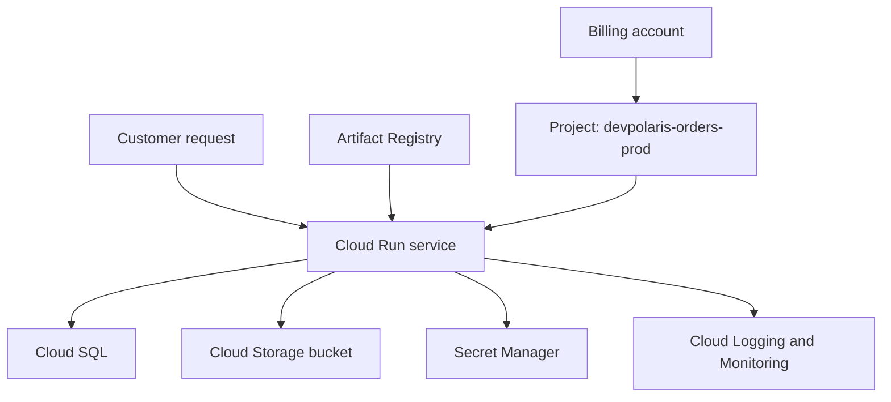

## Table of Contents

1. [The Problem](#the-problem)
2. [The Same App Jobs](#the-same-app-jobs)
3. [What Carries Over](#what-carries-over)
4. [What GCP Changes](#what-gcp-changes)
5. [Projects](#projects)
6. [APIs](#apis)
7. [Resources](#resources)
8. [Callers](#callers)
9. [Billing](#billing)
10. [What GCP Takes Over](#what-gcp-takes-over)
11. [First Map](#first-map)
12. [Putting It All Together](#putting-it-all-together)
13. [What's Next](#whats-next)

## The Problem

The Orders API already has a cloud shape in your head. AWS taught you to ask where code runs, where data lives, who can call what, how traffic enters, and where evidence goes. Azure added a different boundary map: tenants, subscriptions, resource groups, Resource Manager, and managed identities.

Now the team asks for the GCP version of `devpolaris-orders-api`.

- A developer creates a Cloud Run service but deploys it into the wrong project.
- The Cloud SQL Admin API is not enabled, so a database task fails before a database exists.
- A bucket exists, but nobody knows which billing account pays for the project that owns it.
- The app has a service account, but the team cannot tell which resources that identity can access.

The beginner question is not "which GCP product replaces which AWS product?" The better question is:

> How does GCP organize the same app jobs I already understand?

GCP still gives you compute, data, networking, identity, logs, metrics, deployment tools, cost controls, and recovery options. The important shift is that daily work usually starts inside a project, goes through enabled APIs, creates resources with identities and locations, and charges usage through a linked billing account.

## The Same App Jobs

The app has not changed just because the provider changed. The Orders API still needs the same production jobs:

| App need | Plain job |
| --- | --- |
| Customers call checkout | Public traffic reaches healthy code. |
| Backend code keeps running | Compute hosts the app when no laptop is open. |
| Order records survive deploys | A database stores structured state. |
| Receipt files survive | Object storage keeps files outside the container. |
| Private values stay private | A secret store holds sensitive config. |
| The app calls cloud services | A workload identity receives limited permission. |
| Engineers debug later | Logs, metrics, traces, and alerts outlive one process. |
| Releases reach users | Deployment leaves repeatable evidence. |

This is the part that transfers across clouds. A cloud provider is a set of managed homes for jobs that were hidden in the laptop, repo, shell, local database, and human memory.

The useful GCP habit starts there. Ask what job the app needs before memorizing a service name.

## What Carries Over

AWS and Azure are useful bridges because they already taught the shape of a production system. Keep the job-based instinct, but be careful with direct translation.

| If you remember... | Use it to understand... | Careful difference |
| --- | --- | --- |
| AWS account | GCP project | A project is the everyday workspace for resources, APIs, IAM, quotas, logs, and billing links. |
| Azure subscription | GCP project plus billing account | The project owns resources; the billing account pays for usage. |
| Azure resource group | Project plus labels | GCP has no identical universal resource group container. |
| AWS or Azure region | GCP region | Same broad location idea, but services have their own location choices. |
| IAM role or managed identity | IAM role binding plus service account | GCP separates the role from the principal that receives it. |
| ARN or Azure resource ID | Resource path or full resource name | GCP identifiers are project-centered and service-specific. |

The table is orientation, not a migration plan. You can use AWS or Azure to remember the job. Then learn the GCP mechanism that actually owns that job.

## What GCP Changes

GCP's first surprise is how much everyday work revolves around the project. In AWS, the account often feels like the main place where resources, cost, access, and quotas become real. In Azure, those ideas split across tenant, subscription, resource group, and resource. In GCP, the project is the work area most app teams touch again and again.

The second surprise is API enablement. Many Google Cloud services must be enabled for a project before they can be used. A deployment can fail because the project is real, the caller is real, and the resource name is right, but the service API is not enabled.

The third surprise is that GCP does not give you an Azure-style resource group inside every project. Projects and labels do more of the organizing work. That means a messy project or missing labels can make cost, ownership, and cleanup harder.

The mental model becomes:

```text
organization or folder
  -> project
      -> enabled APIs
      -> resources
      -> IAM bindings
      -> logs and quotas
      -> linked billing account
```

## Projects

A project is the everyday workspace for a GCP workload. It has a project ID, a project number, and a display name. The project ID is the string humans and tools often use, such as `devpolaris-orders-prod`. The project number is assigned by Google and appears in some service identities and resource paths.

For the Orders API, the project answers a practical question:

```text
When I deploy, inspect logs, grant access, or review cost, which workspace am I standing in?
```

That question is small, but it prevents many beginner mistakes. If the CLI is pointed at `devpolaris-orders-dev`, a command that succeeds there does not prove production is configured. If a Cloud Run service exists in one project, searching another project does not prove it is missing.

Project choice also affects quotas and API readiness. If the production project has no Cloud Run API enabled, a deployment cannot use Cloud Run there just because a dev project can.

## APIs

GCP exposes services through APIs. To use most Google Cloud APIs and services, the service must be enabled in the project. Enabling a service associates it with the project, makes project-level service behavior visible, and can affect billing and IAM role visibility.

For a first Orders API project, the team might need services like:

| Job | API or service family |
| --- | --- |
| Run container backend | Cloud Run |
| Store relational records | Cloud SQL Admin API and Cloud SQL |
| Store receipt files | Cloud Storage |
| Store secrets | Secret Manager |
| Keep logs and metrics | Cloud Logging and Cloud Monitoring |
| Store images | Artifact Registry |

The gotcha is that "I have permission" and "the API is enabled" are different facts. A principal can have a role that would allow an action, but the project still cannot use a service until the API is enabled.

## Resources

A resource is a thing managed by Google Cloud: a Cloud Run service, Cloud SQL instance, Cloud Storage bucket, Artifact Registry repository, service account, log sink, firewall rule, or many other service objects.

Resources do not all behave the same. Some are global. Some are regional. Some are zonal. Some live inside another resource. Some names must be globally unique. Some only need to be unique in a project or location. The foundation habit is to identify the exact resource, its project, its location, and its job before changing it.

For the Orders API, a small first resource map might look like this:

| Job | GCP resource |
| --- | --- |
| Runtime | Cloud Run service `run-orders-api-prod` |
| Data | Cloud SQL instance `sql-orders-prod` |
| Receipts | Cloud Storage bucket `devpolaris-orders-receipts-prod` |
| Images | Artifact Registry repository `orders-prod` |
| Workload identity | Service account `orders-api-prod@devpolaris-orders-prod.iam.gserviceaccount.com` |
| Evidence | Cloud Logging logs and Cloud Monitoring metrics |

The map is the first debugging tool.

## Callers

Every GCP action has a caller. A human in the console is a caller. The `gcloud` CLI is acting for a caller. A CI pipeline can act as a service account. A Cloud Run service calls other APIs through its runtime service account.

GCP IAM grants roles to principals. Principals can be users, groups, service accounts, or workload identities. A service account is the identity for a machine workload rather than a person.

That means the Orders API needs two kinds of identity thinking:

| Caller | Question |
| --- | --- |
| Human or pipeline deployer | Can this caller deploy or change resources in the right project? |
| Runtime service account | Can the running app read the secret, connect to needed services, and write receipts? |

Do not blur those together. A deployer that can update Cloud Run should not automatically become the runtime identity that reads every secret. A runtime service account that writes receipts should not automatically get permission to edit project IAM.

## Billing

GCP billing is connected to projects through Cloud Billing accounts. A billing account defines who pays, and project usage is charged to the billing account linked to that project.

For a beginner, this matters because "the project exists" is not the same as "the project can run paid services." If billing is disabled or linked to the wrong account, resource creation and service usage can fail or charge the wrong owner.

For `devpolaris-orders-api`, a good first record names both:

```text
project: devpolaris-orders-prod
billing account: DevPolaris Production Billing
cost owner: commerce-platform
```

That record lets finance and engineering talk about the same boundary. The project is where the resources live. The billing account is how usage gets paid for.

## What GCP Takes Over

GCP takes over infrastructure jobs, not product judgment.

Cloud Run can run containers without the team managing servers. Cloud SQL can manage database maintenance, backups, monitoring, and failover features. Cloud Storage can store objects durably in buckets. IAM can evaluate access. Cloud Logging can collect logs after the container exits.

The team still owns the design:

| GCP can provide... | The team still decides... |
| --- | --- |
| Projects and APIs | Which project owns each environment and which services belong there. |
| Managed compute | Runtime shape, scaling limits, rollout strategy, and health expectations. |
| Managed data services | Data model, retention, access, backup settings, and restore practice. |
| IAM | Which caller gets which role at which scope. |
| Logging and monitoring | Which signals matter and who responds. |
| Billing reports | Which spend is expected, owned, or waste. |

Managed service should never mean "no one owns it." It means the provider runs some platform machinery while the team owns the service promise.

## First Map

The first GCP map for the Orders API can stay small:



Read it as a question map:

- Which project is selected?
- Which APIs are enabled?
- Which resource owns each job?
- Which service account does the app use?
- Which billing account pays?
- Which logs and metrics prove the app is working?

Those questions are the GCP mental model. They make later service articles easier because every service now has a place in the same story.

## Putting It All Together

Return to the opener.

- The wrong-project deployment became a project selection question.
- The failed database task became an API enablement question.
- The mystery bucket bill became a project and billing account question.
- The app access problem became a caller and service account question.

GCP is a project-centered control plane where app jobs become enabled APIs, resources, identities, locations, logs, quotas, and billing usage.

## What's Next

The next article makes the placement question concrete. It explains organizations, folders, projects, billing accounts, APIs, quotas, regions, and zones as the boundaries that decide where the Orders API lives and what can fail together.

---

**References**

- [Google Cloud resource hierarchy](https://cloud.google.com/resource-manager/docs/cloud-platform-resource-hierarchy)
- [Enabled services](https://cloud.google.com/service-usage/docs/enabled-service)
- [Verify the billing status of your projects](https://cloud.google.com/billing/docs/how-to/verify-billing-enabled)
- [IAM principals](https://cloud.google.com/iam/docs/principals-overview)
