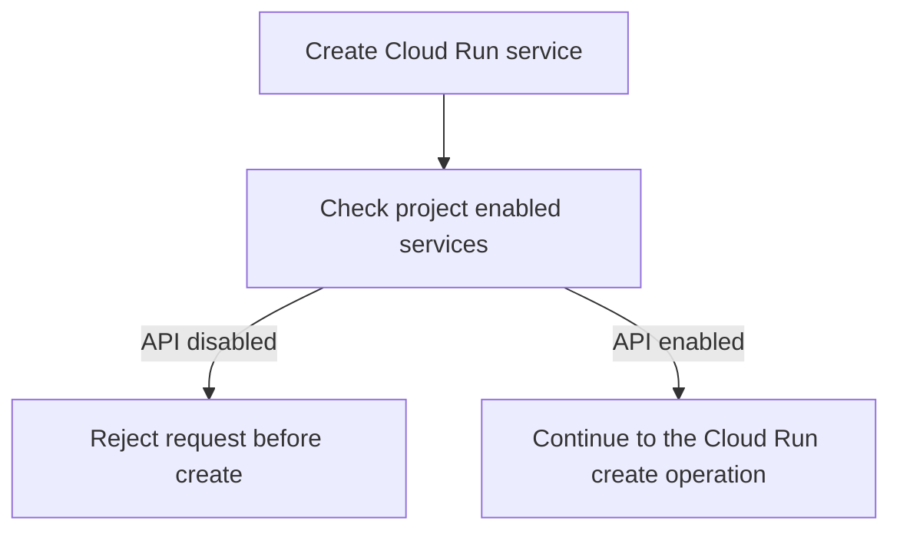
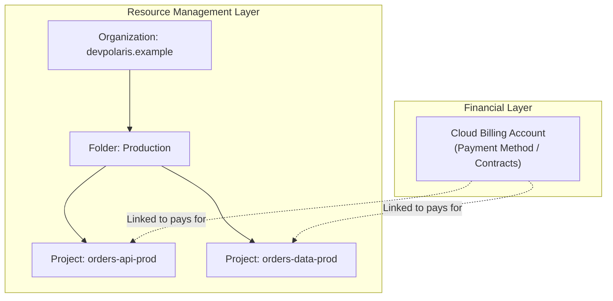

## Table of Contents

1. [Logical Boundaries and App Jobs](#logical-boundaries-and-app-jobs)
2. [The Project-Centric Control Plane](#the-project-centric-control-plane)
3. [API Enablement and Service Gates](#api-enablement-and-service-gates)
4. [Logical to Physical Resources](#logical-to-physical-resources)
5. [Decoupled Billing Architecture](#decoupled-billing-architecture)
6. [Putting It All Together](#putting-it-all-together)
7. [What's Next](#whats-next)

## Logical Boundaries and App Jobs

When you build and run an application on your own laptop, everything is simple because all your code, database files, and network settings share the exact same physical machine. Your database connects directly to a local address, your files are saved to your local hard drive, and nobody else can access your running application unless you explicitly let them. However, when you move your application to the cloud, you are deploying your code to a massive, shared network of physical datacenters cabled across the globe. To keep your application safe, organized, and running efficiently in this shared environment, you need a way to rebuild those secure local boundaries.

*The project is the workspace where cloud resources stand together.*

To recreate the isolation and security of your local laptop, cloud providers construct logical containers to segregate your workloads from other tenants. If you are familiar with Amazon Web Services (AWS), your primary security and operational container is the AWS account, which acts as a standalone sandbox containing its own networks, credentials, and bills. If you are familiar with Microsoft Azure, your hierarchy begins at the billing subscription, which is further divided into resource groups to organize deployments. In Google Cloud Platform (GCP), the primary logical container for almost every resource is the project.

Instead of treating compute servers, databases, and billing as separate entities that you loosely link together, GCP forces you to stand inside a project for almost every action you take. This project-centric approach simplifies resource grouping, but it requires you to understand exactly how this project boundary isolates your workloads, governs your application traffic, and separates your resource ownership from financial liability.

## The Project-Centric Control Plane

A Google Cloud project is the absolute logical workspace for all infrastructure resources. Within a project, you deploy virtual machines, launch managed databases, create storage buckets, write secrets, and attach workload identities. The project serves as the fundamental boundary for identity and access management permissions, API configuration, usage quotas, and administrative logging.

Unlike Azure, where resources can span multiple subscriptions or belong to separate, nested resource groups within a subscription, a GCP resource must belong to exactly one project. This strict containment simplifies ownership and cleanup. If a development team no longer needs an experimental system, deleting the project automatically cascades down to destroy every virtual machine, database instance, and network route housed within it, preventing orphaned resources from silently running up charges.

The transition from other cloud environments is straightforward because the underlying goals remain the same. The following table provides a quick mapping to orient your mental model:

| Concept Role | AWS Equivalent | Azure Equivalent | GCP Equivalent |
| :--- | :--- | :--- | :--- |
| Primary Workspace | AWS Account | Azure Subscription | GCP Project |
| Grouping Container | AWS Account | Azure Resource Group | GCP Project and Labels |
| Physical Geography | AWS Region | Azure Region | GCP Region |
| Workload Principal | IAM Role / Instance Profile | Managed Identity | Service Account |
| Resource Path | Amazon Resource Name (ARN) | Azure Resource ID | GCP Resource Name |

Although this table provides a useful bridge, do not treat these equivalents as identical. A GCP project is more granular than a typical AWS account and is used more frequently to segregate environments, such as separating development, staging, and production workloads into separate project sandboxes.

## API Enablement and Service Gates

The most significant operational gotcha for developers new to Google Cloud is the concept of API enablement. In most cloud environments, once you have administrative permissions, you can often create any resource the cloud provider offers. In GCP, many managed services must first be enabled for the specific project. Before a user, service account, or deployment tool can create a Cloud Run service, Cloud SQL instance, Secret Manager secret, or other managed resource, the matching service API must be active in that project.

*Disabled APIs stop the request before infrastructure changes begin.*

Google documents this through Service Usage. The enabled services list for a project is a registry of which Google APIs are active for that project. When a tool like the Google Cloud SDK or Terraform attempts to create a serverless runtime or database instance, Google checks whether the service is enabled before the resource operation can proceed.

If the API is disabled, the request fails before the requested resource is created. The exact error text depends on the API and tool, but the beginner lesson is stable: project permissions are not enough if the service itself has not been enabled.

API enablement serves as a critical security gate. By keeping unnecessary APIs disabled, you minimize the project's exposure to accidental resource creation, limit the permissions that a compromised credential could exploit, and keep your resource inventory highly predictable.

## Logical to Physical Resources

Resources are the physical or logical objects that Google Cloud manages on your behalf. These include serverless containers, relational database engines, object storage buckets, and cryptographic secrets. To operate safely, you must understand that GCP resources carry distinct geographical scopes that dictate their physical distribution, latency characteristics, and failure domains:

*   **Zonal Resources**: These run within a single physical datacenter building inside a region. If that building experiences a power grid failure, the resource becomes unavailable. Individual virtual machine instances and persistent disks are zonal resources.
*   **Regional Resources**: These belong to a single region and are designed around that region's zones. The exact availability and replication behavior depends on the product and configuration. A Cloud Run service is regional, while a Cloud SQL instance needs a regional high availability configuration before you should describe it as replicated across zones.
*   **Global Resources**: These are logical structures that are not tied to a single geographic area. They are managed by a globally distributed control plane, making them resilient to regional network partitions. Examples include projects, folders, organization-level IAM policies, and VPC networks.

Every modern Google API resource is identified by a structured resource name. This name acts as the precise coordinate that the control plane uses to query or modify the resource. For example, a Cloud Run service name includes its project, location, and service name:

`projects/devpolaris-orders-prod/locations/us-central1/services/orders-api`

By using explicit resource paths instead of loose human-chosen names, you eliminate ambiguity during automated deployments and security reviews.

## Decoupled Billing Architecture

A critical architectural distinction in GCP is the decoupling of resource management from billing liability. In AWS, billing is bound directly to the AWS account itself. In GCP, project management and financial management are treated as two entirely separate logical layers.

A Cloud Billing account defines who pays for cloud usage. It is configured with a payment method, corporate billing details, and tax agreements. A project, on the other hand, is purely a container for resources and APIs. For a project to run any paid services, it must be explicitly linked to an active Cloud Billing account.

This decoupling allows organizations to manage complex multi-project topologies with ease. A large company can link dozens of separate application projects (such as staging, testing, and production environments) to a single, centralized corporate billing account. Alternatively, they can link distinct projects to separate billing accounts to keep different departmental budgets isolated.

If a project's link to its billing account is severed or disabled, paid services can stop running and some resources can eventually become unrecoverable. Treat disabled billing as a serious production incident, not a harmless pause button. Re-establishing billing can restore access in some cases, but Google Cloud documentation is careful to warn that stopped or removed resources are not always recoverable.

## Putting It All Together

Operating securely and efficiently in Google Cloud requires you to shift from accidental setups to deliberate project boundaries. Instead of memorizing service catalogs, focus on how GCP structures the operational sandboxes where your applications run.

*   **The Project**: Serves as your primary logical workspace, containing all enabled APIs, resources, permissions, and logs.
*   **API Enablement**: Acts as a project-level service gate. Permissions and billing still matter, but the service API must be enabled before the project can use that product.
*   **Resource Scopes**: Define whether a resource belongs to a zone, a region, or a global control plane. The product documentation tells you what availability behavior each scope actually provides.
*   **Billing Decoupling**: Separates the financial payment layer from the logical project structure, while still making disabled billing dangerous for running services and stored resources.

By anchoring your mental model around projects and edge-validated APIs, you create a stable foundation. You can now determine exactly where a workload is standing, who is paying for its runtime, and how to verify that its control-plane paths are open.

## What's Next

Now that we have established the GCP project-centric mental model, our next step is to choose the physical and logical boundaries where our production workloads will live. We need to decide how to structure projects under a corporate hierarchy, how billing links are managed across teams, and how regions and zones dictate the physical availability of our code.

In the next article, we will examine the structure of **Projects, Billing, and Regions**. We will learn how to design a resilient resource hierarchy using organizations and folders, how quotas limit physical footprint, and how to plan regional placement to achieve low latency and high availability.

*Use this summary as the quick mental checklist before designing or debugging the service.*

---

**References**

- [Google Cloud Resource Hierarchy](https://cloud.google.com/resource-manager/docs/cloud-platform-resource-hierarchy) - Details the logical tree from organization resources down to individual projects and folders.
- [Service Usage Overview](https://cloud.google.com/service-usage/docs/overview) - Explains API enablement and project-level service activation.
- [Enabled Services](https://cloud.google.com/service-usage/docs/enabled-service) - Describes how projects track enabled Google Cloud services.
- [Google API Resource Names](https://cloud.google.com/apis/design/resource_names) - Defines modern resource name patterns and why APIs expose a `name` field.
- [Cloud Billing Concepts](https://cloud.google.com/billing/docs/concepts) - Focuses on the relationship between billing accounts, project linkages, and financial boundaries.
- [Global, Regional, and Zonal Resources](https://cloud.google.com/compute/docs/regions-zones/global-regional-zonal-resources) - Outlines physical scope behaviors and failure domains across GCP regions.
