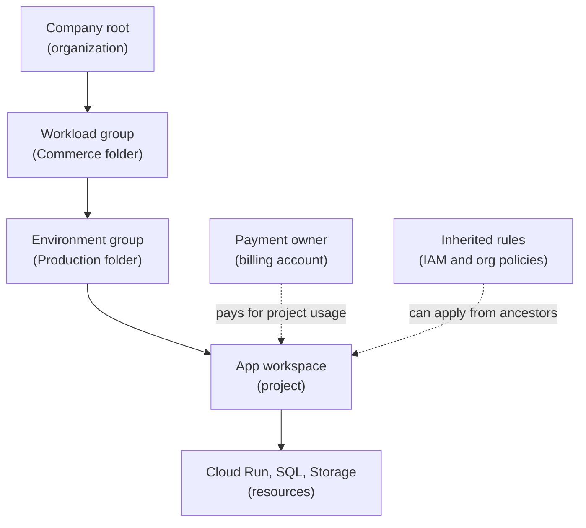

## Table of Contents

1. [The Project Is Not The Whole Company](#the-project-is-not-the-whole-company)
2. [If You Know AWS Or Azure](#if-you-know-aws-or-azure)
3. [The Orders API Needs A Production Home](#the-orders-api-needs-a-production-home)
4. [Organizations Are The Company-Level Root](#organizations-are-the-company-level-root)
5. [Folders Group Projects For Ownership And Policy](#folders-group-projects-for-ownership-and-policy)
6. [Projects Are Where App Resources Live](#projects-are-where-app-resources-live)
7. [Billing Accounts Pay For Project Usage](#billing-accounts-pay-for-project-usage)
8. [APIs And Quotas Are Project Conversations](#apis-and-quotas-are-project-conversations)
9. [IAM Can Be Granted At Several Levels](#iam-can-be-granted-at-several-levels)
10. [A Practical Project Review](#a-practical-project-review)
11. [Failure Modes And First Checks](#failure-modes-and-first-checks)

## The Project Is Not The Whole Company

A single GCP project can feel like the whole cloud when you are learning.
You open the console, pick a project, create a Cloud Run service, and
see logs for that service. For one app, that is already a lot.

But a real company rarely has one project forever. It has development
projects, staging projects, production projects, shared networking
projects, data projects, sandbox projects, and sometimes old projects
that nobody wants to touch because nobody is sure what they do.

GCP needs a way to organize those projects. It also needs a way to
attach policies, permissions, and billing. That is the job of the
resource hierarchy.

The beginner version has four important shapes:

| Shape | Plain meaning |
|---|---|
| Organization | The company-level home when the company uses Google Cloud with a managed identity domain |
| Folder | A grouping layer for projects, often by team, environment, or platform area |
| Project | The app workspace where resources, APIs, IAM, quotas, and logs live |
| Billing account | The payment owner connected to one or more projects |

This article keeps `devpolaris-orders-api` as the thread. The app needs
a production project, but the team also needs to understand where that
project sits and who pays for it.

## If You Know AWS Or Azure

AWS and Azure can help you get oriented, but the shapes do not line up
perfectly.

In AWS, you may think first about accounts inside AWS Organizations. In
Azure, you may think about a tenant, subscriptions, and resource groups.
In GCP, you usually work daily inside projects, while organization and
folders sit above those projects.

Use the comparison to get oriented, then let GCP's hierarchy stand on
its own:

| Concept from another cloud | GCP concept to compare first | Careful difference |
|---|---|---|
| AWS Organizations root | Organization | GCP organization is tied to Google Workspace or Cloud Identity when present |
| AWS account | Project | Project is the base workspace for services, resources, APIs, and IAM |
| Azure subscription | Project plus billing account | Project holds resources, billing account pays |
| Azure resource group | Project plus labels | GCP has no identical universal resource group container |
| AWS organizational unit | Folder | Folders group projects and can carry inherited policies |
| Azure management group | Folder or organization policy layer | GCP folders can group projects for policy and access |

The portable lesson is that production resources need a deliberate
home. In GCP, that means a project with a clear folder, an attached
billing account, and inherited policies the team understands.

## The Orders API Needs A Production Home

The DevPolaris team wants `devpolaris-orders-api` to run on GCP. The
first production shape might be:

```text
project id: devpolaris-orders-prod
folder: Production / Commerce
billing account: DevPolaris Production Billing
primary region: us-central1
main runtime: Cloud Run
main database: Cloud SQL
main object store: Cloud Storage
```

That small record answers practical questions before anyone touches the
console. Developers know the deploy target. Finance knows the payment
owner. Platform engineers know where inherited policies may come from.
Incident responders know where to start looking for logs.

The hierarchy might look like this:



Read the solid path as ownership and placement. Read the dotted lines as
supporting rules. Billing pays. Policies can be inherited. Resources
still live inside the project.

## Organizations Are The Company-Level Root

An organization is the top-level resource for a company when the company
has Google Cloud connected to Google Workspace or Cloud Identity. It is
the root of the managed hierarchy.

For a beginner, the organization answers company-level questions:

- Which company owns these projects?
- Where can central policies be attached?
- Where can broad IAM inheritance start?
- Where can folders and projects be organized?

You may not touch the organization every day as an app developer. That
is normal. A platform or cloud administration team may manage the top of
the hierarchy. Still, it helps to know the organization exists because
some permissions and policies may come from above your project.

For example, the orders team might wonder why it cannot create public
storage buckets in production. The reason may not be a setting on the
bucket itself. It may be an organization policy inherited from the
organization or folder.

That is why "I am project owner" does not always mean "I can do
anything." Higher-level policy can still shape what is allowed.

## Folders Group Projects For Ownership And Policy

Folders are grouping nodes under the organization. A folder can contain
projects and other folders. Teams use folders to make the project tree
match how the company wants to manage work.

A company might group projects by environment:

```text
organization
  -> production
     -> devpolaris-orders-prod
     -> devpolaris-payments-prod
  -> non-production
     -> devpolaris-orders-staging
     -> devpolaris-orders-dev
```

Another company might group by product first:

```text
organization
  -> commerce
     -> production
        -> devpolaris-orders-prod
     -> non-production
        -> devpolaris-orders-staging
```

Neither tree is automatically best. The right folder shape depends on
how the company manages ownership, policy, access, and cost review.

Folders can carry inherited rules. If a production folder has stricter
policy, projects under that folder may inherit those rules. If a
commerce folder grants a read-only group access to all commerce
projects, the orders project may inherit that access.

That can be helpful. It can also be confusing if nobody knows where a
permission came from. When access surprises you, inspect the project and
its ancestors.

## Projects Are Where App Resources Live

Projects are the base-level workspace for most app work. Cloud Run
services, Cloud SQL instances, Cloud Storage buckets, service accounts,
logs, metrics, enabled services, and quotas are all project-centered
conversations.

For `devpolaris-orders-api`, a production project gives the team a
clear operating boundary:

```text
project id: devpolaris-orders-prod
resources:
  Cloud Run service for the API
  Cloud SQL instance for orders
  Cloud Storage bucket for receipts
  Secret Manager secrets for private settings
  Artifact Registry repository for images
  Cloud Logging and Cloud Monitoring signals
```

This does not mean every company uses one project per app per
environment. Some teams group several small services in one project.
Some separate projects by environment. Some use shared platform projects
for networking or artifacts. The key is that the choice should be
intentional and written down.

Projects also make deletion serious. If a project is shut down, the
resources inside it are affected. Treat a project like a real operating
boundary, not a temporary scratch folder.

Before creating production resources, ask:

- Is this the correct project?
- Is this project intended for production?
- Is billing attached?
- Are the needed APIs enabled?
- Are labels required?
- Who can delete or modify resources here?

Those questions sound basic because they are. They prevent expensive
mistakes.

## Billing Accounts Pay For Project Usage

A billing account is the payment owner. A project is linked to a billing
account so usage can be charged. One billing account can pay for many
projects.

This split is easy to miss. The project is where the app lives. The
billing account is how usage gets paid for. If billing is not linked or
is unavailable, resource creation or usage may fail depending on the
service and account state.

For `devpolaris-orders-prod`, the review might say:

```text
project: devpolaris-orders-prod
billing account: DevPolaris Production Billing
budget: orders production monthly budget
labels required: team=orders, service=orders-api, env=prod
```

Billing affects engineering because Cloud Run instances, Cloud SQL
sizing, logging volume, storage retention, and network traffic are all
design choices. If the bill grows and no labels exist, the team may not
know which service caused it.

Good project structure and labels make cost questions easier:

| Cost question | Helpful setup |
|---|---|
| Which environment spent this money? | Separate projects or consistent `env` labels |
| Which team owns this service? | `team=orders` label and clear folder ownership |
| Which resource grew unexpectedly? | Billing reports grouped by project and label |
| Who gets budget alerts? | Budget tied to the right billing account and owner |

Make cost visible enough that teams can make good choices without making
developers afraid to use the platform.

## APIs And Quotas Are Project Conversations

GCP projects do more than hold resources. They also hold enabled
services and quota usage.

Most Google Cloud services need to be enabled in the project before you
use them. That is why a new production project can feel empty even if
you have the right IAM role. The Cloud Run API, Artifact Registry API,
Secret Manager API, Cloud SQL Admin API, and other service doors may
need to be enabled.

Quotas are also commonly project-centered or region-centered. A quota is
a limit on how much of something you can use. Quotas protect platforms
from accidental or unsafe growth, but they can surprise a team during a
new rollout.

For example:

```text
project: devpolaris-orders-prod
operation: deploy new Cloud Run service
result: service API disabled
first check: enabled services for the project
```

Or:

```text
project: devpolaris-orders-prod
region: us-central1
operation: scale backend during traffic spike
result: quota limit reached
first check: quota page for the project and region
```

Those failures come from project setup rather than app code. That
distinction keeps debugging focused.

## IAM Can Be Granted At Several Levels

IAM can be attached at different levels of the hierarchy. A principal
may receive a role on an organization, folder, project, or specific
resource. Lower resources can inherit permissions from ancestors.

For beginners, this means two things:

1. A user may have access because of a folder or organization role, even
   if nothing obvious appears on the resource itself.
2. A user may be blocked by higher-level policy, even if the project
   looks permissive.

For `devpolaris-orders-api`, a clean model might be:

```text
folder: production
  platform team can inspect production projects

project: devpolaris-orders-prod
  orders deployer group can deploy Cloud Run
  orders reader group can view logs and metrics
  CI service account can deploy the service

resource: Secret Manager secret
  runtime service account can read only needed secrets
```

That layered approach is common. Broad read access may be inherited.
Specific deploy access may sit on the project. Runtime secret access may
sit on one secret.

The dangerous shortcut is granting broad roles at the project because it
is faster. That may solve today's deploy and create tomorrow's incident.
When a permission change feels too large, ask whether the role should be
granted closer to the specific resource.

## A Practical Project Review

Before creating the production project for the orders API, the team
should be able to fill out a small review record.

```text
project id:
  devpolaris-orders-prod

parent:
  organization/devpolaris
  folder/commerce/production

billing:
  DevPolaris Production Billing

purpose:
  production runtime and data resources for devpolaris-orders-api

primary services:
  Cloud Run, Cloud SQL, Cloud Storage, Secret Manager,
  Artifact Registry, Cloud Logging, Cloud Monitoring

required labels:
  team=orders
  service=orders-api
  env=prod
  cost_center=commerce

initial owners:
  platform administrators
  orders production deployer group
  orders production reader group
```

This record is a debugging shortcut. When a deploy fails, a cost spike
appears, or a user asks who owns a resource, it gives the team a place
to start.

Small records like this also help new engineers. Instead of asking them
to understand the whole company hierarchy on day one, you show them the
project they will actually touch and the parent boxes that matter.

## Failure Modes And First Checks

The most common hierarchy problems have a boring shape. Boring is good.
It means you can build a checklist.

The deploy command targets the wrong project:

```text
current project: devpolaris-orders-staging
intended project: devpolaris-orders-prod
operation: deploy production Cloud Run image
risk: staging receives a production candidate
first check: gcloud config project and CI deploy target
```

The production project cannot create the service:

```text
project: devpolaris-orders-prod
operation: create Cloud Run service
error: billing account is not linked or service API is disabled
first check: billing link and enabled services
```

A developer sees resources they did not expect:

```text
user: maya@devpolaris.example
resource: production logs
source: inherited folder role
first check: IAM policy on project and ancestor folders
```

The cost report cannot identify the owner:

```text
resource: cloud-run service
labels: missing
symptom: cost grouped under project but not team or service
first check: required label policy and deployment templates
```

The project looks correct, but a policy blocks public access:

```text
resource: storage bucket
operation: make object public
result: denied by organization policy
first check: inherited organization and folder policies
```

The fix direction depends on the failed box. Wrong project means fix the
target. Disabled API means enable the service in the right project.
Missing billing means link the project to the right billing account.
Unexpected access means inspect inherited IAM. Blocked configuration
means inspect organization policies.

That is the value of the hierarchy: it turns a confusing cloud problem
into a short list of places to inspect.

---

**References**

- [Resource hierarchy](https://cloud.google.com/resource-manager/docs/cloud-platform-resource-hierarchy) - Google explains organizations, folders, projects, inheritance, and resources.
- [Creating and managing projects](https://cloud.google.com/resource-manager/docs/creating-managing-projects) - Google explains project IDs, project numbers, project creation, and project lifecycle.
- [Create and manage folders](https://cloud.google.com/resource-manager/docs/creating-managing-folders) - Google explains folders as grouping nodes for projects and policy.
- [Billing reports by project hierarchy](https://cloud.google.com/billing/docs/how-to/reports-project-hierarchy) - Google explains how project hierarchy helps analyze cloud costs.
- [Enabled services](https://cloud.google.com/service-usage/docs/enabled-service) - Google explains how services and APIs are enabled for projects.
