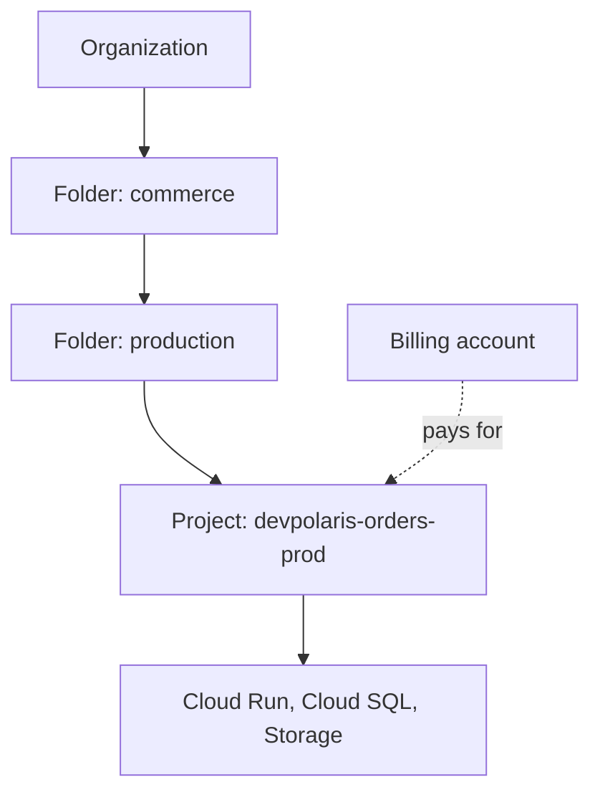

## Table of Contents

1. [The Problem](#the-problem)
2. [Organizations](#organizations)
3. [Folders](#folders)
4. [Projects](#projects)
5. [Billing Accounts](#billing-accounts)
6. [APIs And Quotas](#apis-and-quotas)
7. [Regions](#regions)
8. [Zones](#zones)
9. [Global, Regional, And Zonal](#global-regional-and-zonal)
10. [Placement Review](#placement-review)
11. [Putting It All Together](#putting-it-all-together)
12. [What's Next](#whats-next)

## The Problem

The previous article gave the Orders API a GCP mental model: project, APIs, resources, callers, billing, and evidence. Now the team needs a real home for production.

A quick test already exists. It worked well enough to become tempting.

- The Cloud Run service was deployed into a personal learning project.
- The database experiment lives in a different project because someone had the Cloud SQL API enabled there.
- Billing points at a shared trial account instead of the production cost owner.
- The app runs in `us-central1`, but a new bucket was created in a multi-region location by habit.
- A policy inherited from a folder blocks a production setting, but the engineer only checks the project page.

The placement question is:

> Where should this GCP workload live, and what boundary am I creating?

In GCP, that answer usually includes organization, folder, project, billing account, enabled APIs, quota, region, and zone shape. If any of those are accidental, the workload is already drifting.

## Organizations

An organization resource is the company-level root of the Google Cloud resource hierarchy when a company uses Google Workspace or Cloud Identity. It is where company-wide IAM and organization policies can start.

For a beginner, the organization is the reason a project may not be as independent as it looks. A project can look empty, but inherited policy from above can still control what can be created, which regions are allowed, or who can grant access.

For DevPolaris, the organization record is simple:

```text
organization: devpolaris.example
purpose: company-level root for projects, folders, IAM, and policy
```

Not every learning account has an organization resource. A company environment usually does. The habit is to check whether the project belongs to an organization before assuming the project is the top of the world.

## Folders

Folders group projects under an organization. They can represent teams, environments, business units, shared platforms, or product areas. Folders can also carry IAM and organization policies that child projects inherit.

The useful mental model is a family tree:



The folder is not where the Cloud Run service runs. It is a grouping and policy layer above the project. If a production folder requires labels or blocks some public access, a project inside that folder inherits the rule.

That makes folders useful and easy to forget. When a deployment fails for a policy reason, the cause may be above the project.

## Projects

A project is where most app resources live. It is the everyday target for deployment, IAM bindings, quotas, logs, enabled APIs, and billing linkage.

For the Orders API, a clean production project record might be:

```text
project id: devpolaris-orders-prod
display name: DevPolaris Orders Production
folder: commerce/production
primary region: us-central1
main runtime: Cloud Run
main database: Cloud SQL
main object store: Cloud Storage
```

The project is not the same thing as an Azure resource group. It is more central. If a team wants separate lifecycle, access, cost, quota, and blast-radius boundaries for dev, staging, and production, separate projects are often the first conversation.

That does not mean one project per tiny resource. It means the project should match an operating boundary someone can explain.

## Billing Accounts

A Cloud Billing account defines who pays for a set of resources. A billing account can be linked to one or more projects, and project usage is charged to the linked billing account.

This creates a clean split:

| Boundary | Plain job |
| --- | --- |
| Project | Owns resources, APIs, IAM bindings, quotas, and logs. |
| Billing account | Pays for usage from one or more linked projects. |

If billing is disabled for a project, many paid services cannot keep working normally. If the wrong billing account is linked, cost review goes to the wrong owner.

For production, the team should be able to answer:

```text
Which project owns the resource?
Which billing account pays for that project?
Who can change that billing link?
Which labels make cost review possible later?
```

Billing is part of the resource home.

## APIs And Quotas

Projects also control service readiness. Many services must be enabled for a project before use. A project can have Cloud Run enabled and Cloud SQL disabled. Another project can have the opposite. That is why "it works in dev" may only prove that dev has a different API set.

Quotas are also project conversations. Some quotas are project-wide. Some are regional. Some are service-specific. A production deployment can fail because the selected project and region do not have enough quota even when the same action works elsewhere.

For the Orders API, the project review should include:

| Need | Project check |
| --- | --- |
| Runtime | Cloud Run API enabled. |
| Database | Cloud SQL Admin API enabled. |
| Images | Artifact Registry API enabled and repository location chosen. |
| Secrets | Secret Manager API enabled. |
| Evidence | Cloud Logging and Cloud Monitoring available. |
| Capacity | Relevant quota checked for the chosen region. |

The non-obvious habit is to treat API enablement as part of setup, not as an error message to solve later.

## Regions

A region is a geographic area where many GCP resources can run or store data. Region choice affects latency, service availability, data placement, cost, and recovery design.

The first production version of `devpolaris-orders-api` might choose:

```text
primary region: us-central1
Cloud Run service: us-central1
Cloud SQL instance: us-central1
Artifact Registry repository: us-central1
receipt bucket: reviewed location for the data promise
```

Keeping the app and database in the same region is a simple first habit. It reduces avoidable latency and makes incidents easier to reason about. Splitting them can be valid, but it should be a design decision, not the result of a remembered console default.

Region choice is also not project choice. A project can contain resources in many locations. The project name tells you the app and environment. It does not prove where every resource runs.

## Zones

A zone is an isolated deployment area inside a region. Zones matter most for zonal resources such as some Compute Engine resources and disks. Regional services can hide some of that placement detail, but failure domains still matter.

The beginner mistake is to treat "same region" as "resilient enough." If all VM-shaped pieces are in one zone, one zonal failure can hurt the whole layer. If a database has high availability configured across zones, that choice has cost and recovery implications.

Use zones to ask:

| Question | Why it matters |
| --- | --- |
| Is this resource zonal, regional, or global? | Tells you what can fail together. |
| Are critical copies spread across zones when needed? | Reduces one-zone blast radius. |
| Does the app depend on a zonal disk or instance? | Reveals hidden single points of failure. |
| Does the managed service handle zone placement? | Changes what the team must configure directly. |

Zones are not decoration in a resource name. They are failure boundaries.

## Global, Regional, And Zonal

GCP resources have different location scopes. Some are global. Some are regional. Some are zonal. Some data services offer multi-region or dual-region choices.

| Scope | Plain meaning | Example habit |
| --- | --- | --- |
| Global | The resource is not tied to one region or zone. | Check whether global does or does not mean data lives everywhere. |
| Regional | The resource belongs to one region. | Keep app and nearby dependencies close unless there is a reason. |
| Zonal | The resource belongs to one zone. | Avoid putting every critical copy in one zone. |
| Multi-region or dual-region | Data is placed across more than one region pattern. | Match data placement to latency, compliance, cost, and recovery needs. |

The name alone does not always tell the whole story. A resource can be global from an API perspective while the data or runtime behavior still has service-specific location rules. For important systems, read the service's own location model.

## Placement Review

Before creating production resources, write a small placement review:

| Decision | Orders API answer |
| --- | --- |
| Organization | DevPolaris organization, if present. |
| Folder | `commerce/production`. |
| Project | `devpolaris-orders-prod`. |
| Billing account | DevPolaris Production Billing. |
| Enabled APIs | Cloud Run, Cloud SQL, Cloud Storage, Secret Manager, Artifact Registry, Logging, Monitoring. |
| Primary region | `us-central1` for first production shape. |
| Zone shape | Use managed regional services where possible; spread zonal resources deliberately. |
| Labels | `service=orders-api`, `env=prod`, `team=orders`, `cost_center=commerce`. |

This review is small enough to do before a deploy. It saves hours later because the team can tell whether a resource is in the wrong project, paid by the wrong account, blocked by inherited policy, missing an API, or placed in the wrong location.

## Putting It All Together

Return to the quick test from the opener.

- The personal learning project became a production project decision.
- The database task failure became an API enablement check.
- The shared trial billing account became a billing boundary problem.
- The inherited policy surprise became an organization and folder question.
- The mixed locations became a region and zone review.

GCP placement is not one setting. It is the set of boundaries that decide where the workload lives, who pays, what services can be used, what policies apply, where resources run, and what can fail together.

## What's Next

The next article zooms in on exact resource identity. Once a workload has a project and location plan, the team still needs to know which Cloud Run service, bucket, database, service account, label set, or resource path it is actually changing.

---

**References**

- [Google Cloud resource hierarchy](https://cloud.google.com/resource-manager/docs/cloud-platform-resource-hierarchy)
- [Create and manage folders](https://cloud.google.com/resource-manager/docs/creating-managing-folders)
- [Enabled services](https://cloud.google.com/service-usage/docs/enabled-service)
- [View projects linked to Cloud Billing accounts](https://cloud.google.com/billing/docs/how-to/view-linked)
- [Regions and zones](https://cloud.google.com/compute/docs/regions-zones/)
- [Global, regional, and zonal resources](https://cloud.google.com/compute/docs/regions-zones/global-regional-zonal-resources)
