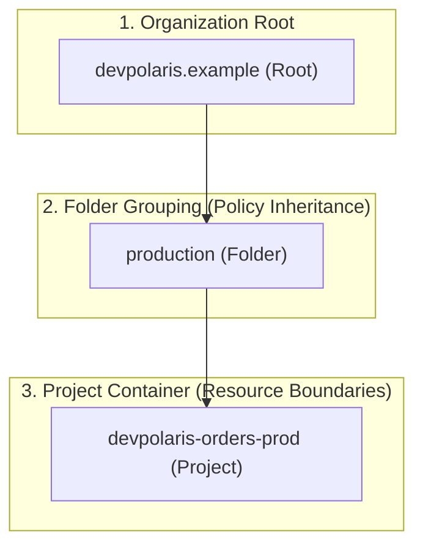

## Table of Contents

1. [Logical Hierarchy and Policy Inheritance](#logical-hierarchy-and-policy-inheritance)
2. [Decoupled Financial Controls](#decoupled-financial-controls)
3. [Resource Quotas and Limits](#resource-quotas-and-limits)
4. [Physical Geography: Regions and Latency](#physical-geography-regions-and-latency)
5. [Zonal Boundaries and Physical Isolation](#zonal-boundaries-and-physical-isolation)
6. [Putting It All Together](#putting-it-all-together)
7. [What's Next](#whats-next)

## Logical Hierarchy and Policy Inheritance

The GCP resource hierarchy is the control-plane structure that places projects under folders and organizations so policy, ownership, and administration flow predictably. When you first start building in the cloud, launching a few virtual machines or storage buckets inside a single personal project is simple. But as your team grows and you begin managing dozens of separate microservices, databases, and environments (like development, staging, and production), casual placement makes ownership, security, and cleanup harder to review. To prevent this, Google Cloud organizes resources into a structured hierarchy that can mirror teams, environments, or compliance boundaries.

*A blocked deployment may be obeying a parent policy above the project.*

GCP structures its control plane as a strict hierarchical tree. This design ensures that security configurations, access rules, and cost parameters flow predictably from top-level corporate nodes down to individual application resources.

The resource hierarchy is comprised of three primary logical layers:

*   **The Organization**: This represents your entire company (e.g., `devpolaris.example`) and is linked directly to a Google Workspace or Cloud Identity directory. The organization node serves as the absolute root of the hierarchy. It is the place where company-wide security rules, corporate IAM roles, and centralized organizational policies are established.
*   **Folders**: These are administrative groupings that sit between the organization and individual projects. Folders can be nested up to four levels deep, allowing you to replicate your company's organizational chart or operational environments (such as grouping all production environments under a dedicated `production` folder).
*   **Projects**: These sit at the bottom of the logical hierarchy, serving as the immediate containers for all cloud resources.

The critical under-the-hood mechanism governing this hierarchy is policy inheritance. Every folder and project inherits all IAM permissions and Organization Policies configured at the layers above it.

For example, if your security team configures an organization-wide policy that blocks the creation of public-IP virtual machines, this rule propagates down through every single folder to every project in your organization. Understanding this inheritance is crucial. When a deployment tool fails to launch a public resource, the blocking constraint is often not within the project itself, but is inherited from an organization policy applied high above in the parent folder.

## Decoupled Financial Controls

A Cloud Billing Account is the administrative payment object that pays for one or more projects. In Google Cloud, resource management and financial accountability are decoupled. A project represents the logical boundary for deploying resources, enabling APIs, and configuring security. However, a project has no native capacity to pay for the resources it houses. To cover these costs, a project must be explicitly linked to a Cloud Billing Account.

*A project can hold resources only when it is linked to a billing account with the right role.*

A Cloud Billing Account is a standalone administrative resource that manages payment profiles, tax configurations, and invoicing agreements. It sits completely outside the resource hierarchy. This decoupling enables highly flexible financial topologies:

*   **Centralized Corporate Billing**: A single corporate billing account can be linked to dozens of separate projects spanning different departments and folders. This allows finance teams to receive a single consolidated invoice while still tracking individual project spend.
*   **Departmental Cost Segregation**: Projects can be linked to different billing accounts to keep cost liabilities completely separated, ensuring that billing disputes or payment adjustments in one department do not affect adjacent workloads.

To maintain a secure financial boundary, GCP enforces strict IAM segregation for billing operations. The permission to link a project to a billing account is not bundled with project ownership.

Instead, a developer must be granted the `Billing Account User` role on the specific billing account, alongside administrative roles on the target project, to establish a connection. This prevents unauthorized users from launching expensive paid services or linking corporate projects to personal trial payment methods.

## Resource Quotas and Limits

Quotas are project, region, or service limits that cap how much cloud capacity or API activity a workload can consume. Before you can safely scale workloads in Google Cloud, you must navigate these control-plane boundaries, which Google enforces to prevent accidental resource exhaustion, guard against cost overruns from runaway scripts, and protect physical capacity pools from sudden tenant spikes.

Quotas are managed and enforced across several practical dimensions:

*   **Logical Scope**: Quotas can apply to an entire project, a specific geographical region, or an individual service. For example, a project may have a global quota limiting the total number of VPC networks it can contain, alongside a regional quota limiting the number of CPU cores it can allocate in `us-central1`.
*   **Rate Limits vs. Allocation Quotas**: Rate limits restrict how many API requests you can make per minute (e.g., preventing a misconfigured build script from flooding the Secret Manager API). Allocation quotas restrict the total number of concurrent resources that can exist (e.g., capping the number of regional Cloud SQL instances).
*   **Default Quotas vs. Requested Increases**: Every new project receives a modest set of default quotas. As your resource footprint grows, you must proactively request quota increases through the control plane before triggering deployments.

When you request a resource creation, Google Cloud checks the relevant service quota for the project, region, or service dimension involved. If the requested allocation exceeds the active quota, the control plane blocks the transaction with a quota error. Planning for quota allocations is a mandatory step in production design. A deployment can be configured correctly, yet fail simply because the target project has not requested enough regional CPU, database, address, or API capacity.

## Physical Geography: Regions and Latency

Regions and zones are the location model that decides where compute, storage, and managed service capacity physically run. While projects and folders establish logical boundaries, your application still runs on hardware housed within real datacenters. In GCP, these physical environments are divided into Regions and Zones.

A Region represents a distinct geographic area, such as Council Bluffs, Iowa (`us-central1`), St. Ghislain, Belgium (`europe-west1`), or Frankfurt, Germany (`europe-west3`). Each region consists of zones that are isolated from one another for availability planning. Choosing the right region for your workload requires balancing three critical engineering constraints:

*   **User Latency**: The physics of networking dictate that packet transit times are limited by the speed of light in fiber optic cables (yielding approximately 1ms of round-trip-time latency per 100km of distance). To minimize application load times, place your compute runtimes in the region physically closest to your primary user base.
*   **Data Sovereignty and Compliance**: Many regulatory frameworks require specific classes of user data to reside within national borders. Selecting regional storage buckets ensures that your database records and files remain physically constrained to compliant geographic areas.
*   **Service Availability and Pricing**: Not every GCP service is available in every region, and pricing varies based on local datacenter operating costs. A service that runs efficiently in `us-central1` may carry a higher hourly rate in `asia-east1`.

A foundational habit for web application design is regional alignment. Keeping your compute runtimes, managed databases, and object storage buckets within the exact same region (such as `us-central1`) eliminates expensive cross-region network transit costs and prevents avoidable multi-region network routing hops from degrading request latencies.

## Zonal Boundaries and Physical Isolation

A zone is the smallest common placement boundary for many GCP resources, such as individual VM instances and Persistent Disks. Within each region, Google provides multiple isolated locations called Zones, typically designated as `us-central1-a`, `us-central1-b`, and `us-central1-c`. A zone maps to one or more physical datacenters equipped with independent power, cooling, and network feeds.

To design resilient architectures, you must distribute your resources across these zonal boundaries. If you run a zonal service (such as Compute Engine virtual machines) and place all your instances within a single zone, a localized power grid failure in that zone's datacenter will take down your entire application. By configuring regional managed services or manually spreading zonal VMs across at least two zones, you ensure that if one physical datacenter experiences an outage, healthy zones can seamlessly absorb the application traffic.

Google Cloud documents zones as named deployment areas inside a region. A zonal resource such as a VM instance belongs to exactly one zone, and a regional design spreads resources across multiple zones or uses a managed regional service.

The important beginner rule is practical rather than hidden: do not place every critical resource in one zone. If you use zonal VMs, create enough instances across zones and put a load balancer in front of them. If you use a managed service, read whether the product is zonal, regional, or global and whether you need to turn on a high availability option.

## Putting It All Together

Designing a production GCP environment means moving from accidental resource placement to deliberate logical and physical boundaries. By applying the structure of the resource hierarchy, you establish security inheritance while laying a resilient physical foundation:

*   **Logical Hierarchy**: Organizations, folders, and projects organize your resources into a manageable tree, enabling predictable security policy inheritance and administrative access control.
*   **Decoupled Billing**: Separates resource management from financial operations, ensuring that link associations are governed by strict IAM roles.
*   **Capacity Quotas**: Enforce control-plane limits at project, regional, and service scopes, protecting your environments from resource exhaustion.
*   **Physical Locations**: Regions align compute and data close to users to minimize latency, while zones isolate physical failure domains inside a region.

By deliberately planning where your projects sit, who pays for them, and how their physical resources are distributed, you eliminate single points of failure before launching a single line of application code.

## What's Next

Now that we have established our logical hierarchy and physical placement strategy, our next step is to control exact resource identity within our projects. We need to define how to uniquely identify and query individual servers, database instances, and storage buckets.

In the next article, we will examine **Resources, Names, and Labels**. We will learn how to construct exact GCP resource paths, how to manage labels for cost allocation and automation, and how tags support conditional security policies.

*Use this summary as the quick mental checklist before designing or debugging the service.*

---

**References**

- [Google Cloud Resource Hierarchy](https://cloud.google.com/resource-manager/docs/cloud-platform-resource-hierarchy) - Explains organization, folder, and project containers.
- [Cloud Billing Resource Management](https://cloud.google.com/billing/docs/how-to/modify-project) - Details permissions and steps required to link and unlink projects to billing accounts.
- [Cloud Quotas Overview](https://cloud.google.com/docs/quotas/overview) - Focuses on rate limits, allocation quotas, and requesting capacity increases.
- [GCP Regions and Zones](https://cloud.google.com/compute/docs/regions-zones/) - Defines geographical regions, zones, and placement behavior.
- [Google Cloud Locations](https://cloud.google.com/about/locations) - Lists current region names, codes, and geography.
