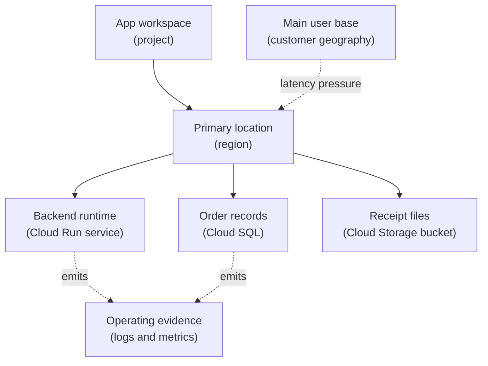

## Table of Contents

1. [Location Is An Engineering Choice](#location-is-an-engineering-choice)
2. [If You Know AWS Or Azure Regions](#if-you-know-aws-or-azure-regions)
3. [The Orders API Chooses A First Region](#the-orders-api-chooses-a-first-region)
4. [Regions Are Geographic Areas](#regions-are-geographic-areas)
5. [Zones Are Failure Areas Inside A Region](#zones-are-failure-areas-inside-a-region)
6. [Global Regional And Zonal Resources Behave Differently](#global-regional-and-zonal-resources-behave-differently)
7. [Location Affects Latency Cost And Recovery](#location-affects-latency-cost-and-recovery)
8. [Do Not Split The App And Database By Accident](#do-not-split-the-app-and-database-by-accident)
9. [A First Location Review](#a-first-location-review)
10. [Failure Modes And First Checks](#failure-modes-and-first-checks)

## Location Is An Engineering Choice

In local development, distance rarely enters the conversation. The app,
terminal, test database, and files are all on one machine or close
enough that you do not think about network travel time.

Cloud systems make location visible. Your app may run in one region.
Your database may live in another region. Your users may be mostly in
North America or Europe. Your logs may be stored in a different location
from your data. Some resources may be global. Some may be tied to one
zone.

That does not make GCP harder for no reason. It gives teams control over
latency, resilience, data placement, and cost. But the control only
helps if the team knows what kind of location each resource uses.

GCP uses regions and zones as common location words. A region is a
geographic area. A zone is an isolated deployment area inside a region.
Some resources are regional. Some are zonal. Some are global. Some data
services have multi-region or dual-region choices.

This article follows `devpolaris-orders-api`, a Node backend moving to
GCP. The first version may run in one region on Cloud Run and use Cloud
SQL plus Cloud Storage. That sounds simple. The location choices still
matter.

> A region is not just where the app lives. It is part of the app's latency, failure, data, and cost story.

## If You Know AWS Or Azure Regions

If you have learned AWS or Azure, the basic idea transfers: cloud
providers divide infrastructure into geographic locations and smaller
failure areas. The details still matter.

This comparison is enough to get started:

| AWS or Azure idea | GCP idea to compare first | What to remember |
|---|---|---|
| AWS Region | GCP region | Same broad idea: geographic area |
| AWS Availability Zone | GCP zone | Same broad idea: isolated area inside a region |
| Azure region | GCP region | Same broad idea, but service location options differ |
| Azure availability zone | GCP zone | Similar failure-area idea |
| AWS global services | GCP global resources | Some GCP resources are global, but many app runtimes and databases are regional or zonal |
| Azure resource group location | No exact GCP match | A GCP project is not located in one region |

The last row is easy to miss. A GCP project is not "in"
`us-central1`. The project can contain resources in many locations.
Location belongs to resources and services, not to the project itself.

That means project names like `devpolaris-orders-prod` tell you the
environment and app boundary. They do not tell you where every resource
runs. You still need to inspect the resource location.

## The Orders API Chooses A First Region

The DevPolaris team wants a simple production version of
`devpolaris-orders-api`. Most customers are in the United States, the
team wants a low-friction first deployment, and the app is not yet
multi-region.

A first location record might look like this:

```text
project: devpolaris-orders-prod
primary region: us-central1
Cloud Run service: us-central1
Cloud SQL instance: us-central1
Cloud Storage receipt bucket: reviewed location, likely us-central1 for first pass
logs and metrics: collected for operating the service
```

This record is not final architecture. It is a first operating choice.
It keeps the app and database close. It makes logs and metrics easier to
reason about. It gives the team one primary location to inspect during a
first incident.

The first map looks like this:



The diagram is deliberately small. It teaches the first question:
where should the service and its data live for the first production
version?

## Regions Are Geographic Areas

A GCP region is an independent geographic area that contains zones.
Region names look like `us-central1`, `europe-west1`, or `asia-east1`.
You choose regions to manage latency, availability, compliance, and
operating simplicity.

For a beginner, the region answers questions like:

- Where will this workload run?
- How close is it to users?
- How close is it to the database?
- Which services are available there?
- What happens if that region has trouble?
- Are there data residency or compliance requirements?

For `devpolaris-orders-api`, `us-central1` might be a reasonable first
region if most users and support workflows are close enough to that
region. If the product later grows in Europe, the team may need a
different design. That later design could involve another region,
different storage placement, replication, or a product-level decision
about latency and recovery.

The important point is that a region choice is not only a dropdown
field. It is a product and operations decision.

## Zones Are Failure Areas Inside A Region

A zone is an isolated deployment area inside a region. Zone names look
like `us-central1-a` or `europe-west1-b`. Zonal resources are tied to a
specific zone.

Compute Engine virtual machines are the easiest example. A VM lives in a
zone. A zonal Persistent Disk must be in a compatible zone to attach to
that VM. If you place a VM in `us-central1-a` and a zonal disk in a
different zone, the design may fail before the app even starts.

Cloud Run is different. You deploy a Cloud Run service to a region, not
to a specific zone in the beginner mental model. GCP manages the
underlying compute placement for that service. That is one reason Cloud
Run is friendly for a first backend module: the team can focus on
regional service behavior before handling VM-level zone placement.

This is the habit:

```text
Cloud Run service:
  think region first

Compute Engine VM:
  think zone first

Regional database or service:
  think region and replication behavior

Global network resource:
  inspect how it connects to regional backends
```

The word "zone" is not advanced. It is the answer to "what fails
together at a smaller scale than a region?"

## Global Regional And Zonal Resources Behave Differently

GCP resources do not all use location in the same way. This is one of
the most important foundation ideas.

Use this table as a first map, not as a replacement for service docs:

| Resource shape | Location habit | Beginner example |
|---|---|---|
| Global resource | Not tied to one region | VPC network, some load balancing pieces, some images |
| Regional resource | Lives in one region | Cloud Run service, regional subnet, many managed service choices |
| Zonal resource | Lives in one zone | Compute Engine VM, zonal Persistent Disk |
| Multi-region or dual-region data | Data placement spans more than one region | Some Cloud Storage bucket location choices |

The confusing part is that "global" does not mean "the app has no
location problem." A global load balancer can route to regional
backends. A global VPC can contain regional subnets. A global resource
can still depend on regional resources to serve real users.

For `devpolaris-orders-api`, that means the team should not stop at:

```text
network: global VPC
```

It should continue:

```text
backend region: us-central1
database region: us-central1
storage location: reviewed
public entry: routes to the intended backend
```

Global, regional, and zonal are scopes. They do not replace design
thinking.

## Location Affects Latency Cost And Recovery

Location affects at least three things: latency, cost, and recovery.

Latency is the time users and services spend waiting on distance and
network path. If the Cloud Run service is in one region and Cloud SQL is
far away in another region, checkout can feel slow even when both
services are healthy.

Cost can change when data crosses locations or when services are placed
in higher-cost configurations. The exact price details change over time,
so do not memorize a random number from an article. Learn the habit:
location choices can affect cost, so inspect pricing and billing reports
when traffic or data crosses boundaries.

Recovery is about what happens when something fails. If every critical
piece sits in one region, a regional problem may affect the whole
service. If the service is spread across regions without a clear data
plan, a failover may be confusing or unsafe.

For a beginner system, one region is often easier to operate than a
half-designed multi-region system. That is not a weakness. It is an
honest first step. The team should know the tradeoff:

| Choice | What you gain | What you give up |
|---|---|---|
| One primary region | Simpler debugging, lower design complexity | Less regional failure independence |
| Multiple zones for zonal resources | Better tolerance of a zone problem | More placement and routing decisions |
| Multi-region design | Higher resilience and closer users when done well | More data, cost, and operational complexity |

The key phrase is "when done well." Multi-region architecture is not a
magic safety button. It is a larger design.

## Do Not Split The App And Database By Accident

One of the easiest beginner mistakes is placing related resources far
apart by accident.

Imagine this setup:

```text
Cloud Run service:
  project: devpolaris-orders-prod
  region: us-central1

Cloud SQL database:
  project: devpolaris-orders-prod
  region: europe-west1
```

Both resources are in the correct project. Both may be healthy. IAM may
be correct. The app may still feel slow because every checkout write
crosses regions.

Another version happens with storage:

```text
receipt upload path:
  API in us-central1
  bucket location chosen without review
  users mostly in one geography
```

This may still work. The question is whether it matches the product and
operations need. If receipts are generated after checkout and downloaded
later, location may matter differently than the order database write
path. You do not need the same answer for every resource. You need an
answer you can explain.

The practical rule is simple: place the app, database, storage, and
users on the same whiteboard before choosing locations. If two connected
resources are far apart, write down why.

## A First Location Review

Before the orders team deploys production resources, it should complete
a small location review.

| Question | Example answer |
|---|---|
| Where are most users? | Mostly United States for first launch |
| Which project owns production? | `devpolaris-orders-prod` |
| What is the primary runtime region? | `us-central1` |
| Where is the database? | Same primary region for first pass |
| Where are receipt files stored? | Reviewed bucket location, aligned with product and data needs |
| Which resources are zonal? | Only VM-shaped resources if used later |
| Which resources are global? | Network resources and some entry-point resources |
| What failure does this design tolerate? | App-level failures and some managed service failures, not full regional outage yet |
| What would trigger a multi-region review? | User geography, recovery target, compliance need, or repeated regional risk |

The last two rows are important. They keep the team honest. A single
region design can be a good first production design if the team knows
what it does and does not protect against.

For early GCP learning, this is the right level. Do not jump into
multi-region data replication before the learner understands project,
region, resource, identity, and observability basics.

## Failure Modes And First Checks

Location bugs often look like app bugs at first.

The API is slow, but CPU is fine:

```text
service: devpolaris-orders-api
runtime: Cloud Run
runtime region: us-central1
database region: europe-west1
symptom: checkout writes are slow
first check: app and database location
```

The fix direction is to review placement. Maybe the database was created
in the wrong region. Maybe the app should move. Maybe the team has a
real multi-region requirement, but that should be a design decision, not
an accident.

A VM cannot attach a disk:

```text
vm zone: us-central1-a
disk zone: us-central1-b
symptom: attach operation fails
first check: zonal resource placement
```

The fix direction is to place compatible zonal resources together or use
a different storage design.

A user-facing endpoint is global, but the backend is unhealthy:

```text
public entry: global
backend: Cloud Run in us-central1
symptom: requests fail from public URL
first check: backend region and health
```

The fix direction is to remember that a global entry point still depends
on real backends in real locations.

A team cannot explain where data lives:

```text
bucket: devpolaris-receipts-prod
location: chosen during quick setup
symptom: compliance review asks for data location
first check: bucket location and data requirements
```

The fix direction is not guessing. Inspect the resource location and
compare it with the data policy the product actually needs.

Location is one of the easiest things to choose quickly and regret
slowly. A short review before creation is cheaper than moving stateful
resources later.

---

**References**

- [Cloud locations](https://cloud.google.com/about/locations) - Google lists regions, zones, and product availability by location.
- [Regions and zones](https://cloud.google.com/compute/docs/regions-zones/) - Google explains regional, zonal, and global Compute Engine resource scope.
- [View available regions and zones](https://cloud.google.com/compute/docs/regions-zones/viewing-regions-zones) - Google shows how to inspect available regions and zones with console or `gcloud`.
- [Cloud Run locations](https://cloud.google.com/run/docs/locations) - Google documents where Cloud Run services can be deployed.
- [Cloud Storage bucket locations](https://cloud.google.com/storage/docs/locations) - Google explains region, dual-region, and multi-region storage location choices.
