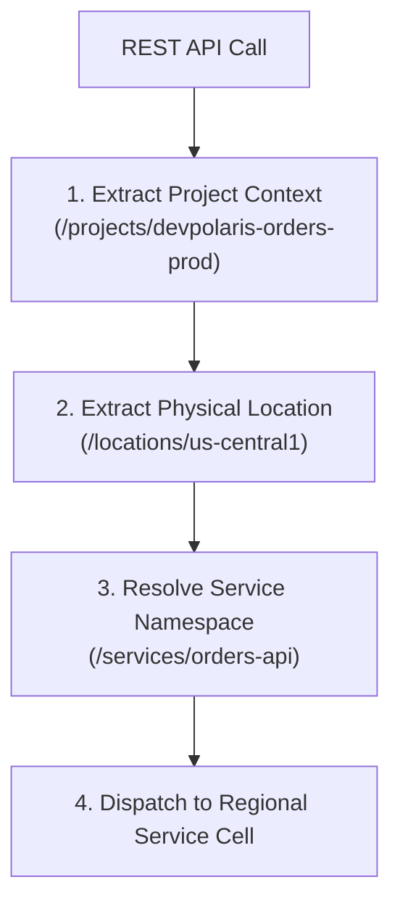
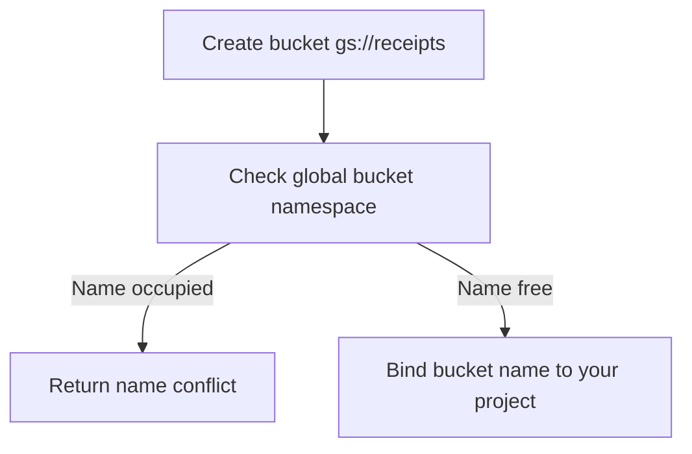
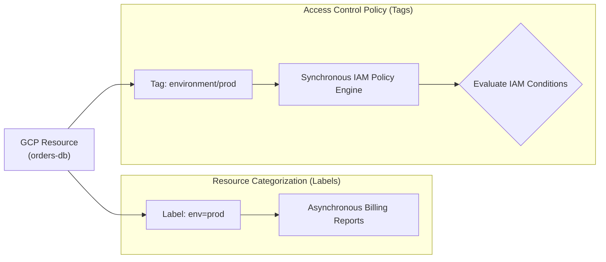

## Table of Contents

1. [Resource Paths and Logical Lineage](#resource-paths-and-logical-lineage)
2. [Global vs. Local Resource Uniqueness](#global-vs-local-resource-uniqueness)
3. [Metadata Classification: Labels](#metadata-classification-labels)
4. [Access Control and Policy Gates: Tags](#access-control-and-policy-gates-tags)
5. [Putting It All Together](#putting-it-all-together)
6. [What's Next](#whats-next)

## Resource Paths and Logical Lineage

When you build systems in the cloud, you quickly accumulate hundreds of virtual objects—like database servers, storage buckets, network switches, and security credentials. Identifying these resources using simple, human-chosen names alone (such as `database-secret` or `orders-service`) is highly risky. As your team provisions separate environments for development, staging, and production, you will inevitably end up with duplicate names across projects. If your deployment scripts or alerting systems rely on loose, logical display names, a developer attempting to update a connection setting in development can easily target the production database by mistake simply because both share the same name. To operate safely, you need a precise, absolute address for every single resource you deploy.

*The path removes guesswork from alerts, scripts, and security reviews.*

GCP reduces resource ambiguity by giving API resources structured names. Modern Google APIs expose these names in a `name` field, and the name usually records the resource's parent path, such as project, location, collection, and resource ID. Older APIs may still show fields like `selfLink`, but the safer general term is resource name or resource path.

When a management tool or deployment pipeline issues a request to retrieve or modify a resource, the API identifies the target from the resource name segments:

1.  **Project Segment**: The path identifies the project that owns the resource, such as `projects/devpolaris-orders-prod`.
2.  **Location Segment**: Many resources include a location segment, such as `locations/us-central1` or `zones/us-central1-a`, because the resource belongs to a regional or zonal parent.
3.  **Collection and Resource Segment**: The final segments identify the resource type and resource ID, such as `services/orders-api`.

By relying on a full resource name instead of a loose display name, deployment tools and alerts can point at the exact object they mean.

## Global vs. Local Resource Uniqueness

When planning your resource naming strategy, you must recognize that GCP resources carry different uniqueness scopes. Failing to account for these scopes can block deployment pipelines and create security conflicts:

*Cloud Storage bucket names behave like public routing names, so collisions fail fast.*

*   **Parent-Scoped Resources**: These must carry unique names only within their documented parent path. A Cloud Run service name is unique within a project and location, Secret Manager secret IDs are unique within a project, and service account IDs are unique within a project. You can safely reuse a name like `orders-api` across development and production projects because the full parent path remains different.
*   **Globally Unique Resources**: These must carry names that are unique across the entire global Google Cloud ecosystem. The primary example is Cloud Storage buckets.

Cloud Storage operates on a single, shared global namespace. When you attempt to create a bucket named `gs://receipts`, the control plane queries a global registration database. If another tenant anywhere in the world has already claimed that bucket name, your deployment will fail immediately with a name conflict error.

Under the hood, global bucket name uniqueness is enforced because bucket names are bound directly to Google's edge DNS routing structures. A bucket name is not just a database key; it is a public URL routing prefix.

To prevent global name clashes, prefix globally unique resources with your company, product, and environment, such as `gs://devpolaris-orders-receipts-prod`. If you use a dotted domain-style bucket name, follow Cloud Storage's domain verification rules instead of assuming that a domain prefix is automatically available.

## Metadata Classification: Labels

To manage a growing cloud footprint, you must separate resource identification from resource categorization. While resource paths provide the exact coordinates needed for deployment tools, they do not help teams track who owns a resource, which environment it serves, or which cost center is responsible for its charges. To categorize resources at scale, GCP provides Labels.

Labels are key-value pairs (such as `env=production` or `team=commerce`) that you attach directly to resource metadata. They are designed for inventory search, resource grouping, and cost allocation. GCP's billing engine exports these labels alongside resource consumption data to Cloud Billing reports and BigQuery export tables.

This enables finance teams to filter costs by specific business criteria:

| Category | Example Label Key | Example Label Value | Question Answered |
| :--- | :--- | :--- | :--- |
| Environment | `env` | `production`, `staging`, `dev` | Is this a live customer runtime or a dev sandbox? |
| Owner | `team` | `commerce`, `infrastructure` | Which engineering group reviews alerts and changes? |
| Cost Allocation | `cost_center` | `checkout-platform` | Which departmental budget pays for this usage? |
| Component | `component` | `api`, `database`, `worker` | Which structural tier does this resource represent? |

The critical systems gotcha is that labels are processed asynchronously. When you update a label on a database instance or storage bucket, the change is written to the resource's metadata record instantly, but it can take several hours for the billing export pipelines to index the new metadata.

Additionally, labels are purely administrative. They have no impact on resource runtime behavior, carry no logical security weight, and cannot be used to restrict network traffic or grant access.

## Access Control and Policy Gates: Tags

When you need metadata to drive security behavior and control-plane access policies, you must use Tags. Although tags and labels appear similar in the GCP console, they are implemented as entirely separate subsystems under the hood.

A Tag is a key-value resource managed by Google Cloud Resource Manager. Unlike labels, which are loose metadata strings attached directly to resources, tags are structured resources that can be created under supported parent resources, including organizations and projects.

A tag consists of a TagKey, such as `environment`, and predefined TagValues, such as `prod` and `non-prod`. These tags can then be attached to supported resources and referenced by policy systems that understand tags, such as IAM Conditions and newer firewall policy features.

The differences between these two metadata systems are foundational:

*   **Evaluation Path**: Labels are read by reporting, inventory, and billing tools. Tags are structured policy metadata that IAM Conditions and supported network security features can evaluate.
*   **Security Enforcement**: You cannot write an IAM policy that says "grant access if the resource carries the label `env=prod`." You *can* write a policy that grants access only if the resource is bound to a tag with the value `environment/prod`.
*   **Network Security**: Secure tags can be integrated with supported firewall policies. Classic VPC firewall rules also have older network tags, so check which tag type the firewall feature expects before authoring a rule.

By establishing a clear split—using labels strictly for cost reports and inventory search, while using tags exclusively for security policy gates and access controls—you prevent administrative changes from accidentally breaking your production security boundaries.

## Putting It All Together

Managing a production GCP environment requires you to move from loose human-readable naming habits to precise logical identities. By applying structured resource paths, namespaces, and metadata layers, you ensure that every resource is visible, accountable, and secure:

*   **Structured Resource Paths**: Resource names act as logical coordinates, making alerts, scripts, and access reviews precise.
*   **Uniqueness Scopes**: Differentiate between project-unique resources and globally unique bucket names that occupy a single, shared edge-DNS routing namespace.
*   **Administrative Labels**: Provide asynchronous key-value annotations designed to power billing reports and cost-center allocations.
*   **Policy-Driving Tags**: Manage structured keys and values that supported IAM and network security features can use for policy decisions.

By structuring how your workloads are named and categorized, you build an auditable system where every resource has a clear logical owner and a secure operational boundary.

## What's Next

Now that we have established resource paths, naming scopes, labels, and tags, our final foundation step is to map these resources to specific GCP services. We need to decide which service families handle user traffic, host container code, persist relational state, and collect system signals.

In the next article, we will examine the **GCP Core Services Map**. We will learn how to translate application needs into direct GCP services, compare managed serverless runtimes against VM architectures, and trace a user request through the entire system.

*Use this summary as the quick mental checklist before designing or debugging the service.*

---

**References**

- [Google API Resource Names](https://cloud.google.com/apis/design/resource_names) - Details the design principles behind structured Google API resource names.
- [Cloud Storage Bucket Naming Guidelines](https://cloud.google.com/storage/docs/buckets#naming) - Focuses on the global namespace, naming constraints, and reuse risk.
- [Domain-Named Bucket Verification](https://cloud.google.com/storage/docs/domain-name-verification) - Explains verification requirements for dotted bucket names.
- [Labeling Resources](https://cloud.google.com/resource-manager/docs/creating-managing-labels) - Outlines administrative categorization, formatting rules, and BigQuery billing exports.
- [Organizing Resources with Tags](https://cloud.google.com/resource-manager/docs/tags/tags-overview) - Explains tag keys, tag values, supported parents, and policy integrations.
- [Secure Tags for Firewalls](https://cloud.google.com/firewall/docs/tags-firewalls-overview) - Explains how secure tags differ from classic network tags in firewall features.
