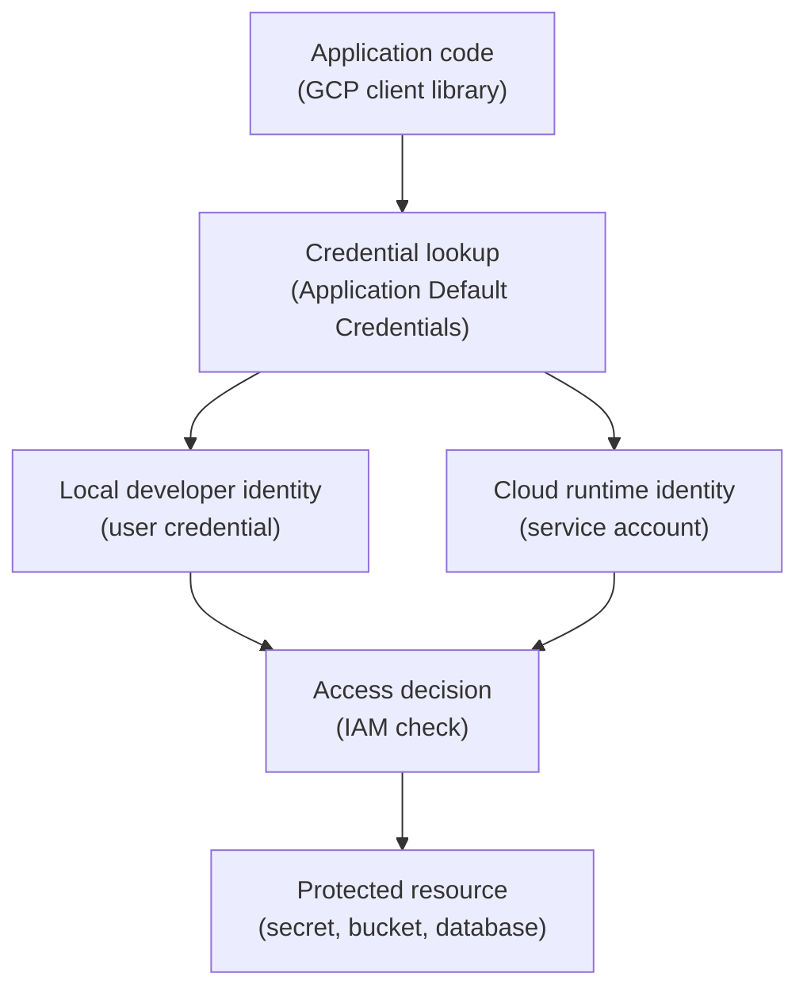

## Table of Contents

1. [Local Success Can Hide A Production Identity Problem](#local-success-can-hide-a-production-identity-problem)
2. [What Application Default Credentials Are](#what-application-default-credentials-are)
3. [If You Have Used AWS Or Azure SDK Credentials](#if-you-have-used-aws-or-azure-sdk-credentials)
4. [The Orders API Development Story](#the-orders-api-development-story)
5. [Local Credentials Usually Represent A Person](#local-credentials-usually-represent-a-person)
6. [Production Credentials Usually Represent A Workload](#production-credentials-usually-represent-a-workload)
7. [Why The Same Code Can Use Different Identities](#why-the-same-code-can-use-different-identities)
8. [The Environment Variable Escape Hatch](#the-environment-variable-escape-hatch)
9. [Service Account Impersonation For Safer Testing](#service-account-impersonation-for-safer-testing)
10. [CI/CD Credentials Are A Separate Story](#cicd-credentials-are-a-separate-story)
11. [Failure Modes](#failure-modes)
12. [A Local Development Checklist](#a-local-development-checklist)
13. [The Habit To Build](#the-habit-to-build)

## Local Success Can Hide A Production Identity Problem

A developer runs `devpolaris-orders-api` on their machine. The app starts. It reads a test
secret from Secret Manager. It writes a file to a development bucket. The developer opens a
pull request feeling confident. Then the same code runs on Cloud Run and fails with:

```text
PermissionDenied: Permission 'secretmanager.versions.access' denied
on resource 'projects/devpolaris-orders-prod/secrets/orders-db-url'
```

The code did not change. The library did not change. The identity changed. That is the
beginner trap this article is about. GCP client libraries can find credentials
automatically. That is useful because application code does not need to manually pass a
credential into every client. But automatic credential discovery also means you need to know
which credential was discovered in each environment.

Local code often runs as a human developer. Production code usually runs as a service
account. The same JavaScript call can be allowed locally and denied in production because
GCP is checking different principals. This article teaches Application Default Credentials,
usually called ADC, as a lookup pattern. ADC is not one credential. It is the way Google
client libraries look for the credential they should use.

## What Application Default Credentials Are

Application Default Credentials is a standard strategy used by Google Cloud authentication
libraries to find credentials for application code. The purpose is simple. Your code can
create a GCP client without hardcoding a credential file or token path. The library checks
the environment it is running in and finds the available credential. On a developer machine,
that credential may come from a local ADC file created by a developer login flow.

In Cloud Run, that credential usually comes from the service account attached to the running
service. In CI/CD, it may come from workload identity federation, service account
impersonation, or another configured identity path. That flexibility is helpful. It also
means ADC is not a permission model by itself. ADC does not grant access. IAM grants access.

ADC only decides which identity asks for access. That distinction matters. If the identity
changes, the IAM result can change. Here is the mental model:



The app code starts the flow. ADC finds an identity. IAM decides whether that identity can
touch the resource.

## If You Have Used AWS Or Azure SDK Credentials

If you know AWS, this feels similar to the AWS SDK credential provider chain. The code asks
for credentials. The SDK checks places like environment variables, profiles, or instance
metadata. The identity may be different locally and in production. If you know Azure, this
feels similar to `DefaultAzureCredential`. The Azure SDK tries several credential sources
depending on where the code runs.

Local development and production identity can differ there too. GCP's ADC has the same kind
of convenience and the same kind of trap. The convenience is that one code path can run in
several environments. The trap is assuming "the app has access" without naming the identity.
When debugging, do not stop at "ADC is configured."

Ask which principal ADC resolved to in this environment. That is the part IAM checks.

## The Orders API Development Story

The orders team has a small local development setup. Ana is working on receipt export logic.
The app uses the GCP client libraries to read a secret and write to a development bucket.
Ana has run a local GCP login flow before. Her local ADC file represents her user identity.
When the Node.js code creates a Secret Manager client, the library finds Ana's local
credential.

The request is made as:

```text
ana@devpolaris.example
```

That is fine for local development if the team intentionally grants Ana development access.

But production uses a different identity:

```text
orders-api-prod@devpolaris-orders-prod.iam.gserviceaccount.com
```

The production service account does not inherit Ana's permissions. It should not. Ana is a
person. The runtime service account is the production workload. The production app needs its
own access sentence. If Ana can read a production secret locally, that does not prove Cloud
Run can read it. It proves Ana can read it.

That difference is small in words and large in operations.

## Local Credentials Usually Represent A Person

On a developer machine, ADC often points to a user credential. That user credential is
convenient. It lets local scripts and sample apps call GCP without manually passing tokens
everywhere. It is also easy to misunderstand. Local success can become a false signal. The
app may start because the developer has broad access. The app may write to a bucket because
the developer is in a wide group.

The app may read a secret because the developer is on-call. None of that proves the runtime
service account is ready. For development, this can still be acceptable. The key is honesty.
Say, "This local run used Ana's credential." Do not say, "The app has permission." The app
in production has permission only if the runtime identity has permission.

This is why teams often keep separate development projects. Local credentials can be useful
and less risky there. Production credentials should stay stricter.

## Production Credentials Usually Represent A Workload

In Cloud Run, the service runs as a configured service account. That service account becomes
the identity used by the app when it calls GCP APIs. For the orders API, the desired runtime
identity is:

```text
orders-api-prod@devpolaris-orders-prod.iam.gserviceaccount.com
```

When the Node.js code asks Secret Manager for `orders-db-url`, ADC does not need Ana's local
credential. Cloud Run provides the runtime credential path. The client library uses that
path. IAM checks whether the service account can access the secret. This is a better
production model. The credential is not stored in the container image. The credential is not
copied into an environment variable.

The credential is not tied to a human employee. The service account is attached by the
platform and checked by IAM. That does not mean access is automatic. The service account
still needs roles on the correct resources. Cloud Run providing an identity solves
authentication. IAM policy still decides authorization. Authentication means proving who is
asking.

Authorization means deciding what that actor may do. ADC helps with authentication. IAM
handles authorization.

## Why The Same Code Can Use Different Identities

The code below is intentionally small:

```text
create Secret Manager client
read latest version of orders-db-url
connect to the database
```

Nothing in that flow says "use Ana" or "use the production service account." The library
asks the environment for credentials. That is why the same code can behave differently:

| Environment | Identity ADC may use | What the result proves |
|---|---|---|
| Ana's laptop | Ana's user credential | Ana has access |
| Cloud Run production | Runtime service account | The production workload has access |
| CI/CD deploy job | Deployer identity | The pipeline has deploy access |
| Local test with impersonation | Target service account | The chosen service account has access |

This table is the core lesson. Do not test the wrong identity and trust the result. If you
need to know whether production will work, test with the production-like identity in a safe
environment. If the app needs to read one development secret, test with the service account
intended for the development service. If the deployment needs to attach a runtime service
account, test with the deployer identity.

Identity is part of the test setup.

## The Environment Variable Escape Hatch

Many authentication systems support an environment variable that points to a credential
file. In GCP, `GOOGLE_APPLICATION_CREDENTIALS` can point to a credential file for ADC to
use. This is useful for some local or special cases. It is also a place where teams
accidentally create risk. If the variable points to a service account key file, that file is
a sensitive secret.

If it points to a production service account key on a laptop, the laptop now carries
production workload access. If it is copied into CI/CD, the pipeline now stores a long-lived
secret. The escape hatch should not become the default plan. Prefer platform-provided
identities in GCP runtimes. Prefer federation or impersonation patterns for automation when
they fit.

Use local user credentials for local development only when that is the intended development
model. If the team must use a credential file, treat it like a secret. Know where it lives.
Know who can read it. Know when it expires or rotates. Know how to revoke it.

## Service Account Impersonation For Safer Testing

Sometimes you want to test as a service account without downloading a service account key.
Service account impersonation is one way to do that. Impersonation means a human or tool is
allowed to obtain short-lived credentials for a service account. It is controlled by IAM. It
leaves a clearer access path than handing out a key file.

For example, Ana may be allowed to impersonate a development runtime service account for
local testing:

```text
orders-api-dev@devpolaris-orders-dev.iam.gserviceaccount.com
```

That lets her test behavior closer to the real workload identity. It does not require
storing a long-lived key in the repository. It also makes the trust relationship explicit.
Ana can impersonate the development service account because a policy says so. She should not
be able to impersonate every production service account by default. Impersonation is not
magic safety.

It still needs careful IAM. But it is often a better fit than copying service account keys
between machines.

## CI/CD Credentials Are A Separate Story

Deployment automation is not local development. A CI/CD workflow has its own identity
question. Who is allowed to deploy? Which repository or build system is trusted? Which
project can it deploy into? Can it act as the runtime service account? Can it read
production secrets? Usually the deployer should not read runtime secrets. It should deploy
the service and attach the correct runtime identity.

The running service should read its own secrets later. That separation keeps the pipeline
from becoming a production data reader. For external CI/CD systems, workload identity
federation is often better than storing a service account key. For GCP-native builds, the
build service account should still be reviewed as a normal principal. ADC may be involved in
both cases, but the lesson stays the same.

Name the identity. Name the resource. Name the role. Do not let "the pipeline" hide the
principal that GCP actually checks.

## Failure Modes

The first failure is local success with user credentials. Ana can run the app locally. Cloud
Run fails. The reason is that Ana had secret access and the runtime service account did not.
The fix direction is to grant the runtime service account the correct role on the correct
secret, not to copy Ana's credential.

The second failure is a credential file accidentally used in production. The container image
or environment variable points to an old service account key. The app runs as a different
identity than the team expected. The fix direction is to remove the key path, use the
platform-provided runtime identity, and rotate or delete the exposed key.

The third failure is testing with the wrong project. Local ADC uses a development project.
The production resource name points to production. The test tells you little because the
environment is mixed. The fix direction is to make the project and identity visible in local
test instructions. The fourth failure is CI/CD using runtime credentials.

The deploy workflow stores a key for the same service account used by Cloud Run. The
pipeline can deploy and read production dependencies. The fix direction is to split deploy
identity from runtime identity and remove long-lived keys where possible. The fifth failure
is missing impersonation permission. Ana tries to test as a development service account.

The command fails because she is not allowed to impersonate it. The fix direction is to
grant impersonation narrowly if the workflow is approved, or use a different testing path.

## A Local Development Checklist

Use a small checklist before trusting a local GCP test.

| Question | Good answer |
|---|---|
| Which project is selected? | The project matches the environment being tested |
| Which identity is being used? | The developer can name the user or service account |
| Is the test using a user credential? | The team knows the result proves user access only |
| Is the test using a service account? | The service account is the intended one for the test |
| Is a credential file involved? | The file is treated as a secret and has a reason |
| Does production use the same identity? | If not, production needs its own IAM check |

The checklist is not meant to slow people down. It prevents false confidence. The dangerous
sentence is:

```text
It worked locally, so production should have access.
```

The better sentence is:

```text
It worked locally as Ana. Production still needs the runtime service account checked.
```

That one change saves a lot of debugging time.

## The Habit To Build

Whenever you see ADC, translate it. Do not leave the word as a black box. Ask what identity
ADC found. Ask where that identity came from. Ask whether that identity matches the
environment you are trying to prove. Ask what IAM roles that identity has on the target
resource. This habit makes local development safer.

It also makes production debugging more grounded, because the facts are named. The code can
stay clean. The client libraries can still find credentials automatically. The team just
refuses to treat automatic lookup as automatic permission. ADC answers "who am I using right
now?" IAM answers "what may that identity do?" Keep those two answers separate and GCP
authentication becomes much less confusing.

---

**References**

- [Application Default Credentials](https://cloud.google.com/docs/authentication/application-default-credentials) - Official guide to how Google authentication libraries find default credentials.
- [Authentication at Google](https://cloud.google.com/docs/authentication) - Overview of authentication concepts and credential patterns across Google Cloud.
- [Service account impersonation](https://cloud.google.com/iam/docs/service-account-impersonation) - Explains how one principal can use short-lived credentials for a service account.
- [Best practices for using service accounts](https://cloud.google.com/iam/docs/best-practices-service-accounts) - Covers why long-lived keys should be avoided when safer identity paths are available.
- [Workload Identity Federation](https://cloud.google.com/iam/docs/workload-identity-federation) - Documents the pattern for external workloads to use short-lived access without service account keys.
