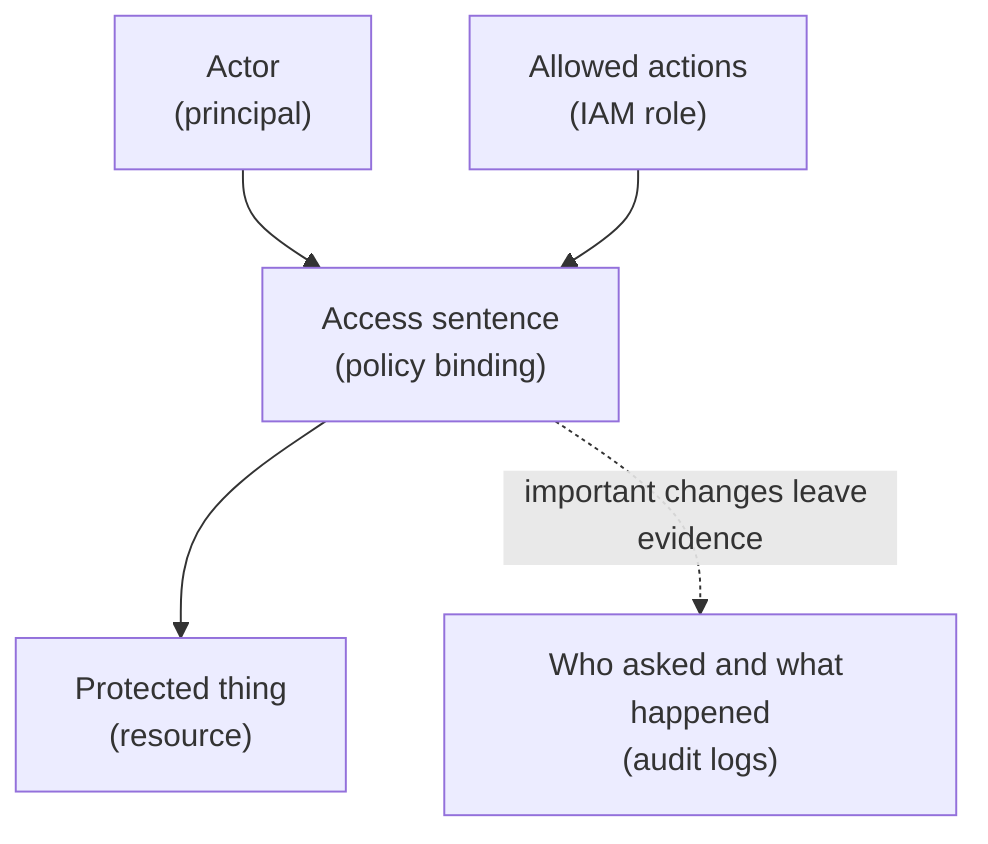

## Table of Contents

1. [Security Starts With A Permission Question](#security-starts-with-a-permission-question)
2. [The GCP Shape In One Sentence](#the-gcp-shape-in-one-sentence)
3. [How This Maps From AWS And Azure](#how-this-maps-from-aws-and-azure)
4. [The Example Service We Will Protect](#the-example-service-we-will-protect)
5. [Principals Are The Actors](#principals-are-the-actors)
6. [Resources Are The Targets](#resources-are-the-targets)
7. [Roles Describe Allowed Actions](#roles-describe-allowed-actions)
8. [Policy Bindings Attach The Actor To The Target](#policy-bindings-attach-the-actor-to-the-target)
9. [Service Accounts Let Software Act](#service-accounts-let-software-act)
10. [Secrets Need A Separate Door](#secrets-need-a-separate-door)
11. [Audit Logs Are The Receipt](#audit-logs-are-the-receipt)
12. [Common Failure Modes](#common-failure-modes)
13. [The Habit To Build](#the-habit-to-build)

## Security Starts With A Permission Question

A backend service does not become secure because it runs in a cloud project. It becomes
safer when every important action has a clear answer. Who is asking? What are they trying to
touch? Which exact action are they trying to perform? Who gave them that permission? Where
can we see evidence later? Those questions sound simple, but they are the daily shape of
cloud security.

When `devpolaris-orders-api` starts in production, it needs to read a database connection
secret, connect to Cloud SQL, write receipt files to Cloud Storage, and send logs to Cloud
Logging. The app should not automatically get permission to delete projects, change billing,
or read every secret in the company. GCP security exists to draw those lines. It gives
humans and software identities.

It gives resources names and parents. It gives permissions through roles. It records
permission decisions in policies. It records many important actions in audit logs. The goal
is not to memorize every IAM role on day one. The goal is to learn how GCP thinks about an
access decision. Once that picture is clear, the role names become easier to read.

## The GCP Shape In One Sentence

GCP IAM (Identity and Access Management, the permission system for GCP) answers this
sentence:

> This principal can use this role on this resource.

A principal is the actor. It might be a human user, a Google group, a service account, or
another supported identity. A role is a bundle of permissions. For example, a role may allow
reading logs, deploying a Cloud Run service, or accessing a Secret Manager secret version. A
resource is the thing being protected.

It might be a project, a Cloud Run service, a Cloud SQL instance, a Cloud Storage bucket, a
secret, or a folder above many projects. A policy binding is the line that connects them. It
says that a principal receives a role on a resource. That is the basic grammar. Read it
slowly. If an action fails, one part of that sentence is usually wrong.

The app might be using a different principal than you thought. The role might not include
the needed permission. The binding might be attached to the wrong resource. The resource
might live in a different project. The request might be blocked by an additional condition.
Security debugging in GCP often means rebuilding that sentence from evidence instead of
guessing.

Here is the picture we will use through this module:



The arrows are not a network path. They are a permission story. The actor asks to do
something to the target. GCP checks whether a policy binding gives that actor a role that
allows the action. Some actions also produce audit log records so the team can investigate
later.

## How This Maps From AWS And Azure

If you learned AWS first, GCP IAM will feel familiar and different at the same time. AWS has
principals, actions, resources, and policies. GCP also has principals, permissions,
resources, and policies. The difference is how often you will think in project-scoped
resource hierarchy and role bindings. In AWS, you may read a policy document attached to an
IAM role and look for actions like `s3:GetObject`.

In GCP, you often ask which role was granted to which principal on which project, folder,
bucket, secret, or service. If you learned Azure first, the closest bridge is Azure RBAC.
Azure gives a principal a role assignment at a scope such as a subscription, resource group,
or resource. GCP gives a principal a role binding on a resource, project, folder, or
organization.

That sounds very similar. The important GCP-specific detail is the project. Many beginner
mistakes happen because the engineer grants a role in one project while the service is
running in another. Another difference is service accounts. AWS developers often think about
IAM roles attached to workloads. Azure developers often think about managed identities. In
GCP, a service account is the identity a workload uses when it calls Google Cloud APIs.

That service account can be granted roles just like a human can. Do not force these ideas
into a perfect one-to-one translation. Use the translation as a bridge, then read the GCP
resource and policy model directly.

## The Example Service We Will Protect

The running example is `devpolaris-orders-api`. It is a Node.js backend that receives
checkout requests. In production it runs on Cloud Run. It stores order records in Cloud SQL.
It stores exported receipt files in Cloud Storage. It reads private configuration from
Secret Manager. It sends logs and request information to Cloud Logging. The project is
`devpolaris-orders-prod`.

The runtime service account is:

```text
orders-api-prod@devpolaris-orders-prod.iam.gserviceaccount.com
```

That address looks like an email address because GCP uses email-like identifiers for service
accounts. This does not mean a person checks an inbox. It means software has an identity
that can be named in IAM policies. The team wants a simple security promise:
`devpolaris-orders-api` can do the work needed for checkout, and not much more.

That promise breaks into smaller promises. The app can read only the secrets it needs. The
app can connect only to its database. The app can write only to its export bucket. The CI/CD
pipeline can deploy the service, but cannot read production customer data. Developers can
inspect logs, but only a smaller on-call group can change production access.

This module teaches how GCP expresses those promises.

## Principals Are The Actors

A principal is the identity that asks GCP to do something. The word sounds formal, but the
idea is familiar. When you use GitHub, your user account is the actor. When a GitHub Actions
workflow deploys, the workflow may use a token or federated identity as the actor. When a
backend reads a cloud secret, the backend needs an identity too.

In GCP, common principals include human users, Google groups, service accounts, and workload
identities from outside Google Cloud. For this module, focus on two kinds first. Human users
represent people. Service accounts represent software. A human user might be:

```text
ana@devpolaris.example
```

A service account might be:

```text
orders-api-prod@devpolaris-orders-prod.iam.gserviceaccount.com
```

Those two identities should not receive the same access by default. Ana may need to view
Cloud Run revisions and read logs. The production service may need to access one secret and
one database. The deploy pipeline may need to update Cloud Run, but it should not download
every object in the receipt bucket. That separation is the point.

If every actor uses the same owner-level credential, the team cannot answer who did what. It
also cannot limit damage when one credential leaks.

## Resources Are The Targets

A resource is the thing GCP protects or operates. Projects are resources. Cloud Run services
are resources. Cloud Storage buckets are resources. Secret Manager secrets are resources.
Cloud SQL instances are resources. Some resources contain other resources. An organization
can contain folders. A folder can contain projects. A project can contain many service
resources. That parent-child shape matters because IAM permissions can be inherited from
higher levels.

If a group receives a role at the project level, that access can affect many resources
inside the project. If a service account receives a role only on one secret, the access is
much narrower. That is why GCP access reviews always ask about scope. The same role can be
reasonable on one secret and too broad on the whole project.

For `devpolaris-orders-api`, the target might be one specific secret:

```text
projects/devpolaris-orders-prod/secrets/orders-db-url
```

Or it might be the whole production project:

```text
projects/devpolaris-orders-prod
```

Those are very different targets. The role might be the same, but the blast radius is not.
Blast radius means how much damage or accidental change one mistake can cause. Smaller scope
gives a mistake less room to spread.

## Roles Describe Allowed Actions

A role is a named bundle of permissions. A permission is the smallest action GCP checks. For
example, reading a secret version requires a permission for accessing secret payloads.
Updating a Cloud Run service requires permissions for changing that service. Viewing logs
requires logging read permissions. Most engineers do not grant individual permissions
directly. They grant roles that contain permissions.

GCP has basic roles, predefined roles, and custom roles. Basic roles such as Owner, Editor,
and Viewer are broad. They are easy to understand, but often too wide for production work.
Predefined roles are service-specific roles that Google maintains. For example, Secret
Manager has roles for secret access and secret administration. Cloud Run has roles for
viewing, developing, and administering services.

Custom roles are roles you define yourself when predefined roles are not the right shape.
Beginners do not need to start with custom roles. They should start by reading predefined
roles carefully and choosing the narrowest role that fits the job. The role name should
match the action. If the app only reads one secret at runtime, it should not receive a role
that manages all secrets.

If a developer only needs logs during support, they should not receive a deployment role as
a shortcut.

## Policy Bindings Attach The Actor To The Target

A policy binding is the sentence GCP reads. It connects a principal, a role, and a resource.
Here is a simplified version of what the idea looks like:

```text
resource:
  secret: orders-db-url

binding:
  principal: orders-api-prod@devpolaris-orders-prod.iam.gserviceaccount.com
  role: Secret Manager Secret Accessor
```

This says the runtime service account can access that secret. The exact policy format
depends on the API or tool you use, but the idea stays the same. The binding does not say
the app can access every secret. It says this principal receives this role on this target.
That makes policy bindings readable if you slow down.

When you see a policy, do not read it as a wall of security text. Read it like sentences.
Who is named? Which role are they getting? Where is the binding attached? Is the scope
larger than the task needs? Is there a condition attached? Does this binding affect
production, staging, or both? Those questions catch many mistakes before they become
incidents.

## Service Accounts Let Software Act

Cloud services are not people, but they still need identities. That is the purpose of a
service account. A service account is an identity for software. When Cloud Run runs
`devpolaris-orders-api`, the service runs as a service account. When the app calls Secret
Manager, GCP checks the permissions of that service account. When the app connects to Cloud
SQL through a GCP-supported path, GCP can also check that identity.

This is safer than storing a human user's credential inside the app. People leave teams.
People need many permissions for different tasks. Human credentials are usually not the
right shape for a production service. A service account can be named for one job:

```text
orders-api-prod@devpolaris-orders-prod.iam.gserviceaccount.com
```

That name says the account belongs to production orders API runtime work. It should not
deploy the app. It should not manage billing. It should not administer all projects. It
should only do what the running backend needs. The deploy pipeline should use a different
identity. That separation gives the team cleaner logs and smaller risk.

If the runtime identity is overpowered, a bug in the app can become a cloud-wide security
problem.

## Secrets Need A Separate Door

Some configuration values are sensitive. A database username might be sensitive. A database
password is sensitive. A payment provider token is sensitive. An API key for a private
vendor is sensitive. These values should not live in a Git repository. They should not be
copied into a wiki page. They should not be passed around in chat.

In GCP, Secret Manager is the service that stores secrets as named secrets with versions.
The secret name is not the dangerous part. The secret payload is the dangerous part. That
distinction matters. Many people may be allowed to know that a secret called `orders-db-url`
exists. Very few actors should be allowed to read the current value.

For `devpolaris-orders-api`, the runtime service account may need access to this one secret:

```text
orders-db-url
```

That access should be granted because the app needs it at startup or when creating database
connections. It should not imply access to every secret in the project. Secrets also need
rotation thinking. Rotation means changing a secret value and making sure the application
uses the new value without breaking production. The safer habit is to treat secret access as
runtime access, not as a developer convenience.

## Audit Logs Are The Receipt

Security work needs evidence. If a deployment changes a Cloud Run service, the team should
be able to find who or what changed it. If someone grants a broad role on the production
project, the team should be able to see that change. If an app receives a permission denied
error, logs should help identify which identity was used.

GCP records many admin and data events through Cloud Audit Logs. An audit log is not a
replacement for good access design. It is the receipt that helps the team understand what
happened. Imagine a production secret changed on Friday. The app starts failing on Monday.
Without audit logs, the team may rely on memory and chat history.

With audit logs, the team can look for the secret change and the actor that made it. That
does not make the failure pleasant. It does make the investigation grounded in evidence. For
beginners, the first audit habit is simple. When access surprises you, ask for the identity
and the resource. Then check the logs for the action.

The log is often the first place where the story becomes specific.

## Common Failure Modes

Most GCP identity problems are not mysterious once you translate them back into the access
sentence. Here are common shapes. The first is the wrong principal. The developer tested
locally as `ana@devpolaris.example`, but Cloud Run runs as
`orders-api-prod@devpolaris-orders-prod.iam.gserviceaccount.com`. Local testing passes.
Production fails when the service account lacks access. The second is the wrong resource.

The service account has access to a secret in staging, but production is reading a secret
with the same name in `devpolaris-orders-prod`. The name looks familiar. The project is
different. The third is the wrong role. The app can view secret metadata, but it cannot
access the secret payload. That is a useful safety boundary.

Seeing that a secret exists is not the same as reading the sensitive value. The fourth is
the wrong scope. A developer grants a role on the whole project because granting it on a
specific secret felt slower. The app works, but it now has more access than it needs. That
is not a runtime bug.

It is a risk that should be cleaned up before the shortcut becomes normal. The fifth is
missing API enablement. IAM might be correct, but the required service API is not enabled in
the project. That failure does not mean the principal is bad. It means the project is not
ready to use that service.

Good debugging separates these cases.

## The Habit To Build

The habit is to make every access decision readable. Do not start with "GCP is denying me."
Start with the sentence. Which principal is making the request? Which resource is the
request touching? Which permission does that action require? Which role contains that
permission? Where is the binding attached? Is the binding inherited from a parent?

Is there a condition? Is the service API enabled? Is there an audit log that proves the
request? This is not extra ceremony. It is how you avoid guessing. When the orders API
cannot read its secret, the fix might be a missing binding on one secret. When a deploy
pipeline cannot update Cloud Run, the fix might be a missing deploy role and service account
use permission.

When a developer cannot see logs, the fix might be a viewer role on the right project.
Different problems need different fixes. The mental model keeps them separate.

---

**References**

- [IAM overview](https://cloud.google.com/iam/docs/overview) - Google's starting point for principals, roles, policies, and resources in GCP IAM.
- [IAM policies](https://cloud.google.com/iam/docs/policies) - Explains allow policies and bindings, which are the core access sentence in this module.
- [Understanding roles](https://cloud.google.com/iam/docs/understanding-roles) - Describes basic, predefined, and custom roles and how permissions are grouped.
- [Service account overview](https://cloud.google.com/iam/docs/service-account-overview) - Defines service accounts as identities for workloads and automation.
- [Cloud Audit Logs overview](https://cloud.google.com/logging/docs/audit) - Explains the audit records GCP creates for many administrative and data access events.
