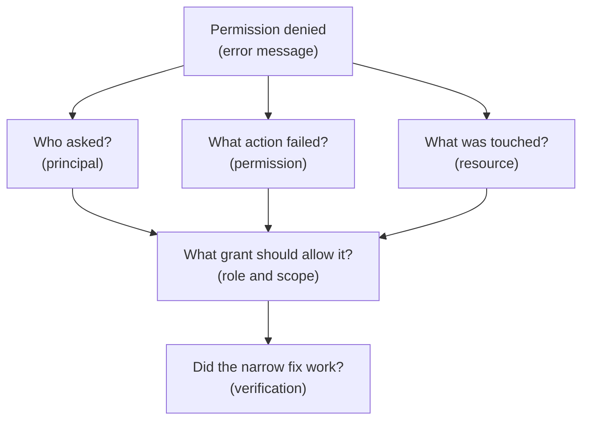

## Table of Contents

1. [Permission Denied Is A Clue](#permission-denied-is-a-clue)
2. [Start With The Access Sentence](#start-with-the-access-sentence)
3. [The Debugging Path](#the-debugging-path)
4. [Check The Principal First](#check-the-principal-first)
5. [Check The Resource And Project](#check-the-resource-and-project)
6. [Check The Missing Permission](#check-the-missing-permission)
7. [Check Role, Scope, And Inheritance](#check-role-scope-and-inheritance)
8. [Check Service APIs And Runtime Settings](#check-service-apis-and-runtime-settings)
9. [Common Failure Examples](#common-failure-examples)
10. [Access Reviews Before Incidents](#access-reviews-before-incidents)
11. [Audit Logs Turn Memory Into Evidence](#audit-logs-turn-memory-into-evidence)
12. [Fix Narrowly, Then Verify](#fix-narrowly-then-verify)
13. [The Habit To Build](#the-habit-to-build)

## Permission Denied Is A Clue

A permission denied error can feel like a wall. The app tried to do something. GCP said no.
The team is tired. Someone suggests granting Owner just to get production moving. That
impulse is understandable. It is also how small access problems become large security
problems. A permission denied error is usually not random. It is a clue.

It often tells you the missing permission, the target resource, and sometimes the service
involved. You still need to find the principal and the scope. Once you have those facts, the
fix is usually much smaller than a broad role. This article follows `devpolaris-orders-api`.
The service runs on Cloud Run in `devpolaris-orders-prod`. It reads a secret, connects to
Cloud SQL, writes receipt exports to Cloud Storage, pulls images from Artifact Registry
during deployment, and emits logs.

Each dependency can fail with access errors. The troubleshooting habit is the same. Name the
actor. Name the target. Name the missing action. Find the binding that should allow it.

## Start With The Access Sentence

Do not begin by guessing a role.

Begin by rebuilding the access sentence.

```text
principal:
  who made the request?

action:
  what permission was required?

resource:
  what exact resource was touched?

binding:
  where should the role be granted?
```

That is the structure behind most IAM troubleshooting. If the sentence is incomplete, the
fix will be a guess. Here is the picture:



The flow is intentionally boring. Boring is good here. Security debugging should be
evidence-based, not dramatic. If you do the same checks in the same order, you are less
likely to add access in the wrong place.

## The Debugging Path

A practical path has six questions. First, which principal made the request? Second, which
resource was touched? Third, which permission was missing? Fourth, which role includes that
permission? Fifth, where should the role be granted? Sixth, how will you verify the fix
without granting more than needed? These questions work for humans and workloads. They work
for runtime errors and deployment errors.

They work for Secret Manager, Cloud SQL, Cloud Storage, Artifact Registry, and Cloud Run.
The exact commands and console screens change by service. The reasoning does not. Here is a
useful error example:

```text
PermissionDenied: Permission 'secretmanager.versions.access' denied
on resource 'projects/devpolaris-orders-prod/secrets/orders-db-url'
```

This error already gives you two facts. The missing permission is
`secretmanager.versions.access`. The resource is the `orders-db-url` secret in the
production project. The principal is not shown in this short snippet. So the next step is to
find which identity the app used. For Cloud Run, that means checking the service's
configured service account for the running revision.

## Check The Principal First

Many access fixes fail because the team grants the right role to the wrong actor. This
happens often in local development. Ana can read the secret. The production service account
cannot. Granting Ana another role changes nothing for Cloud Run. The principal for a runtime
failure is usually the workload identity. For `devpolaris-orders-api`, that should be:

```text
orders-api-prod@devpolaris-orders-prod.iam.gserviceaccount.com
```

The principal for a deployment failure may be different.

For example:

```text
orders-deployer@devpolaris-build.iam.gserviceaccount.com
```

That deployer may need Cloud Run update access. It may also need permission to act as the
runtime service account. It usually does not need to read the database password. The first
debugging question is:

> Which identity did GCP actually check for this request?

Do not accept "the app" or "the pipeline" as the final answer. The app and pipeline are
systems. GCP checks a principal. Name it.

## Check The Resource And Project

The same resource name can exist in multiple projects. `orders-db-url` in development is not
`orders-db-url` in production. `orders-receipts` in staging is not the production bucket.
When you read an error, copy the project and resource name carefully. For example:

```text
projects/devpolaris-orders-prod/secrets/orders-db-url
```

This tells you the target is production. If you grant access in `devpolaris-orders-staging`,
production will not care. Project confusion is common because developer tools remember
context. A CLI may have one project selected. A Terraform workspace may point at another. A
CI/CD workflow may pass a project ID through an environment variable. The console may be
open to a project from a previous task.

The fix is not to distrust every tool. The fix is to make the project visible in release
records and errors. When debugging, write down:

```text
requesting principal:
target project:
target resource:
missing permission:
```

That small record prevents wandering.

## Check The Missing Permission

GCP errors often name a permission. The permission is more precise than the role. A role is
a bundle. The permission is the specific action that failed. If the error says:

```text
secretmanager.versions.access
```

The app is trying to access a secret version payload. If the error is about Artifact
Registry download permissions, the runtime or deploy path may not be able to pull the image.
If the error is about Cloud Run service update permissions, the deployer may not be allowed
to change the service. The permission tells you what kind of role to search for.

It does not mean you should grant every role that contains it. You still need to choose a
role that fits the job. For example, a secret administrator role may include many secret
management actions. The runtime app may only need secret access. The missing permission
guides the search. The job description guides the final choice.

## Check Role, Scope, And Inheritance

After you know the principal, resource, and missing permission, inspect the grants. You are
looking for a role that includes the needed permission. You are also looking at where the
role is attached. A role on a folder can be inherited by projects. A role on a project can
affect many resources in that project.

A role on one resource is narrower. Scope changes risk. It can also change whether the role
works. Some roles can be granted at some resource levels and not others. Some services
support resource-level IAM for specific resources. If you are unsure, check the service's
official IAM documentation rather than guessing. A review should produce a sentence like:

```text
orders-api-prod service account
has roles/secretmanager.secretAccessor
on projects/devpolaris-orders-prod/secrets/orders-db-url
```

Or:

```text
orders-deployer service account
has Cloud Run deployment access
on projects/devpolaris-orders-prod
and can act as orders-api-prod service account
```

The sentence may reveal the gap.

If you cannot write the sentence, you probably do not understand the grant yet.

## Check Service APIs And Runtime Settings

Not every failure is fixed by IAM. GCP services often need APIs enabled in a project.
Runtime settings also matter. The app may run as the wrong service account. The Cloud Run
service may point at the wrong secret name. The deployment may use the wrong project ID. The
database connection may require a network or connector setup in addition to IAM.

That is why access troubleshooting should not become role hunting only. IAM can be correct
while the runtime configuration is wrong. For `devpolaris-orders-api`, check:

| Area | Beginner question |
|---|---|
| Project | Is the service deployed in the intended project? |
| Runtime identity | Is Cloud Run using the expected service account? |
| API enablement | Is the needed GCP API enabled in that project? |
| Resource reference | Is the app pointing at the production secret, bucket, or database? |
| Network path | Does the service also need private connectivity? |
| IAM binding | Does the right principal have the right role at the right scope? |

The table is not a procedure.

It is a reminder that permissions live inside a larger runtime setup.

## Common Failure Examples

Secret Manager failure:

```text
Permission 'secretmanager.versions.access' denied
on resource 'projects/devpolaris-orders-prod/secrets/orders-db-url'
```

Likely facts to check: The principal is the Cloud Run runtime service account. The resource
is one secret. The role should allow secret payload access. The scope should usually be the
specific secret when possible. Cloud SQL connection failure:

```text
Cloud SQL connection failed:
caller is not authorized to connect to instance orders-prod-db
```

Likely facts to check: The principal is the runtime service account. The target is the
production Cloud SQL instance. IAM may be one part of the issue. Network or connection
configuration may also be involved. Cloud Storage write failure:

```text
AccessDenied: caller does not have storage.objects.create
on bucket devpolaris-orders-receipts-prod
```

Likely facts to check: The runtime service account needs object creation access on the
export bucket. It may not need object deletion access. It may not need access to every
bucket in the project. Artifact Registry image pull failure:

```text
denied: permission to download artifacts from repository orders-api
```

Likely facts to check: The deploy or runtime path needs image read access. The repository
project may be different from the runtime project. The service account being checked may not
be the one you expected. Cloud Run deploy failure:

```text
Permission 'iam.serviceAccounts.actAs' denied
on service account orders-api-prod
```

Likely facts to check: The deployer can update Cloud Run, but cannot attach the runtime
service account. The fix is usually service-account-use access, not secret access. Each
example has its own service detail. The access sentence stays the same.

## Access Reviews Before Incidents

The best time to review access is before an incident. An access review asks whether current
permissions still match current jobs. It is not only a compliance task. It is maintenance
for production understanding. Review service accounts first because they often collect
permissions as systems grow. For each service account, ask:

| Review item | What you are looking for |
|---|---|
| Owner | A team or service that still owns the identity |
| Job | Runtime, deploy, worker, migration, or support |
| Roles | Roles that match the job |
| Scope | Grants attached no higher than needed |
| Keys | Long-lived keys that should be removed or justified |
| Recent use | Evidence that the identity is still active |
| Sensitive access | Secrets, production data, billing, or admin permissions |

Then review human groups. Groups are usually better than one-off user grants because people
join and leave teams. But groups can also become too broad. If
`developers@devpolaris.example` can read every production secret, the group is carrying more
risk than its name suggests. Good reviews remove unused access and document access that
remains.

## Audit Logs Turn Memory Into Evidence

During an incident, memory is fragile. Someone remembers a deployment. Someone remembers a
secret rotation. Someone remembers a permission change. Those memories may be true, but the
team still needs evidence. Cloud Audit Logs help show administrative changes and many access
events. For identity work, audit logs can answer questions like: Who changed the IAM policy?

Who created a service account key? Which service account deployed the Cloud Run revision?
Which principal accessed a secret? Which project and resource were involved? Audit logs do
not fix the problem by themselves. They reduce guessing. If a broad role appeared on the
production project yesterday, the log can show the actor and time.

If a service account key was created and never approved, the log can show that too. The
habit is to use audit logs as part of the story, not as an afterthought after everyone has
already guessed.

## Fix Narrowly, Then Verify

The safest useful fix is usually narrow and testable. Narrow means the role matches the
action. Narrow means the principal matches the workload. Narrow means the scope matches the
resource. Testable means you can prove the fix worked. For the Secret Manager failure, a
narrow fix might be:

```text
grant secret payload access
to orders-api-prod service account
on only orders-db-url
```

Then verify with the app, not only with the IAM page. The Cloud Run revision should start.
The database health check should pass. The logs should no longer show the permission error.
For the deploy act-as failure, a narrow fix might be:

```text
allow orders-deployer to act as orders-api-prod service account
```

Then verify the deployment can attach that runtime service account. Do not use Owner as a
diagnostic tool unless you are in a tightly controlled emergency process and understand the
cleanup. Broad roles can hide the real missing permission. They also make later access
reviews harder.

## The Habit To Build

When a GCP access error appears, slow down for one minute. Write the access sentence. Name
the principal. Name the resource. Name the missing permission. Name the role that should
contain it. Name the scope where the binding belongs. Check whether the runtime is using the
identity you think it is using. Check whether the project is the one you think it is.

Check whether a service API or runtime setting is part of the failure. Use audit logs when
the story involves a change. Apply the smallest useful fix. Verify with the application
behavior. Then leave a short note explaining why the grant exists. That note might save the
next engineer from granting the same access in a broader place.

Good access work is not about never seeing permission denied. It is about turning permission
denied into a clear, small, reviewable change.

---

**References**

- [Troubleshoot allow policies](https://cloud.google.com/iam/docs/troubleshooting-access) - Official troubleshooting guidance for IAM access problems.
- [Policy Troubleshooter](https://cloud.google.com/policy-intelligence/docs/troubleshoot-access) - Explains the tool that helps analyze why a principal has or does not have access.
- [IAM policies](https://cloud.google.com/iam/docs/policies) - Documents policy bindings, resource hierarchy, and inheritance.
- [Cloud Audit Logs overview](https://cloud.google.com/logging/docs/audit) - Explains the audit evidence GCP records for many admin and data access events.
- [Service account best practices](https://cloud.google.com/iam/docs/best-practices-service-accounts) - Helps review runtime and automation identities safely.
