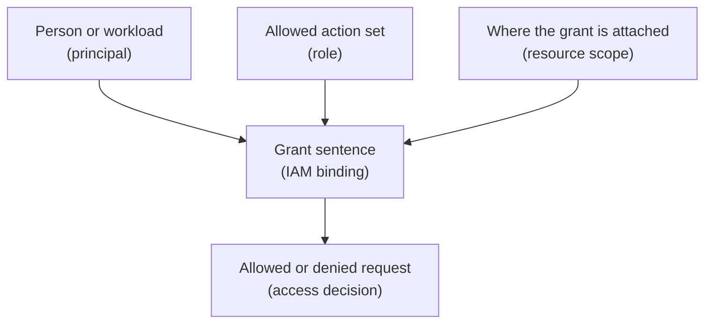

## Table of Contents

1. [Access Is A Relationship](#access-is-a-relationship)
2. [The Sentence GCP Tries To Read](#the-sentence-gcp-tries-to-read)
3. [Principals: The Actor Side](#principals-the-actor-side)
4. [Resources: The Target Side](#resources-the-target-side)
5. [Roles: The Permission Bundle](#roles-the-permission-bundle)
6. [Bindings: Where The Relationship Lives](#bindings-where-the-relationship-lives)
7. [Basic, Predefined, And Custom Roles](#basic-predefined-and-custom-roles)
8. [Inheritance: Why Scope Matters](#inheritance-why-scope-matters)
9. [Reading A Policy](#reading-a-policy)
10. [A Practical Access Review](#a-practical-access-review)
11. [Conditions Add One More Question](#conditions-add-one-more-question)
12. [Failure Modes And Fix Directions](#failure-modes-and-fix-directions)
13. [The Review Habit](#the-review-habit)

## Access Is A Relationship

New cloud users often look for permission as if it were a switch. They ask, "Does this
service account have access?" That question is incomplete because GCP evaluates a
relationship. The answer depends on the actor, the target, the action, and the place where
the permission was granted. That is why two permission problems can look similar but require
different fixes.

`devpolaris-orders-api` may fail to read a secret because the runtime service account has no
binding on that secret. The deploy pipeline may fail because it can update Cloud Run but
cannot act as the runtime service account. A developer may fail to view logs because they
are looking in the wrong project. All three failures feel like "permission denied."

Those failures need different fixes. This article teaches the parts you need to separate
them: principals, resources, roles, policy bindings, inheritance, and conditions. Those
words are official, but the idea is friendly enough:

> Someone gets a named set of actions on something.

If you can read that sentence, you can read most GCP IAM decisions.

## The Sentence GCP Tries To Read

GCP IAM uses policies to answer access questions. An allow policy contains bindings. Each
binding grants one role to one or more principals. The role applies at the resource where
the policy is attached. That sounds formal, so turn it into a sentence:

```text
orders-api-prod service account
gets Secret Manager Secret Accessor
on the orders-db-url secret
```

That sentence is readable. It says the production runtime identity can read the secret
payload for the database URL. Now compare a wider sentence:

```text
orders-api-prod service account
gets Secret Manager Secret Accessor
on the whole production project
```

The role name did not change. The scope changed. The second sentence can allow access to
more secrets. Access review needs the full relationship: role name, principal, resource,
scope, and condition. Here is the shape:



The useful reading order is actor, role, scope, action. Who is named? What role did they
receive? Where is the role attached? Does the role include the action being attempted?

## Principals: The Actor Side

A principal is the actor named in an IAM policy. The actor can be a person. It can be a
group. It can be a service account. It can also be a supported external identity through
federation, but that can wait until later. For daily app work, the important split is human
identity versus workload identity.

A human identity is someone like:

```text
ana@devpolaris.example
```

A workload identity is often a service account like:

```text
orders-api-prod@devpolaris-orders-prod.iam.gserviceaccount.com
```

Those identities should not be mixed casually. Ana may need to inspect deployments and logs.
The Cloud Run service needs runtime access to its own dependencies. The CI/CD pipeline needs
deployment access. Each job deserves its own actor. This separation makes permissions
smaller. It also makes logs easier to trust. If a production secret was read by the runtime
service account, that tells a different story than a human user reading the same secret.

If a pipeline updated a Cloud Run service, that tells a different story than a developer
doing it by hand. Good principal design gives the team a cleaner story later.

## Resources: The Target Side

A resource is the thing the principal wants to touch. The target might be a project. It
might be one Cloud Run service. It might be one Secret Manager secret. It might be one Cloud
Storage bucket. It might be one Cloud SQL instance. The target matters because IAM can be
attached at different levels.

Granting access on a project is different from granting access on one resource inside that
project. For example, the orders API may need access to one secret:

```text
projects/devpolaris-orders-prod/secrets/orders-db-url
```

That does not mean it needs access to every secret in:

```text
projects/devpolaris-orders-prod
```

Scope is one of the easiest places to accidentally overgrant. Overgrant means giving more
access than the job needs. It often happens because the narrow grant takes a few more
minutes to figure out. The shortcut works today. Then it becomes the default pattern. A
month later, nobody remembers why a runtime service account can read every secret.

The safe review question is:

> What is the smallest resource where this role still lets the job work?

Small does not always mean one object. Sometimes a project-level grant is the right
tradeoff. But it should be a choice, not a reflex.

## Roles: The Permission Bundle

A role is a named group of permissions. A permission is an individual action, such as
reading a log entry or accessing a secret version. Most teams do not grant permissions one
by one. They grant roles. This makes IAM readable, but it also means you need to understand
role size. Some roles are narrow.

Some roles are broad. Some roles are designed for viewing. Some roles are designed for
administration. The role name is a clue, not a substitute for checking the permissions. For
example, a role that can administer secrets is not the same as a role that can access secret
values. An admin role may create, delete, and configure secrets.

An accessor role may read secret payloads. Those are different jobs. For
`devpolaris-orders-api`, runtime access usually wants reading, not administration. For a
platform engineer managing secret lifecycle, administration might be needed. The same
resource can require different roles for different actors. That is normal. Do not solve
every IAM problem by reaching for a broader role.

First ask which action is missing. Then find the smallest role that includes that action and
fits the job.

## Bindings: Where The Relationship Lives

A binding connects principals to a role on a resource.

In policy form, the idea looks like this:

```text
resource:
  projects/devpolaris-orders-prod/secrets/orders-db-url

binding:
  role: roles/secretmanager.secretAccessor
  members:
    - serviceAccount:orders-api-prod@devpolaris-orders-prod.iam.gserviceaccount.com
```

The exact tool output may differ, but the sentence is clear. The service account gets the
secret accessor role on one secret. If the binding were attached to the project instead, the
sentence would change. That difference is easy to miss in a console screen. It is easier to
catch when you say the sentence out loud.

Read every binding with these four fields:

| Field | Plain-English question |
|---|---|
| Principal | Who is receiving access? |
| Role | What named action bundle are they receiving? |
| Resource | Where is the grant attached? |
| Condition | Is the grant limited by time, attributes, or context? |

The condition field may be empty. An empty condition does not mean the grant is wrong. It
only means the grant is not using that extra filter. For beginners, the first win is
correctly reading the first three fields.

## Basic, Predefined, And Custom Roles

GCP roles come in a few shapes. Basic roles are old, broad roles: Owner, Editor, and Viewer.
They are easy to recognize. They are also often too wide for production app work. Viewer may
be okay for some read-only support needs. Owner and Editor deserve extra caution because
they can include many actions across many services.

Predefined roles are maintained by Google for specific services or jobs. Examples include
roles for Cloud Run, Secret Manager, Cloud Storage, Cloud Logging, and Artifact Registry.
These are usually where a beginner should start. They are more specific than basic roles and
easier than building custom roles immediately. Custom roles are roles your organization
defines.

They are useful when no predefined role matches the exact job. They also require
maintenance. If the job changes, the custom role may need to change. If a Google Cloud
service adds new permissions, a custom role may not automatically include them. That
tradeoff is important. Custom roles can reduce access. They can also create extra
operational work.

For a first production service, prefer a clear predefined role at a small scope before
designing a custom role.

## Inheritance: Why Scope Matters

GCP resources sit in a hierarchy. At the top, there may be an organization. Folders can
group projects. Projects contain many service resources. IAM policies can be attached at
different levels. Access can be inherited from a parent. That means a binding on a folder
can affect projects inside that folder. A binding on a project can affect resources inside
that project.

Inheritance is useful because teams do not want to repeat every basic viewer grant on every
single resource. Inheritance is risky because a broad parent grant can reach more places
than the engineer expected. For example:

```text
folder: production
  role: Logging Viewer
  member: group:oncall@devpolaris.example
```

That may be reasonable. The on-call group needs to inspect logs across production projects.
Now compare this:

```text
folder: production
  role: Secret Manager Secret Accessor
  member: group:developers@devpolaris.example
```

That is much more sensitive. It could allow many developers to read many production secrets
across many projects. The role and the scope must be reviewed together. Inheritance is not
bad. Invisible inheritance is bad. The team should know which parent grants are
intentionally broad.

## Reading A Policy

IAM output can feel dense because the policy uses official names. Slow it down. Imagine this
simplified policy snapshot:

```text
resource: projects/devpolaris-orders-prod

bindings:
  role: roles/run.developer
  members:
    - serviceAccount:orders-deployer@devpolaris-build.iam.gserviceaccount.com

  role: roles/logging.viewer
  members:
    - group:orders-oncall@devpolaris.example

  role: roles/secretmanager.secretAccessor
  members:
    - serviceAccount:orders-api-prod@devpolaris-orders-prod.iam.gserviceaccount.com
```

Do not start by judging it. Start by reading it. The deployer service account can develop or
update Cloud Run resources in this project, depending on the permissions in that role. The
on-call group can view logs in this project. The runtime service account can access secrets
in this project. Now review it. The first binding may be too broad if the deployer only
updates one Cloud Run service.

The logging viewer binding may be reasonable at project level because logs are spread across
services. The secret accessor binding may be too broad because the runtime app likely needs
only a few secrets. The review is not "roles good" or "roles bad." The review is "role plus
scope plus actor."

## A Practical Access Review

Take a production issue. The orders API fails at startup. The log says:

```text
PermissionDenied: Permission 'secretmanager.versions.access' denied
on resource 'projects/devpolaris-orders-prod/secrets/orders-db-url'
```

This error already gives you useful facts. The missing action is about reading a secret
version. The target is the `orders-db-url` secret in the production project. The next
missing fact is the principal. For Cloud Run, the principal is the service account
configured on the service. If the service is running as:

```text
orders-api-prod@devpolaris-orders-prod.iam.gserviceaccount.com
```

Then the access sentence should be:

```text
orders-api-prod service account
gets a role that includes secretmanager.versions.access
on the orders-db-url secret
```

If the binding exists on a staging secret, it does not help. If the binding exists for a
developer user, it does not help. If the binding exists on a different runtime service
account, it does not help. This is why permission debugging is usually a fact-gathering
exercise. The fix is not "add Owner." The fix is to attach the right role to the right
principal at the right scope.

## Conditions Add One More Question

IAM Conditions let a binding apply only when extra rules are true. For example, an
organization might grant temporary access until a date. It might restrict access based on
resource attributes. It might use conditions to make a broad grant safer. Conditions are
useful, but they add one more thing to debug. A principal may have the role.

The resource may be correct. The role may include the needed permission. The condition may
still evaluate to false. For beginners, the key is not to memorize condition syntax yet. The
key is to notice when a binding has a condition. If a temporary production support grant
expired yesterday, the user will see a permission failure today.

The IAM page may still show the binding. But the binding no longer applies. That is why the
access sentence becomes:

```text
principal gets role on resource, only when condition is true
```

Conditions are a good fit for special cases. They are not a replacement for clear principal
and role design. Use them when the extra rule matches a real operating need.

## Failure Modes And Fix Directions

Here are the permission failures that show up again and again. The first is broad project
access used as a shortcut. The app works after someone grants a role on the whole project.
The failure is hidden because production becomes green. The risk is wider access than the
app needs. The fix direction is to move the grant down to the specific resource when the
service supports resource-level IAM.

The second is human access copied into runtime access. Ana can read the secret locally.
Cloud Run cannot. The app worked on a developer machine because Ana's local credentials were
used. The fix direction is to check the runtime service account and grant that service
account the needed role. The third is wrong project. The binding exists in
`devpolaris-orders-staging`.

The request touches `devpolaris-orders-prod`. The fix direction is to verify the project in
the error, the resource name, and the command or console context. The fourth is role
mismatch. The actor can view metadata but cannot read payloads or update services. The fix
direction is to identify the exact missing permission and choose a role that includes it.

The fifth is inherited access nobody remembers. A group has access from a folder-level
binding. The project policy does not show the full story if you only inspect the project
screen. The fix direction is to inspect effective access, including parents.

## The Review Habit

Before approving a new IAM change, ask for the relationship in plain English. Do not accept
only "grant secret access." Ask who receives access. Ask which role is being granted. Ask
which resource receives the binding. Ask why that scope is the smallest reasonable scope.
Ask whether the access belongs to a human, a runtime service account, or a deployer
identity.

Ask how the team will know the access was used. This does not need to become a slow meeting.
A good access review can be a short pull request comment. For example:

```text
Grant roles/secretmanager.secretAccessor
to orders-api-prod service account
on only the orders-db-url secret.

Reason:
Cloud Run needs to read the database URL at startup.
The service should not read other production secrets.
```

That note teaches future readers. It also makes the grant easier to remove later if the app
no longer needs it. IAM is easier to maintain when the team writes grants as human-readable
sentences with reasons.

---

**References**

- [IAM overview](https://cloud.google.com/iam/docs/overview) - Defines IAM resources, principals, roles, permissions, and policies.
- [IAM policies](https://cloud.google.com/iam/docs/policies) - Explains allow policies, bindings, and inheritance.
- [Understanding roles](https://cloud.google.com/iam/docs/understanding-roles) - Details basic, predefined, and custom roles.
- [IAM Conditions overview](https://cloud.google.com/iam/docs/conditions-overview) - Explains how conditional access can limit a role binding.
- [Policy Troubleshooter](https://cloud.google.com/policy-intelligence/docs/troubleshoot-access) - Shows how GCP can help explain why access is allowed or denied.
