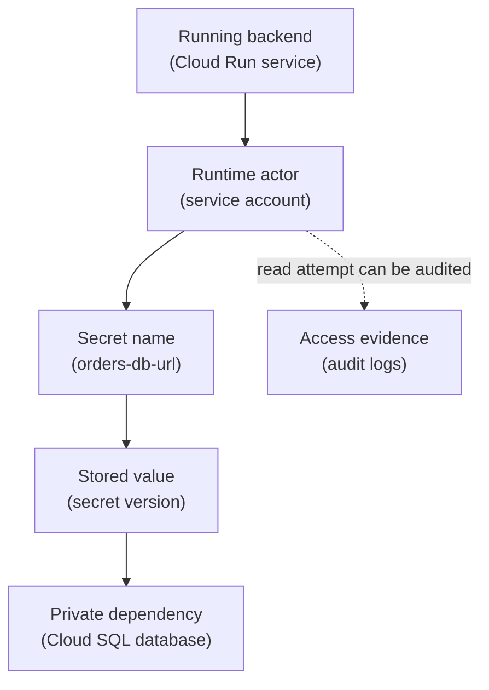

## Table of Contents

1. [Secrets Are Configuration With Consequences](#secrets-are-configuration-with-consequences)
2. [What Secret Manager Stores](#what-secret-manager-stores)
3. [Names Are Not The Same As Values](#names-are-not-the-same-as-values)
4. [Versions Make Rotation Possible](#versions-make-rotation-possible)
5. [IAM Controls Who Reads Payloads](#iam-controls-who-reads-payloads)
6. [The Orders API Secret Flow](#the-orders-api-secret-flow)
7. [Rotation Is A Release Plan](#rotation-is-a-release-plan)
8. [Encryption Is The Baseline, Not The Whole Story](#encryption-is-the-baseline-not-the-whole-story)
9. [Where Cloud KMS Fits](#where-cloud-kms-fits)
10. [Local Development And Test Secrets](#local-development-and-test-secrets)
11. [Failure Modes](#failure-modes)
12. [A Practical Secret Review](#a-practical-secret-review)
13. [The Habit To Build](#the-habit-to-build)

## Secrets Are Configuration With Consequences

Applications need configuration. Some configuration is harmless. A feature flag name, a
public API base URL, or a default page size can often be visible to many engineers. Other
configuration is sensitive. A database password is sensitive. A payment provider token is
sensitive. A signing key is sensitive. A private webhook token is sensitive. Those values
are secrets because knowing the value gives someone power the system did not intend to give
them.

That is why secrets should not be treated like normal environment variables in a README.
They should not be committed to Git. They should not be pasted into tickets. They should not
be copied into chat. They need a storage place with access control, versioning, audit
evidence, and a rotation path. In GCP, Secret Manager is the managed service for storing
secret values.

It does not remove the need for careful application design. It gives the team a better place
to store, read, rotate, and review secret access.

## What Secret Manager Stores

Secret Manager stores secrets. A secret is the named container. A secret version is one
stored value inside that container. That split is important. The name `orders-db-url` can
stay stable while the value changes over time. Version 1 might contain an old database
connection string. Version 2 might contain a rotated connection string. The application can
read the latest enabled version or a specific version depending on the design.

For a beginner, picture the shape like this:



The secret name identifies the entry. The version contains the sensitive payload. The
service account must have permission to access that payload. The app uses the payload to
connect to the dependency. That is the basic flow.

## Names Are Not The Same As Values

New teams sometimes hide secret names as if the name were the secret. The sensitive part is
the payload. It is usually fine for engineers to know that a production secret called
`orders-db-url` exists. It is risky for every engineer to read the database password inside
that secret.

This distinction makes access design easier. Some people may need to manage secret metadata.
Fewer people need to read secret payloads. Some automation may need to create new versions.
The runtime service may only need to read the current value. Those are different jobs.
Different jobs should receive different roles. For example:

| Job | Needs payload access? | Typical access shape |
|---|---|---|
| Runtime app | Yes | Read selected secret versions |
| Platform operator | Maybe | Manage secret metadata and versions |
| On-call debugger | Rarely | Prefer logs and configuration evidence first |
| CI/CD deployer | Usually no | Deploy app without reading runtime secret values |

Use the table to avoid giving payload access just because someone works on the service.

## Versions Make Rotation Possible

Secret rotation means changing the secret value. Rotation can happen because a credential
expired. It can happen because a vendor asks for a new token. It can happen because a value
may have leaked. It can also happen as a normal security habit. Versions make rotation safer
because the secret name can stay stable. The app keeps asking for `orders-db-url`.

Secret Manager can hold a new enabled version under that same secret. The risky part is
making sure the app and dependency agree on the new value. For a database password, rotation
usually involves both sides. The database must accept the new credential. The secret must
store the new credential.

The app must read and use the new credential. Old connections may still exist for a short
time. A rollback plan may be needed if the new value breaks production. Treat secret
rotation as a release plan that includes storage, the app, and the dependency. The safest
rotation plans define the order, the validation check, and the rollback target.

## IAM Controls Who Reads Payloads

Secret Manager stores the secret. IAM controls who can read it. For `devpolaris-orders-api`,
the runtime service account may need access to one production secret:

```text
orders-api-prod@devpolaris-orders-prod.iam.gserviceaccount.com
```

The target secret is:

```text
projects/devpolaris-orders-prod/secrets/orders-db-url
```

The access sentence should be narrow:

```text
orders-api-prod service account
can access versions of orders-db-url
```

That sentence is different from:

```text
orders-api-prod service account
can access every secret in devpolaris-orders-prod
```

The second sentence may be easier to set up. It is also wider than the app needs. The narrow
grant is usually better when the service supports it and the operational cost is reasonable.
This is where Secret Manager and IAM meet. Secret Manager gives the secret a home. IAM
decides which principals can open the door.

Cloud Audit Logs help show who opened or changed the door.

## The Orders API Secret Flow

The orders API needs a database URL. The team does not want the database password in source
code. It also does not want the password baked into the container image. So the value lives
in Secret Manager. The runtime service account gets access to that secret. At startup, the
app reads the secret and creates its database connection.

A plain-English release record might say:

```text
secret: orders-db-url
project: devpolaris-orders-prod
current version: 7
reader: orders-api-prod service account
used by: Cloud Run service devpolaris-orders-api
validation: /health/db returns ok after revision starts
rollback target: version 6 until database credential is removed
```

This release record tells the team what changed and how to check it. The validation matters
because a secret can exist and still be wrong. The app may read the secret successfully,
then fail to connect because the value is malformed. Secret access proves permission. It
does not prove the value is correct.

For that, the app needs a health check or a smoke test that exercises the dependency.

## Rotation Is A Release Plan

A secret rotation can break production even when IAM is correct. Imagine the team rotates
`orders-db-url`. The new secret value points to the right database host. But it uses the
wrong username. Secret Manager works. The app reads the new value. The database rejects the
connection. From the app's point of view, production is down.

That is why rotation needs the same care as a deploy. Before rotation, know which app uses
the secret. Know whether the app reads the secret at startup or refreshes it while running.
Know how to verify the new value. Know how to go back to the previous version if needed.
Know when the old credential can be disabled.

A simple rotation plan might be:

```text
1. Add the new database credential while the old one still works.
2. Add a new Secret Manager version with the new connection string.
3. Restart or roll the Cloud Run service so it reads the new value.
4. Check database health and checkout smoke tests.
5. Keep the old version available until the release is stable.
6. Disable the old database credential after the rollback window.
```

The main lesson is that the secret, the app, and the dependency must move together.

## Encryption Is The Baseline, Not The Whole Story

GCP encrypts data in many managed services. That baseline matters. But beginners often hear
"encrypted" and assume the security work is done. Encryption protects data at rest and in
transit in important ways. Access control still decides which engineer or workload can read
a secret payload. A leaked service account key is still dangerous. An overpowered runtime
service account can still read too many secrets. A rotated value can still be wrong.

Access control, audit logs, network design, and application behavior still matter. For
Secret Manager, the practical beginner focus is: Where is the secret stored? Who can access
the payload?

Which workload uses it? How is the value rotated? What evidence exists when it is read or
changed? Those questions help more than saying "it is encrypted" and stopping.

## Where Cloud KMS Fits

Cloud KMS (Key Management Service) is GCP's managed service for creating, storing, and using
cryptographic keys. A cryptographic key is a controlled secret used to encrypt, decrypt,
sign, or verify data depending on the key type and use case. Many teams first meet KMS
through customer-managed encryption keys. That means the team manages a key in KMS and
configures certain Google Cloud resources to use that key for encryption.

This gives the team more control over key lifecycle and access. It also gives the team more
responsibility. If the key is disabled, destroyed, or inaccessible, the protected data or
service can become unusable. That is a serious operational tradeoff. For beginners, keep the
difference clear: Secret Manager stores secret values like passwords and tokens.

Cloud KMS manages encryption keys. Some services can use KMS keys to encrypt their data. KMS
is not a better place to paste every database password. Use Secret Manager for application
secrets. Use KMS when you need key management for encryption, signing, or customer-managed
encryption key requirements. The two services can work together in a security design, but
they solve different problems.

## Local Development And Test Secrets

Local development needs care too. Do not train the team to copy production secrets onto
laptops. A development project can have development secrets. A staging project can have
staging secrets. Production secrets should be harder to read. If a developer needs to test
secret reading logic, use a safe test value in a non-production project.

For example:

```text
project: devpolaris-orders-dev
secret: orders-db-url
value: connection string for a disposable development database
reader: orders-api-dev service account
```

This lets the app exercise the same shape without carrying production risk. The shape
matters. The app still reads from Secret Manager. The service account still needs IAM. The
secret still has versions. The value is safer if it leaks. Do not use `.env` files as the
main lesson for cloud secret behavior. They are useful for some local workflows.

They do not teach GCP IAM, audit logs, or rotation.

## Failure Modes

The first failure is secret metadata access without payload access. An engineer can see that
`orders-db-url` exists. The app still fails because the runtime service account cannot
access the secret version payload. The fix direction is to grant the right payload access
role to the runtime service account on the correct secret. The second failure is payload
access at the wrong scope.

The app receives secret access on the whole project. Production works, but the app can read
unrelated secrets. The fix direction is to narrow the binding to the secrets the app needs
when possible. The third failure is a rotated value that the dependency rejects. Secret
Manager returns the new value. The database refuses the connection.

The fix direction is to validate the dependent system and keep a rollback version until the
release is stable. The fourth failure is a deleted or disabled version used by a running
service. The app asks for a specific version that is no longer enabled. The fix direction is
to understand whether the app should track latest or a pinned version, then restore or
deploy the correct reference.

The fifth failure is treating KMS as a general secret store. The team stores application
tokens in the wrong service or builds custom encryption flows it does not need. The fix
direction is to use Secret Manager for application secrets and KMS for encryption keys.

## A Practical Secret Review

Review secrets as operating resources with owners, readers, rotation plans, and evidence.

For each production secret, ask:

| Question | Why it matters |
|---|---|
| What application uses this secret? | A secret without an owner becomes mystery risk |
| Which project owns it? | Names repeat across environments |
| Which principals can read the payload? | Payload readers have sensitive access |
| Which principals can add versions? | Version writers can change runtime behavior |
| How is it rotated? | Rotation without a plan can break the app |
| What validates the value? | Secret access does not prove the value works |
| What is the rollback version? | Bad values need a safe return path |

The review should produce readable notes.

For example:

```text
orders-db-url
  owner: orders team
  runtime reader: orders-api-prod service account
  rotation check: /health/db and checkout smoke test
  rollback: previous enabled version until database credential is retired
```

That note is useful during an incident.

It tells the team who owns the secret, who reads it, and how to recover from a bad value.

## The Habit To Build

Treat secrets as living dependencies that connect the app to other systems. They need
owners. They need narrow readers. They need rotation plans. They need validation. They need
audit evidence. They need cleanup when the dependency goes away. Secret Manager gives GCP
teams a good managed home for these values.

IAM decides who can open that home. Cloud KMS handles key-management needs when encryption
control is the problem. Audit logs help show what changed or was accessed. The mature habit
is to connect all of those pieces without making the article or the system more complicated
than the secret deserves. For `devpolaris-orders-api`, the rule is plain: The app can read
the secrets it needs to serve orders.

It should not read secrets for unrelated services. The deploy pipeline should not read the
database password just to deploy a new revision. That boundary is practical security.

---

**References**

- [Secret Manager overview](https://cloud.google.com/secret-manager/docs/overview) - Official introduction to secrets, versions, and Secret Manager concepts.
- [Secret Manager access control](https://cloud.google.com/secret-manager/docs/access-control) - Explains IAM roles and permissions for secrets and secret versions.
- [Secret Manager rotation](https://cloud.google.com/secret-manager/docs/rotation-recommendations) - Gives Google guidance for rotating secrets safely.
- [Cloud KMS overview](https://cloud.google.com/kms/docs) - Explains GCP key management and where KMS fits in encryption designs.
- [Encryption at rest in Google Cloud](https://cloud.google.com/docs/security/encryption/default-encryption) - Documents Google's default encryption model for data stored in Google Cloud.
