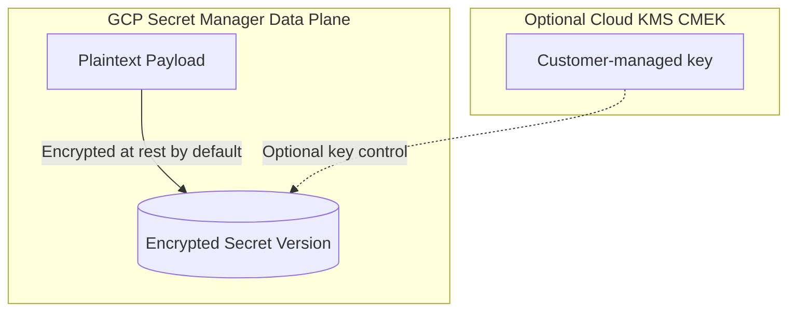

## Table of Contents

1. [Secret Manager](#secret-manager)
2. [Secrets and Versions Logical Separation](#secrets-and-versions-logical-separation)
3. [Rotation Notifications and Pub/Sub Hooks](#rotation-notifications-and-pub-sub-hooks)
4. [VPC Service Controls and Perimeter Security](#vpc-service-controls-and-perimeter-security)
5. [Cross-Cloud Mapping Reference](#cross-cloud-mapping-reference)
6. [Putting It All Together](#putting-it-all-together)

## Secret Manager

Secret Manager is a secure, managed Google Cloud service designed to store, manage, and audit sensitive runtime configuration values such as database connection strings, third-party API tokens, cryptographic private keys, and certificates. Rather than storing dangerous plain-text values inside version control repositories, dynamic application filesystems, or environmental variables, Secret Manager provides a dedicated security control point.

By housing secrets inside a managed API service, you decouple sensitive data from runtime execution code. Applications retrieve credentials programmatically at startup or during execution, ensuring that dangerous payloads remain completely isolated from operators and unauthorized systems.

Secret Manager unifies secret storage under a managed service boundary. It manages version transitions, enforces granular IAM access controls, generates auditable access logs, encrypts data at rest by default, and can integrate with customer-managed encryption keys when your compliance model requires them.

## Secrets and Versions Logical Separation

A major operational gotcha in credentials management is the difficulty of rotating secrets without causing application downtime. If a password is bound to a single configuration variable, rotating that credential forces a redeployment or container restart. Secret Manager solves this by establishing a strict logical separation between a **Secret** and its **Versions**.


*Rotation changes which version is used without changing the resource identity.*

The **Secret** is the named logical container (e.g. `projects/dev-project/secrets/orders-db-url`). It defines the metadata, IAM access policies, replication locations, and rotation schedules. The secret container itself does not store sensitive payloads; it acts as the stable resource address that your application references.

A **Secret Version** represents the actual encrypted payload (e.g. version `1`, `2`, or `3`) stored within that container. Versions are immutable; once a payload is written to a version, it cannot be modified. If the database password changes, you add a new version to the container.

This split enables seamless credential rotations:

*   **Stable References**: Application code can request the latest active payload dynamically by querying the virtual path suffix `/versions/latest`, eliminating the need to update container environment variables when credentials change.
*   **Version Lifecycles**: Old versions can be disabled (temporarily blocking access) or destroyed (permanently shredding the payload) systematically, allowing you to transition workloads to new credentials with minimal operational risk.

:::expand[Design Detail: Default Encryption, CMEK, and HSM Choices]{kind="design"}
Understanding encryption options prevents a common compliance mistake. Secret Manager encrypts secret data at rest by default with Google-managed encryption. You can optionally configure customer-managed encryption keys (CMEK) so your organization controls the Cloud KMS key used for a secret.

The beginner-safe way to explain the encryption model is to separate what Google Cloud does by default from the extra controls your team can choose:



1.  **Default Protection**: Secret Manager encrypts secret data at rest using Google-managed encryption.
2.  **CMEK Option**: With CMEK, Secret Manager uses Cloud KMS so your team controls the key lifecycle and can disable or rotate that key according to policy.
3.  **HSM Option**: HSM-backed protection applies only when the Cloud KMS key itself uses the HSM protection level. Do not describe every Secret Manager secret as HSM-backed by default.

When an application authorized by IAM requests a version, Secret Manager returns the secret payload through the API. The operational controls you manage are IAM scope, version state, rotation workflow, replication, audit logs, and optional CMEK configuration.
:::

## Rotation Notifications and Pub/Sub Hooks

To maintain a secure posture, production credentials must be rotated on a deliberate schedule. Secret Manager can integrate with **Cloud Pub/Sub** to notify automation when a secret reaches its configured rotation time:


*Rotation is safest when the version change is visible and repeatable.*

1.  **Rotation Schedule Configuration**: You define a rotation schedule and a target Pub/Sub topic on the secret.
2.  **Rotation Notification**: At the configured time, Secret Manager publishes a `SECRET_ROTATE` event to the Pub/Sub topic.
3.  **Automation Handler**: A subscriber, such as a Cloud Run service or Cloud Run function, performs the real credential work. It might connect to the backing database, generate a new password, test it, and add a new Secret Manager version.
4.  **Graceful Rollout**: Application code reads a specific version, alias, or `latest` through the Secret Manager API. Once the new credential is verified across the fleet, automation can disable or destroy the old version after a grace window.

Secret Manager does not rotate the database password or third-party token by itself. It gives you the versioned storage and the notification point so your automation can perform the rotation safely and leave audit evidence.

## VPC Service Controls and Perimeter Security

In highly secure environments, standard IAM policies are insufficient to protect against insider data exfiltration. If a malicious insider or a compromised container possesses the correct IAM `Secret Manager Secret Accessor` role, they can extract payloads from any device globally. To prevent this, you enforce **VPC Service Controls (VPC-SC)** perimeters.

VPC Service Controls allows you to draw a logical security perimeter around supported Google-managed services, including Secret Manager:

```mermaid
flowchart LR
    subgraph ExternalDevice["Public Device / External Network"]
        Attacker["Operator with IAM Accessor Role"]
    end

    subgraph VPCSCPerimeter["VPC Service Controls (VPC-SC) Perimeter"]
        subgraph CustomerVPC["Customer VPC Subnet"]
            AppVM["App VM Instance"]
        end
        SecretManager["Secret Manager Resource"]
    end

    AppVM -->|1. Request from VPC| SecretManager
    SecretManager -->|Allowed| AppVM

    Attacker -->|1. Request from Internet| SecretManager
    SecretManager -->|Blocked by API Gateway<br/>(403 VPC Service Controls)| Attacker
```

VPC Service Controls is independent of IAM. IAM still decides whether the principal has permission to access the secret. VPC-SC adds a perimeter check that can restrict data movement across perimeter boundaries using ingress and egress rules and optional access levels.

If an operator with correct IAM roles attempts to access a protected secret from outside the allowed perimeter path, the request can still be rejected by VPC Service Controls. This makes VPC-SC a defense-in-depth control for exfiltration risk, not a replacement for narrow secret-level IAM.

## Cross-Cloud Mapping Reference

This table maps core GCP Secret Manager components to their direct AWS and Azure equivalents:

| GCP Component | AWS Equivalent | Azure Equivalent | Operational Behavior |
| :--- | :--- | :--- | :--- |
| **Secret** | Secret Container | Secret | Logical container hosting metadata, IAM policies, and rotation schedules. |
| **Secret Version** | Secret Version (with Labels) | Secret Version | Immutable physical payload stored within the secret container. |
| **Pub/Sub Rotation Hook**| Rotation Lambda Integration| Event Grid Integration | Asynchronous trigger hooks to automate credentials generation and rotation. |
| **VPC-SC Perimeter** | VPC Endpoint Policy | Private Endpoint + NSG | Network-level perimeter security that blocks cross-boundary exfiltration. |

## Putting It All Together

Protecting runtime credentials requires a multi-layered security architecture.

By separating secrets from versions, you decouple connection strings from application code, allowing your microservices to query the latest credential payload dynamically.

Secret Manager encrypts secret data at rest by default, and CMEK lets you bring a Cloud KMS key when your organization needs key-level control. HSM-backed keys are an optional Cloud KMS protection choice, not the default behavior of every secret.

Pub/Sub integration gives your rotation automation a reliable signal, and VPC Service Controls perimeters add a second boundary around supported Google APIs when insider or compromised-credential exfiltration is a concern.

This completes the Identity & Security architecture: your workloads can use keyless identities, and sensitive application configuration can live in Secret Manager with IAM, audit logs, encryption, rotation workflows, and optional perimeter controls.


*Use this summary as the quick mental checklist before designing or debugging the service.*


---

**References**

- [Google Cloud: Secret Manager overview](https://cloud.google.com/secret-manager/docs/overview) - Core specification for managed secrets and versions.
- [Google Cloud: Secret Manager CMEK](https://cloud.google.com/secret-manager/docs/cmek) - Explains customer-managed encryption key behavior for Secret Manager.
- [Google Cloud: Secret rotation](https://cloud.google.com/secret-manager/docs/secret-rotation) - Documents rotation schedules and `SECRET_ROTATE` Pub/Sub notifications.
- [Google Cloud: Access a secret version](https://cloud.google.com/secret-manager/docs/access-secret-version) - Describes version numbers, aliases, and `latest` access.
- [Google Cloud: Secret Manager access control](https://cloud.google.com/secret-manager/docs/access-control) - Guide to enforcing least-privilege IAM roles on secret resources.
- [Google Cloud: VPC Service Controls overview](https://cloud.google.com/vpc-service-controls/docs/overview) - Technical reference for building logical network perimeters around APIs.
