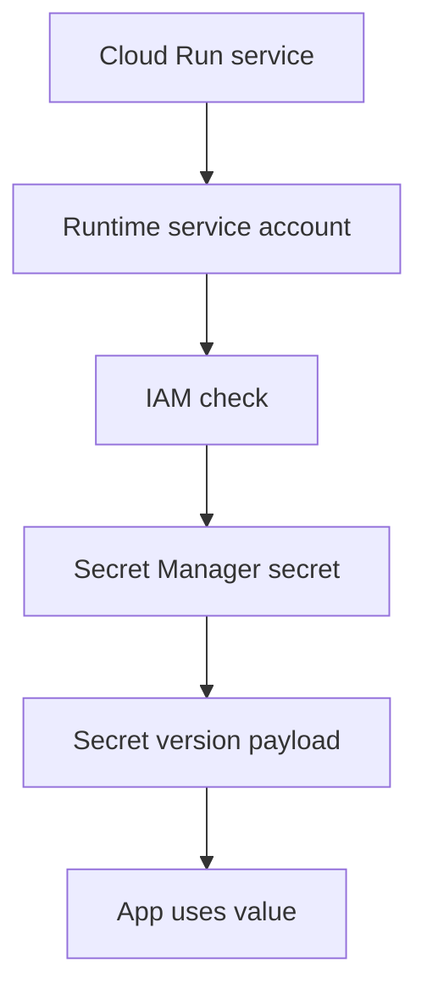

## Table of Contents

1. [The Problem](#the-problem)
2. [Secret Manager](#secret-manager)
3. [Secrets And Versions](#secrets-and-versions)
4. [Secret Access](#secret-access)
5. [Runtime Flow](#runtime-flow)
6. [Rotation](#rotation)
7. [Audit Evidence](#audit-evidence)
8. [Encryption](#encryption)
9. [KMS](#kms)
10. [Review Shape](#review-shape)
11. [Putting It All Together](#putting-it-all-together)

## The Problem

The Orders API needs a few dangerous values. It needs a database URL, a payment webhook signing secret, and perhaps a token for a third-party provider.

Those values start in convenient places:

- A developer keeps the database URL in a local `.env` file.
- A pipeline variable stores the production value but does not say which app uses it.
- A secret is pasted into a ticket during an incident.
- An old Cloud Run revision keeps using a previous value after rotation.

The problem is not that configuration exists. Applications need configuration. The problem is that some configuration gives power to whoever can read it.

The beginner question is:

> Where should sensitive runtime values live, and who can read them?

In GCP, the first answer is Secret Manager.

## Secret Manager

Secret Manager is the managed GCP service for storing and managing sensitive values such as API keys, passwords, certificates, and tokens. It gives the team a named place for secrets, versioned values, IAM access control, audit evidence, and encryption behavior.

Secret Manager does not make every design safe by itself. It gives the team a better control point than Git, chat, tickets, local files, or broad pipeline variables.

For the Orders API, a secret might be:

```text
project: devpolaris-orders-prod
secret: orders-db-url
purpose: database connection value for production runtime
reader: orders-api-prod service account
```

That record is already safer than "the password is in the deploy notes." The name is stable. The payload is controlled. Access can be reviewed.

## Secrets And Versions

Secret Manager separates the secret from its versions.

The secret is the named container:

```text
orders-db-url
```

A secret version is a stored payload inside that container:

```text
orders-db-url version 1
orders-db-url version 2
orders-db-url version 3
```

That split makes rotation possible. The app can keep referring to the same secret name while the value changes over time. A new version can be added. An old version can be disabled or destroyed according to the team's process. Some systems pin a specific version; others read the latest enabled version.

The non-obvious truth is that the secret name is usually not the dangerous part. The payload is. It is often fine for engineers to know a production secret named `orders-db-url` exists. It is not fine for every engineer to read the connection string value inside it.

## Secret Access

Secret access is still IAM. The runtime service account needs a role that allows it to access the secret version payload.

For the Orders API, the access sentence should be narrow:

```text
serviceAccount:orders-api-prod@devpolaris-orders-prod.iam.gserviceaccount.com
gets Secret Manager Secret Accessor
on secret orders-db-url
```

Granting access at the project can be convenient, but it may allow the app to read more secrets than needed. Granting access at the secret keeps the blast radius smaller when the service only needs one value.

Also separate readers from managers. A runtime service account may need to read the current secret value. It usually should not create, rotate, disable, destroy, or grant access to secrets.

## Runtime Flow

The runtime flow has four parts:



Read it slowly:

1. The Cloud Run service runs as a service account.
2. The app asks Secret Manager for a value.
3. IAM checks whether that service account can access the secret version.
4. Secret Manager returns the payload if the request is allowed.
5. The app uses the value to connect to the dependency.

If the app fails, each part is evidence. Which service account did Cloud Run use? Which secret path did the app request? Which version was read? Which IAM binding allows access? What did the audit logs show?

## Rotation

Rotation means changing a secret value safely. It is not only "upload a new value." The app, dependency, rollout, and rollback path all matter.

For a database URL, a rotation might look like this:

| Step | Why it matters |
| --- | --- |
| Create or prepare the new database credential | The dependency must accept the new value. |
| Add a new secret version | The secret name stays stable while the payload changes. |
| Deploy or restart the app path that reads the value | The runtime must actually use the new version. |
| Verify checkout and database connections | The new value must work for users. |
| Disable or remove old credential after a safe window | Old access should not live forever. |

Rotation is a release plan. If old revisions still use the old value, disabling it too early can break traffic. If old values never get disabled, rotation becomes a ritual instead of risk reduction.

## Audit Evidence

Secret review should gather evidence without exposing the payload.

Useful evidence includes:

| Evidence | What it proves |
| --- | --- |
| Secret name and project | Which controlled value is involved. |
| Version metadata | Which version exists, is enabled, or was disabled. |
| IAM policy | Which principals can access the payload. |
| Cloud Run revision config | Which runtime service account asks for the secret. |
| Audit logs | Who accessed or changed secret metadata or versions, where supported. |
| Rotation record | Which app version uses which secret version or latest value. |

Avoid pasting secret values into tickets or chat to prove work happened. Prove the value changed by showing metadata, version state, deployment evidence, and successful app behavior.

## Encryption

Secret Manager encrypts secret data in transit and at rest. That baseline matters, but it is not the whole security story.

Encryption protects stored and transmitted data at the platform layer. IAM still decides who can read the payload. Audit logs still help explain who accessed or changed things. Rotation still limits how long a compromised value remains useful. Application design still decides whether the secret gets copied into logs or error messages.

Do not use "it is encrypted" as a reason to grant broad access. Encryption and access control solve different parts of the problem.

## KMS

Cloud Key Management Service, or Cloud KMS, manages cryptographic keys. Secret Manager can use Google-managed encryption by default, and for workloads that require more control, Secret Manager can use customer-managed encryption keys, often called CMEK.

For a beginner, KMS belongs in the "extra control and compliance" conversation, not in every first secret review.

Use KMS questions when the team has a real requirement:

| Question | Why it matters |
| --- | --- |
| Do we need customer-managed keys for this secret? | Some compliance or control requirements demand it. |
| Who can administer the key? | Key admins can affect secret availability. |
| Is the key in the right location for the secret behavior? | CMEK has location and service constraints. |
| What happens if the key is disabled? | The secret may become unusable. |

KMS can strengthen control. It also adds an operating dependency. Treat it as a deliberate design choice.

## Review Shape

A practical secret review for the Orders API should answer:

| Question | Example answer |
| --- | --- |
| Which secret? | `projects/devpolaris-orders-prod/secrets/orders-db-url` |
| What is stored? | Database connection value, not pasted in review. |
| Who reads it? | `orders-api-prod` runtime service account. |
| Who manages it? | A small platform or database operations group. |
| How does rotation work? | New version, app rollout, verification, old credential disabled. |
| What evidence is safe to share? | Version state, IAM binding, audit logs, app health, no payload. |

That shape keeps sensitive values out of ordinary conversation while still making security review concrete.

## Putting It All Together

Return to the opener.

- The `.env` file became a local development detail, not the production secret store.
- The pipeline variable became a controlled Secret Manager entry.
- The pasted ticket value became safe metadata and audit evidence instead of a payload leak.
- The old revision problem became a rotation and rollout question.
- The runtime service account got read access to the needed secret, not broad power over every secret.
- Encryption and KMS became part of the protection story without replacing IAM or rotation.

Secret Manager is the place where sensitive runtime values become named, versioned, access-controlled, auditable resources. That closes the identity and security module: the next GCP module can now talk about networks knowing who the callers are and where secrets live.

---

**References**

- [Secret Manager overview](https://docs.cloud.google.com/secret-manager/docs/overview)
- [Access control with IAM](https://cloud.google.com/secret-manager/docs/access-control)
- [Access and manage secret versions](https://cloud.google.com/secret-manager/docs/access-secret-version)
- [Enable customer-managed encryption keys for Secret Manager](https://cloud.google.com/secret-manager/docs/cmek)
