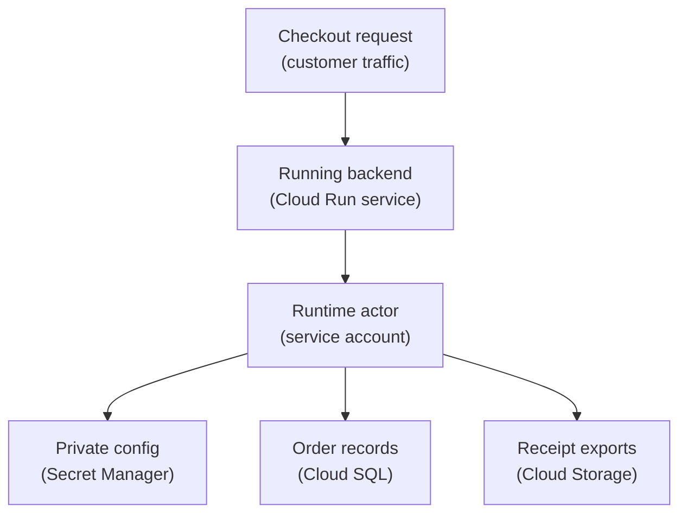

## Table of Contents

1. [Software Needs Its Own Identity](#software-needs-its-own-identity)
2. [What A Service Account Is](#what-a-service-account-is)
3. [If AWS Roles Or Azure Managed Identities Are Familiar](#if-aws-roles-or-azure-managed-identities-are-familiar)
4. [The Orders API Runtime Identity](#the-orders-api-runtime-identity)
5. [Runtime Identity Is Not Deploy Identity](#runtime-identity-is-not-deploy-identity)
6. [The Act As Permission](#the-act-as-permission)
7. [Keys Are A Last Resort](#keys-are-a-last-resort)
8. [Workload Identity Federation For CI/CD](#workload-identity-federation-for-cicd)
9. [Naming Service Accounts Clearly](#naming-service-accounts-clearly)
10. [What To Grant To The Orders API](#what-to-grant-to-the-orders-api)
11. [Failure Modes](#failure-modes)
12. [A Review Checklist For Service Accounts](#a-review-checklist-for-service-accounts)
13. [The Operating Habit](#the-operating-habit)

## Software Needs Its Own Identity

A production application should not borrow a developer's login. That sentence sounds obvious
once you hear it. But many early cloud mistakes come from doing exactly that in a hidden
way. A developer runs a command locally. The command uses the developer's credential. The
command works. The team assumes the app has the same access.

Then the app runs in production and fails. Or worse, the team copies a human credential into
an environment variable so the production app can keep working. That creates a bigger
problem. Now a service depends on a person. If the person leaves, rotates a password, loses
access, or has too much permission, the app inherits that confusion.

GCP gives software its own identity through service accounts. The service account becomes
the actor in IAM policies. Cloud Run can run as that service account. A CI/CD pipeline can
deploy using a separate service account. The team can grant each identity the access for its
job and no more. This is the center of safe GCP automation.

## What A Service Account Is

A service account is an identity for software. It is a named principal that applications,
virtual machines, jobs, functions, and pipelines can use when they call Google Cloud APIs.
Service accounts have email-like names. For example:

```text
orders-api-prod@devpolaris-orders-prod.iam.gserviceaccount.com
```

The first part names the job. The middle part names the project. The suffix says it is a GCP
service account. That service account can receive IAM roles. It can be attached to a runtime
such as Cloud Run. It can appear in audit logs. It can be allowed or denied just like a
human principal.

The important difference is ownership. A human identity belongs to a person. A service
account belongs to a workload or automation path. That makes it easier to reason about
production. The orders API does not need Ana's access. It needs the access required by the
orders API.

## If AWS Roles Or Azure Managed Identities Are Familiar

If you know AWS, a GCP service account plays a role similar to a workload identity. You
might attach an IAM role to an EC2 instance, ECS task, or Lambda function. The workload then
uses that role when it calls AWS APIs. In GCP, Cloud Run, Compute Engine, Cloud Functions,
and other runtimes can use service accounts as their identity.

If you know Azure, compare this with managed identities. An Azure managed identity lets an
app authenticate to Azure services without storing a password. A GCP service account fills a
similar daily need, but the GCP naming and IAM binding model is different. The useful habit
carries across providers: Do not put human credentials in production apps.

Do not make the deploy identity and runtime identity the same by habit. Do not give the
workload more permissions than the job needs. The GCP-specific detail is that the service
account is a visible principal with an email-like name. You will see it in IAM bindings,
Cloud Run service settings, audit logs, and error messages.

When a GCP permission failure happens, ask:

> Which service account was the workload actually using?

That question prevents a lot of guessing.

## The Orders API Runtime Identity

The runtime identity is the identity used by a running application.

For `devpolaris-orders-api`, the runtime identity might be:

```text
orders-api-prod@devpolaris-orders-prod.iam.gserviceaccount.com
```

Cloud Run runs the container. The Node.js code handles checkout requests. When the code
calls Secret Manager, Cloud SQL, Cloud Storage, or another GCP service, the request is made
as the runtime service account. That picture matters more than the code language. The Node
process is not automatically trusted because it is running on Cloud Run.

It has the permissions attached to the service account Cloud Run uses for that revision.
Here is the simple flow:



The service account is the identity GCP checks when the app reaches for cloud resources. If
the service account lacks secret access, the app fails even if the developer who deployed it
has secret access. If the service account has too much storage access, a bug in the app may
touch data it should never touch.

Runtime identity is part of application design.

## Runtime Identity Is Not Deploy Identity

The deploy identity is the identity that changes the running service. It might be used by
GitHub Actions, Cloud Build, or another CI/CD system. The runtime identity is the identity
the app uses after deployment. Those jobs are different. The deployer needs to update Cloud
Run. It may need to read an image from Artifact Registry.

It may need permission to configure which service account the Cloud Run service uses. The
runtime service account needs to read runtime dependencies such as secrets, database access,
and storage buckets. It does not need permission to deploy itself. A common beginner
shortcut is to use one service account for both jobs. The shortcut works.

It also mixes two risk shapes. If the running app has deployment permissions, an application
bug or server-side request issue has a wider path to change infrastructure. If the deployer
has runtime data permissions, a CI/CD mistake or compromised pipeline can read production
secrets or data. Separate identities make the boundary clearer. For example:

```text
runtime:
  orders-api-prod@devpolaris-orders-prod.iam.gserviceaccount.com

deployer:
  orders-deployer@devpolaris-build.iam.gserviceaccount.com
```

The names tell you the job before you open the IAM page.

## The Act As Permission

There is one GCP detail that surprises many learners. Giving a deployer permission to update
Cloud Run is not always enough. If the deployer configures the Cloud Run service to run as a
service account, GCP must also decide whether the deployer may use that service account.
This is often described as "act as" access.

Act-as access lets the deployer attach that service account to the service it is deploying.
That extra check prevents a dangerous shortcut. Without it, a user who can deploy could
choose a very privileged service account and make their code run with that access. For
`devpolaris-orders-api`, the deployer may need permission to deploy Cloud Run and permission
to act as:

```text
orders-api-prod@devpolaris-orders-prod.iam.gserviceaccount.com
```

If this permission is missing, the deployment can fail even though the Cloud Run update role
looks correct. The failure is useful. It means GCP is protecting the runtime identity from
being attached by someone who has not been allowed to use it. When deploy fails with a
service-account-related permission error, check two questions. Can the deploy identity
update the runtime?

Can it act as the runtime service account? Both questions matter.

## Keys Are A Last Resort

Service accounts can have keys. A key is a credential file that lets software authenticate
as the service account. Keys are convenient because they can be downloaded and used outside
GCP. That convenience is exactly why they are risky. A key file can be copied. It can be
committed to a repository. It can be pasted into a ticket.

It can stay valid after the person who created it forgets about it. If a key leaks, anyone
with the file can act as that service account until the key is disabled or deleted. For many
modern workloads, you should avoid long-lived service account keys. Cloud Run can use an
attached service account without a key file.

Compute Engine can use attached service accounts without a key file. CI/CD systems can often
use workload identity federation instead of a downloaded key. This is a major security
improvement because the credential becomes short-lived and tied to a trusted identity path.
If a team still uses keys, it needs a clear reason. It also needs rotation, storage, and
removal practices.

A key should never be the first answer just because it is quick.

## Workload Identity Federation For CI/CD

Many teams deploy from outside GCP. GitHub Actions is a common example. The old way was
often to create a service account key, store it as a repository secret, and let the workflow
use that key. That works, but the key becomes a sensitive long-lived secret. Workload
identity federation is a safer pattern. Federation means GCP trusts a short-lived identity
from another system instead of requiring a copied service account key.

For a GitHub Actions workflow, the external system can present an OIDC (OpenID Connect, a
standard way to send signed identity claims) token. GCP checks whether that external
identity is allowed to impersonate or use a target service account. The workflow gets
temporary access for the deployment job. No static service account key needs to live in
GitHub secrets.

The setup is more involved than pasting a JSON key. The payoff is better security. The CI/CD
identity can be tied to a repository, branch, environment, or other trusted claim. If the
workflow changes, you can review the trust relationship. For beginners, the concept is
enough:

> Prefer short-lived, workload-tied credentials over downloaded service account keys.

The exact setup belongs in a CI/CD or identity federation article.

Here we only need the security shape.

## Naming Service Accounts Clearly

Names are part of security because names are how humans review access. A service account
called `default` tells you almost nothing. A service account called `prod-admin` may be too
broad and still not tell you which workload owns it. A better name describes the workload
and environment:

```text
orders-api-prod@devpolaris-orders-prod.iam.gserviceaccount.com
orders-worker-prod@devpolaris-orders-prod.iam.gserviceaccount.com
orders-deployer@devpolaris-build.iam.gserviceaccount.com
```

These names are not perfect, but they are readable. They show the service, job, and
environment. That matters during an incident. If audit logs show `orders-api-prod`, the team
has a good first guess. If logs show `svc-123`, the team has to search for meaning before it
can debug the real problem. Clear names also reduce accidental sharing.

If a new export worker needs storage access, it should not borrow the orders API runtime
identity just because it already exists. Create a service account for the worker. Grant the
worker what it needs. Keep the access story clean.

## What To Grant To The Orders API

The runtime service account should receive access based on the app's actual dependencies.

For `devpolaris-orders-api`, that might include:

| Need | Possible target | Permission shape |
|---|---|---|
| Read database URL | One Secret Manager secret | Secret value access |
| Connect to Cloud SQL | One database instance or project setup | Database connection access |
| Write receipt exports | One Cloud Storage bucket | Object create or object write access |
| Emit logs | Logging service path | Usually handled by the runtime environment |
| Read container image | Artifact Registry path | Needed by the runtime or deployment path depending on setup |

Use this table as a thinking plan rather than a copy-paste permission plan. Start from the
app's dependency list. Then map each dependency to a resource. Then choose the smallest role
and scope that supports the dependency. Avoid granting permissions because "the app may need
it later." Later is when you add access with a new reason.

Production IAM should describe current needs. The deployer identity gets a different map. It
needs to update Cloud Run. It may need to push or select a container image. It may need to
act as the runtime service account. It does not need to read the database password. That
separation is the main lesson.

## Failure Modes

The first failure is using the default service account without noticing. Some GCP services
can have default service accounts. If the team deploys quickly, the app may run as a broad
or unclear default identity. The app works, but nobody can explain why it has access. The
fix direction is to create a named runtime service account and attach it intentionally.

The second failure is missing act-as access during deployment. The CI/CD service account can
update Cloud Run. The deploy still fails because it cannot attach the runtime service
account. The fix direction is to grant the deployer the right service account use permission
on the runtime identity, not to make the deployer an Owner. The third failure is a leaked
key.

A service account key was created for a quick script. The key was stored in a developer
machine or CI secret and forgotten. The fix direction is to disable and delete unused keys,
move supported workloads to attached identities or federation, and review where the key was
used. The fourth failure is one service account shared by many workloads.

The orders API, export worker, and admin job all use the same identity. An access review
cannot tell which workload needed which role. The fix direction is to split identities by
job and move bindings to the new service accounts gradually. The fifth failure is runtime
access granted to the deployer. The pipeline can read secrets because it was easier to grant
broad access during deployment setup.

The fix direction is to separate deploy permissions from runtime data permissions.

## A Review Checklist For Service Accounts

A service account review should be simple enough that teams actually do it.

Use these questions:

| Question | Why it matters |
|---|---|
| What workload owns this identity? | A service account without an owner becomes mystery access |
| Which environment is it for? | Production and staging should not blur together |
| Is it runtime or deploy identity? | These jobs need different permissions |
| Does it have keys? | Long-lived keys are sensitive and easy to lose track of |
| Which roles are attached? | Role size defines what the workload can do |
| Where are those roles attached? | Scope controls blast radius |
| Does audit logging show expected use? | Evidence helps confirm the identity is still needed |

The checklist keeps production understandable. When a new engineer joins on-call, they
should be able to answer what `orders-api-prod` does by reading the service account name,
its IAM bindings, and recent audit logs. If that takes an hour, the identity model is too
muddy.

## The Operating Habit

Treat service accounts as application architecture, not as a setup chore. Create one when a
workload has a real job. Name it after that job. Attach it to the runtime intentionally.
Grant only the roles needed by that job. Avoid long-lived keys when the platform can provide
identity without them. Separate deploy identity from runtime identity.

Review old service accounts when workloads are retired. This habit pays off during boring
days and bad days. On boring days, it keeps IAM readable. On bad days, it lets the team
answer: Which workload acted? What was it allowed to do? Was that access expected? What can
we reduce now? That is the point of service accounts.

They give software a name GCP can check and humans can understand.

---

**References**

- [Service account overview](https://cloud.google.com/iam/docs/service-account-overview) - Defines service accounts and how workloads use them as identities.
- [Best practices for using service accounts](https://cloud.google.com/iam/docs/best-practices-service-accounts) - Covers key risks, service account separation, and operational guidance.
- [Attach service accounts to resources](https://cloud.google.com/iam/docs/attach-service-accounts) - Explains how supported GCP resources use service accounts.
- [Manage access to service accounts](https://cloud.google.com/iam/docs/manage-access-service-accounts) - Documents service account access control, including acting as a service account.
- [Workload Identity Federation](https://cloud.google.com/iam/docs/workload-identity-federation) - Explains the pattern for trusting external workload identities without long-lived service account keys.
