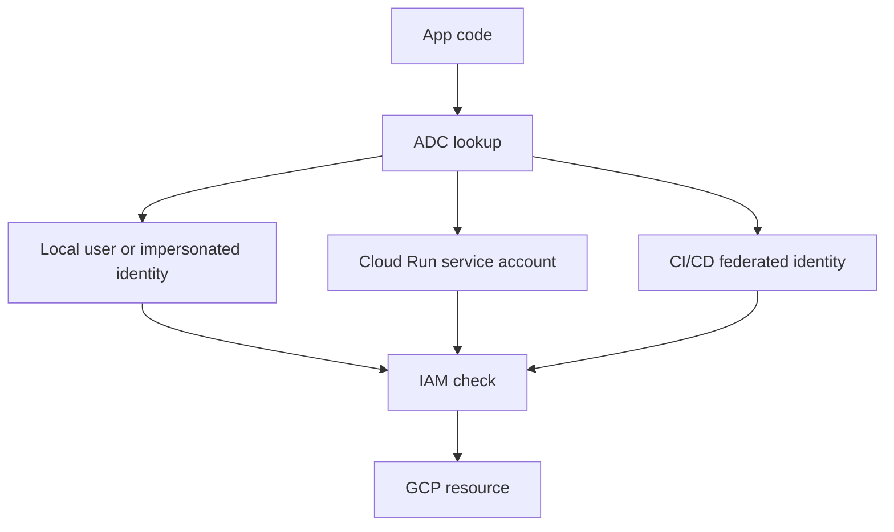

## Table of Contents

1. [The Problem](#the-problem)
2. [Service Accounts](#service-accounts)
3. [Runtime Identity](#runtime-identity)
4. [Deploy Identity](#deploy-identity)
5. [ADC](#adc)
6. [Local Development](#local-development)
7. [Impersonation](#impersonation)
8. [Keys](#keys)
9. [Workload Identity Federation](#workload-identity-federation)
10. [Failure Evidence](#failure-evidence)
11. [Putting It All Together](#putting-it-all-together)
12. [What's Next](#whats-next)

## The Problem

The Orders API has a clean IAM sentence now: a principal gets a role on a resource. The next question is which principal the app should use.

Local development is where this gets confusing. Maya runs the API on her laptop. The code reads a development secret and writes a test receipt. The same code goes to Cloud Run and fails in production:

```text
PermissionDenied: Permission 'secretmanager.versions.access' denied
```

The code did not change. The identity changed.

- On Maya's laptop, the client library may use Maya's local Application Default Credentials.
- On Cloud Run, the app should use the runtime service account attached to the service.
- In CI/CD, the pipeline should use a deploy identity, not the same identity the app uses at runtime.
- A copied service account key might make everything work, but it creates a long-lived secret that now has to be protected and rotated.

The beginner question is:

> How does app code or automation become the caller without borrowing a human login?

GCP's normal answer is a service account.

## Service Accounts

A service account is an identity for software. It is a principal that applications, VMs, jobs, functions, and pipelines can use when they call Google Cloud APIs.

Service accounts have email-like names:

```text
orders-api-prod@devpolaris-orders-prod.iam.gserviceaccount.com
```

That name tells a story. `orders-api-prod` names the workload. `devpolaris-orders-prod` names the home project. The suffix tells you this is an IAM service account.

The service account can receive IAM roles. It can be attached to Cloud Run. It can appear in audit logs. It can be impersonated by an approved deployer or developer. It should belong to the workload or automation path, not to a human.

The Orders API does not need Maya's access. It needs the access required by the Orders API.

## Runtime Identity

Runtime identity is the identity used by running application code. For Cloud Run, that identity is the service account attached to the service.

The runtime service account should match what the app needs while serving requests:

| App behavior | Runtime access needed |
| --- | --- |
| Read database URL | Access one Secret Manager secret. |
| Write receipt files | Write to the receipts bucket or relevant object path. |
| Emit logs | Use normal platform logging behavior. |
| Connect to database | Use the configured Cloud SQL access path. |

The runtime identity should not automatically deploy new revisions, change IAM policy, delete projects, or administer billing. Those are different jobs.

This is the key split:

```text
runtime identity: what the app can do while running
deploy identity: what the release process can change
```

If those become the same identity by habit, a bug in the app can inherit deployment power.

## Deploy Identity

Deploy identity is the identity used by a person, pipeline, or automation to release changes. It may need to build images, push to Artifact Registry, deploy Cloud Run, and update traffic.

It also often needs permission to act as the runtime service account. In GCP, letting one principal attach or use a service account for a workload is a powerful operation. A deployer that can act as a highly privileged runtime service account may indirectly gain that service account's access.

For the Orders API:

| Identity | Job |
| --- | --- |
| `orders-api-prod@...` | Runtime service account for the running app. |
| `orders-deployer-prod@...` | Deployment automation identity. |
| Maya's user account | Human review, local development, or approved impersonation. |

Keep those jobs separate. The deployer should be able to release the app. The app should be able to serve requests. A human should not be hidden inside production runtime behavior.

## ADC

Application Default Credentials, or ADC, is the strategy Google authentication libraries use to find credentials for application code. ADC lets code create Google Cloud clients without hardcoding a token path.

ADC is useful because the same code can run locally and in production. It is risky when the team forgets that "same code" does not mean "same identity."

The lookup can find credentials from different places depending on the environment. Locally, it may use a developer credential or a configured credential file. On Google Cloud runtimes, it commonly uses the attached service account. In CI/CD, it may use federation or impersonation.



ADC finds the caller. IAM decides whether that caller can act.

## Local Development

Local success can hide a production identity problem. Maya's local credentials may be allowed to read a development secret. Cloud Run's runtime service account may not be allowed to read the production secret. The JavaScript line can be identical in both places.

That is why local testing should include identity evidence:

| Question | Why it matters |
| --- | --- |
| Which project is selected? | Prevents testing against the wrong environment. |
| Which credential did ADC use? | Separates user identity from workload identity. |
| Is the developer impersonating the runtime service account? | Makes local behavior closer to production. |
| Which resource was accessed? | Prevents dev secret success from proving prod secret access. |

Do not fix a production failure by copying a personal credential into the app. The app should run as the service account designed for that app.

## Impersonation

Service account impersonation means one authenticated principal temporarily acts as a service account, if it has permission to do so. It can be useful for local testing, operations, and automation because it avoids distributing a long-lived key.

For example, a developer might be allowed to impersonate the Orders API service account in a dev project to test whether the service account has enough access. A deployment pipeline might impersonate a deployer service account through an approved federation setup.

Impersonation should be reviewed carefully. If a user can impersonate a powerful service account, they can use the access that service account has. The service account's roles and the impersonation grant both matter.

The good habit is to make impersonation explicit and auditable instead of hiding credentials in files.

## Keys

A service account key is a long-lived credential that can let software authenticate as the service account. Keys can be useful in limited cases, especially outside Google Cloud, but they are risky. If copied, leaked, or forgotten, the key can be used until it is revoked or expires by policy.

Prefer safer options when possible:

| Need | Safer starting point |
| --- | --- |
| GCP runtime calls GCP APIs | Attach a service account to the runtime. |
| Local testing as a workload | Use impersonation where appropriate. |
| External CI/CD deploys to GCP | Use Workload Identity Federation. |
| Legacy system cannot federate | Use a key only with strict storage, rotation, and monitoring. |

Do not put service account keys in Git, container images, shared tickets, or ordinary environment files. A key is a secret with the power of the service account behind it.

## Workload Identity Federation

Workload Identity Federation lets workloads outside Google Cloud access Google Cloud resources by exchanging external identity assertions for short-lived Google credentials. It is commonly used with CI/CD systems such as GitHub Actions or GitLab.

The practical reason to care is simple: it reduces the need to store service account keys outside GCP.

For a release pipeline, the shape might be:

```text
GitHub Actions identity
  -> Workload Identity Federation
  -> deployer service account
  -> Cloud Run deployment
```

That still needs IAM review. Federation is not magic access. It controls how the caller authenticates. IAM still decides what the caller can do.

## Failure Evidence

When identity fails, gather evidence before changing roles:

| Evidence | What it answers |
| --- | --- |
| Cloud Run service config | Which runtime service account is attached? |
| Error message | Which permission and resource failed? |
| ADC environment | Which credential did local code use? |
| IAM policy | Which role is granted and at what scope? |
| Audit logs | Which principal made the request? |
| CI/CD settings | Which external identity or service account deployed? |

The fix depends on the identity. A local ADC issue, a runtime service account issue, and a deployer impersonation issue can all look like "permission denied" until the principal is named.

## Putting It All Together

Return to Maya's local success and production failure.

- Local code worked because ADC found a local credential.
- Cloud Run failed because the runtime service account did not have the same access.
- The right fix was not to copy Maya's credential into production.
- Runtime identity and deploy identity needed separate service accounts.
- Impersonation helped testing without distributing a key.
- Workload Identity Federation gave external CI/CD a path without storing a long-lived service account key.

Service accounts make software visible as an actor. Once the actor is visible, IAM can grant only the access the job needs.

## What's Next

The next article applies IAM and service accounts to sensitive values. It explains Secret Manager, secret versions, runtime access, rotation, audit evidence, encryption, and where Cloud KMS fits.

---

**References**

- [Service accounts overview](https://cloud.google.com/iam/docs/service-account-overview)
- [How Application Default Credentials works](https://cloud.google.com/docs/authentication/application-default-credentials)
- [Workload Identity Federation](https://cloud.google.com/iam/docs/workload-identity-federation)
- [Identities for workloads](https://cloud.google.com/iam/docs/workload-identities)
