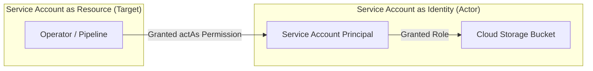
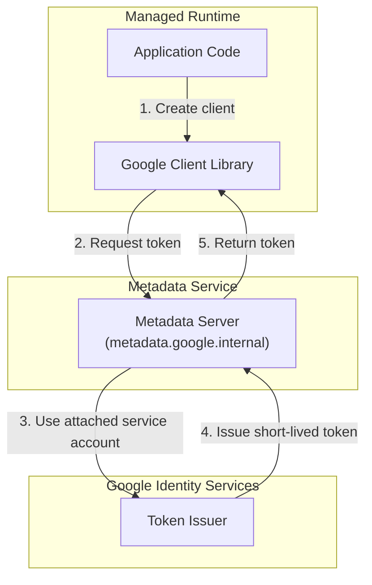
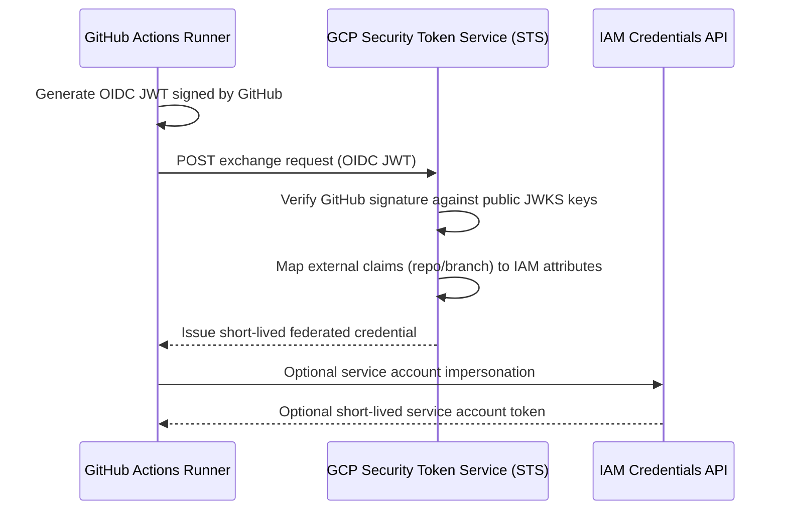

## Table of Contents

1. [Service Accounts for Apps and Automation](#service-accounts-for-apps-and-automation)
2. [The Dual Nature: Identity and Resource](#the-dual-nature-identity-and-resource)
3. [Runtime Identity and Application Default Credentials](#runtime-identity-and-application-default-credentials)
4. [Deploy Identity and Workload Identity Federation](#deploy-identity-and-workload-identity-federation)
5. [Workload Identity Federation Protocol](#workload-identity-federation-protocol)
6. [Cross-Cloud Mapping Reference](#cross-cloud-mapping-reference)
7. [Putting It All Together](#putting-it-all-together)
8. [What's Next](#whats-next)

## Service Accounts for Apps and Automation

A service account is a non-human IAM identity designed specifically for applications, virtual machines, container runtimes, and automated deployment pipelines. Unlike standard human accounts that authenticate using passwords, multi-factor tokens, or single sign-on (SSO) portals, service accounts authenticate programmatically. They represent the machine actor within your GCP project's security boundary.

When application code queries a database, reads a bucket, or fetches a secret payload, it does not act under a developer's identity. Instead, the runtime environment runs as a service account, ensuring that the workload has its own dedicated, auditable principal.

Every service account is named using a unique, email-like address that indicates its purpose, home project, and domain suffix:

`orders-api-prod@devpolaris-orders-prod.iam.gserviceaccount.com`

By assigning dedicated service accounts to each distinct application job, you establish a solid operational foundation. You isolate workload boundaries, secure your audit logs, and enforce strict least-privilege policies.

## The Dual Nature: Identity and Resource

To build secure architectures, you must understand the dual logical nature of service accounts. A service account operates simultaneously as an **Identity** and as a **Resource**.

*Treat service accounts as production resources, not merely credential files.*

As an **Identity**, a service account is a principal. You grant it IAM roles (e.g. `roles/secretmanager.secretAccessor`) on other resources like storage buckets or database secrets. The service account acts as the subject of the access sentence, exercising those roles to execute API requests.

As a **Resource**, a service account is an object that other principals need permission to manipulate. For example, a deployment pipeline or an administrator needs the `iam.serviceAccounts.actAs` permission on a service account to attach it to a Cloud Run service or an instance group.

If a developer possesses `actAs` permissions on a highly privileged service account, they can programmatically attach that service account to a VM they control, run code on that VM, and execute the service account's roles. This creates an indirect privilege escalation path. Therefore, you must audit who has permission to act as your service accounts as strictly as you audit direct project access.

## Runtime Identity and Application Default Credentials

Application Default Credentials (ADC) is the centralized strategy used by Google Cloud client libraries to automatically discover credentials at runtime. ADC allows developers to write environment-portable code: the exact same container code runs on a developer's laptop, in a staging sandbox, and in production without hardcoding authentication keys.

*The application receives temporary proof of identity without storing a key.*

When your application initializes a client library (e.g. `const client = new SecretManagerServiceClient()`), the library executes a structured lookup sequence to locate credentials:

1.  **Environment Variable Check**: The library looks for the `GOOGLE_APPLICATION_CREDENTIALS` environment variable, which points to a local JSON credential file path.
2.  **Local ADC File Check**: If the environment variable is not defined, the library checks the local ADC file created by `gcloud auth application-default login`.
3.  **Attached Service Account Check**: If the code runs on a supported Google Cloud runtime, the library uses the attached service account through the metadata server.

This lookup chain ensures that your application code never carries static API keys, relying entirely on the surrounding environment to provide the correct principal.

:::expand[Design Detail: Metadata Tokens Without Key Files]{kind="design"}
Understanding the documented runtime contract is enough to secure most GCP applications. When a workload runs with an attached service account, Google client libraries can request short-lived credentials from the runtime environment instead of loading a private key file from disk.

The useful beginner model is straightforward:

1.  **Attach the right service account** to the Cloud Run service, VM, or GKE workload.
2.  **Let ADC find the runtime identity** instead of shipping a JSON private key.
3.  **Grant only the resource roles the workload needs**, such as Secret Manager Secret Accessor on one secret.

This pattern keeps compromised container filesystems from containing long-lived Google Cloud private keys.
:::

## Deploy Identity and Workload Identity Federation

While applications use a **Runtime Identity** (service accounts attached to containers), deployment pipelines use a **Deploy Identity** to build, configure, and release resources.

Historically, connecting external CI/CD platforms (like GitHub Actions or GitLab CI) to GCP required creating a service account, downloading a static JSON private key, and pasting that key into GitHub Secrets. This introduced severe security risks: if a malicious actor compromised the GitHub repository or accessed the secrets pool, they stole the persistent key and gained permanent access to your GCP project.

Google Cloud solves this through **Workload Identity Federation (WIF)**.

Workload Identity Federation allows external CI/CD workloads to access Google Cloud resources securely by exchanging external identity tokens for short-lived Google credentials, eliminating the need to store long-lived service account keys outside GCP.

## Workload Identity Federation Protocol

The WIF token exchange lets an external workload prove its identity to Google without storing a service account key. The workload can then either access supported Google Cloud resources directly as a federated principal or impersonate a service account when your design requires a service account boundary.

1.  **Token Generation**: When a pipeline runs, the GitHub runner requests an OpenID Connect (OIDC) JSON Web Token (JWT) signed by GitHub’s private keys.
2.  **STS Exchange**: The runner sends this OIDC JWT to the GCP **Security Token Service (STS)**.
3.  **Signature Verification**: The STS queries GitHub's public JSON Web Key Sets (JWKS) to verify that the token was signed by GitHub and originates from your approved repository and branch.
4.  **Attribute Mapping**: The STS maps external claims (such as `repository`, `actor`, and `workflow`) to target IAM attributes.
5.  **Resource Access or Impersonation**: The runner either uses the federated credential directly on resources that allow it, or impersonates a service account after receiving the required Workload Identity User permission.

Because no private keys are ever generated or stored outside GCP, this protocol closes the credential leakage vector completely.

:::expand[Under the Hood: PKCS#8 Private Key Leakage and Perimeter Bypass Risks]{kind="design"}
Understanding the internal structure of a service account private key JSON file explains why security teams strictly restrict their use.

A service account key JSON file contains a **PKCS#8 formatted RSA private key block** along with metadata matching the service account's client ID and certificate URI. This private key is a cryptographically strong credential.

When you download a service account key, Google’s control plane does not store the private key block. It only stores the public key certificate to validate future handshakes. Consequently, if you lose the JSON file, the key cannot be recovered; it must be deleted and replaced.

Leaking a service account private key is catastrophic because whoever has the key can authenticate as that service account until the key is disabled or deleted. The risk is identity theft, not a hidden network shortcut. VPC firewalls protect network paths, but Google API authorization still depends on IAM and the credential presented to the API.
:::

## Cross-Cloud Mapping Reference

This table maps core GCP service account concepts to their direct AWS and Azure equivalents:

| GCP Concept | AWS Equivalent | Azure Equivalent | Operational Behavior |
| :--- | :--- | :--- | :--- |
| **Service Account** | IAM Role | Managed Identity | The non-human machine principal assigned to workloads. |
| **Application Default Credentials** | AWS Credentials Provider | DefaultAzureCredential | Environment-portable client library credential lookup sequence. |
| **Workload Identity Federation** | OIDC Identity Provider | Entra ID Workload Federation | Cryptographic OIDC-to-OAuth2 token exchange for external runners. |
| **Service Account Key** | IAM Access Key | Service Principal Secret | Long-lived, static cryptographic private key credentials. |

## Putting It All Together

Securing machine identities requires separating runtime execution from deployment administration.

When your application container boots inside Cloud Run, Google client libraries can use Application Default Credentials to discover the attached service account and request short-lived OAuth2 tokens from the runtime metadata service, keeping your runtime free of static keys.

For deployment pipelines, you configure Workload Identity Federation. External runners present short-lived OIDC or SAML proof to Google's Security Token Service, then access resources directly as a federated principal or impersonate a deployer service account with explicit permission.

By eliminating service account key files wherever possible, you reduce the damage of repository, laptop, and CI secret leaks. The goal is short-lived credentials, narrow IAM roles, and clear audit logs.

## What's Next

Establishing secure workload identities solves the principal check. However, applications still need a secure, versioned place to house sensitive configuration payloads. In the next article, we analyze Secret Manager, focusing on secrets, versions, IAM access, rotation notifications, customer-managed encryption options, and VPC Service Controls perimeters.

*Use this summary as the quick mental checklist before designing or debugging the service.*

---

**References**

- [Google Cloud: Service accounts overview](https://cloud.google.com/iam/docs/service-account-overview) - Architectural reference for non-human principals.
- [Google Cloud: Workload Identity Federation](https://cloud.google.com/iam/docs/workload-identity-federation) - Technical specification for OIDC-based keyless authentication.
- [Google Cloud: Application Default Credentials](https://cloud.google.com/docs/authentication/application-default-credentials) - Guide to dynamic environment-based credential resolution.
- [Google Cloud: Service account key best practices](https://cloud.google.com/iam/docs/best-practices-for-managing-service-account-keys) - Explains why long-lived service account keys should be avoided.
