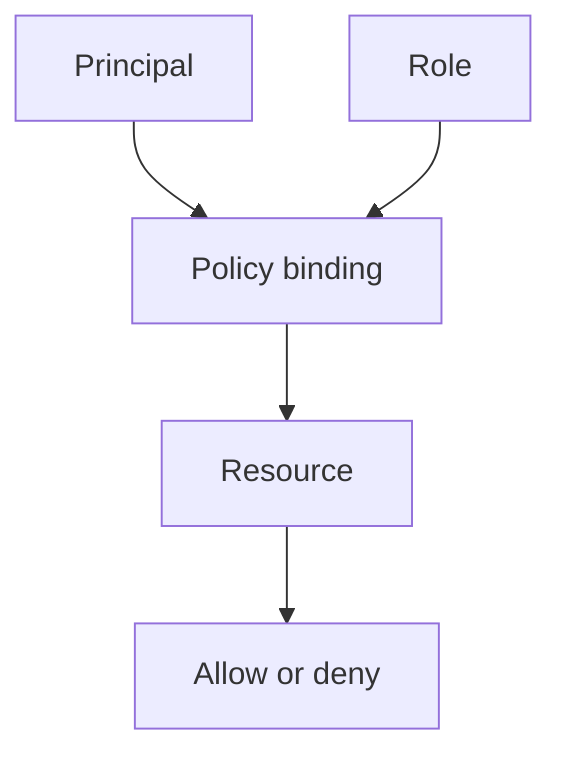

## Table of Contents

1. [The Problem](#the-problem)
2. [What Is GCP IAM](#what-is-gcp-iam)
3. [Principals](#principals)
4. [Resources](#resources)
5. [Permissions](#permissions)
6. [Roles](#roles)
7. [Policy Bindings](#policy-bindings)
8. [Scope](#scope)
9. [Conditions](#conditions)
10. [Audit Evidence](#audit-evidence)
11. [Narrow Fixes](#narrow-fixes)
12. [Putting It All Together](#putting-it-all-together)
13. [What's Next](#whats-next)

## The Problem

The Orders API now has a GCP project, service map, and production resources. The next problem is access.

The app runs on Cloud Run and tries to read a database URL from Secret Manager. Production fails with an error like this:

```text
PermissionDenied: Permission 'secretmanager.versions.access' denied
on resource 'projects/devpolaris-orders-prod/secrets/orders-db-url'
```

Someone suggests granting Owner on the project so the release can continue. That would probably make the error disappear. It would also give the running app far more power than it needs.

The useful question is smaller and safer:

> Who is allowed to do this action on this GCP resource?

GCP IAM answers that question through a relationship. A principal asks to perform an action. A resource is protected. A role contains permissions. A policy binding grants the role to the principal at a scope. Audit logs can help prove who asked and what happened.

## What Is GCP IAM

Identity and Access Management, usually called IAM, is GCP's permission system. It decides whether an authenticated principal can perform an action on a resource.

The beginner sentence is:

```text
This principal gets this role on this resource.
```

For the Orders API secret, a healthy sentence might be:

```text
serviceAccount:orders-api-prod@devpolaris-orders-prod.iam.gserviceaccount.com
gets Secret Manager Secret Accessor
on secret orders-db-url
```

That sentence has all the pieces the team needs to review. If an access request fails, one of the pieces is usually missing, wrong, or attached too broadly.



The diagram is simple on purpose. IAM is hard when it becomes a wall of role names. It is easier when every role name is attached to an actor, a target, and a reason.

## Principals

A principal is the actor that has authenticated to Google Cloud. It can be a user, group, service account, domain, or another supported identity shape.

For a learning backend, the important principal types are:

| Principal | Plain meaning | Example |
| --- | --- | --- |
| User | A human account | `user:maya@example.com` |
| Group | A collection of users | `group:orders-oncall@example.com` |
| Service account | A workload or automation identity | `serviceAccount:orders-api-prod@devpolaris-orders-prod.iam.gserviceaccount.com` |
| External workload principal | A workload from another identity system | CI/CD through Workload Identity Federation |

The principal is where many mistakes hide. A developer may test locally as a user, while Cloud Run runs as a service account. A pipeline may deploy as one service account, while the app runs as another. A group may have broad access that an individual does not realize they inherited.

Before changing a role, name the principal that actually made the request.

## Resources

A resource is the protected thing. It might be a project, folder, organization, Cloud Run service, Secret Manager secret, Cloud Storage bucket, Cloud SQL instance, service account, or another GCP object.

The denied request named the resource:

```text
projects/devpolaris-orders-prod/secrets/orders-db-url
```

That path says the target is the `orders-db-url` secret in the production project. The target is not "some secret." It is a specific resource. That detail matters because a role granted on one secret is different from the same role granted on the whole project.

For access review, copy the resource path or another strong identifier. Human names are useful, but IAM decisions are made against resources.

## Permissions

A permission is a specific action that can be allowed or denied. Permissions often look like service action strings. In the error above, the missing permission is:

```text
secretmanager.versions.access
```

That tells the team the app tried to access a secret version payload. It does not mean the app needs every Secret Manager permission. It does not mean the app should administer projects. It means the role chosen for the app must include the permission needed for this job.

Permissions are rarely granted one by one in daily work. They are usually bundled into roles. Still, reading the missing permission helps choose the right role.

## Roles

A role is a bundle of permissions. When you grant a role to a principal, the principal receives the permissions in that role at the grant's scope.

GCP has basic roles, predefined roles, and custom roles:

| Role type | Beginner meaning | Review habit |
| --- | --- | --- |
| Basic role | Broad legacy-style role such as Owner, Editor, or Viewer | Avoid for workloads unless there is a very strong reason. |
| Predefined role | Google-managed role for a service job | Prefer when it matches the task closely. |
| Custom role | Team-defined permission bundle | Use when predefined roles are too broad and the team can maintain it. |

For the Orders API, `roles/secretmanager.secretAccessor` is much closer to the job than project Owner. The app needs to read a secret payload. It does not need to change IAM policy, delete storage buckets, or alter billing.

The role should match the job, not the urgency of the incident.

## Policy Bindings

An allow policy contains bindings. A binding connects principals to a role, sometimes with a condition. The policy is attached to a resource.

In plain English:

```text
At this resource, these principals get this role.
```

A narrow binding might attach Secret Accessor to only one secret:

```text
resource: projects/devpolaris-orders-prod/secrets/orders-db-url
role: roles/secretmanager.secretAccessor
principal: serviceAccount:orders-api-prod@devpolaris-orders-prod.iam.gserviceaccount.com
```

A wider binding might attach the same role at the project:

```text
resource: projects/devpolaris-orders-prod
role: roles/secretmanager.secretAccessor
principal: serviceAccount:orders-api-prod@devpolaris-orders-prod.iam.gserviceaccount.com
```

The role name did not change. The blast radius changed. The second binding may allow the app to read many secrets in the project. That might be intended for some service accounts. It should not happen by accident.

## Scope

Scope is where the binding is attached. GCP's resource hierarchy means policies can be attached at organization, folder, project, and many resource levels. Access can be inherited downward.

For a beginner, scope answers:

```text
How much of the world does this grant cover?
```

| Scope | What it can affect |
| --- | --- |
| Organization | Many folders and projects below it. |
| Folder | Projects and resources below that folder. |
| Project | Many resources inside the project. |
| Resource | One specific protected thing, when the service supports it. |

The safe habit is to grant at the narrowest scope that still supports the job. If the Orders API needs one secret, start by asking whether secret-level access is enough. If it needs a bucket prefix, understand what scope the service actually supports. If a pipeline deploys Cloud Run, it may need project or service-level permissions plus permission to act as the runtime service account.

Scope is where small mistakes become large.

## Conditions

IAM Conditions can add rules to a binding. A condition might limit access by time, resource name, request attributes, or other supported context.

Conditions are powerful because they make a binding more precise. They can also make access harder to read. A principal may have the right role at the right scope, but the condition may not match the request.

For a foundation article, the main habit is simple: if access looks correct and still fails, check whether a condition is attached to the binding. Do not remove conditions just to make the page simpler. Understand what promise the condition is protecting.

## Audit Evidence

Audit logs turn access decisions into evidence. They can show who made administrative changes and, for supported services and log types, who accessed data or attempted important operations.

For the Orders API, useful evidence might include:

| Evidence | What it helps answer |
| --- | --- |
| Error message | Which permission and resource failed. |
| Cloud Run revision config | Which runtime service account the app used. |
| IAM policy | Which binding grants the role and where. |
| Audit logs | Which principal asked, what action happened, and whether it was allowed. |

Do not rely on memory for access reviews. Copy the principal, permission, resource, role, scope, and evidence.

## Narrow Fixes

The narrow fix follows the access sentence.

For the denied secret request, the review path is:

1. Identify the principal: the Cloud Run runtime service account.
2. Identify the action: `secretmanager.versions.access`.
3. Identify the resource: `projects/devpolaris-orders-prod/secrets/orders-db-url`.
4. Choose a role that contains the needed permission.
5. Attach the binding at the narrowest useful scope.
6. Verify the app can read the secret and no broader access was added.

This is slower than granting Owner for one minute. It is also the difference between fixing access and punching a hole through the project.

## Putting It All Together

Return to the opener.

- The denied secret read became a principal question: which service account did Cloud Run use?
- The error text became a permission question: which action was missing?
- The resource path became a target question: which secret was protected?
- The role became a job question: what permission bundle fits this action?
- The binding became a scope question: should access live on the secret or the project?
- Audit evidence made the fix reviewable later.

GCP IAM is not a giant permission menu. It is a relationship between an actor, an action, a role, a resource, and a scope.

## What's Next

The next article focuses on the actor that production software should use: service accounts. It explains runtime identity, deploy identity, local Application Default Credentials, impersonation, keys, and Workload Identity Federation.

---

**References**

- [IAM principals](https://cloud.google.com/iam/docs/principals-overview)
- [Understanding allow policies](https://cloud.google.com/iam/docs/allow-policies)
- [Roles and permissions](https://cloud.google.com/iam/docs/roles-overview)
- [IAM policy types](https://cloud.google.com/iam/docs/policy-types)
