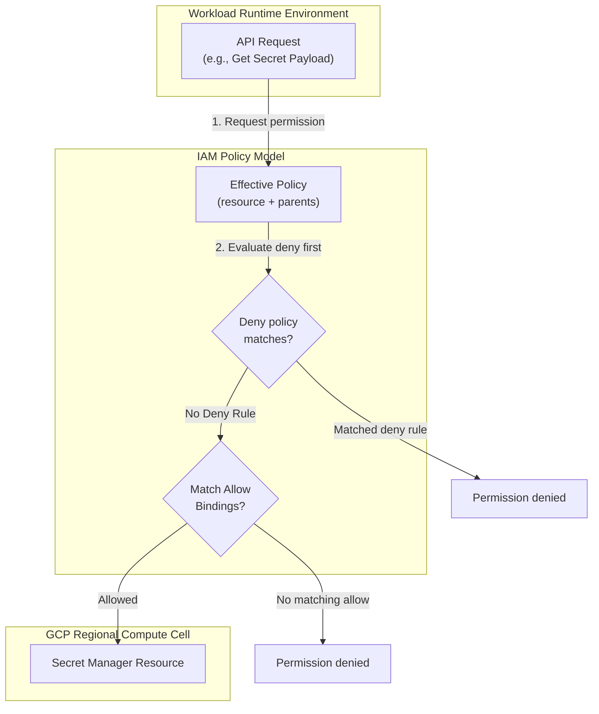

## Table of Contents

1. [GCP Identity and Access Management](#gcp-identity-and-access-management)
2. [Principals](#principals)
3. [Resource Hierarchy and Caching Latency](#resource-hierarchy-and-caching-latency)
4. [Permissions and Granular Actions](#permissions-and-granular-actions)
5. [Roles: Predefined vs. Custom](#roles-predefined-vs-custom)
6. [Policy Bindings and Scope Blast Radius](#policy-bindings-and-scope-blast-radius)
7. [Cross-Cloud Mapping Reference](#cross-cloud-mapping-reference)
8. [Putting It All Together](#putting-it-all-together)
9. [What's Next](#whats-next)

## GCP Identity and Access Management

GCP Identity and Access Management (IAM) is the permission system that answers a simple question: can this caller perform this action on this resource? It looks at the authenticated principal, the requested permission, the target resource, and the policies attached to that resource and its parents.

*Every access decision is a structured sentence, not a loose username check.*

Rather than relying on local server users or one-off access lists, GCP IAM lets you express access as a policy relationship. A human user, group, service account, or federated identity receives a role on a resource. That role contains permissions. When the principal calls a Google API, IAM determines whether the effective policy grants the required permission.

Every authorization check evaluated by GCP IAM is defined as a unified relationship: a principal is granted a specific role on a target resource at a defined scope. If any segment of this relationship is misconfigured or attached too broadly, your workloads are exposed to either operational authentication failures or unnecessary security vulnerabilities.

:::expand[Design Detail: Allow Policies, Deny Policies, and Effective Access]{kind="design"}
Understanding the documented IAM model is enough to debug most access issues. IAM uses allow policies to grant access and deny policies to create explicit blocks. The effective decision comes from the target resource and its ancestors in the resource hierarchy.

When an SDK client, Terraform plan, or running container calls a Google API, the authorization question is structured as a permission check. For example, reading a Secret Manager version requires a permission such as `secretmanager.versions.access` on the secret version resource. IAM does not grant that permission directly to the caller in daily administration. It grants a role that contains the permission.

An allow policy contains bindings. Each binding connects principals to a role, and the role contains permissions. Because policies inherit downward, a project-level role can grant access to many child resources. A resource-level role narrows the blast radius.

Deny policies can be attached to organizations, folders, and projects. If a deny policy matches the principal and permission, the request is denied even if an allow binding would otherwise grant access.

Policy Intelligence is a separate set of tools for analysis, recommendation, and troubleshooting. It helps humans understand and reduce access, but it should not be described as the runtime authorization engine.
:::

## Principals

A principal is the authenticated identity requesting access to a GCP resource. Google Cloud organizes principals into distinct categories based on their operational roles:

*   **Google Accounts (Users)**: Individual human accounts managed in Google Workspace or Cloud Identity (e.g. `user:maya@example.com`).
*   **Google Groups**: Named collections of Google Accounts (e.g. `group:orders-oncall@example.com`). Granting roles to groups simplifies administrative updates because adding a user to a group automatically propagates all inherited permissions.
*   **Service Accounts**: Workload or automation identities assigned directly to running application code or deployment runners (e.g. `serviceAccount:orders-api-prod@...`).
*   **Workload Identities**: Federated identities derived from external identity providers via OpenID Connect (OIDC) or SAML handshakes.

When an authorization check fails, the first step is to isolate the exact principal making the call. A common pitfall occurs when a developer tests code locally under their personal user account and experiences success, only for the deployed container to fail because the attached runtime service account lacks the corresponding role.

## Resource Hierarchy and Caching Latency

GCP manages resources in a strict, hierarchical tree. This structure dictates how policies are inherited and evaluated throughout your environment:

*A fresh permission change may be correct but not visible everywhere immediately.*

1.  **Organization**: The root node representing your entire company. Organization-level policies apply to all resources below it.
2.  **Folders**: Logical groupings of projects used to mirror corporate departments or environments (e.g. `Folder: Production`).
3.  **Projects**: The primary administrative and billing boundary containing your actual resources.
4.  **Resources**: Individual service objects (e.g. `secret-manager-secret`, `cloud-storage-bucket`).

Permissions are inherited downward. A role granted to a principal at the Organization scope automatically propagates through all folders, projects, and resources inside that tree.

Google Cloud access changes are eventually consistent. A policy edit can be correct in the console or Terraform state before every authorization check observes it.

When you create or modify an IAM policy binding, Google documentation says access changes usually propagate within minutes and can take longer. Group membership changes can take longer than direct policy edits. During that window, a newly granted permission may still return `Permission Denied`, and a recently removed permission may not disappear everywhere immediately.

## Permissions and Granular Actions

A permission is the atomic action allowed or denied by IAM. It is represented as a structured string mapping the service, resource type, and action (e.g., `secretmanager.versions.access`).

Permissions map directly to the REST API endpoints exposed by Google Cloud. For example, when an application calls the Secret Manager API to retrieve a database connection string, it requires the `secretmanager.versions.access` permission on that specific secret resource.

In daily administration, engineers do not grant individual permissions directly to principals. Instead, permissions are bundled into unified packages called roles.

## Roles: Predefined vs. Custom

A role is a collection of permissions that you assign to principals. GCP supports three distinct role categories:

*   **Basic Roles (Legacy)**: Broad, coarse-grained roles representing **Owner**, **Editor**, and **Viewer**. These roles grant wide permissions across almost every service inside a project, including network administration, billing management, and database deletion. Standardizing on basic roles for application workloads violates least-privilege principles and introduces severe operational blast radiuses.
*   **Predefined Roles**: Google-managed roles tailored to specific service jobs (e.g. `roles/secretmanager.secretAccessor` or `roles/storage.objectViewer`). Google automatically updates these roles when new features or permissions are added to the underlying services.
*   **Custom Roles**: Tailored permission bundles defined by your team when predefined roles are too broad for a specific security standard. Custom roles require active maintenance; if Google introduces a new API permission to a service, you must manually update your custom role to inherit it.

## Policy Bindings and Scope Blast Radius

An allow policy is a collection of **Policy Bindings** attached to a resource. A binding links one or more principals to a single role, sometimes constrained by an IAM Condition (such as restricting access to a specific time window or CIDR IP block).

The most common architectural mistake in IAM design is selecting the wrong scope for a policy binding. The scope represents the exact node in the resource hierarchy where the binding is attached.

Consider a runtime service account that only needs to read a single database connection string. If you bind the `Secret Manager Secret Accessor` role to that service account at the **Project scope**, the service account gains the ability to read *every* secret in the entire project, including payment credentials and operations keys.

By binding the same role at the **Resource scope** (attached directly to the individual `orders-db-url` secret resource), you restrict the service account's blast radius completely. If the container is compromised, the attacker can access only the single connection string, keeping the remaining project secrets secure.

## Cross-Cloud Mapping Reference

This table maps core GCP IAM concepts to their direct AWS and Azure equivalents:

| GCP IAM Concept | AWS Equivalent | Azure Equivalent | Operational Behavior |
| :--- | :--- | :--- | :--- |
| **Principal** | IAM User / Role / Group | Entra ID Principal / Group | The authenticated identity requesting access to an API. |
| **Predefined Role** | AWS Managed Policy | Built-in Role | Prepackaged bundle of permissions managed by the cloud provider. |
| **Policy Binding** | IAM Policy Attachment | Role Assignment | Connects a principal to a role at a specific hierarchical node. |
| **Resource Scope** | Resource-based Policy | Resource-level Assignment | Attaches permissions directly to individual service objects. |

## Putting It All Together

Securing a cloud workload requires keeping the IAM access sentence narrow and auditable.

When a containerized API fails to retrieve a secret version, IAM is usually failing the access sentence. The caller is the runtime service account, the action is `secretmanager.versions.access`, the target is the secret version, and the binding must grant a role containing that permission at the right scope.

To resolve this, you identify the exact runtime service account principal, choose the predefined `Secret Manager Secret Accessor` role, and bind it to that principal at the narrowest resource scope possible, usually attached directly to the specific secret.

Then wait for IAM propagation before assuming the change failed. A correct policy can still need time before every request path sees it.

## What's Next

IAM defines the relationships that govern access, but workloads need a concrete mechanism to authenticate as a principal without borrowing human logins. In the next article, we detail Service Accounts, focusing on runtime identity, Application Default Credentials, Workload Identity Federation, and why long-lived key files are risky.

*Use this summary as the quick mental checklist before designing or debugging the service.*

---

**References**

- [Google Cloud: IAM overview](https://cloud.google.com/iam/docs/overview) - Core guide to GCP permissions and policy structures.
- [Google Cloud: Understanding allow policies](https://cloud.google.com/iam/docs/allow-policies) - Reference for binding principals to roles at different scopes.
- [Google Cloud: Deny policies](https://cloud.google.com/iam/docs/deny-overview) - Describes deny policy attachments and deny-before-allow behavior.
- [Google Cloud: Access change propagation](https://cloud.google.com/iam/docs/access-change-propagation) - Documents eventual consistency timing for IAM access changes.
- [Google Cloud: Policy Intelligence tools](https://cloud.google.com/iam/docs/policy-intelligence-tools) - Explains Policy Intelligence as analysis and recommendation tooling.
- [Google Cloud: Resource hierarchy](https://cloud.google.com/resource-manager/docs/cloud-platform-resource-hierarchy) - Explanation of folders, projects, and downward policy inheritance.
