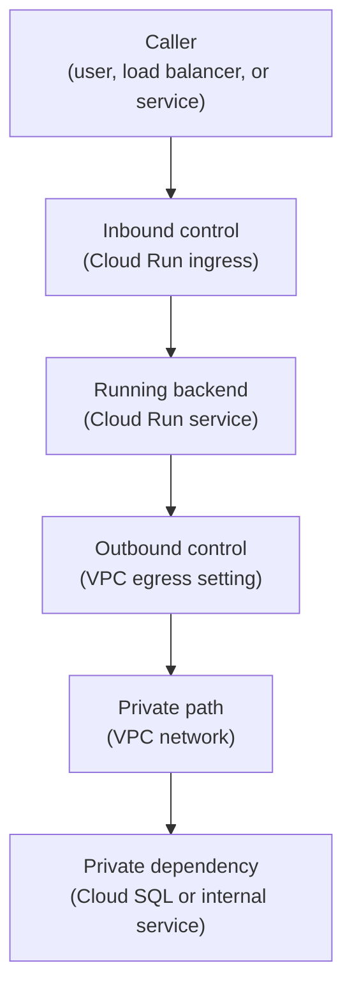

## Table of Contents

1. [Cloud Run Still Has Network Edges](#cloud-run-still-has-network-edges)
2. [Two Directions: Ingress And Egress](#two-directions-ingress-and-egress)
3. [The Orders API Runtime Shape](#the-orders-api-runtime-shape)
4. [Ingress Controls Who Can Reach The Service](#ingress-controls-who-can-reach-the-service)
5. [IAM Authentication Is Not The Same As Ingress](#iam-authentication-is-not-the-same-as-ingress)
6. [Egress Controls Where The Service Sends Traffic](#egress-controls-where-the-service-sends-traffic)
7. [Direct VPC Egress And Serverless VPC Access](#direct-vpc-egress-and-serverless-vpc-access)
8. [Private Ranges Only Versus All Traffic](#private-ranges-only-versus-all-traffic)
9. [Private Cloud SQL Is A Path, Not A Checkbox](#private-cloud-sql-is-a-path-not-a-checkbox)
10. [Startup And Scaling Can Reveal Network Problems](#startup-and-scaling-can-reveal-network-problems)
11. [Evidence For A Healthy Cloud Run Network](#evidence-for-a-healthy-cloud-run-network)
12. [Failure Modes And Fix Directions](#failure-modes-and-fix-directions)
13. [The Review Habit](#the-review-habit)

## Cloud Run Still Has Network Edges

Cloud Run removes a lot of server work. You do not choose VM sizes. You do not patch the
host operating system. You do not manually place each instance. That is the point. But Cloud
Run does not remove networking. A service still has an inbound edge. Something can call it.
A service still has an outbound edge.

It calls databases, APIs, storage, and other services. Those two edges need different
settings. For `devpolaris-orders-api`, users call the API over HTTPS. The API then calls
Cloud SQL, Secret Manager, Cloud Storage, and Cloud Logging. Some calls may use public
Google API paths with IAM. Some calls may need private VPC egress. The main beginner mistake
is treating "Cloud Run is serverless" as "networking no longer matters." Cloud Run is still
in the request path. You just configure the path at a higher level.

## Two Directions: Ingress And Egress

Ingress means traffic coming into the service. Egress means traffic leaving the service. The
words are short, but the distinction prevents many bad fixes. Ingress answers: Who can call
this Cloud Run service? Which network paths can reach it? Does traffic enter directly,
through a domain mapping, or through a load balancer? Egress answers: Where does this Cloud
Run service send outbound traffic?

Does it use normal internet egress? Does it send private ranges into a VPC network? Does all
outbound traffic go through the VPC? Changing one direction does not fix the other. If
private clients cannot call Cloud Run, changing VPC egress is not the main answer. If Cloud
Run cannot reach a private database, changing public ingress is not the main answer.

Here is the simple map:



Read inbound left to right. Read outbound from the service down to its dependency. Do not
blend the two.

## The Orders API Runtime Shape

The orders API runs on Cloud Run in `us-central1`.

The project is:

```text
devpolaris-orders-prod
```

The service name is:

```text
devpolaris-orders-api
```

The runtime service account is:

```text
orders-api-prod@devpolaris-orders-prod.iam.gserviceaccount.com
```

The public entry is:

```text
orders.devpolaris.com
```

The private database is Cloud SQL. The app also calls Google APIs such as Secret Manager and
Cloud Storage. That gives the team three distinct questions:

```text
Can users reach the API?
Can the API reach private resources?
Can the API identity call the Google APIs it needs?
```

Those questions map to ingress, egress, and IAM. All three must be correct for checkout to
work. If one fails, the symptoms can look similar to a user. The API returns an error. The
fix depends on which question failed.

## Ingress Controls Who Can Reach The Service

Cloud Run ingress settings control which network paths can reach the service. The service
may be reachable from the internet. It may be limited to internal traffic and load balancer
paths. It may be designed so the external Application Load Balancer is the only public
entry. The exact choice depends on the service. For a public checkout API, the team may want
public users to reach the load balancer, not the raw service URL.

That means the load balancer becomes the front door. Cloud Run ingress should match that
design. If the Cloud Run service accepts direct internet traffic and the team thought only
the load balancer could reach it, there is a gap between the design and reality. That gap
may not break the app. It still matters because it creates an extra path around the front
door.

Ingress is about network reachability. It is the first question for inbound traffic. After a
request reaches the service, IAM authentication may still apply depending on how the service
is configured.

## IAM Authentication Is Not The Same As Ingress

Cloud Run can use IAM to decide who is allowed to invoke a service. That is useful for
private services and service-to-service calls. But IAM authentication and ingress settings
are different controls. Ingress controls which network paths can reach the service endpoint.
IAM controls which principal is authorized to invoke the service. For a public user-facing
API, the team may allow unauthenticated customer requests at the HTTP application layer
while still protecting admin routes inside the app.

For an internal service, the team may require IAM-authenticated calls from another service
account. Do not use one control as a substitute for the other. If the service should not be
reachable directly from the internet, fix ingress. If the service should only allow certain
callers after they reach the endpoint, fix IAM or application authentication.

If both are required, configure both. This is the same separation you learned in the
identity module. Network reachability and authorization support each other. They do not
replace each other.

## Egress Controls Where The Service Sends Traffic

Cloud Run egress is about outbound traffic. The orders API sends outbound traffic when it
connects to Cloud SQL, calls a payment provider, reads a secret, writes a receipt object, or
sends telemetry. Some outbound calls can use the normal public internet path. Some should
use a private path. Some calls go to Google APIs and are controlled by IAM and service
access patterns.

For private VPC resources, Cloud Run needs a way to send traffic into a VPC network. That is
where VPC egress enters the picture. Without the correct egress path, the app may fail with
timeouts even though the database exists and the service account has permissions. The error
may look like:

```text
Error: connect ETIMEDOUT 10.50.4.3:5432
```

That error points to the network path to `10.50.4.3`, not to a broader IAM role.

## Direct VPC Egress And Serverless VPC Access

Cloud Run can send traffic to a VPC network through Direct VPC egress. Direct VPC egress
lets the Cloud Run service use a VPC network and subnet for outbound traffic without a
Serverless VPC Access connector. Serverless VPC Access connectors are still available for
cases where direct egress is not the option the team uses. For a beginner module, the
important idea is that Cloud Run needs an explicit outbound path to private VPC resources.
With Direct VPC egress, the service revision is configured with a network, subnet, and
egress setting. The subnet supplies private addresses for instances as they run and scale.
That means subnet capacity can matter. If the subnet is too small, scaling can hit address
pressure.

This can feel strange because Cloud Run hides servers from you. But private networking still
needs address space. Serverless does not mean addressless.

## Private Ranges Only Versus All Traffic

When configuring VPC egress, the team chooses which outbound traffic goes through the VPC
path. One common choice is private ranges only. That means traffic to private IP ranges goes
through the VPC network, while other internet-bound traffic does not. Another choice is all
traffic. That means all outbound traffic goes through the VPC network path.

The choice affects routing, cost, observability, and failure behavior. For
`devpolaris-orders-api`, private ranges only might be enough if the service only needs VPC
egress for Cloud SQL private IP and internal addresses. All traffic might be chosen if the
team wants centralized egress control, NAT, inspection, or a consistent outbound IP pattern.
All traffic can be more controlled, but it also requires the team to provide working routes
for all outbound destinations. If the service calls a tax API on the public internet and all
traffic is sent through a VPC with no internet egress path, checkout can fail. The egress
mode should match the dependency list. Do not choose it from habit.

## Private Cloud SQL Is A Path, Not A Checkbox

Cloud SQL private IP is a private access pattern. It lets clients connect to Cloud SQL
through private networking instead of using a public IP path. For Cloud Run, that still
means several pieces must agree. The Cloud SQL instance needs private IP configured. The VPC
network needs the required private service connection pattern. The Cloud Run service needs
VPC egress into that network.

The app needs to use the correct connection target. The database still needs to accept the
application credential. If one piece is missing, the failure may look like a generic
connection error. That is why "private Cloud SQL" should be written as a path:

```text
Cloud Run
  -> VPC egress
  -> VPC network
  -> private services access
  -> Cloud SQL private IP
```

Now each part can be checked. The path also reminds you that IAM and database credentials
are separate from packet reachability. The packet may arrive. The database can still reject
the login.

## Startup And Scaling Can Reveal Network Problems

Cloud Run can scale. That is one reason teams like it. Scaling also reveals network
assumptions. If each instance needs private addresses from a subnet, the subnet must have
enough room. If the app checks the database only after receiving traffic, users may hit
failures while a new instance discovers the private path is broken.

If the service starts before the network dependency is ready, the first requests can fail.
This is why startup and readiness behavior matter. The app should make network dependency
failures visible early. For example:

```text
/health/live
  process is running

/health/ready
  process can reach Cloud SQL and required configuration
```

Do not make the readiness check too heavy. It should prove the service can accept traffic.
It should not perform a full checkout. The goal is to catch broken network paths before
customers do.

## Evidence For A Healthy Cloud Run Network

A useful Cloud Run network record might look like this:

```text
service: devpolaris-orders-api
region: us-central1
ingress: internal-and-cloud-load-balancing
runtime service account: orders-api-prod

egress:
  mode: private-ranges-only
  network: vpc-orders-prod
  subnet: subnet-orders-run-us-central1

private dependency:
  Cloud SQL: orders-prod
  connection: private IP
  validation: /health/ready
```

This record is useful because it separates the directions. Ingress says how callers reach
the service. Egress says where the service sends private traffic. Service account says who
the service is when it calls Google APIs. Validation says what proves the path works. During
an incident, this record gives the on-call engineer a map before they open the console.

That is the point.

## Failure Modes And Fix Directions

The first failure is changing egress to fix ingress. Private clients cannot call Cloud Run.
Someone changes VPC egress. Nothing improves because the problem was inbound reachability.
The fix direction is to review ingress settings and the intended load balancer or internal
entry path. The second failure is changing ingress to fix database access. Cloud Run cannot
reach Cloud SQL private IP.

Someone changes public access settings. The app still times out. The fix direction is to
review VPC egress, subnet, private services access, and Cloud SQL private configuration. The
third failure is subnet address pressure. Traffic spikes. New instances need private
addresses. The subnet does not have enough room. The fix direction is to use a suitable
subnet range and plan for scale.

The fourth failure is all traffic egress without internet path. The app sends every outbound
call through the VPC, but the VPC has no working route for public APIs the app needs. The
fix direction is to review dependency destinations and provide the right egress path. The
fifth failure is service identity confusion. The network path exists, but Secret Manager
access fails.

The fix direction is to debug IAM for the runtime service account, not the VPC.

## The Review Habit

Review Cloud Run networking in two columns. Inbound: Who calls the service? Which hostname
do they use? Does traffic enter directly or through a load balancer? What is the ingress
setting? Is IAM invocation required? Outbound: Which private dependencies does the service
call? Does it need VPC egress? Which network and subnet are used? Does egress send only
private ranges or all traffic?

Which health check proves the dependency path? This two-column review prevents a lot of
confused fixes. Cloud Run makes hosting easier. It does not remove the need to explain
traffic direction. When the direction is clear, the settings become much easier to reason
about.

---

**References**

- [Restrict network ingress for Cloud Run](https://cloud.google.com/run/docs/securing/ingress) - Official guide to Cloud Run ingress settings and network entry paths.
- [Direct VPC egress with Cloud Run](https://cloud.google.com/run/docs/configuring/vpc-direct-vpc) - Explains how Cloud Run services, jobs, and worker pools send traffic to VPC networks.
- [Compare Direct VPC egress and VPC connectors](https://cloud.google.com/run/docs/configuring/connecting-vpc) - Describes the difference between Direct VPC egress and Serverless VPC Access connectors.
- [Cloud SQL private IP](https://cloud.google.com/sql/docs/mysql/private-ip) - Explains private IP connectivity and private services access for Cloud SQL.
- [Cloud Run authentication](https://cloud.google.com/run/docs/authenticating/overview) - Documents how IAM-based invocation relates to Cloud Run service access.
