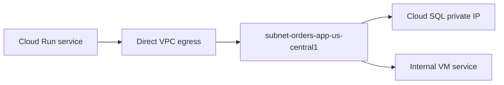

## Table of Contents

1. [The Problem](#the-problem)
2. [Ingress](#ingress)
3. [IAM And Ingress](#iam-and-ingress)
4. [Egress](#egress)
5. [Direct VPC Egress](#direct-vpc-egress)
6. [Private Ranges](#private-ranges)
7. [All Traffic](#all-traffic)
8. [Startup Checks](#startup-checks)
9. [Evidence](#evidence)
10. [Putting It All Together](#putting-it-all-together)
11. [What's Next](#whats-next)

## The Problem

Cloud Run makes deployment feel simple. You give it a container, and Google runs instances when requests arrive. That simplicity can hide two different network edges.

- Users or load balancers need to reach the service over HTTPS.
- The service needs to call Cloud SQL, Google APIs, and sometimes private addresses in a VPC.
- A team sets the service to require authentication and assumes that means the network is private.
- Another team configures private egress and assumes that means the public URL is no longer reachable.

Cloud Run networking is easier when you split the directions. Ingress is about who can reach the service. Egress is about where the service sends outbound traffic. IAM authentication is related to ingress, but it is not the same thing as network reachability.

## Ingress

Ingress controls which network paths can reach a Cloud Run service. A service can be reachable from the public internet, only through internal paths, or through selected load balancer and internal patterns depending on the chosen setting.

Ingress and invocation permission answer different questions. Ingress is the reachability gate. If the path is blocked by ingress, the request should not get to the service as an invocable request. If the path is allowed, IAM may still require an authenticated principal.

For the Orders API, a common production shape is:

| Caller path | Ingress decision |
| --- | --- |
| Public users through external load balancer | Allow the load balancer path |
| Random direct internet caller to generated URL | Block or avoid depending on design |
| Internal service in the same environment | Allow only if the architecture needs internal calls |

The key review question is plain: should this Cloud Run service be directly public, or should it only be reached through the public entry point you designed?

## IAM And Ingress

IAM answers who may invoke a service when authentication is required. Ingress answers where requests may come from. Those checks can work together, but they solve different problems.

If a service allows public ingress but requires IAM, an unauthenticated public request may reach the service edge and then be rejected for lack of permission. If a service blocks the network path through ingress, adding an IAM role to the caller does not open that path.

This distinction prevents a common production mistake. A team locks down IAM and leaves an unintended network path open. Another team restricts ingress and then debugs an IAM role that was never reached. Read the failure carefully: a network-style rejection and an IAM permission denial point to different controls.

| Control | Question |
| --- | --- |
| Ingress | Is this request path allowed to reach the service? |
| IAM | Is this caller allowed to invoke the service? |
| Application auth | Is this user or token allowed inside the app's own model? |

Cloud Run can be simple, but public security still has layers.

## Egress

Egress controls where outbound traffic from the Cloud Run service goes. A service might call public APIs, Google APIs, private VM addresses, Cloud SQL private IPs, or internal services. Each destination may need a different path.

By default, Cloud Run can make outbound requests without you manually attaching it to a subnet. That is fine for many public API calls. It is not enough when the destination is a private address inside a VPC or when the team wants outbound traffic to leave through a controlled VPC path.

For the Orders API, egress questions include:

| Destination | Network question |
| --- | --- |
| Public payment API | Can normal outbound internet access reach it, and should egress be controlled? |
| Secret Manager | Is the Google API reachable, and does IAM allow access? |
| Cloud SQL private IP | Does Cloud Run have a VPC egress path to the private address? |
| Internal VM service | Does the VPC route and firewall allow the path? |

Egress is not "turn on private networking." It is choosing the outbound path for the destinations the service actually uses.

## Direct VPC Egress

Direct VPC egress lets a Cloud Run service send traffic directly to a VPC network without a Serverless VPC Access connector. It gives the service a VPC network and subnet path for outbound traffic.

This is often the clearer starting point for new Cloud Run services that need private addresses. The service still runs as Cloud Run. You are not placing a fleet of VMs. You are configuring how outbound packets that need VPC reachability leave the service.

The subnet choice matters. If the service runs in `us-central1`, use a subnet in the right region and make sure the IP range has room for the egress behavior you expect. If the destination is a private managed service, the VPC also needs the correct private access pattern.



The diagram shows only outbound traffic. It does not say who can call Cloud Run inbound.

## Private Ranges

Cloud Run egress settings can send only private-range traffic through the VPC path while leaving other outbound traffic on the normal internet path. This is a useful default when the service only needs VPC egress for private addresses.

For example, the Orders API might send `10.30.0.0/16` traffic through the VPC path to reach private services, while calls to a public payment API use normal outbound internet. That keeps the VPC path focused on private dependencies.

The gotcha is destination classification. If a service endpoint is a public Google API, it may not behave like a private RFC 1918 address. If the team needs all Google API calls or all outbound traffic to use a controlled private path, private-ranges-only may not express the policy. The destination and policy have to match.

| Egress mode | Good fit |
| --- | --- |
| Private ranges only | Service needs VPC access for private IP destinations |
| All traffic | Service needs every outbound request to use the VPC path |

Private ranges only is not weaker by default. It is just narrower. Use it when the destination set is truly private ranges.

## All Traffic

All-traffic egress sends every outbound request through the VPC path. This can be useful when the team wants central egress controls, NAT behavior, inspection, or private Google API access patterns to apply to all outbound traffic.

The tradeoff is that the VPC path now has to support everything the service calls. Public internet APIs may need Cloud NAT or another egress route. Google API access may need the right private access design. Firewall and route restrictions can break dependencies that previously worked through the default Cloud Run outbound path.

Before choosing all traffic, write down the outbound dependency list:

| Dependency | Needed path |
| --- | --- |
| Cloud SQL private IP | VPC private path |
| Secret Manager | Google API access plus IAM |
| Cloud Storage | Google API access plus IAM |
| Payment provider | Internet egress path |
| Internal worker | VPC route and firewall |

All traffic gives more central control. It also makes the VPC egress design responsible for more destinations.

## Startup Checks

Cloud Run scales instances as traffic arrives. Network mistakes can show up during startup and during long-running requests. A service may fail to become ready because it tries to connect to a private database, fetch a secret, or call a dependency before serving requests.

That does not mean every dependency should be called at startup. It means startup behavior should be intentional. If startup requires a private connection, the egress path, route, firewall, DNS, and IAM need to be correct before the revision receives traffic.

Useful startup evidence includes:

```text
revision: orders-api-00042
ingress: load-balancer-and-internal
egress: direct-vpc, private-ranges-only
subnet: subnet-orders-app-us-central1
startup dependency: Cloud SQL private IP
failure shape: timeout, permission denied, or DNS resolution error
```

The failure shape matters. Timeout points toward path, route, firewall, or DNS. Permission denied points toward IAM or database credentials. A refused connection points toward the destination service and port.

## Evidence

A Cloud Run network review should name both edges:

```text
service: devpolaris-orders-api
region: us-central1
ingress: load balancer path only
invocation: authenticated where required
egress mode: direct VPC egress, private ranges only
egress subnet: subnet-orders-app-us-central1
private dependency: Cloud SQL private IP
public dependency: payment API over HTTPS
logs: request logs and startup logs reviewed
```

That note gives incident responders a starting point. If public requests fail, start with DNS, load balancer, ingress, IAM, and revision traffic. If private database calls fail, start with egress, VPC path, private access, DNS, firewall, and database permission.

## Putting It All Together

Return to the opening problems.

Users reaching the service are an ingress question. Decide whether callers can use the generated Cloud Run URL, a custom domain, a load balancer path, internal paths, or some combination.

The service calling Cloud SQL is an egress question. If the database uses a private IP, Cloud Run needs a VPC egress path and the managed service private access design must exist.

IAM authentication and ingress are separate gates. Requiring an authenticated invoker can reject callers, but it does not by itself decide which network paths are allowed.

Private egress is not the same as hiding the public URL. Egress controls outbound traffic. Ingress controls inbound reachability. Keeping those directions separate makes Cloud Run feel much less mysterious.

## What's Next

Cloud Run can send traffic into a VPC, but some destinations are managed services that do not simply live inside your subnet. Next, we look at private access to Cloud SQL, Google APIs, and service-oriented private endpoints.

---

**References**

- [Google Cloud: Cloud Run ingress settings](https://cloud.google.com/run/docs/securing/ingress)
- [Google Cloud: Configure Direct VPC egress](https://cloud.google.com/run/docs/configuring/vpc-direct-vpc)
- [Google Cloud: Serverless VPC Access](https://cloud.google.com/vpc/docs/serverless-vpc-access)
