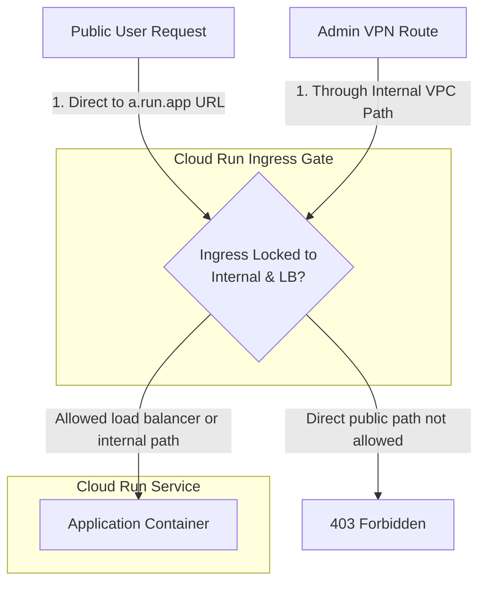
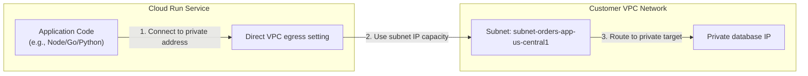

## Table of Contents

1. [Cloud Run Ingress and Egress](#cloud-run-ingress-and-egress)
2. [Inbound Ingress Settings and Path Protection](#inbound-ingress-settings-and-path-protection)
3. [Outbound Egress Modes](#outbound-egress-modes)
4. [The IMDS Workload Token Exchange](#the-imds-workload-token-exchange)
5. [Putting It All Together](#putting-it-all-together)
6. [What's Next](#whats-next)

## Cloud Run Ingress and Egress

When you use serverless platforms like Google Cloud Run, your containerized application runs on physical servers managed entirely by Google. You do not have to configure virtual machines, set up operating systems, or manage scaling limits. However, removing server management does not eliminate the need for network planning. To operate a secure serverless service, you must treat your container's networking like designing the doors of a highly secure building. You must configure two completely separate paths: the inbound "front door" (how users and other services reach your container) and the outbound "back door" (where your container goes to fetch data or call external APIs).

*Read the two sides separately when debugging access.*

The inbound path is called ingress. It determines who is allowed to walk through your front door. For example, you can choose to make your container's public URL accessible to anyone on the public street (internet), or lock it down so only visitors arriving from inside your private VPC network (or guided through your global load balancer) are permitted to enter.

The outbound path is called egress. It dictates where your container can go when it opens its back door to send a network request. For example, when your application code needs to save data, it can make requests out to the public internet (default internet egress), or route privately through a secure tunnel directly to your internal database subnet (VPC egress) completely separated from the public street.

By separating ingress from egress, you protect your system from common security holes. You can ensure that a backend processing container can access private internal databases securely through its back door, while keeping its front door completely locked and invisible to any unsolicited public internet requests.

## Inbound Ingress Settings and Path Protection

When you deploy a Cloud Run service, the platform assigns it a default public URL (e.g. `https://orders-api-123.a.run.app`). To prevent clients from bypassing your public entry points (like load balancers or API gateways), you must configure **Ingress Settings**:

*   **All (Public)**: The default setting. The service is reachable directly from the public internet using the generated platform URL or any custom domain mapping.
*   **Internal**: The service is only reachable from resources within the same VPC network (via VPC connectors or Direct VPC egress) or other serverless services.
*   **Internal and Cloud Load Balancing**: The service is only reachable from your external Application Load Balancer (via Serverless NEGs) or from internal VPC resources.

These settings are the serverless equivalents of AWS Target Group path restrictions or Azure Container Apps Ingress Access Restrictions. They isolate your microservice, ensuring that public users cannot discover and invoke your raw container endpoints directly.

The setting is enforced by Cloud Run's ingress control. Google documents the outcome rather than a header algorithm: direct internet calls to the raw service URL are blocked, while traffic from the allowed load-balancer or internal paths can reach the service.

This is separate from IAM authentication. A service can have public ingress but still require callers to have the Cloud Run Invoker permission. A service can also allow unauthenticated invocation but restrict which network paths are accepted. Read ingress and IAM as two gates, not one.

## Outbound Egress Modes

Outbound egress controls where your container sends packets. When your code makes an HTTP request or establishes a TCP socket, Cloud Run routes the packets based on your configured egress path:

*   **Default Internet Egress**: Outbound packets leave the container over Google's public shared routing fabric, assigning a dynamic public IP address to the connection. This works for calling external API endpoints but cannot reach private resources inside a VPC.
*   **VPC Egress**: Routes outbound packets through a dedicated subnet interface inside your VPC network.

When VPC Egress is active, you must choose a routing policy:

*   **Private Ranges Only**: The default VPC routing policy. Only packets destined for RFC 1918 private IP address blocks (such as `10.0.0.0/8`, `172.16.0.0/12`, or `192.168.0.0/16`) are routed through your VPC subnet. All other outbound traffic to the public internet or public Google APIs bypasses the VPC, routing over Google's default internet paths.
*   **All Traffic**: Forces every outbound packet (including public internet calls) to route through your VPC subnet. This policy is necessary when you must inspect all outbound traffic or route all public requests through a static IP address via a Cloud NAT gateway.

:::expand[Design Detail: Direct VPC Egress Behavior]{kind="design"}
Historically, serverless runtimes often routed outbound VPC traffic through a Serverless VPC Access connector, a dedicated managed connector that acted as a transit bridge. Direct VPC egress lets Cloud Run send outbound traffic to a VPC network without that connector.

The documented behavior is the important part. Cloud Run allocates ephemeral IP addresses from the selected subnet for outbound VPC traffic. During scale-up, the platform can reserve IP addresses in blocks, so subnet sizing matters. Google recommends allowing enough free IP space, and small subnets can become a scaling bottleneck.

Direct VPC egress affects outbound traffic only. It does not make a Cloud Run service reachable from your VPC by inbound TCP connections. Cloud Run services and jobs do not support Direct VPC ingress, so inbound access still uses Cloud Run ingress settings, load balancers, IAM, and service URLs.

When your application initiates a socket connection to a private database, Cloud Run uses the configured egress mode to decide whether the connection should leave through the VPC subnet. With `private-ranges-only`, private address ranges go through the VPC and other traffic uses the default path. With `all-traffic`, all outbound traffic goes through the VPC, which is useful when you need Cloud NAT, inspection, or a controlled egress path.
:::

## The IMDS Workload Token Exchange

Securing serverless database and API connections requires you to avoid hardcoding static credentials inside container configurations. Cloud Run solves this by letting the service run as a service account and by exposing metadata access that Google client libraries can use to obtain short-lived credentials.

*Network privacy does not replace IAM. Both paths must pass.*

Cloud Run supports metadata access through the local metadata hostname. The point is not the sandbox implementation; the point is that the workload can request credentials for its attached service account without storing a key file.

When your container code or SDK client attempts to access a resource (such as reading a database key or calling Secret Manager), it initiates a dynamic handshake:

1.  **Local Fetch**: The application issues an HTTP GET request to `http://metadata.google.internal/computeMetadata/v1/instance/service-accounts/default/token` with the required header `Metadata-Flavor: Google`.
2.  **Runtime Identity Check**: The runtime knows which service account is attached to the Cloud Run revision.
3.  **Token Issuance**: Google returns a short-lived OAuth2 access token for that service account.

The application container injects this token into its outbound Bearer headers to access resources securely, ensuring that no static keys ever reside on disk or in environment variables.

This metadata path gives your container libraries a uniform lookup target, enabling passwordless authentication without local private keys.

## Putting It All Together

Let's trace how the inbound and outbound edges work together on a Cloud Run microservice.

By setting your service's ingress to `internal-and-cloud-load-balancing`, you ensure that inbound user traffic must arrive through the allowed load-balancer path or an allowed internal path, protecting your container from direct raw internet access.

For outbound traffic, you enable Direct VPC egress bound to your regional subnet. When the application container makes a private database call, Cloud Run routes that outbound connection through the configured VPC egress path and consumes subnet IP capacity during scaling.

Finally, the application uses Cloud Run service identity and metadata-backed credentials to acquire short-lived OAuth2 tokens. The private network path gets packets to the right place, and IAM decides whether the service account is allowed to use the target Google API.

## What's Next

Cloud Run can now send traffic into a VPC. However, many backing resources (such as relational databases or managed object storage) are managed services that do not simply sit in your subnet. In the next article, we detail Private Access, focusing on Private Services Access peering, Private Google Access DNS virtual IPs, and Private Service Connect proxy gateways.

*Use this summary as the quick mental checklist before designing or debugging the service.*

---

**References**

- [Google Cloud: Cloud Run ingress settings](https://cloud.google.com/run/docs/securing/ingress) - Core guide to restricting inbound access to serverless runtimes.
- [Google Cloud: Configure Direct VPC egress](https://cloud.google.com/run/docs/configuring/vpc-direct-vpc) - Specification for direct virtual network interface mounting.
- [Google Cloud: Cloud Run authentication overview](https://cloud.google.com/run/docs/authenticating/overview) - Explains Cloud Run Invoker checks and unauthenticated access.
- [Google Cloud: Cloud Run service identity](https://cloud.google.com/run/docs/securing/service-identity) - Explains service accounts and runtime credentials.
