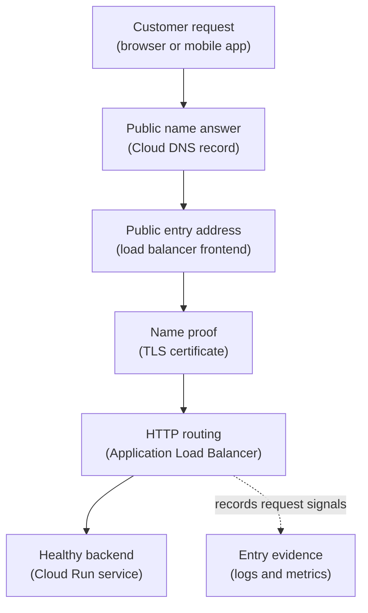

## Table of Contents

1. [A Public API Needs A Trustworthy Front Door](#a-public-api-needs-a-trustworthy-front-door)
2. [The Public Entry Path](#the-public-entry-path)
3. [DNS Gives The Name An Answer](#dns-gives-the-name-an-answer)
4. [Custom Domains Need Ownership And Direction](#custom-domains-need-ownership-and-direction)
5. [HTTPS Proves The Name And Encrypts The Request](#https-proves-the-name-and-encrypts-the-request)
6. [Load Balancers Receive Traffic Before Backends Do](#load-balancers-receive-traffic-before-backends-do)
7. [Global And Regional Are Real Design Choices](#global-and-regional-are-real-design-choices)
8. [Cloud Run Can Sit Behind A Load Balancer](#cloud-run-can-sit-behind-a-load-balancer)
9. [Health Checks Keep Bad Backends Out](#health-checks-keep-bad-backends-out)
10. [Evidence For The Public Path](#evidence-for-the-public-path)
11. [Failure Modes And Fix Directions](#failure-modes-and-fix-directions)
12. [Tradeoffs For The First Public Entry](#tradeoffs-for-the-first-public-entry)
13. [The Review Habit](#the-review-habit)

## A Public API Needs A Trustworthy Front Door

Users should not need to know how your backend is hosted. They should call a stable name.
They should use HTTPS. They should reach a healthy backend. They should not see internal
service URLs, temporary revision names, or random infrastructure details. That is the job of
the public entry path. For `devpolaris-orders-api`, the public name is:

```text
orders.devpolaris.com
```

That name should lead to the production checkout API. It should present a valid certificate.
It should route requests to the intended Cloud Run service or backend. It should stop
sending traffic to unhealthy backends. It should leave enough logs and metrics for the team
to debug failed requests. The public entry path has several parts.

DNS answers the name. TLS proves the name and encrypts the connection. The load balancer or
Cloud Run entry receives the request. Backend health decides which service instance should
receive traffic. If one part is wrong, users may see a failure even when the application
code is healthy.

## The Public Entry Path

The public path starts outside Google Cloud. A customer opens the mobile app or browser. The
client asks where `orders.devpolaris.com` points. DNS returns an answer. The client opens an
HTTPS connection to the entry point. The entry point presents a certificate for that name.
Then the request is routed to the backend. In a GCP design with an external Application Load
Balancer and Cloud Run, the path can look like this:

```text
customer
  -> orders.devpolaris.com
  -> Cloud DNS record
  -> external Application Load Balancer
  -> certificate and HTTPS proxy
  -> serverless backend
  -> Cloud Run service
```

Here is the same path as a small diagram:



Read it top to bottom. DNS is not the load balancer. The certificate is not the backend. The
load balancer is not the application code. Each piece has a different failure mode.

## DNS Gives The Name An Answer

DNS (Domain Name System, the internet naming system) turns a readable name into an address
or another name. Cloud DNS is GCP's managed DNS service. It can host public zones for names
visible on the internet. It can also host private zones visible only inside selected VPC
networks. For the public API, the team cares about the public zone.

The record might say:

```text
orders.devpolaris.com -> public load balancer address
```

That sounds simple, but DNS failures are common because DNS has two layers of ownership.
First, the domain owner must delegate the zone to the right authoritative name servers.
Second, the zone must contain the right record. If delegation points somewhere else, editing
Cloud DNS records will not change what users see. If the record points to an old load
balancer, the app can be healthy and users can still reach the wrong place.

When debugging, ask: Which DNS zone owns this name? Which record answers the name? What
address or target does it return? Does that target belong to the intended entry point? DNS
is the first hop users depend on, so it deserves evidence.

## Custom Domains Need Ownership And Direction

A custom domain is a friendly name the team controls, such as `orders.devpolaris.com`. Cloud
Run can have service-generated URLs, but users should usually see a stable product domain. A
custom domain gives the team a clean public contract. It also forces the team to prove
domain ownership and point traffic at the intended entry. There are two common shapes.

The team can map a custom domain directly to Cloud Run for simpler services. Or the team can
put an external Application Load Balancer in front of Cloud Run for more control over TLS,
routing, policies, and multiple backends. The right first question is not "which service is
cooler." The right first question is: What job must the public entry do?

If the service only needs a simple HTTPS custom domain, direct Cloud Run domain mapping may
be enough. If the service needs centralized routing, multiple backends, edge controls, or a
single front door for several services, a load balancer may be the better entry. The domain
points to the entry. The entry decides what happens next.

Those are separate choices.

## HTTPS Proves The Name And Encrypts The Request

HTTPS is HTTP over TLS. TLS (Transport Layer Security) protects the connection and lets the
server prove it owns the name the client requested. For `orders.devpolaris.com`, the client
expects a certificate valid for that name. If the certificate is missing, expired, or for
another name, users may see a browser or client error before the request reaches the app.

In GCP, Certificate Manager can manage TLS certificates for supported load balancer paths.
Some Cloud Run custom domain flows can also manage certificates for the service entry. The
exact choice depends on the entry design. The mental model stays the same: DNS sends the
client to an entry. The entry presents a certificate. The certificate must match the name
the client used.

A healthy HTTPS entry snapshot might say:

```text
domain: orders.devpolaris.com
certificate: managed certificate for orders.devpolaris.com
entry: external Application Load Balancer
status: active
backend: devpolaris-orders-api Cloud Run service
```

This snapshot tells the team what to check when users report TLS errors. Do not start by
changing app code. First prove the name and certificate path.

## Load Balancers Receive Traffic Before Backends Do

A load balancer is a managed entry point that receives traffic and sends it to backends. For
HTTP and HTTPS APIs, GCP Application Load Balancers are the main load balancing family to
understand first. They operate at Layer 7, which means they understand HTTP-level traffic.
Layer 7 is the application layer in the networking model.

For a beginner, that means the load balancer can make decisions based on HTTP concepts like
hostnames, paths, and health checks. The load balancer is not your app. It is the front
desk. It receives the request, checks the rules, and sends the request to a backend that
should handle it. For `devpolaris-orders-api`, the backend could be a Cloud Run service
through a serverless backend configuration.

The load balancer gives the team a stable public frontend. It can also help with custom
domains, certificates, routing, and centralized request signals. That extra control has a
cost. There are more resources to configure and debug. For a tiny service, direct Cloud Run
entry might be easier. For a production API with several routes or shared entry controls,
the load balancer can make the public path cleaner.

## Global And Regional Are Real Design Choices

GCP load balancing often surprises people because global and regional are not only labels on
a console page. They shape where the frontend exists and how traffic reaches backends. A
global external Application Load Balancer can present a global entry for HTTP and HTTPS
traffic. It is often useful when users are spread across regions or when the team wants a
single global public entry.

A regional external Application Load Balancer keeps the load balancer in one region. It can
be a better fit when the service, compliance needs, or network design is regional. Do not
choose global just because it sounds better. Do not choose regional just because the app
currently runs in one region. Ask what the public entry must promise.

| Choice | What You Gain | What You Must Manage |
|---|---|---|
| Direct Cloud Run URL or mapping | Fewer moving parts | Less central control for complex entry patterns |
| Global external Application Load Balancer | One global HTTP entry and broader routing options | More load balancer resources to understand |
| Regional external Application Load Balancer | Regional control and placement | Less global entry behavior |

This table is not a final architecture decision.

It is a way to discuss the tradeoff before clicking through setup.

## Cloud Run Can Sit Behind A Load Balancer

Cloud Run can receive traffic directly. It can also sit behind an Application Load Balancer.
When Cloud Run sits behind a load balancer, the load balancer is the public entry and Cloud
Run is the backend. That design lets the team control the public path more centrally. It can
also help when several services share one domain.

For example:

```text
orders.devpolaris.com/api        -> devpolaris-orders-api
orders.devpolaris.com/receipts   -> devpolaris-receipts-api
```

The load balancer can route by path or host depending on the design. Cloud Run still has its
own ingress settings. That is important. If the team wants traffic to enter only through the
load balancer, the Cloud Run ingress setting should match that intention. Otherwise, users
may reach the service through another path the team did not mean to expose.

This is a good example of layered network design. The load balancer controls the public
front door. Cloud Run ingress controls which network paths can reach the service. IAM may
still control whether a caller is allowed to invoke the service. Each layer answers a
different question.

## Health Checks Keep Bad Backends Out

A load balancer should not blindly send traffic to a broken backend. It needs a way to
decide whether the backend is healthy. For VM or instance group backends, health checks are
explicit resources. For serverless backends, GCP hides some of the backend mechanics, but
the same operating idea matters: the entry should route traffic only to a backend that can
serve it.

Your application still needs useful health behavior. If the orders API starts but cannot
reach Cloud SQL, a shallow health check may say "healthy" while checkout fails. If the
health endpoint checks too much, a small dependency issue may remove all backends too
aggressively. Health checks are a tradeoff. They should prove the backend can receive
traffic and perform its core job.

They should not become a slow full checkout every few seconds. For the orders API, a
practical split might be:

```text
/health/live
  proves the process is running

/health/ready
  proves the app can serve traffic and reach required dependencies
```

The load balancer or runtime entry may use the appropriate readiness signal depending on the
platform.

The important part is that public traffic should not continue to a backend known to be
unready.

## Evidence For The Public Path

When users cannot reach an API, collect evidence from the outside in. Start with the name.
Then the certificate. Then the entry. Then the backend. A useful public path record might
look like this:

```text
public name:
  orders.devpolaris.com

dns answer:
  points to: gcp-orders-prod-lb

https:
  certificate: valid for orders.devpolaris.com
  status: active

load balancer:
  type: external Application Load Balancer
  frontend: HTTPS 443
  backend: serverless backend for devpolaris-orders-api

backend:
  platform: Cloud Run
  region: us-central1
  health: ready
```

This record tells you where to look. If DNS points to the wrong entry, load balancer health
does not matter yet. If the certificate is wrong, the request may not reach your app. If the
backend is unhealthy, changing DNS will not fix it. One path. One check at a time.

## Failure Modes And Fix Directions

The first failure is stale DNS. The team moved to a new load balancer.
`orders.devpolaris.com` still points to the old entry. The fix direction is to update the
authoritative DNS record and account for DNS caching while validating. The second failure is
certificate mismatch. The certificate is valid for `api.devpolaris.com`, but the client
calls `orders.devpolaris.com`.

The fix direction is to issue or attach a certificate that covers the actual hostname. The
third failure is direct Cloud Run exposure when the load balancer should be the only entry.
The load balancer is configured, but the Cloud Run service still accepts traffic through
another public path. The fix direction is to review Cloud Run ingress settings and the
intended public entry.

The fourth failure is unhealthy backend. The load balancer receives traffic, but has no
healthy backend to send it to. The fix direction is to inspect backend health, service
startup logs, and the app's readiness behavior. The fifth failure is global versus regional
mismatch. The team expects global behavior from a regional entry, or expects regional
control from a global one.

The fix direction is to restate the entry requirement and choose the load balancer mode that
matches it.

## Tradeoffs For The First Public Entry

A direct Cloud Run custom domain is easy to understand. That is a real advantage. There are
fewer resources to explain. There are fewer backend objects to click through. An external
Application Load Balancer gives more control. That is also a real advantage. It can
centralize TLS, routing, backend selection, and request signals. It can place several
services behind one public entry.

The cost is complexity. More pieces mean more places where a beginner can misread the path.
For a learning path, teach both shapes, then choose based on the job. For
`devpolaris-orders-api`, I would use the load balancer path when the team wants a production
front door with clear TLS, routing, and backend health evidence. For a small internal
prototype, direct Cloud Run entry may be enough.

The key is to write down the choice and why it fits the traffic job.

## The Review Habit

Review public entry from the user's side first. Which hostname do users call? Which DNS zone
owns that hostname? What does the hostname resolve to? Which entry receives HTTPS? Which
certificate covers the hostname? Which backend receives traffic? How is backend health
checked? Can users bypass the intended entry? Which logs prove requests reached the entry?

This review keeps the team away from random fixes. If the customer cannot connect, do not
immediately redeploy the app. First find where the request stopped. The public path is a
chain. Debug it like a chain.

---

**References**

- [Cloud DNS overview](https://cloud.google.com/dns/docs/overview) - Explains public and private managed DNS zones in Google Cloud.
- [Application Load Balancer overview](https://cloud.google.com/load-balancing/docs/application-load-balancer) - Documents GCP Application Load Balancer modes and supported backend types.
- [External Application Load Balancer overview](https://cloud.google.com/load-balancing/docs/https) - Explains external HTTP and HTTPS load balancing choices, including global and regional modes.
- [Certificate Manager overview](https://cloud.google.com/certificate-manager/docs/overview) - Describes managed TLS certificates for supported Google Cloud load balancers.
- [Cloud Run ingress](https://cloud.google.com/run/docs/securing/ingress) - Shows how Cloud Run service ingress settings interact with direct URLs, domains, and load balancer paths.
