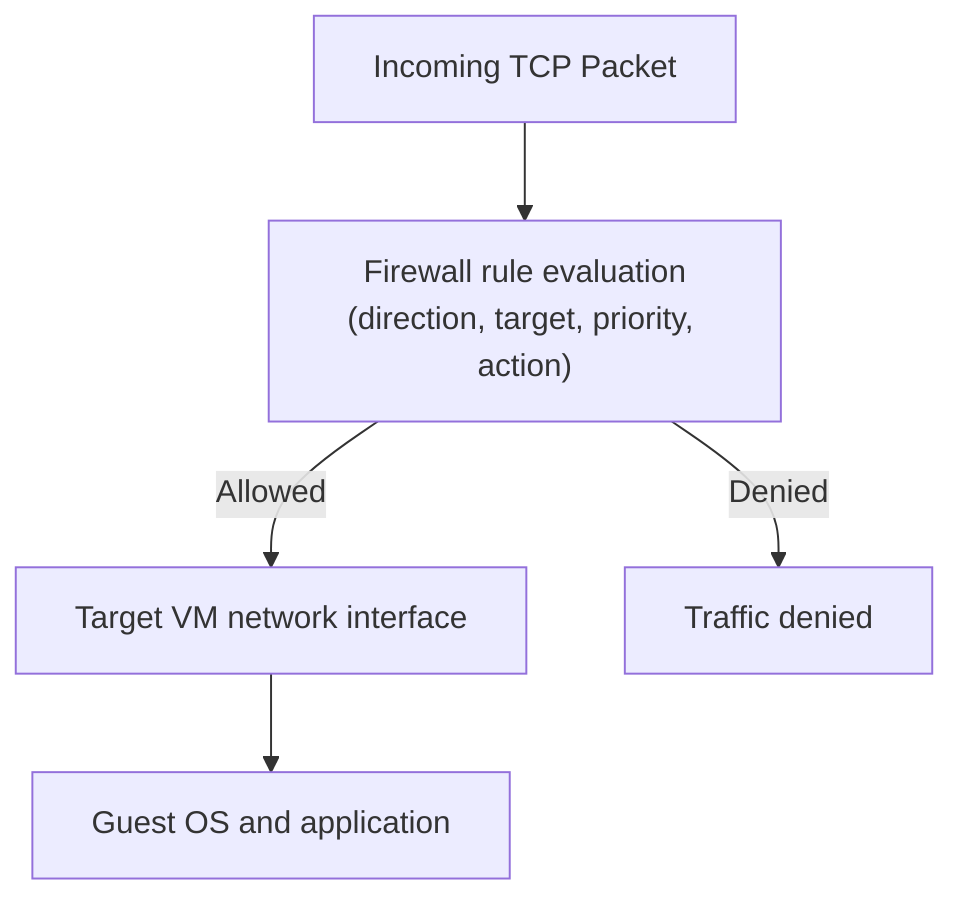

## Table of Contents

1. [VPC Firewall Rules](#vpc-firewall-rules)
2. [Stateful Connection Tracking](#stateful-connection-tracking)
3. [Ingress and Egress Paths](#ingress-and-egress-paths)
4. [Rule Priority Matching Engine](#rule-priority-matching-engine)
5. [Target Segmentation: Tags vs. Service Accounts](#target-segmentation-tags-vs-service-accounts)
6. [Putting It All Together](#putting-it-all-together)
7. [What's Next](#whats-next)

## VPC Firewall Rules

GCP VPC firewall rules are conditional packet policies attached to a VPC network and enforced for the VM interfaces they target. They decide whether traffic is allowed or denied based on direction, priority, protocol, ports, source or destination ranges, and target instances.

In Google Cloud, these network controls are managed by writing firewall rules. Unlike other cloud environments like Amazon Web Services (AWS), which split firewall tasks into stateful, allow-only Security Groups for individual virtual machines and stateless, ordered Network ACLs (NACLs) at the subnet boundary, Google Cloud combines these behaviors into a single firewall system. Every rule you write is stateful, can either explicitly allow or block traffic, and is evaluated in a strict priority order at the virtual interface of your resource.

At its core, a firewall rule is a conditional security statement linked to your VPC network. It inspects a packet and looks for a match based on the direction of travel, the action, the protocol, the destination ports, the source or destination ranges, and the targeted instances. If a packet matches these criteria, the rule's instruction is executed. The implied posture is deny ingress and allow egress, but the default VPC network also comes with pre-populated allow rules for internal traffic, SSH, RDP, and ICMP. Custom VPC networks make the implicit rules easier to reason about because you add the opening rules deliberately.

:::expand[Design Detail: Where Firewall Rules Apply]{kind="design"}
The beginner-safe way to understand GCP firewall rules is that they are not a single firewall appliance sitting in one subnet. A VPC firewall rule is evaluated for the VM network interfaces it targets.

That matters because you design rules around the destination or source instances, not around a box that every packet must pass through. If an ingress rule blocks traffic, the traffic is denied before your application process should treat it as an accepted connection. Google Cloud manages the enforcement machinery; the design contract you control is the rule direction, target, source or destination, priority, and action.

This is why a blocked port scan does not need an application-level deny rule. The VPC firewall should reject traffic that should never become an application connection in the first place.
:::

## Stateful Connection Tracking

Stateful connection tracking means a permitted connection creates temporary return-path state. When a rule allows a connection in one direction, such as ingress to port 443, Google Cloud tracks the connection state and permits return traffic in the opposite direction without requiring a matching outbound rule.

*State tracking prevents every response from needing a duplicate inbound rule.*

To enforce this, Google Cloud keeps connection state for allowed traffic. When a TCP connection begins, the firewall evaluation checks the first packet against the active rules. Once allowed, return packets that match the connection can flow without a mirrored rule.

As long as the connection remains active, return packets matching this connection record are allowed without requiring a mirrored firewall rule. Once the connection is terminated via a `FIN` or `RST` handshake, or times out due to inactivity, the state record is removed, and a new connection must be evaluated from scratch.

## Ingress and Egress Paths

Ingress and egress describe packet direction relative to the targeted VM interface. GCP separates firewall rules by traffic direction, allowing you to build highly targeted security perimeters:

*   **Ingress Rules**: Control incoming traffic routed toward target resources inside your VPC. Every ingress rule must specify a source (such as an IP range, a network tag, or a service account identity) and target resources.
*   **Egress Rules**: Control outgoing traffic initiated by your resources. Every egress rule must specify target resources and a destination (such as an external IP range or another subnet).

By default, every VPC network contains two implied, lowest-priority rules:

*   **Implied Ingress Deny**: Drops all incoming traffic to all resources, unless you explicitly write a higher-priority allow rule.
*   **Implied Egress Allow**: Permits all outbound traffic from all resources to any destination globally, unless you explicitly write a higher-priority deny rule.

This default posture secures your resources from unsolicited incoming scans while allowing your applications to download packages or call external APIs out of the box.

## Rule Priority Matching Engine

The rule priority engine is the ordered evaluation model that decides which matching firewall rule wins. When traffic targets a VM network interface, Google Cloud evaluates all matching rules using this priority matching engine.

*A lower number wins, so broad allow rules must sit beneath narrow denies.*

Each firewall rule carries an integer priority number between `0` and `65535`. The engine evaluates rules in ascending order, meaning **lower numbers have higher priority**. A rule with priority `100` is evaluated and enforced before a rule with priority `1000`.

To prevent rules from overlapping and creating silent security holes, many teams organize firewall policies into local priority bands. The numbers below are an example convention, not a Google-defined standard:

| Priority Band | Intended Use Case | Operational Example |
| :--- | :--- | :--- |
| **`0 - 99`** | Emergency Overrides | Immediately block a compromised corporate CIDR range. |
| **`100 - 499`** | Organization Security Gates | Globally block cleartext HTTP (port 80) across all environments. |
| **`500 - 999`** | App-Specific Service Rules | Allow the database proxy to accept traffic only on port 5432. |
| **`1000 - 65534`**| Project-Level Defaults | Standard internal VPC communication or developer testing rules. |
| **`65535`** | Implied System Defaults | The default ingress deny and egress allow catch-all rules. |

Once a packet matches a rule's criteria (source, destination, protocol, and port), the rule's action (allow or deny) is executed immediately, and further evaluation stops. If no custom rules match, the packet falls back to the implied priority `65535` defaults.

This explicit priority band structure maps closely to AWS Network ACLs and Azure Network Security Groups, where each rule is assigned an integer order. However, unlike AWS NACLs which are bound to subnets, GCP prioritizes and enforces these rules globally across the entire VPC, eliminating the need to manage split-layer subnet and instance firewall tables.

## Target Segmentation: Tags vs. Service Accounts

Target segmentation is how you decide which VM interfaces a firewall rule applies to. GCP allows you to target firewall rules to specific VM instances using two different metadata systems: network tags and service accounts.

**Network Tags** are simple text strings, such as `web-server` or `database-tier`, added directly to a VM instance. They are simple to understand and configure, but they carry significant security risks in production environments. Any user with Compute Instance Admin permissions can add or remove tags on a VM, which dynamically alters that VM's firewall boundaries without passing through an IAM security policy review.

**Service Accounts** are workload identities attached to VM instances. When you target a firewall rule to a service account, such as `orders-app@prod-project.iam.gserviceaccount.com`, the rule applies to VM instances running as that specific service account.

Because modifying a VM's service account requires specific IAM permissions, using service account targets can prevent developer tag drift from accidentally exposing database ports or lateral network paths.

Targeting rules based on service accounts is the GCP equivalent of grouping network access around workload identity instead of manually maintained IP lists. It is still a firewall targeting mechanism for VM instances, so treat Cloud Run and other serverless ingress settings as separate networking controls.

## Putting It All Together

Securing a VPC network requires a layered approach. By default, the implied ingress deny blocks all incoming traffic, protecting your subnets from raw internet scans.

When you deploy a backend workload, you assign it a dedicated service account. You then write an ingress allow rule targeting that service account, restricting access to the specific source VPN range and database ports.

The VPC firewall rule is evaluated against the targeted VM interface. Packets that violate the rule are dropped before they reach the guest workload, keeping the application focused on serving allowed traffic.

## What's Next

Now that the private network has a routing map and packet rules, the next question is how public users reach the system safely. In the next article, we follow a request through public DNS records, HTTPS certificates, global Application Load Balancers, and serverless NEGs.

*Use this summary as the quick mental checklist before designing or debugging the service.*

---

**References**

- [Google Cloud: VPC firewall rules](https://cloud.google.com/firewall/docs/firewalls) - Architectural specification for GCP distributed firewalls.
- [Google Cloud: Firewall rules logging](https://cloud.google.com/firewall/docs/firewall-rules-logging) - Reference for auditing and verifying matched traffic.
- [Google Cloud: Firewall rule targets](https://cloud.google.com/firewall/docs/firewalls#rule_assignment) - Explains network tag and service account targeting behavior.
