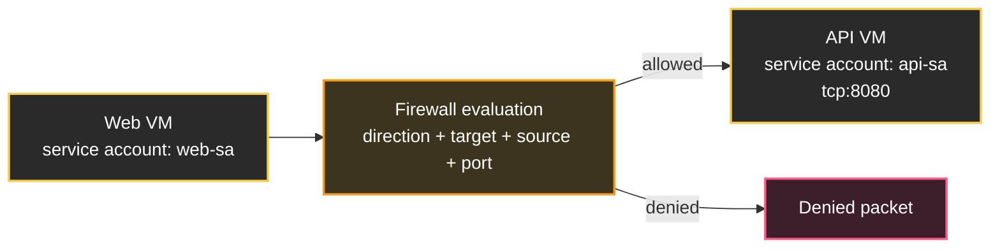

## Table of Contents

1. [Firewall Rules as Packet Decisions](#firewall-rules-as-packet-decisions)
2. [Direction, Sources, and Destinations](#direction-sources-and-destinations)
3. [Priority, Allow, and Deny](#priority-allow-and-deny)
4. [Implied Rules and Default Network Rules](#implied-rules-and-default-network-rules)
5. [Stateful Return Traffic](#stateful-return-traffic)
6. [Targets: Tags and Service Accounts](#targets-tags-and-service-accounts)
7. [Firewall Policies for Shared Guardrails](#firewall-policies-for-shared-guardrails)
8. [gcloud and Terraform Firewall Baseline](#gcloud-and-terraform-firewall-baseline)
9. [Verification Commands and Troubleshooting](#verification-commands-and-troubleshooting)
10. [Putting It All Together](#putting-it-all-together)
11. [What's Next](#whats-next)

## Firewall Rules as Packet Decisions
<!-- section-summary: A firewall rule is an access decision for packets that enter or leave VM interfaces in a VPC network. -->

A **Google Cloud firewall rule** is a network access rule that decides whether traffic is allowed or denied for VM interfaces in a VPC network. It checks packet facts such as direction, source, destination, protocol, port, target, priority, and action. The action is either **allow** or **deny**.

The food delivery app from the VPC article gives us the packet path for this article. The team has a web tier, an API tier, and a database client tier. The VPC route table can send packets from the web subnet to the API subnet. That only answers the path question. The firewall answers the access question: can a packet from the web tier reach TCP port `8080` on the API tier?



Firewall rules are attached to a VPC network, and Google Cloud enforces them for VM network interfaces that match the rule target. That detail is important for beginners because rule enforcement follows the targeted interfaces in the VPC rather than a single appliance VM sitting in one subnet. If a managed instance group replaces an API VM with a new VM that uses the same target service account, the rule applies to the new VM interface too.

Every firewall decision starts with direction, so that is the next piece.

## Direction, Sources, and Destinations
<!-- section-summary: Ingress rules control packets arriving at targets, and egress rules control packets leaving targets. -->

**Direction** describes the packet's movement relative to the targeted VM interface. **Ingress** means the packet is arriving at the target. **Egress** means the packet is leaving the target. This sounds small, but many firewall mistakes start with the rule written in the wrong direction.

An **ingress rule** controls incoming traffic to target VMs. For the food delivery app, the API tier might need an ingress allow rule for TCP `8080` from the web tier. The target is the API VM interface. The source is the web tier, expressed as a source range, source tag, or source service account depending on the rule design.

An **egress rule** controls outgoing traffic from target VMs. The API tier might need egress to a private database address on TCP `5432`, or the worker tier might need egress to a package repository through Cloud NAT on TCP `443`. The target is the VM that sends the traffic. The destination is the IP range or address the packet tries to reach.

Here is the same app written as packet questions:

| Packet | Direction | Target | Source or destination | Port |
|---|---|---|---|---:|
| Public load balancer proxy to web VM | Ingress | Web VMs | Load balancer proxy ranges | `443` or app port |
| Web VM to API VM | Ingress | API VMs | Web tier identity or subnet range | `8080` |
| API VM to database | Egress | API VMs | Database private address range | `5432` |
| Worker VM to API VM | Ingress | API VMs | Worker tier identity or subnet range | `8080` |

The useful beginner habit is to name the target first. "API VMs accept TCP `8080` from web VMs" is an ingress rule targeting API VMs. "API VMs send TCP `5432` to the database range" is an egress rule targeting API VMs. Once the target is clear, source and destination fields stop blending together.

Direction tells Google Cloud which side of the packet to evaluate. Priority decides which matching rule wins when multiple rules could apply.

## Priority, Allow, and Deny
<!-- section-summary: Firewall priorities decide which matching rule applies, and lower priority numbers win over higher numbers. -->

Every VPC firewall rule has a **priority** from `0` through `65535`. Lower numbers have higher priority. If a rule is created without an explicit priority, Google Cloud assigns priority `1000`.

The highest-priority applicable rule controls the decision for a packet. A broad rule with priority `500` can override a narrower rule with priority `1000` because priority wins before target specificity. When two applicable rules have the same priority and different actions, **deny wins over allow**. Because of that, production teams usually give important rules unique priorities so logging and review stay predictable.

Here is a small priority plan for the food delivery app:

| Priority | Rule idea | Why it exists |
|---:|---|---|
| `100` | Deny SSH from the internet to all VMs | A shared safety rule blocks a risky management path |
| `300` | Allow emergency SSH from the VPN admin subnet to break-glass VMs | A narrow exception sits above broad denies |
| `800` | Allow web tier to reach API tier on TCP `8080` | The application path is explicit |
| `900` | Allow API tier to reach database private range on TCP `5432` | The database path is explicit |
| `65535` | Implied rules | Google Cloud fallback behavior applies when no rule matches |

The numbers leave gaps, which helps a team add a future rule without renumbering everything. The exact bands are a team convention rather than a Google Cloud requirement. The important behavior is official: lower numbers have higher priority, and the highest-priority applicable rule takes precedence.

An **allow rule** grants the matching packet access. A **deny rule** blocks the matching packet. A practical production design uses both. Allow rules express expected paths, such as web to API. Deny rules express guardrails, such as no direct SSH from `0.0.0.0/0`.

Now we can talk about what happens when no custom rule matches.

## Implied Rules and Default Network Rules
<!-- section-summary: Every VPC has implied fallback rules, while the default network also starts with removable pre-populated ingress allow rules. -->

Google Cloud VPC networks have implied firewall behavior. There is an implied ingress deny rule and an implied egress allow rule at the lowest priority, `65535`. In plain language, unsolicited inbound traffic is blocked unless a higher-priority rule allows it, and outbound traffic is allowed unless a higher-priority rule denies it.

Those implied rules exist in every VPC network. They are different from the pre-populated rules in the default network. The **default network** is the auto mode VPC network that new projects may receive unless organization policy disables it. Google Cloud pre-populates the default network with ingress allow rules that permit internal traffic, SSH, RDP, and ICMP. These rules can be deleted or modified.

That distinction matters during production reviews. A custom mode production VPC usually starts quieter because the team adds the opening rules deliberately. A default network may already allow SSH or RDP from broad source ranges, and those rules deserve review before real workloads land there.

For the food delivery app, a custom mode network makes the access story easier to audit:

| Access path | Expected firewall posture |
|---|---|
| Internet to API VMs | No allow rule, so implied ingress deny blocks it |
| Web tier to API tier on TCP `8080` | Explicit ingress allow targeting API VMs |
| API tier to database on TCP `5432` | Explicit egress allow if the team restricts outbound paths |
| API tier to arbitrary internet destination | Allowed by implied egress unless a higher-priority egress deny blocks it |

Some teams leave implied egress allow in place for early application work, then add egress deny rules and narrow allows once dependencies are known. Other teams start with restricted egress in production from the beginning. The right timing depends on the team's operational maturity, but the final goal is clear: application paths are visible in rules instead of hidden inside a broad fallback.

The next beginner question is return traffic. If a web VM starts a connection to an API VM and the API VM replies, does the team need a second firewall rule for the response?

## Stateful Return Traffic
<!-- section-summary: GCP firewall rules track allowed connections, so matching return traffic can flow without a mirrored rule. -->

Google Cloud VPC firewall rules are **stateful**. Stateful means Google Cloud tracks allowed connections and automatically permits matching return traffic for that connection. If an ingress rule allows a web VM to connect to TCP `8080` on an API VM, the API VM's response packets can return to the web VM as part of that connection.

This saves teams from writing mirrored rules for every response. The first packet that starts the connection still needs to match an allow rule. After Google Cloud accepts the connection, return packets that belong to that connection are allowed by connection tracking.

Here is the food delivery API flow:

1. A web VM sends a TCP packet to an API VM on port `8080`.
2. Google Cloud evaluates ingress firewall rules for the API VM interface.
3. An allow rule matches the web source and API target.
4. Google Cloud tracks the connection.
5. The API VM sends response packets back to the web VM.
6. The return packets match connection state and flow back without a separate mirrored egress allow for that response.

Stateful firewalls still need good direction design. If the API VM initiates a new outbound connection to a database, that is a new connection and follows egress evaluation for the API VM. The earlier web-to-API state grants no unrelated access to other destinations.

Now that direction, priority, implied rules, and state are clear, the next design question is scope. Which VMs receive a rule?

## Targets: Tags and Service Accounts
<!-- section-summary: Targets define which VM interfaces receive a rule, and service account targeting gives stricter production control than simple network tags. -->

A **target** defines which VM interfaces a firewall rule applies to. Without a specific target, a VPC firewall rule can apply broadly in the network. With a target, the team can attach the rule only to selected VMs.

Google Cloud commonly uses **network tags** and **service accounts** for firewall targeting. A network tag is a text label on a VM, such as `web` or `api`. A service account is the Google Cloud identity attached to a VM, such as `api-prod@food-prod.iam.gserviceaccount.com`.

Network tags are easy to start with. A rule can say "allow TCP `8080` to VMs with the `api` tag from VMs with the `web` tag." This is readable and fast for labs or small environments. The operational tradeoff is that tags can be added or removed while a VM is running by users with the right Compute Engine permissions. If tag editing is too broad, a VM can accidentally join a more privileged network group.

Service account targeting ties firewall scope to workload identity. A rule can target VMs running as `api-prod@food-prod.iam.gserviceaccount.com` and allow sources running as `web-prod@food-prod.iam.gserviceaccount.com`. Changing the service account on an instance requires stopping and restarting the VM, and IAM permissions around service accounts are usually reviewed more tightly than simple tag changes.

Google Cloud has an important constraint: a single firewall rule supports either target service accounts or target network tags, with no mixing between the two target styles. The source fields also have restrictions depending on the target style. A team can choose the targeting style intentionally for each rule family.

For the food delivery app, service accounts give a clean production layout:

| Tier | VM service account | Firewall role |
|---|---|---|
| Web | `web-prod@food-prod.iam.gserviceaccount.com` | Source for API ingress |
| API | `api-prod@food-prod.iam.gserviceaccount.com` | Target for API ingress and source for database egress |
| Worker | `worker-prod@food-prod.iam.gserviceaccount.com` | Source for selected API ingress |

This design lets a rule describe the workload identity instead of chasing individual VM IPs. Managed instance groups can recreate VMs, and the firewall intent remains attached to the service account.

Workload-level rules handle application paths. Larger organizations also need shared guardrails above individual projects and VPCs.

## Firewall Policies for Shared Guardrails
<!-- section-summary: Hierarchical and network firewall policies let organizations manage shared rules above individual VPC firewall rules. -->

Google Cloud has more than one firewall rule surface. Traditional **VPC firewall rules** live at the VPC network level. **Firewall policies** provide shared policy containers for broader governance. A beginner only needs the basic hierarchy on day one because it explains why a project rule might be one decision among several in the path.

A **hierarchical firewall policy** can be associated with an organization or folder. Rules in that policy can block, allow, or delegate evaluation to lower levels. When a policy is attached at the organization or folder, VMs under that part of the resource hierarchy inherit it. This is useful for central security teams that want broad guardrails, such as blocking risky management ports from the internet across many projects.

A **global network firewall policy** is a project-level policy that can apply to VPC networks in that project. It gives teams a reusable network policy layer instead of repeating the same VPC firewall rules by hand across networks. Traditional VPC firewall rules still matter for local application access, especially in smaller projects.

For the food delivery company, a central platform team might create a folder-level policy that denies ingress SSH from `0.0.0.0/0`. The application team can still create VPC firewall rules that allow web-to-API traffic. The central guardrail handles a company-wide risk. The application rules handle service-specific paths.

This layered design also affects troubleshooting. When a packet is denied, the denied decision might come from a hierarchical policy, a global network firewall policy, or a VPC firewall rule. Logs and testing tools help find the actual layer.

## gcloud and Terraform Firewall Baseline
<!-- section-summary: A practical firewall baseline turns the web, API, database, and admin paths into reviewed rules with clear priorities and logging. -->

Now turn the food delivery packet story into actual configuration. The team has one custom-mode VPC called `food-prod-vpc`. The web tier runs as `web-prod@food-prod.iam.gserviceaccount.com`, the API tier runs as `api-prod@food-prod.iam.gserviceaccount.com`, and the database private address is `10.40.0.15`.

The first rule blocks direct internet SSH and RDP. This is a guardrail rule, so it uses a low priority number and logging:

```bash
gcloud compute firewall-rules create deny-ingress-admin-from-internet \
  --project=food-prod \
  --network=food-prod-vpc \
  --direction=INGRESS \
  --priority=100 \
  --deny=tcp:22,tcp:3389 \
  --source-ranges=0.0.0.0/0 \
  --enable-logging
```

The next rule allows the expected application path. The source and target are service accounts, so the rule follows workload identity instead of VM names or IP addresses:

```bash
gcloud compute firewall-rules create allow-ingress-api-from-web-tcp-8080 \
  --project=food-prod \
  --network=food-prod-vpc \
  --direction=INGRESS \
  --priority=800 \
  --allow=tcp:8080 \
  --source-service-accounts=web-prod@food-prod.iam.gserviceaccount.com \
  --target-service-accounts=api-prod@food-prod.iam.gserviceaccount.com \
  --enable-logging
```

If the team restricts egress, the API tier also needs a database path:

```bash
gcloud compute firewall-rules create allow-egress-api-to-db-tcp-5432 \
  --project=food-prod \
  --network=food-prod-vpc \
  --direction=EGRESS \
  --priority=900 \
  --allow=tcp:5432 \
  --destination-ranges=10.40.0.15/32 \
  --target-service-accounts=api-prod@food-prod.iam.gserviceaccount.com \
  --enable-logging
```

In a real production repo, the same rules usually live in Terraform. Terraform gives review, history, plan output, and rollback through the infrastructure workflow:

```hcl
resource "google_compute_firewall" "deny_ingress_admin_from_internet" {
  project   = var.project_id
  name      = "deny-ingress-admin-from-internet"
  network   = google_compute_network.food_prod.self_link
  direction = "INGRESS"
  priority  = 100

  source_ranges = ["0.0.0.0/0"]

  deny {
    protocol = "tcp"
    ports    = ["22", "3389"]
  }

  log_config {
    metadata = "INCLUDE_ALL_METADATA"
  }
}

resource "google_compute_firewall" "allow_ingress_api_from_web" {
  project   = var.project_id
  name      = "allow-ingress-api-from-web-tcp-8080"
  network   = google_compute_network.food_prod.self_link
  direction = "INGRESS"
  priority  = 800

  source_service_accounts = [
    "web-prod@${var.project_id}.iam.gserviceaccount.com"
  ]

  target_service_accounts = [
    "api-prod@${var.project_id}.iam.gserviceaccount.com"
  ]

  allow {
    protocol = "tcp"
    ports    = ["8080"]
  }

  log_config {
    metadata = "INCLUDE_ALL_METADATA"
  }
}

resource "google_compute_firewall" "allow_egress_api_to_db" {
  project   = var.project_id
  name      = "allow-egress-api-to-db-tcp-5432"
  network   = google_compute_network.food_prod.self_link
  direction = "EGRESS"
  priority  = 900

  destination_ranges = ["10.40.0.15/32"]

  target_service_accounts = [
    "api-prod@${var.project_id}.iam.gserviceaccount.com"
  ]

  allow {
    protocol = "tcp"
    ports    = ["5432"]
  }

  log_config {
    metadata = "INCLUDE_ALL_METADATA"
  }
}
```

The important production habit is that each rule name reads like the sentence the team says during review: allow ingress to API from web on TCP `8080`, allow egress from API to database on TCP `5432`, and deny internet admin ports. The priority numbers, service accounts, ports, and logging settings should all match that sentence.

## Verification Commands and Troubleshooting
<!-- section-summary: Firewall logging, rule listing, Connectivity Tests, and flow evidence help teams prove which rule or network step controls a packet path. -->

Firewall rules can have logging enabled. **Firewall Rules Logging** records information about connections that match a rule. This helps answer practical questions like "Did the API allow rule match?" and "Which deny rule blocked the packet?" Unique priorities and clear rule names make those logs far easier to read.

Good rule names explain direction, target, source, and port. A name like `allow-ingress-api-from-web-tcp-8080` carries more operational value than `api-rule-1`. During an incident, the person reading logs gets the rule's purpose from the name before opening the full configuration.

The first verification command lists the rule set in the order humans usually review it:

```bash
gcloud compute firewall-rules list \
  --project=food-prod \
  --filter='network~food-prod-vpc' \
  --sort-by=priority \
  --format='table(name,direction,priority,disabled,allowed,denied,sourceRanges,destinationRanges,targetServiceAccounts)'
```

The second command describes one rule when the team needs exact fields:

```bash
gcloud compute firewall-rules describe allow-ingress-api-from-web-tcp-8080 \
  --project=food-prod \
  --format=yaml
```

The third check creates a Connectivity Test for the expected web-to-API path. The instance URIs and IP addresses should come from the actual incident or deployment evidence:

```bash
gcloud network-management connectivity-tests create web-to-api-8080 \
  --project=food-prod \
  --source-instance=projects/food-prod/zones/us-central1-a/instances/web-1 \
  --source-ip-address=10.20.10.15 \
  --destination-instance=projects/food-prod/zones/us-central1-a/instances/api-1 \
  --destination-ip-address=10.20.20.9 \
  --destination-port=8080 \
  --protocol=TCP

gcloud network-management connectivity-tests describe web-to-api-8080 \
  --project=food-prod \
  --format=yaml
```

Google Cloud also provides **Connectivity Tests** in Network Intelligence Center. Connectivity Tests can analyze the expected forwarding path for traffic between endpoints, such as a VM, GKE cluster, load balancer forwarding rule, or internet IP address. For some paths, it can also run live data plane analysis. This is useful when the route exists, but the packet still fails because a firewall rule, policy, or next hop blocks the path.

A practical troubleshooting flow for the food delivery app might look like this:

| Symptom | First useful check | What the team learns |
|---|---|---|
| Web tier fails to reach API on `8080` | Connectivity Test from web VM to API VM | Route, firewall, and policy path |
| API logs show no request | Firewall rule logging on API ingress rule | Whether packets reached firewall evaluation |
| SSH works from the internet unexpectedly | List default-network rules or broad ingress rules | Whether a pre-populated or custom rule allows it |
| API can reach any external endpoint | Egress rules and implied egress posture | Whether outbound access is intentionally broad |

Troubleshooting is easiest when the rule set tells a story. Direction, target, source, protocol, port, priority, and action all match the sentence the team would say out loud.

## Putting It All Together
<!-- section-summary: A production firewall design writes explicit packet paths for web, API, and database traffic while shared guardrails block risky defaults. -->

Let's assemble the food delivery app with a clean firewall design.

The web tier receives traffic from the public load balancer path on the application port. The exact source ranges depend on the load balancer design, so the team uses the documented proxy or health check ranges for that product rather than opening every VM port to the internet. The target is the web tier service account.

The API tier accepts ingress on TCP `8080` from the web tier service account. It also accepts selected worker traffic if the worker tier needs to call internal API endpoints. There is no rule that allows `0.0.0.0/0` directly to the API tier, so internet scans fall to the implied ingress deny.

The API tier sends egress to the database private address on TCP `5432`. If the team has chosen restricted egress, the API service account receives only the destination ranges and ports it needs. If the team still uses implied egress allow during early development, the future hardening task is documented so broad outbound access gets tracked instead of quietly remaining forever.

A folder-level hierarchical firewall policy blocks SSH and RDP from the internet across production projects. A break-glass admin path allows management access only from a VPN subnet to a small set of emergency targets. Firewall logging is enabled on important allow and deny rules, and Connectivity Tests is available when a packet path fails.

The final beginner checkpoint is this: **routes decide where a packet can go, firewall rules decide whether that packet is allowed, priorities decide which matching rule wins, targets decide which VM interfaces receive the rule, and stateful tracking lets return traffic follow an allowed connection**.

## What's Next
<!-- section-summary: The next networking topic follows public entry points after the private VPC and firewall rules are in place. -->

The VPC now has a map, and the firewall rules now describe packet access. The next networking question is how public users reach the application safely.

From here, the roadmap can move into DNS, certificates, load balancers, public entry points, and private backends. Those pieces sit in front of the app, while the VPC and firewall rules keep the internal path controlled.

---

**References**

- [Google Cloud: VPC firewall rules](https://docs.cloud.google.com/firewall/docs/firewalls) - Documents firewall rule direction, priority, actions, implied rules, default network rules, targets, stateful behavior, and logging.
- [Google Cloud: Use VPC firewall rules](https://docs.cloud.google.com/firewall/docs/using-firewalls) - Shows how to create, update, list, and manage VPC firewall rules with the Google Cloud CLI.
- [Google Cloud SDK: gcloud compute firewall-rules create](https://docs.cloud.google.com/sdk/gcloud/reference/compute/firewall-rules/create) - Documents current flags for allow and deny rules, source ranges, source service accounts, target service accounts, priorities, and logging.
- [Google Cloud: Hierarchical firewall policies](https://docs.cloud.google.com/firewall/docs/firewall-policies) - Explains organization and folder-level firewall policies, inheritance, delegation, and shared guardrail use cases.
- [Google Cloud: Connectivity Tests overview](https://docs.cloud.google.com/network-intelligence-center/docs/connectivity-tests/concepts/overview) - Describes configuration analysis and packet path simulation for troubleshooting connectivity.
- [Google Cloud SDK: gcloud network-management connectivity-tests create](https://docs.cloud.google.com/sdk/gcloud/reference/network-management/connectivity-tests/create) - Documents current CLI fields for source, destination, port, protocol, and cross-project Connectivity Tests.
- [Terraform Registry: google_compute_firewall](https://registry.terraform.io/providers/hashicorp/google/latest/docs/resources/compute_firewall) - Defines the Terraform resource shape for VPC firewall rules, service account targets, allow and deny blocks, and logging configuration.
