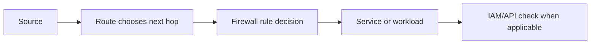

## Table of Contents

1. [The Problem](#the-problem)
2. [Packet Path](#packet-path)
3. [Firewall Rules](#firewall-rules)
4. [Direction](#direction)
5. [Priority](#priority)
6. [Targets](#targets)
7. [Sources](#sources)
8. [Implied Rules](#implied-rules)
9. [IAM Boundary](#iam-boundary)
10. [Logging Evidence](#logging-evidence)
11. [Putting It All Together](#putting-it-all-together)
12. [What's Next](#whats-next)

## The Problem

The Orders team has a VPC network and regional subnets. Now they need to let the right traffic through without turning the network into an open hallway.

- A bastion VM should accept SSH only from the admin VPN range.
- An internal worker should call a private backend port, but not every VM in the network should have that path.
- An egress rule was added for a third-party API, but a lower-numbered deny rule still wins.
- A developer grants IAM to a service account and expects that to open a TCP port.

Firewall rules answer a narrower question than people often expect: when a packet has a route, should this new connection be allowed through the VPC firewall layer? They do not create routes. They do not grant IAM. They decide packet access for resources that the rule can target.

## Packet Path

Read a packet in this order:



The route step matters first because a firewall rule cannot send traffic somewhere. If the destination is not routable, an allow rule does not help. Once a route exists, firewall evaluation can decide whether the new connection is allowed.

For example, if a VM in `subnet-orders-app-us-central1` tries to reach a private backend at `10.30.20.15:8443`, the VPC must know how to route to `10.30.20.0/24`. Then the relevant ingress rule on the backend side must allow that source and port. If the destination is a Google API, IAM may still reject the request after the network path works.

The habit is simple: route, rule, service setting, identity. Do not collapse them into one word called "networking."

## Firewall Rules

A GCP VPC firewall rule describes a packet decision. It belongs to a VPC network, has a direction, has an action, has a priority, and matches traffic by targets plus source or destination criteria.

The most common action is `allow`, though deny rules exist. Rules can match protocols and ports, such as TCP 443 or TCP 5432. They can also be broad, which is exactly why review matters. A rule that allows `0.0.0.0/0` to TCP 22 is not the same risk as a rule that allows the admin VPN range to TCP 22.

Think of a firewall rule as a sentence:

```text
For these targets, in this direction, from or to this range, allow or deny these protocols and ports, unless a higher-priority rule already decided.
```

That sentence is more useful than memorizing the field names. It forces you to ask what the rule is aimed at and which packet it is supposed to match.

## Direction

Direction tells you which side of the connection the rule is judging.

An ingress rule controls traffic coming into the target. If users, admins, or another workload are trying to reach a VM, the destination side needs an ingress rule that permits the right source and port.

An egress rule controls traffic leaving the target. If a VM or workload needs to call an external API, a private database range, or another service, the source side may need an egress rule that permits the destination and port.

| Direction | Question | Example |
| --- | --- | --- |
| Ingress | Who can start a connection to this target? | Admin VPN to bastion on TCP 22 |
| Egress | Where can this target start a connection? | Worker to payment API on TCP 443 |

A common beginner mistake is opening the wrong direction. If a backend cannot receive traffic from an internal caller, adding an egress rule to the backend is usually not the fix. The backend is the destination. The relevant rule is usually ingress to the backend target, plus any egress policy on the caller side if egress is restricted.

## Priority

Firewall priority decides which matching rule wins. Lower numbers have higher priority. A priority `100` rule is evaluated before a priority `1000` rule.

This is one of the easiest places to misread a configuration. Humans often read a list from top to bottom in the console and assume the last allow they saw explains behavior. GCP uses priority. If a deny rule with a lower number matches the same traffic, that deny can win before the allow rule matters.

Use priorities as review bands, not random numbers:

| Priority range | Example use |
| --- | --- |
| `100-199` | Emergency or organization-level denies |
| `500-799` | Narrow production service allows |
| `1000` | Default project-level application rules |
| `65000+` | Lowest-priority catchalls and implied behavior |

The specific bands are a team convention, not a GCP requirement. The value is that a reviewer can tell why a rule sits above another rule.

## Targets

Targets answer which resources the rule applies to. For VM instances, GCP firewall rules can target all instances in the network, instances with specific network tags, or instances using specific service accounts.

Network tags are simple labels on VM instances. They are easy to understand and easy to overuse. Service account targets can be more precise when identity already expresses the workload role. If the Orders worker VM runs as `orders-worker@...`, a rule targeting that service account can follow the workload purpose better than a tag someone might copy onto a test VM.

Cloud Run is different. You do not attach a normal VPC firewall target to a Cloud Run instance the way you target a VM. Cloud Run has service-level ingress controls for callers and separate VPC egress settings for outbound traffic. If Cloud Run sends traffic through a VPC path to a VM or private resource, the target resource's rules still matter, but the Cloud Run service is not just another tagged VM.

| Target style | Good for | Watch out for |
| --- | --- | --- |
| All instances | Small learning networks or broad infrastructure rules | Too broad for production service access |
| Network tag | Simple VM grouping | Tags can drift or be copied carelessly |
| Service account | Workload-role targeting | Requires disciplined service account use |
| Service-level ingress | Cloud Run and similar services | Different control plane than VM firewall targets |

The target is the part of the rule that prevents a useful allow from becoming a network-wide allow.

## Sources

An ingress rule usually needs a source. That source can be a CIDR range, another resource grouping, or a service account pattern depending on the rule type and resource. The review question is always the same: who is allowed to start this connection?

For admin access, a source should usually be a narrow VPN or trusted range, not the whole internet. For workload-to-workload access, a source should be the calling tier, not every private address in the VPC. For health checks and load balancers, the source range may need to match documented Google ranges or load balancer behavior.

Egress rules flip the question. The target resource is starting the connection, so the rule cares about destinations. A broad egress allow can be acceptable in a small environment, but production systems often need to know which private ranges, Google APIs, or external services a workload may call.

The source or destination field is where many "temporary" rules become permanent. `0.0.0.0/0` is easy to type. It is harder to explain in a later review.

## Implied Rules

GCP VPC networks include implied firewall behavior. The default implied IPv4 rules deny ingress and allow egress at the lowest priority. That means a new network does not accept unsolicited inbound IPv4 traffic by default, while outbound IPv4 traffic is allowed unless you add higher-priority rules that restrict it.

This default is helpful, but it can be misleading. "Ingress is denied by default" does not mean every resource is safe. A broad allow rule can still expose a VM port. A public IP can still put a resource on an internet path. A service-level ingress setting can still make a serverless service reachable in ways a VM firewall rule does not describe.

The implied egress allow also deserves attention. If your security model requires restricted outbound traffic, you need explicit egress policy. Otherwise workloads may be able to start connections more broadly than the team expects.

| Implied behavior | Beginner takeaway |
| --- | --- |
| Deny ingress | Add only the inbound paths you mean to support |
| Allow egress | Restrict outbound paths explicitly when the workload requires it |
| Lowest priority | Higher-priority custom rules can override the default behavior |

Defaults are not a design. They are the floor you build on.

## IAM Boundary

IAM and firewall rules are different checks. IAM answers whether a principal may call a Google Cloud API or perform an action on a resource. Firewall rules answer whether network packets may start a connection through the VPC firewall layer.

If a service account lacks permission to read a secret, opening TCP 443 will not grant that permission. If a VM port is blocked by a firewall rule, granting Viewer on the project will not open that port. Real requests may pass both checks, but passing one does not imply passing the other.

For the Orders API, this matters in two places. A private database connection needs a network path and database access. A Secret Manager call needs a reachable Google API endpoint and IAM permission for the runtime service account. When a request fails, read the error carefully. A timeout sounds like path or firewall. A permission denied response sounds like IAM. Some failures need both reviewed.

## Logging Evidence

Firewall rule logging can help a team understand whether a rule matched traffic. It is not a replacement for a network design, and it does not show packet contents. It gives metadata that can answer practical questions: which rule matched, what direction was involved, and which source and destination were present.

Useful evidence for a firewall review looks like this:

```text
rule: allow-orders-worker-to-backend
direction: INGRESS
priority: 600
target: serviceAccount:orders-backend
source: serviceAccount:orders-worker
protocol/port: tcp:8443
logging: enabled during rollout
```

That evidence is small enough for a teammate to verify. It names the direction, the target, the source, and the port. It also leaves a trail for the rule's purpose.

## Putting It All Together

Return to the opening problems.

The bastion should accept SSH only from the admin VPN range. That is an ingress rule with a narrow source, a clear target, and a port that does not depend on the instance name alone.

The internal worker should call the private backend port. The backend needs an ingress allow from the worker's source identity or range. If outbound traffic is restricted, the worker may also need a matching egress rule. The route still has to exist first.

The lower-numbered deny can beat a later allow because priority decides rule order. Read the number, not just the presence of an allow rule.

IAM does not open TCP ports. Firewall rules do not grant API permission. A healthy GCP review can say which check is failing instead of throwing every control into one bucket.

## What's Next

Now the private network has a map and packet rules. The next question is how real users reach the service from the public internet. We will follow a public name through DNS, HTTPS, load balancing, serverless backends, and health evidence.

---

**References**

- [Google Cloud: VPC firewall rules](https://cloud.google.com/firewall/docs/firewalls)
- [Google Cloud: Firewall rules overview](https://cloud.google.com/firewall/docs/firewalls)
- [Google Cloud: Firewall Rules Logging](https://cloud.google.com/firewall/docs/firewall-rules-logging)
