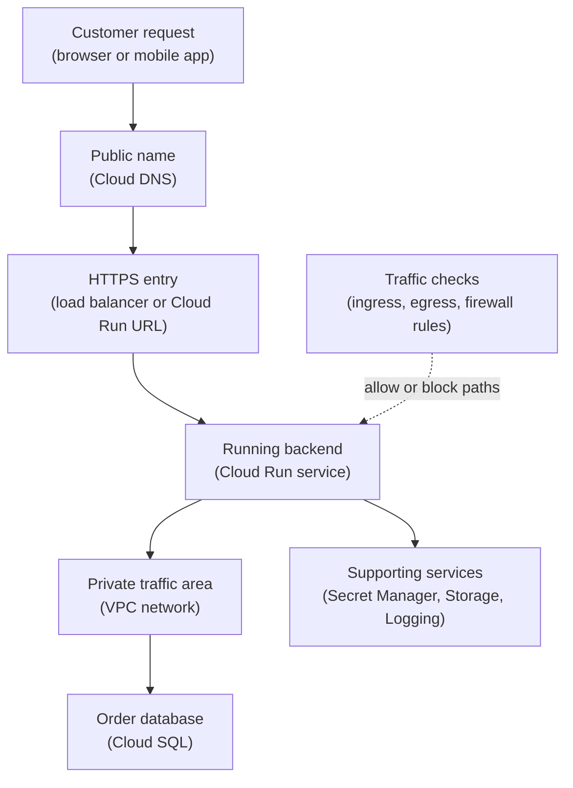

## Table of Contents

1. [Start With The Traffic Story](#start-with-the-traffic-story)
2. [The GCP Shape That Surprises People](#the-gcp-shape-that-surprises-people)
3. [How This Compares With AWS And Azure](#how-this-compares-with-aws-and-azure)
4. [The Orders API Request Path](#the-orders-api-request-path)
5. [Public Entry And Private Dependencies](#public-entry-and-private-dependencies)
6. [A VPC Network Is Global, But Subnets Are Regional](#a-vpc-network-is-global-but-subnets-are-regional)
7. [Routes Decide The Next Hop](#routes-decide-the-next-hop)
8. [Firewall Rules Decide Whether Traffic Is Allowed](#firewall-rules-decide-whether-traffic-is-allowed)
9. [Cloud Run Has A Service URL And Optional Network Paths](#cloud-run-has-a-service-url-and-optional-network-paths)
10. [Managed Services May Need Private Access Patterns](#managed-services-may-need-private-access-patterns)
11. [Evidence For A Healthy Path](#evidence-for-a-healthy-path)
12. [Common Beginner Failure Modes](#common-beginner-failure-modes)
13. [The Network Review Habit](#the-network-review-habit)

## Start With The Traffic Story

Before a backend can serve real users, the team needs to answer a plain traffic question:
How does a request get from the caller to the thing it needs? That question sounds small. It
grows quickly in production. A customer needs a public HTTPS name. The backend needs a
runtime. The database should not become a public target.

The app may need to call Google APIs. The app may need a private path to Cloud SQL. Support
engineers need logs that show where traffic stopped. GCP networking is the set of names,
private networks, routes, load balancers, ingress settings, egress settings, and firewall
rules that shape those paths. The goal is not to memorize every network product.

The goal is to read a small production service and ask better questions. Where does public
traffic enter? Where does private traffic live? Which name points to which destination?
Which route sends traffic onward? Which rule allows or blocks the connection? Which identity
is allowed to change the network? Identity and networking are different checks.

IAM can let a deployer edit a Cloud Run service. That does not prove the running service can
reach a database. Network access can allow a packet to reach a destination. That does not
prove the caller is authorized to read data. Good GCP work keeps those questions separate.

## The GCP Shape That Surprises People

GCP networking has one beginner surprise worth learning early. A VPC network is global. A
subnet is regional. That is different from the mental model many people bring from AWS,
where a VPC is regional. In GCP, one VPC network can contain subnets in multiple regions.
The network is the global private traffic area. The subnets are regional address ranges
where resources receive private IP addresses.

This design means the words need to stay precise. When you say "the network," you may be
talking about the global VPC network. When you say "where does the service run," you are
usually talking about a region and one or more regional subnets. For
`devpolaris-orders-api`, the production project might have:

```text
project: devpolaris-orders-prod
vpc network: vpc-orders-prod
primary region: us-central1
app subnet: subnet-orders-app-us-central1
private service range: services-orders-prod
```

The VPC network gives the private traffic area a name. The subnet places the app's private
addresses in a region. The service range can be used for managed services that need private
service access. Those are not interchangeable. If you debug with the wrong noun, you will
look in the wrong place.

## How This Compares With AWS And Azure

If you know AWS networking, keep the broad habit. You already know to separate DNS, load
balancers, private address space, routes, and firewall-style rules. The GCP vocabulary
changes. The VPC network is global. Subnets are regional. Firewall rules belong to the VPC
network and can apply to matching resources. Cloud Load Balancing has global and regional
choices that do not map perfectly to one AWS load balancer name.

If you know Azure networking, the VNet comparison helps, but still needs care. An Azure VNet
and a GCP VPC network both give private network space. Azure VNets are regional. GCP VPC
networks are global, with regional subnets. Azure private endpoints and GCP private access
patterns solve similar problems, but the service names and setup steps differ.

Here is the orientation table:

| Idea you may know | GCP idea to learn | Important difference |
|---|---|---|
| AWS VPC or Azure VNet | VPC network | GCP VPC networks are global resources |
| AWS subnet or Azure subnet | Subnet | GCP subnets are regional resources |
| AWS security group or Azure NSG | VPC firewall rule | GCP rules live at the network level and match targets |
| Route 53 or Azure DNS | Cloud DNS | Public and private zones are separate choices |
| ALB, Front Door, or Application Gateway | Cloud Load Balancing | Pick global or regional and HTTP or network behavior by traffic job |
| VPC endpoint or private endpoint | Private Google Access, private services access, or Private Service Connect | GCP has several private access patterns, not one universal endpoint |

Use the table as a bridge. Do not use it as a dictionary. The real test is always the
traffic path in front of you.

## The Orders API Request Path

The running example is `devpolaris-orders-api`. It is a Node.js backend for checkout
traffic. In this GCP path, the service runs on Cloud Run in `devpolaris-orders-prod`.
Customers call:

```text
https://orders.devpolaris.com/checkout
```

The backend stores order records in Cloud SQL. It stores receipt exports in Cloud Storage.
It reads private configuration from Secret Manager. It sends runtime evidence to Cloud
Logging and Cloud Monitoring. The beginner traffic path looks like this:

```text
customer
  -> orders.devpolaris.com
  -> HTTPS entry point
  -> Cloud Run service
  -> Cloud SQL private connection
  -> Cloud Storage and Google APIs
```

That path has two kinds of traffic. Customer traffic is inbound. It enters the service
through a public HTTPS path or through a load balancer that fronts Cloud Run. Application
traffic is outbound. It leaves the running service to reach databases, storage, secrets,
logging, and other APIs. Those directions matter. Cloud Run ingress settings affect who can
reach the service.

Cloud Run egress settings affect where the service sends outbound traffic. A load balancer
can shape public HTTPS entry. VPC egress can shape private calls from the service to
resources in a VPC network. Here is the first map:



The diagram is not trying to show every valid GCP design. It is showing the questions you
must keep separate. Public name. Public entry. Runtime. Private path. Managed services.
Traffic checks.

## Public Entry And Private Dependencies

A production API usually has one public face and several private dependencies. The public
face is intentional. Customers need a stable HTTPS name. Mobile apps need a reachable
endpoint. Monitoring systems may need to check health from outside. That does not mean every
dependency should be public. The database does not need to behave like a public website.

Receipt storage does not need broad public object access. Private configuration does not
need a public network path. The orders team wants this shape:

| Piece | Should public users reach it? | Why |
|---|---|---|
| `orders.devpolaris.com` | Yes | This is the customer API entry |
| Cloud Run service URL or load balancer | Maybe | It depends on whether the load balancer is the only public entry |
| Cloud SQL database | No | Only the app should talk to order records |
| Secret Manager secret | No direct user path | The app reads it through Google APIs with IAM |
| Receipt bucket | Usually no direct public write path | The app writes controlled exports |

The table is about exposure. It is not about IAM alone. A database can have correct
IAM-related settings and still be reachable from places you did not intend. A Cloud Run
service can have a public URL and still require IAM authentication. Network reachability and
identity checks work together, but they are not the same check.

This is the first habit:

> Decide which path should be public before you make anything public.

## A VPC Network Is Global, But Subnets Are Regional

A VPC network is a private network area inside Google Cloud. It lets resources communicate
using private addresses, subject to routes and firewall rules. In GCP, the VPC network is
global. That means the network is not created inside one region. The subnets inside it are
regional. A subnet gives a region a specific IP address range.

For example:

```text
vpc network:
  vpc-orders-prod

subnets:
  subnet-orders-app-us-central1     10.30.10.0/24
  subnet-orders-data-us-central1    10.30.20.0/24
  subnet-orders-app-us-east1        10.31.10.0/24
```

The global VPC can contain all three subnets. The app in `us-central1` uses a `us-central1`
subnet. If the team later adds `us-east1`, it creates a regional subnet there instead of
creating a new VPC only because the region changed. This shape is useful. It can also
confuse beginners. You may see one VPC name attached to resources in multiple regions.

That does not mean every resource is in every region. The resource still has a regional or
zonal placement. For Cloud Run, the service has a region. For Cloud SQL, the instance has a
region. For subnets, the subnet has a region. The VPC network is the shared private map. The
regional resources are where work actually runs.

## Routes Decide The Next Hop

A route tells traffic where to go next. It does not decide whether the destination
application is healthy. It does not decide whether the caller is authorized. It only helps
decide the next network hop for a destination range. GCP VPC networks have system-generated
routes for normal subnet communication. You can also create custom routes when your design
needs a specific next hop, such as a network appliance or VPN path.

For a beginner service, routes matter because "same cloud provider" does not automatically
mean "every path exists." The app may need a private path to Cloud SQL. A private VM may
need a path to Google APIs. Traffic to the internet may need NAT. Traffic to on-premises
networks may need Cloud VPN or Cloud Interconnect, but those are beyond this first module.

The first route question is: Where is this packet trying to go? The second is: Which next
hop handles that destination? For the orders API, write it plainly:

```text
from: Cloud Run service in us-central1
to: Cloud SQL private address
expected path: Cloud Run egress into VPC network, then private service path
```

If that path is not configured, the app may try another path or fail. When debugging, routes
are one part of the story. They sit beside DNS, firewall rules, service configuration, and
IAM.

## Firewall Rules Decide Whether Traffic Is Allowed

Firewall rules allow or deny traffic. In GCP, VPC firewall rules are defined at the network
level and enforced for matching resources. They are not the same as IAM roles. IAM answers
whether an identity can call a Google Cloud API. Firewall rules answer whether network
traffic is allowed on a path. For example, a developer may have IAM permission to edit a
Compute Engine VM.

That does not mean a database port is open. A service account may be allowed to read a
Secret Manager secret. That does not mean a private database address is reachable. For
Compute Engine VMs, firewall rules can match targets by network tags or by service accounts.
That gives teams a way to write rules around groups of instances instead of individual IP
addresses.

Cloud Run networking has its own details, especially when using Direct VPC egress and
network tags for outbound traffic. The beginner lesson is not every syntax rule. The
beginner lesson is that traffic rules need a target, a direction, a source or destination, a
protocol, and a port. Read the rule as a sentence:

```text
allow TCP 5432
from orders app private range
to the database listener
```

If the sentence is too broad, review it.

If the sentence does not match the traffic, it will not help.

## Cloud Run Has A Service URL And Optional Network Paths

Cloud Run is serverless, but it is not outside networking. A Cloud Run service can receive
HTTP requests. It has ingress settings that control which network paths can reach it. It can
send outbound traffic to the internet or to a VPC network, depending on how egress is
configured. This matters because Cloud Run often looks simple at first.

You deploy a container. You get a URL. The service responds. That is a great first
experience. Production still needs intentional entry and exit paths. For inbound traffic,
the team may choose:

| Inbound choice | What it means |
|---|---|
| Public Cloud Run URL | The service can be reached through its Cloud Run endpoint, subject to ingress and IAM |
| Custom domain mapping | A friendly domain points at the service |
| External Application Load Balancer | A managed HTTPS front door sits in front of serverless backends |
| Internal entry through load balancing | Private callers use an internal load balancer path |

For outbound traffic, the team may choose normal internet egress or VPC egress. VPC egress
lets Cloud Run send traffic into a VPC network so it can reach private resources. Direct VPC
egress is the modern path when it fits. Serverless VPC Access connectors still exist for
cases where direct egress is not the right option.

The important beginner point: Inbound and outbound settings solve different problems.
Changing egress does not make private clients able to call Cloud Run directly. Changing
ingress does not automatically give Cloud Run a private route to Cloud SQL.

## Managed Services May Need Private Access Patterns

Managed services are services Google operates for you. Cloud SQL is managed. Cloud Storage
is managed. Secret Manager is managed. Managed does not always mean "inside your subnet."
This is a common beginner misunderstanding. Your app may run in a VPC-connected environment.
The managed service may live behind a Google-managed service boundary. To make the path
private, GCP offers different patterns depending on the service and access shape.

For Cloud SQL private IP, you may use private services access. For Google APIs from private
resources, Private Google Access may be part of the design. For service-oriented private
connectivity, Private Service Connect may be the right pattern. These names are easy to mix
up. Do not memorize them as a list. Ask what kind of private path you need:

| Need | GCP pattern to investigate |
|---|---|
| Private database address for Cloud SQL | Private IP with private services access |
| Private VM reaches Google APIs without an external IP | Private Google Access |
| Private endpoint to Google APIs or a published service | Private Service Connect |
| Cloud Run reaches VPC resources | Direct VPC egress or Serverless VPC Access |

The exact service decides the exact setup. The mental model is stable: managed services may
need a private access pattern, not just a VPC name.

## Evidence For A Healthy Path

A healthy networking design leaves evidence. The evidence does not need to be fancy. It
needs to let a teammate follow the path. For the orders API, a useful snapshot might look
like this:

```text
service: devpolaris-orders-api
project: devpolaris-orders-prod
region: us-central1

public entry:
  name: orders.devpolaris.com
  entry: external HTTPS load balancer
  certificate: active for orders.devpolaris.com

runtime:
  platform: Cloud Run
  ingress: internal-and-cloud-load-balancing
  egress: private-ranges-only through vpc-orders-prod
  subnet: subnet-orders-app-us-central1

private dependency:
  database: Cloud SQL orders-prod
  access: private IP
  validation: /health/db returns ok
```

This snapshot does not prove every detail. It gives the team a starting map. If users get
TLS errors, look at the public entry and certificate. If the app cannot reach the database,
look at Cloud Run egress, private service access, DNS, and the database connection path. If
the service is reachable directly when it should not be, look at ingress settings and load
balancer design.

Evidence turns "network is broken" into a smaller sentence.

## Common Beginner Failure Modes

The first failure is treating VPC as regional. The team creates a new VPC for every region
because it expects the AWS shape. That may be valid in some designs, but it should be
intentional. In GCP, one global VPC with regional subnets may be the simpler first map. The
second failure is mixing ingress and egress.

The team configures Cloud Run VPC egress and expects private callers to reach the service
directly. That is the wrong direction. Egress is outbound from Cloud Run. Ingress is inbound
to Cloud Run. The third failure is public database access during testing. The app connects
quickly, but production data now has a wider network surface.

The fix direction is to design the private path early and validate it with the same health
check the app uses. The fourth failure is DNS pointing at the wrong entry.
`orders.devpolaris.com` points to an old load balancer or an old Cloud Run mapping. The app
is healthy, but users reach the wrong place. The fix direction is to verify the DNS answer
and the target entry point before changing app code.

The fifth failure is IAM confusion. Someone grants a role to the service account and expects
a blocked port to open. The fix direction is to check firewall rules and private routes
separately from IAM bindings.

## The Network Review Habit

A beginner network review should be readable in plain English. For each service, ask: Where
do public users enter? Which custom domain do they use? Where does TLS terminate? Which
runtime receives the request? What private dependencies does the runtime call? Does the
runtime need VPC egress? Which subnet supplies private addresses? Which firewall rule or
service setting allows the path?

Which evidence proves the path works? That review turns networking from a pile of product
names into a route you can follow. For `devpolaris-orders-api`, the first good sentence is:

```text
Public HTTPS traffic enters through orders.devpolaris.com,
reaches the load balancer, forwards to Cloud Run,
and the service uses VPC egress to reach Cloud SQL privately.
```

If the team can say that sentence and show evidence for each hop, the network is
understandable.

That is the goal for this module.

---

**References**

- [VPC networks](https://cloud.google.com/vpc/docs/vpc) - Official GCP documentation for VPC networks, including the global VPC and regional subnet model.
- [Subnets](https://cloud.google.com/vpc/docs/subnets) - Explains how subnets work as regional IP address ranges inside VPC networks.
- [VPC firewall rules](https://cloud.google.com/firewall/docs/firewalls) - Documents how GCP firewall rules allow or deny traffic for matching resources.
- [Cloud Run ingress](https://cloud.google.com/run/docs/securing/ingress) - Explains how Cloud Run ingress settings control inbound network paths.
- [Direct VPC egress for Cloud Run](https://cloud.google.com/run/docs/configuring/vpc-direct-vpc) - Documents how Cloud Run sends outbound traffic into a VPC network.
