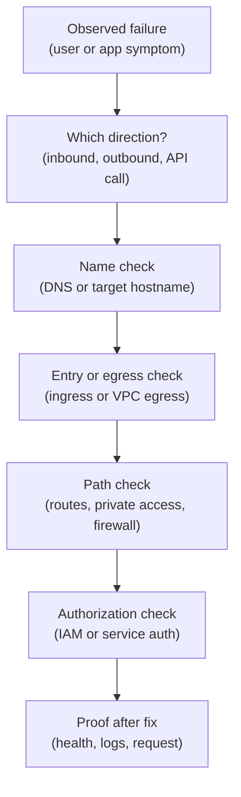

## Table of Contents

1. [The First Job Is To Shrink The Problem](#the-first-job-is-to-shrink-the-problem)
2. [Name The Direction Before You Debug](#name-the-direction-before-you-debug)
3. [The First-Check Map](#the-first-check-map)
4. [When Users Cannot Reach The API](#when-users-cannot-reach-the-api)
5. [When HTTPS Fails Before The App Sees Traffic](#when-https-fails-before-the-app-sees-traffic)
6. [When Cloud Run Is Reachable Through The Wrong Path](#when-cloud-run-is-reachable-through-the-wrong-path)
7. [When Cloud Run Cannot Reach Cloud SQL](#when-cloud-run-cannot-reach-cloud-sql)
8. [When Google API Calls Fail](#when-google-api-calls-fail)
9. [When A Timeout Is Not Permission Denied](#when-a-timeout-is-not-permission-denied)
10. [When A Permission Error Is Not A Route Problem](#when-a-permission-error-is-not-a-route-problem)
11. [A Small Incident Record](#a-small-incident-record)
12. [Fix One Layer, Then Verify](#fix-one-layer-then-verify)
13. [The Review Habit](#the-review-habit)

## The First Job Is To Shrink The Problem

The phrase "the network is broken" is too large to guide a fix. It could mean DNS points to
the wrong place. It could mean a certificate does not match the hostname. It could mean a
load balancer has no healthy backend. It could mean Cloud Run ingress blocks the path. It
could mean Cloud Run egress is missing.

It could mean a private service connection is not configured. It could mean a firewall rule
blocks traffic. It could mean IAM denies the request after the network succeeds. Those are
different problems. They need different fixes. The first job in a GCP network incident is to
shrink the problem into a specific sentence. For example:

```text
Users can resolve orders.devpolaris.com,
but HTTPS fails because the certificate does not cover the hostname.
```

Or:

```text
Cloud Run starts,
but /health/ready times out when connecting to Cloud SQL private IP.
```

Those sentences are fixable.

This article gives you a first-check path.

## Name The Direction Before You Debug

Before opening five console tabs, name the traffic direction. Inbound means traffic is
coming into the service. Outbound means traffic is leaving the service. Control plane means
someone or something is calling a Google Cloud API to create, change, or inspect resources.
Those directions lead to different checks. For `devpolaris-orders-api`, examples are:

| Symptom | Direction | First area |
|---|---|---|
| Users cannot reach `orders.devpolaris.com` | Inbound | DNS, HTTPS, load balancer, Cloud Run ingress |
| Cloud Run cannot connect to Cloud SQL | Outbound | VPC egress, private access, DNS, database |
| App cannot read Secret Manager | API call | Runtime service account and IAM |
| Deployer cannot attach VPC egress | Control plane | IAM on network or subnet setup |

The table prevents a common mistake. Do not fix outbound egress when inbound DNS is wrong.
Do not fix DNS when IAM denies Secret Manager access. Do not grant Owner when the app has a
TCP timeout to a private address. Name the direction first.

## The First-Check Map

Here is the generic first-check map:



Not every failure uses every box. If HTTPS fails before the app sees traffic, service
authorization may not matter yet. If Secret Manager says permission denied, firewall rules
may not matter. The map is a reminder to move in order. Find the direction. Check the name.
Check the entry or exit configuration. Check the path.

Check authorization. Verify with the smallest real user or app action.

## When Users Cannot Reach The API

Start outside the app.

The user calls:

```text
https://orders.devpolaris.com/checkout
```

The first checks are: Does the name resolve? Does it point to the intended entry? Does HTTPS
present the right certificate? Does the entry route to a healthy backend? Does Cloud Run
ingress allow the intended path? Do request logs show the request reaching the entry? A
failure record might say:

```text
symptom:
  mobile app reports network error before checkout reaches backend

checked:
  DNS resolves orders.devpolaris.com to old load balancer address
  new load balancer has healthy backend
  old load balancer has no backend for /checkout

likely fix:
  update authoritative DNS record to intended load balancer address
```

This record keeps the team from redeploying the app unnecessarily. The app may be fine. The
name is wrong.

## When HTTPS Fails Before The App Sees Traffic

HTTPS failures often happen before the request reaches your application code. A client may
report a certificate error. A browser may show a privacy warning. An API client may refuse
the connection. In that case, check the certificate path. Does the certificate cover
`orders.devpolaris.com`? Is it attached to the intended HTTPS entry? Is it active?

Is DNS pointing to the entry that uses that certificate? A certificate for the wrong name
can make a healthy backend look broken. For example:

```text
requested hostname:
  orders.devpolaris.com

certificate presented:
  api.devpolaris.com

app status:
  Cloud Run revision healthy
```

Attach or provision a certificate that matches the requested hostname. A new revision will
not fix a hostname and certificate mismatch. The order matters. Name first. Certificate
second. Backend after that.

## When Cloud Run Is Reachable Through The Wrong Path

Sometimes the service works, but through a path the team did not intend. For example, the
team wants all public traffic through an external Application Load Balancer. But someone can
still call the Cloud Run service directly through its service URL. That may bypass central
routing, logging, policies, or custom domain controls. The symptom is an exposure gap, not
an outage. The first checks are: What is the intended public entry? What are the
Cloud Run ingress settings? Can the service URL still be reached from the public internet?
Is IAM invocation required? Do logs show direct requests that did not pass through the load
balancer? The fix direction is to align Cloud Run ingress with the intended entry design.

Do not call this "working" just because the app returns 200. The path matters.

## When Cloud Run Cannot Reach Cloud SQL

Cloud Run to Cloud SQL private access is an outbound problem. Start with the app log. The
error might say:

```text
connect ETIMEDOUT 10.50.4.3:5432
```

That looks like a network path problem. Check whether the Cloud Run revision uses VPC
egress. Check the network and subnet. Check whether the database has private IP configured.
Check the private services access path. Check the hostname or connection target the app
uses. Check whether the database is listening and accepting connections. Then check
authentication.

If the app reaches the database but the login fails, the problem has moved from network
reachability to database authorization. Write the path:

```text
Cloud Run revision
  -> VPC egress
  -> subnet-orders-run-us-central1
  -> vpc-orders-prod
  -> private services access
  -> Cloud SQL private IP
```

If you cannot prove one box, inspect that box before changing others.

## When Google API Calls Fail

Not every outbound call is a private database connection. The app also calls Google APIs.
Secret Manager is a Google API. Cloud Storage is a Google API. Cloud Logging is a
Google-managed service. A failure to read Secret Manager may look like:

```text
PermissionDenied: Permission 'secretmanager.versions.access' denied
```

The request reached the service layer, and the principal did not have the required
permission. Check the runtime service account. Check the target secret. Check the IAM role
and scope. For a private VM calling Google APIs without an external IP, Private Google
Access may matter. For Cloud Run calling Google APIs, the path and identity details differ.

The important habit is to read the error. Timeout. Connection refused. Permission denied.
Name not found. Each points to a different layer.

## When A Timeout Is Not Permission Denied

A timeout usually means the caller did not receive a useful response in time. It often
points to DNS, routing, firewall, egress, private access, or a dead service. It does not
usually mean "grant a broader role." For example:

```text
Error: connect ETIMEDOUT 10.50.4.3:5432
```

This says the app tried to connect to a private address and waited. The next checks are
network checks. Does the service have VPC egress? Is the subnet correct? Does the private
destination exist? Does a firewall or service rule block it? Is the database accepting
connections? Adding `roles/editor` to the service account would be noise.

The packet still needs a path.

## When A Permission Error Is Not A Route Problem

A permission error means the service understood who was asking and denied the action.

For example:

```text
PermissionDenied: caller does not have storage.objects.create
```

That points to IAM or service authorization. Network changes are unlikely to help. The next
checks are identity checks. Which service account made the request? Which bucket was
targeted? Which permission was missing? Which role contains that permission? Where should
the role be granted? This is the same access sentence from the identity module. The network
may be healthy.

The authorization may be wrong. Do not make the network more open to fix a denied API
action. Fix the principal, role, and scope.

## A Small Incident Record

During a network issue, write a small record. It keeps the team honest. For example:

```text
incident:
  checkout cannot reach database after new Cloud Run revision

direction:
  outbound from Cloud Run to Cloud SQL

observed:
  /health/live ok
  /health/ready fails
  logs show ETIMEDOUT to 10.50.4.3:5432

checked:
  service region: us-central1
  vpc egress: not configured on new revision
  Cloud SQL private IP: enabled

fix:
  redeploy revision with Direct VPC egress to vpc-orders-prod

verification:
  /health/ready ok
  checkout smoke test ok
```

This record is short. It is much better than a chat thread full of guesses. It names the
direction, evidence, fix, and verification.

## Fix One Layer, Then Verify

Network incidents become messy when teams change many layers at once. They update DNS. They
redeploy the app. They grant a broad role. They open a firewall rule. Now the service works,
but nobody knows which change fixed it. That makes rollback and review harder. Prefer one
targeted change. Then verify. If DNS is wrong, fix DNS and test the name.

If the certificate is wrong, attach the right certificate and test TLS. If Cloud Run egress
is missing, redeploy with the intended egress and test the private dependency. If IAM denies
a Google API call, grant the narrow role and test that API action. The verification should
match the failure. Do not call the incident fixed because the deployment succeeded.

Call it fixed when the broken path works.

## The Review Habit

Use this first-check order:

```text
1. What direction is the traffic?
2. What name or target is being used?
3. Which entry or egress setting controls the path?
4. Which route, private access pattern, or firewall rule applies?
5. Which identity or service authorization applies?
6. What evidence proves the fix?
```

That list turns "network is broken" into one of a few smaller problems. For
`devpolaris-orders-api`, the most common first checks are: DNS and certificate for
user-facing failures. Cloud Run ingress for unexpected public reachability. Cloud Run egress
and private service access for database timeouts. Runtime service account IAM for Secret
Manager and Cloud Storage permission errors.

Backend readiness for load balancer or service health failures. When the first check is
clear, the fix is usually smaller. Smaller fixes are easier to review. They also teach the
next engineer how the system actually works.

---

**References**

- [Cloud Run ingress](https://cloud.google.com/run/docs/securing/ingress) - Documents inbound network paths and ingress settings for Cloud Run services.
- [Direct VPC egress with Cloud Run](https://cloud.google.com/run/docs/configuring/vpc-direct-vpc) - Explains Cloud Run outbound VPC connectivity and common limitations.
- [VPC firewall rules](https://cloud.google.com/firewall/docs/firewalls) - Official firewall rule behavior for allow and deny checks in VPC networks.
- [Cloud DNS overview](https://cloud.google.com/dns/docs/overview) - Covers DNS zones and records used in public and private name resolution.
- [IAM troubleshooting](https://cloud.google.com/iam/docs/troubleshooting-access) - Helps separate permission denied problems from network reachability problems.
