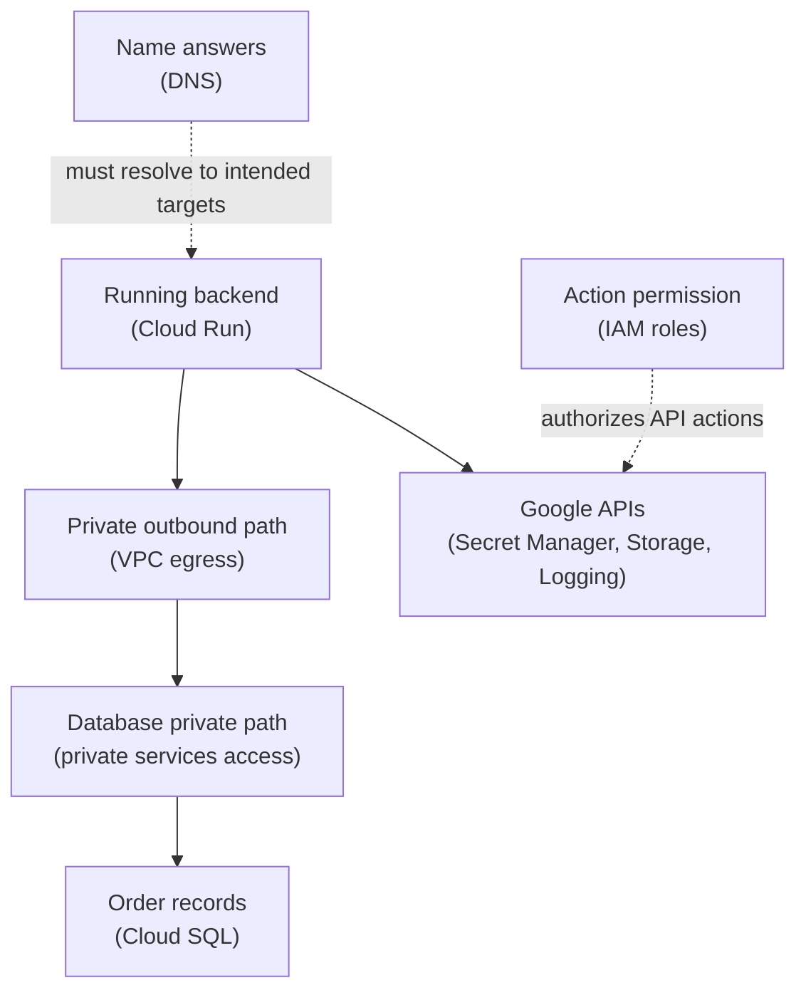

## Table of Contents

1. [Managed Does Not Always Mean In Your Subnet](#managed-does-not-always-mean-in-your-subnet)
2. [The Private Access Question](#the-private-access-question)
3. [The Three Patterns Beginners Should Know](#the-three-patterns-beginners-should-know)
4. [Cloud SQL Private IP Uses Private Services Access](#cloud-sql-private-ip-uses-private-services-access)
5. [Private Google Access Helps Private VMs Reach Google APIs](#private-google-access-helps-private-vms-reach-google-apis)
6. [Private Service Connect Is Service-Oriented Private Access](#private-service-connect-is-service-oriented-private-access)
7. [Cloud Run Needs Its Own Outbound Path](#cloud-run-needs-its-own-outbound-path)
8. [DNS Is Part Of Private Access](#dns-is-part-of-private-access)
9. [IAM Still Controls API Permission](#iam-still-controls-api-permission)
10. [The Orders API Managed Service Map](#the-orders-api-managed-service-map)
11. [Failure Modes And Fix Directions](#failure-modes-and-fix-directions)
12. [Tradeoffs For A First Design](#tradeoffs-for-a-first-design)
13. [The Review Habit](#the-review-habit)

## Managed Does Not Always Mean In Your Subnet

Managed services are one reason teams use cloud providers. You do not want to run every
database host yourself. You do not want to operate every object storage server. You do not
want to build your own secret storage system. GCP gives you managed services for those jobs.
Cloud SQL runs managed databases. Cloud Storage stores objects.

Secret Manager stores sensitive values. Cloud Logging receives runtime evidence. The
beginner trap is assuming that a managed service automatically sits inside your VPC subnet.
Often it does not. Google operates the service behind a managed boundary. Your app needs a
supported access path to that service. Sometimes the path is a public Google API endpoint
protected by IAM.

Sometimes the path is a private IP connection. Sometimes the path is Private Service
Connect. Sometimes the path is Private Google Access. Those names sound similar because they
all involve private access, but each feature solves a different path problem. This article
teaches when each idea appears.

## The Private Access Question

Do not start with the service name. Start with the access question. What is trying to reach
what? Where is the caller running? Is the destination a Google API, a managed database, or a
service published through a private endpoint? Does the caller have an external IP address?
Does the caller run in Cloud Run, a VM, or another platform?

Does the connection need private IP behavior? Those questions matter because private access
is not one universal button. For `devpolaris-orders-api`, there are several outbound calls:

```text
Cloud Run service
  -> Cloud SQL database
  -> Secret Manager
  -> Cloud Storage
  -> Cloud Logging
```

Cloud SQL private IP is one kind of path. Secret Manager and Cloud Storage are Google APIs
with their own access patterns and IAM controls. Cloud Logging is another Google-managed
service. Treating all of them as "the database network" will confuse the design.

## The Three Patterns Beginners Should Know

For a first pass, learn three private access patterns. Private services access is commonly
involved when your VPC connects to some Google-managed service producer networks, such as
Cloud SQL private IP. Private Google Access lets VM instances without external IP addresses
reach Google APIs and services through Google's network path when subnet requirements are
met. Private Service Connect lets consumers access managed services privately through
service-oriented endpoints or backends.

Here is a careful map:

| Pattern | Plain-English job | Example |
|---|---|---|
| Private services access | Connect your VPC to a Google-managed service producer network | Cloud SQL private IP |
| Private Google Access | Let private VMs reach Google APIs without external IPs | VM calling Cloud Storage API |
| Private Service Connect | Expose a private endpoint to Google APIs or published services | Internal endpoint for a managed service |

This table is only orientation. The service docs decide the exact pattern. The important
habit is to ask which private access job you are solving. Private database address. Private
API access. Private endpoint to a service. Different jobs. Different tools.

## Cloud SQL Private IP Uses Private Services Access

Cloud SQL can use private IP. Private IP means clients reach the database through private
networking rather than connecting to a public IP address. For Cloud SQL, this involves
private services access. Private services access creates a private connection between your
VPC network and the Google-managed service producer network. That phrase can feel abstract.
Think of it as a managed private bridge.

Your VPC is the consumer side. Google's service network is the producer side. Cloud SQL
lives on the managed side. Your app reaches it through a private address path. For the
orders API, the path might be:

```text
Cloud Run
  -> Direct VPC egress
  -> vpc-orders-prod
  -> private services access
  -> Cloud SQL private IP
```

The path has several parts. If private services access is missing, the private address
cannot work as expected. If Cloud Run has no VPC egress, it may not reach the private path.
If the app uses the wrong connection target, it may bypass the private path. Private IP is a
design, not a label you trust blindly.

## Private Google Access Helps Private VMs Reach Google APIs

Private Google Access is mainly useful to understand for VM instances that have only
internal IP addresses. Those VMs may still need to call Google APIs such as Cloud Storage.
Without an external IP address, the VM cannot simply use normal internet egress. Private
Google Access lets eligible private VMs reach Google APIs and services when enabled on the
subnet and when the network requirements are met.

Private Google Access answers a specific question: Can a private VM reach Google APIs
without having its own external IP? For example, a private VM batch worker might need to
write an export to Cloud Storage. If the VM has no external IP, Private Google Access may be
part of the answer.

The VM still needs IAM permission to write the object. Private Google Access gives a network
path. IAM gives API authorization. Both are required.

## Private Service Connect Is Service-Oriented Private Access

Private Service Connect is a GCP networking capability for private access to services. It
lets consumers access managed or published services privately from inside their VPC network.
The consumer can use internal IP addresses for the endpoint. The producer owns the service
behind the private connection. The producer might be Google, a third-party provider, or
another team.

This design is service-oriented. The consumer does not need broad network access to the
producer's whole VPC. It reaches a specific service endpoint. That is useful when teams want
private access without wide network peering. For beginners, Private Service Connect is the
answer to this kind of question: How can my VPC reach a managed or published service through
a private endpoint I control?

You do not need Private Service Connect for every Cloud Run app. Recognize it when the
private access requirement is service-oriented.

## Cloud Run Needs Its Own Outbound Path

Cloud Run needs a configured outbound path when it must reach private VPC resources. For
Cloud Run, that usually means Direct VPC egress when it fits, or Serverless VPC Access
connectors for designs that use that older or alternate path. This sits beside managed
service private access.

For Cloud SQL private IP, Cloud Run needs:

```text
Cloud Run VPC egress
plus
Cloud SQL private IP path
```

One without the other is incomplete. If Cloud SQL has private IP but Cloud Run has no VPC
egress, the service may not reach it. If Cloud Run has VPC egress but Cloud SQL only has a
public path, the database still uses a public path. Write both sides down.

Caller outbound path. Destination private access path. That one habit prevents a lot of
confusion.

## DNS Is Part Of Private Access

Private paths still use names. Those names must resolve to the intended addresses. DNS can
make or break private access. For example, a database connection string may use a hostname.
If that hostname resolves to a public address, the app may leave the private path. If it
resolves to a private address that the caller cannot route to, the app may time out.

If private DNS is missing, the app may not find the service at all. This is why private
access reviews should include DNS. Check both the private endpoint and name resolution: Does
the application name resolve to the private destination from the caller's network? For GCP,
the exact DNS setup depends on the service and private access pattern.

Do not assume the public hostname automatically becomes private. Verify what the caller
sees.

## IAM Still Controls API Permission

Private network access does not replace IAM. If a private VM can reach Cloud Storage APIs
through Private Google Access, the VM's service account still needs permission to read or
write the target objects. If Cloud Run can reach a private Cloud SQL address, the app still
needs valid database credentials or supported IAM database access depending on the database
setup. If a workload can reach a Private Service Connect endpoint, the service may still
enforce its own authorization.

Network path answers: Can traffic reach the service? IAM or service auth answers: Should
this actor be allowed to perform the action? Both questions can fail. The error shape
usually tells you where to look. A timeout points toward network path, DNS, route, or
firewall. A permission denied error points toward IAM or service authorization.

A connection refused error means the path reached something, but the service was not
listening or accepting as expected. Good troubleshooting keeps these meanings separate.

## The Orders API Managed Service Map

The orders API uses several managed services.

Here is a simple map:



The diagram intentionally keeps Google APIs separate from the database private path. The app
may use IAM to call Secret Manager and Cloud Storage. The app may use VPC egress and private
services access for Cloud SQL. DNS supports both paths. This is the main lesson. Do not
flatten every managed service into one private networking idea.

Each dependency has its own access pattern.

## Failure Modes And Fix Directions

The first failure is assuming private IP is automatic. Cloud SQL exists in the same project,
but the private path the app expects still needs configuration. The fix direction is to
configure and verify the supported private IP path, including private services access where
required. The second failure is forgetting the caller path.

Cloud SQL has private IP, but Cloud Run has no VPC egress. The fix direction is to configure
Cloud Run outbound access to the VPC network and correct subnet. The third failure is DNS
resolving to the public path. The app uses a hostname that still resolves to a public
address. The fix direction is to inspect DNS from the caller's point of view and adjust the
private DNS or connection target.

The fourth failure is confusing Private Google Access with private database connectivity. A
private VM can call Google APIs, but that does not create a private Cloud SQL path. The fix
direction is to match the private access pattern to the service. The fifth failure is fixing
network when IAM is missing. The app reaches Secret Manager but receives permission denied.

The fix direction is to grant the runtime service account the needed role on the secret, not
to change the VPC.

## Tradeoffs For A First Design

Private access improves the boundary story. It can also make the setup harder. A public
endpoint is easier to test. A private path is usually easier to defend. A single shared VPC
is easier to learn. Many segmented networks can reduce blast radius but increase DNS and
routing work. Private Service Connect gives service-oriented access, but it is another
concept to operate.

Private Google Access helps private VMs reach Google APIs, but it does not solve every
managed service path. For a first production learning design, keep the path small. Cloud Run
for the app. Direct VPC egress for private ranges. Cloud SQL private IP through the
supported private service path. IAM for Google API calls. Clear DNS notes.

That is enough complexity for a beginner module. Add advanced patterns when the design asks
for them.

## The Review Habit

For every managed service dependency, write one line:

```text
caller -> network path -> managed service -> authorization check
```

For the orders database:

```text
Cloud Run -> VPC egress and private services access -> Cloud SQL -> database login
```

For Secret Manager:

```text
Cloud Run -> Google API path -> Secret Manager -> IAM secret access
```

For Cloud Storage:

```text
Cloud Run -> Google API path -> Cloud Storage -> IAM object access
```

These lines are simple. They force the team to name the path. They also stop people from
fixing the wrong layer. When a managed service call fails, ask whether the failure is name
resolution, network path, service access pattern, or authorization. Then change the smallest
correct layer.

---

**References**

- [Cloud SQL private IP](https://cloud.google.com/sql/docs/mysql/private-ip) - Explains private IP connectivity and private services access for Cloud SQL.
- [Private Google Access](https://cloud.google.com/vpc/docs/private-google-access) - Documents how private VM instances can reach Google APIs and services.
- [Private Service Connect overview](https://cloud.google.com/vpc/docs/private-service-connect) - Explains private service-oriented access to Google APIs, published services, and managed services.
- [Direct VPC egress with Cloud Run](https://cloud.google.com/run/docs/configuring/vpc-direct-vpc) - Shows how Cloud Run sends outbound traffic into a VPC network.
- [Cloud DNS overview](https://cloud.google.com/dns/docs/overview) - Covers public and private managed zones used for name resolution.
