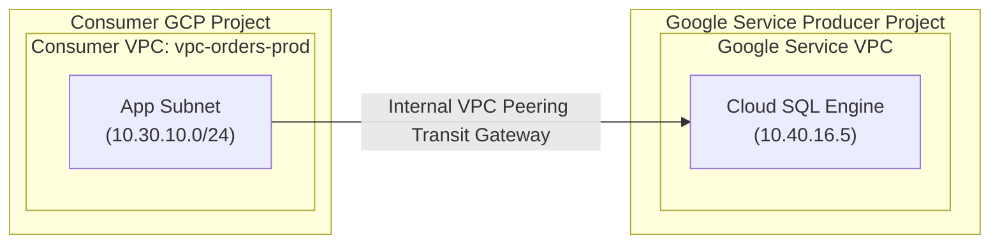
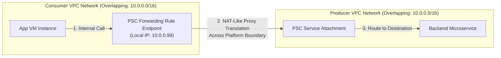

## Table of Contents

1. [Private Access to Managed Services](#private-access-to-managed-services)
2. [Private Services Access and Peering Boundaries](#private-services-access-and-peering-boundaries)
3. [Private Google Access and DNS Virtual IPs](#private-google-access-and-dns-virtual-ips)
4. [Private Service Connect and Proxy Translation](#private-service-connect-and-proxy-translation)
5. [Putting It All Together](#putting-it-all-together)

## Private Access to Managed Services

When you construct a secure office building, you typically build separate, dedicated rooms for highly sensitive assets like safe deposit boxes, backup generator controls, or master key vaults. You would not place these sensitive rooms out on the public street where anyone can walk past them. Instead, you keep them isolated inside administrative boundaries. However, your authorized staff working in the main office still need to reach these rooms securely throughout the day.

Rather than forcing staff to exit the building, walk down a public sidewalk, and enter through a public front door, you construct secure private corridors, underground tunnels, or localized badge-reader doors connecting your main floor directly to the sensitive vaults. In the cloud, private access patterns act as these secure corridors and tunnels.

Managed platform services do not all use the same private access pattern. Cloud SQL private IP is reached through a private services connection. Cloud Storage and Secret Manager are Google APIs, so a VM without an external IP commonly reaches them through Private Google Access or through Private Service Connect for Google APIs. A partner or producer service can be reached through Private Service Connect. The first job is to identify what kind of destination you are calling.

| Destination | Typical private access tool | Beginner mental model |
| :--- | :--- | :--- |
| Cloud SQL private IP and similar producer services | Private Services Access | Peering-style connection to a Google-managed producer network |
| Google APIs such as Cloud Storage and Secret Manager from VMs without external IPs | Private Google Access | Subnet setting plus DNS/routing to Google API VIPs |
| Google APIs, producer services, or partner services through local private endpoints | Private Service Connect | Internal IP endpoint in your VPC that forwards to a service attachment or Google API target |

## Private Services Access and Peering Boundaries

When you deploy a managed database like Cloud SQL with a private IP, the physical database engine does not sit in your application subnet. Google provisions the database in a dedicated, Google-owned **Service Producer Project**. To make this database reachable from your VPC, you must establish **Private Services Access (PSA)**.

*The managed service stays outside your subnet even though traffic uses private IPs.*

For engineers familiar with other cloud ecosystems, Private Services Access operates similarly to AWS VPC Peering or Azure VNet Peering. In all three systems, you establish a logical network bridge between two distinct networks to route private IP traffic directly. However, in GCP, because the destination network is managed entirely by Google as a service producer network, you do not peer with another network of your own. Instead, you reserve a dedicated IP range inside your own VPC network first, and Google uses that reserved range to assign private IPs to the databases it provisions for you.

Private Services Access is built on VPC Network Peering. The integration requires a secure, two-step allocation:

1.  **IP Range Reservation**: You allocate a dedicated, non-overlapping private IP range (such as a `/20` block) inside your VPC network specifically for Google services.
2.  **Private Connection**: You establish a peering connection between your VPC network and Google's service producer network.

Because this is a VPC Network Peering-based connection, you must guarantee that the allocated service range does not overlap with existing subnets, peered networks, or connected VPN ranges. The connection is also non-transitive. A VM in one peered network cannot automatically use your PSA connection to reach the producer network through you.

## Private Google Access and DNS Virtual IPs

VM instances and serverless containers that lack public IP addresses still need to call Google APIs (like reading secrets or uploading logs). By default, these APIs are resolved to public IP addresses. To route these calls privately, you enable **Private Google Access (PGA)** on your subnets.

Private Google Access allows VM instances without external IP addresses to reach Google APIs and services. It is enabled on a subnet. For private VIP use, you also configure DNS so Google API hostnames resolve to `private.googleapis.com` or `restricted.googleapis.com`.

When a workload in a PGA-enabled subnet queries DNS for a Google API, the result depends on the DNS records you configured:

*   **`private.googleapis.com` (`199.36.153.8/30`)**: Resolves to Google APIs and supports all standard GCP services.
*   **`restricted.googleapis.com` (`199.36.153.4/30`)**: Resolves only to APIs that are compatible with VPC Service Controls, blocking data exfiltration attempts to external Google services.

The route to these VIP ranges commonly uses a default internet gateway next hop in the VPC route table, but Google keeps the traffic on Google's network. This is why the word “internet gateway” in the route does not mean your VM needs a public external IP.

## Private Service Connect and Proxy Translation

While VPC Peering is highly effective, it introduces significant architectural constraints in enterprise environments. VPC Peering is non-transitive, meaning you cannot route packets through one peering connection to reach another. Furthermore, if two companies or departments have overlapping IP space (e.g., both use `10.0.0.0/16`), they cannot peer their VPCs.

*The endpoint gives consumers a local private target for a provider-owned service.*

To solve this, GCP provides **Private Service Connect (PSC)**, a service-oriented connection pattern.

Private Service Connect is Google's endpoint-based connectivity pattern. Instead of bridging entire VPCs, PSC gives the consumer a private endpoint in its VPC and maps that endpoint to a producer service attachment or to supported Google APIs.

Instead of peering entire networks, Private Service Connect creates a forwarding rule endpoint with an internal IP address, such as `10.30.10.99`, directly inside your consumer subnet.

When your application sends traffic to the local PSC endpoint, Google forwards the connection to the configured service attachment or Google API target. The consumer uses a local private IP, and the producer does not need to expose its whole network.

This isolates the networks and reduces IP conflict problems because the consumer targets the endpoint address rather than routing through the producer's whole address plan. DNS still matters. Depending on whether you are connecting to Google APIs, a producer service, or a database endpoint, you may need explicit DNS records so the application hostname resolves to the intended private endpoint.

## Putting It All Together

Cross-boundary private connectivity requires selecting the right access tool for the job.

When your application needs a relational database, you allocate a dedicated IP block and establish a peered Private Services Access connection, allowing packets to route directly to the Cloud SQL engine in Google's service project.

For standard Google APIs from VMs without external IPs, you enable Private Google Access on your subnet and configure DNS for the private or restricted Google API VIPs when that pattern is required.

Finally, for cross-department or external services with overlapping IP address spaces, you deploy Private Service Connect, placing a local forwarding endpoint inside your subnet and mapping it to a producer service attachment or Google API endpoint.

*Use this summary as the quick mental checklist before designing or debugging the service.*

---

**References**

- [Google Cloud: Private services access](https://cloud.google.com/vpc/docs/private-services-access) - Architectural guide for peered service networking.
- [Google Cloud: Private Google Access](https://cloud.google.com/vpc/docs/private-google-access) - Reference for routing Google APIs via internal virtual IP blocks.
- [Google Cloud: Configure Private Google Access](https://cloud.google.com/vpc/docs/configure-private-google-access) - Explains DNS, VIP ranges, and route requirements.
- [Google Cloud: Private access options](https://cloud.google.com/vpc/docs/private-access-options) - Compares private connectivity patterns by service type.
- [Google Cloud: Private Service Connect overview](https://cloud.google.com/vpc/docs/private-service-connect) - Specification for endpoint-based NAT proxy translation.
