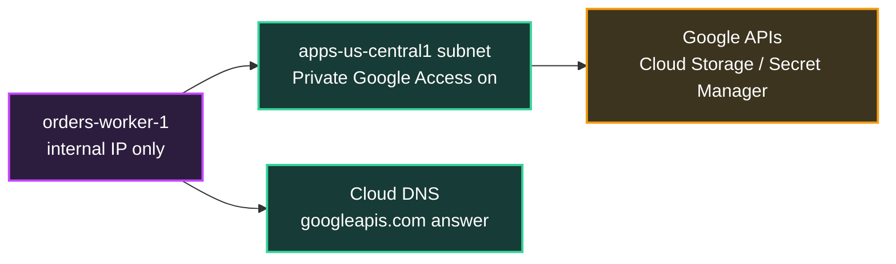
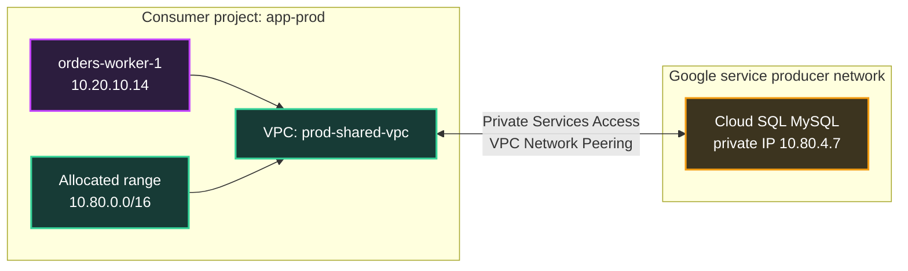
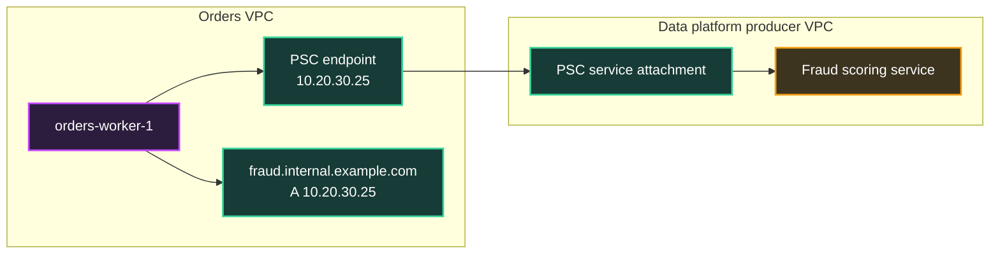
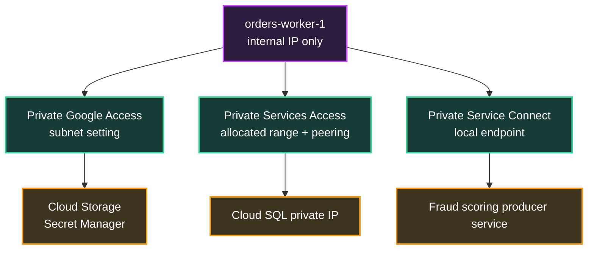

## Table of Contents

1. [Private Access to Managed Services](#private-access-to-managed-services)
2. [Private Google Access for Google APIs](#private-google-access-for-google-apis)
3. [Private Services Access for Cloud SQL Private IP](#private-services-access-for-cloud-sql-private-ip)
4. [Private Service Connect for Endpoints](#private-service-connect-for-endpoints)
5. [DNS, Routes, IAM, and Service Setup](#dns-routes-iam-and-service-setup)
6. [gcloud and Terraform Setup Shapes](#gcloud-and-terraform-setup-shapes)
7. [Verification Runbook](#verification-runbook)
8. [Choosing the Right Pattern](#choosing-the-right-pattern)
9. [Putting It All Together](#putting-it-all-together)
10. [What's Next](#whats-next)

## Private Access to Managed Services
<!-- section-summary: Private access starts by identifying the kind of destination: a Google API, a managed service network, or a producer endpoint. -->

Private access means a workload reaches a managed service through **private Google Cloud networking paths** instead of depending on a public external address on the workload. The workload might be a VM with only an internal IP address, a Cloud Run service using VPC egress, or a GKE Pod in a private cluster. The destination might be Cloud Storage, Secret Manager, Cloud SQL, Memorystore, or a service published by another team.

The first helpful split is the destination type. **Google APIs** are service endpoints such as `storage.googleapis.com` and `secretmanager.googleapis.com` that run on Google's production infrastructure. **VPC-hosted managed services** are services such as Cloud SQL, Filestore, and Memorystore where the service has private addresses in a producer VPC network. **Producer services** are services exposed by Google, another team, or a partner through a private endpoint or service attachment.

Here is the production story we will keep using. An order-processing VM named `orders-worker-1` sits in subnet `apps-us-central1` with no external IP address. It needs three private paths: it reads objects from Cloud Storage, fetches database passwords from Secret Manager, connects to a Cloud SQL MySQL instance through private IP, and later calls a fraud-scoring service published by the data platform team. All four calls are "private access" in a casual conversation, but they use different Google Cloud features.

| Workload need | Best starting feature | What it gives you |
|---|---|---|
| A private VM calls Cloud Storage or Secret Manager APIs | **Private Google Access** | Subnet-level access from internal-IP VMs to Google APIs and services |
| An app connects to Cloud SQL through private IP | **Private Services Access** | A private connection between your VPC and a service producer VPC network |
| An app calls Google APIs through an internal endpoint or calls a published producer service | **Private Service Connect** | A local internal endpoint or backend that forwards to a supported API or service |

Google Cloud lists these options separately because they solve different problems. Private Google Access is about **API reachability from private clients**. Private Services Access is about **private addressing for VPC-hosted managed services**. Private Service Connect is about **service-oriented endpoints** where the consumer uses a local private IP and the producer exposes only the service.

Now that we have the three names on the table, start with the simplest production pain: a VM has no external IP address, but the application still needs Google APIs.

## Private Google Access for Google APIs
<!-- section-summary: Private Google Access lets internal-IP VMs in an enabled subnet call Google APIs such as Cloud Storage and Secret Manager. -->

**Private Google Access** is a subnet setting that lets VM instances with only internal IP addresses reach Google APIs and services. It applies by subnet, so a VM in an enabled subnet can call supported Google APIs while a VM in a different disabled subnet cannot use that same path. A VM with an external IP address already has another way to reach Google APIs, so Private Google Access matters most for private VMs.

In the `orders-worker-1` example, the VM has no external IP address because the platform team wants batch workers to stay off the public internet. The application still needs to download order export files from Cloud Storage and read `projects/prod/secrets/db-password` from Secret Manager. Those requests go to Google API hostnames, not to a private address inside your subnet. Private Google Access gives that internal-IP VM a supported path to those APIs.

Private Google Access has three separate pieces in real deployments. The first piece is the **subnet setting**. The subnet that contains the VM network interface must have Private Google Access enabled. The second piece is **DNS**. Many teams keep the normal `googleapis.com` names, while stricter environments use private Google API domains such as `private.googleapis.com` or `restricted.googleapis.com` with Cloud DNS records. The third piece is **routing and firewall egress**. The VPC still needs a route for the Google API VIPs, and egress firewall policy must allow the traffic.



There is a common beginner trap here. Private Google Access handles network reachability to APIs while IAM still grants application permission. The VM calls Cloud Storage or Secret Manager using a service account. That service account needs IAM permissions such as `storage.objects.get` for the bucket or `secretmanager.versions.access` for the secret. Private access answers "can packets reach the API endpoint?" IAM answers "may this identity perform the API action?"

In production, teams often test this in layers. The first evidence is the VM network interface: it should have only an internal IP address and should sit in the intended subnet. The second evidence is the subnet setting for Private Google Access. The third evidence is DNS resolution for the API name. The fourth evidence is egress firewall policy. The final evidence is the actual API call using the VM service account. A network failure and an IAM failure can both look like "the app cannot read the secret," so separating the layers saves time.

Cloud Storage and Secret Manager are API-style destinations. Cloud SQL private IP has a different shape because the database instance lives behind a service producer network.

## Private Services Access for Cloud SQL Private IP
<!-- section-summary: Private Services Access creates a private connection to a service producer VPC, which is the pattern behind Cloud SQL private IP. -->

**Private Services Access**, often shortened to PSA, is a private connection between your VPC network and a VPC network owned by Google or a third-party service producer. The connection uses **VPC Network Peering** under the hood. Your workloads use internal IP addresses to reach the managed service, and the traffic stays within Google's network rather than using the public internet.

Cloud SQL private IP is the most familiar example. When the team creates `orders-mysql-prod` with private IP, Cloud SQL places the database engine in a Cloud SQL VPC managed by Google. Private Services Access connects the application VPC to that producer network so `orders-worker-1` can connect to the database private address.

Private Services Access requires an **allocated IP range**. This is a block of private address space reserved in your VPC for the service producer to use. Google Cloud recommends planning this range carefully because it must avoid overlaps with current subnets, future subnets, peered VPC ranges, VPN routes, Interconnect routes, and Network Connectivity Center spokes that share route information. A small range can work for a lab, but production teams usually reserve enough room for future managed services.



The setup has a clear order. A network admin enables the Service Networking API, reserves an internal allocated range for service networking, creates the private connection to `servicenetworking.googleapis.com`, and then creates or updates the managed service instance to use private IP. For Cloud SQL, an existing instance can be configured for private IP, but changing the connected network or enabling private IP can restart the instance and cause a short downtime window, so teams usually plan this as a maintenance change.

Private Services Access also has important reachability boundaries. The path uses non-transitive VPC Network Peering, so a second VPC peered to your application VPC lacks inherited access to the Cloud SQL private IP path through your VPC. That shows up often after a company adds a separate analytics VPC and expects it to reach the same database. The better design is to plan the database access network intentionally, use a supported multi-VPC pattern, or use a service-specific connection option where available.

The database connection still has non-network controls. Cloud SQL still has users, passwords or IAM database authentication depending on engine and setup, SSL/TLS settings, and application-level connection limits. Firewall rules in the consumer VPC must allow egress from the workload to the database private IP and port, and the database service itself still decides whether the client can authenticate. Private Services Access gives the private path while Cloud SQL remains a managed service.

Private Services Access fits database-style managed services. The next pattern fits situations where you want a local endpoint in your VPC that represents an API or producer service.

## Private Service Connect for Endpoints
<!-- section-summary: Private Service Connect gives consumers local internal endpoints for supported Google APIs and published producer services. -->

**Private Service Connect**, usually shortened to PSC, lets a consumer access a managed service privately from inside a VPC network. The consumer can use an internal IP address in its own VPC, and Google Cloud forwards traffic to a supported Google API, a Google managed service, or a published service from another producer. The producer keeps its network separate, and the consumer gets a local target that is easy to place in DNS and firewall policy.

For Google APIs, PSC can create an endpoint so `orders-worker-1` sends requests to an internal IP address instead of the public API endpoint address for names such as `storage.googleapis.com`. This gives the network team more explicit endpoint control. It can help when a company wants a known internal destination for API calls, centralized DNS records, and firewall rules that mention a private endpoint address.

For producer services, PSC solves a different problem. Imagine the data platform team publishes a fraud-scoring service from its own project. The orders team should call only that service, not peer entire VPC networks or receive broad route visibility into the data platform network. With PSC, the producer publishes a service attachment, and the consumer creates an endpoint in the consumer VPC. The orders app calls a local private IP such as `10.20.30.25`, and Google Cloud forwards the connection to the producer service.



Private Service Connect is useful when teams want **service-level connectivity** instead of broad network connectivity. The consumer can grant applications access to a specific endpoint. The producer can publish a service without sharing all subnet routes. This reduces the address planning pressure that appears with peering, especially when two networks have overlapping or messy IP ranges.

PSC still needs supporting configuration. The endpoint is a forwarding rule with an internal address, so the consumer project needs permissions to create internal addresses and forwarding rules. DNS records must point the application hostname at the endpoint. Egress firewall policy must allow traffic to the endpoint. For PSC endpoints to Google APIs, Google Cloud also documents prerequisites such as enabling required APIs and using Private Google Access for VMs without external IP addresses when they access Google APIs through an endpoint.

At this point we have three private access tools. The painful bugs usually happen between the tools, where DNS, routing, IAM, and service-specific setup get mixed together.

## DNS, Routes, IAM, and Service Setup
<!-- section-summary: Private access designs work best when DNS, routing, IAM, and service configuration are treated as separate checks. -->

Private access designs break down cleanly when each layer has its own job. **DNS** decides which IP address an application tries to reach. **Routes** decide the next hop for that destination. **Firewall rules** decide whether the packet may leave or enter a resource. **IAM** decides whether the caller may perform a Google API action. **Service-specific settings** decide whether the managed service accepts the connection.

For Private Google Access, DNS often decides whether API calls use normal `googleapis.com` answers, `private.googleapis.com`, or `restricted.googleapis.com`. A VM can sit in a subnet with Private Google Access enabled and still fail if custom DNS sends `storage.googleapis.com` somewhere unexpected. In stricter environments, `restricted.googleapis.com` is often paired with VPC Service Controls, but the exact domain choice needs to match the APIs the application uses.

For Private Services Access, DNS may be boring for Cloud SQL if the app connects to the private IP directly or uses a connection name with a connector. The important parts are the allocated range, the private connection, the Cloud SQL private IP setting, the peering routes, and the database port. If the route exists but the app receives `Access denied for user`, the network path may be fine and the database authentication layer needs attention.

For Private Service Connect, DNS is usually part of the design. The endpoint has an internal IP address, but production applications should call a stable service name. That name might be `storage.googleapis.com` through a PSC API endpoint pattern, or it might be `fraud.internal.example.com` for a producer service. The DNS record should live where the client can resolve it, which can mean a Cloud DNS private zone attached to the right VPC network.

IAM deserves its own separate check. A service account attached to `orders-worker-1` might have permission to call Secret Manager but lack permission to read the Cloud Storage bucket. Private access leaves those API permissions intact. In fact, private networks often make IAM more important because teams remove public paths and expect identity to carry the final authorization decision.

Service setup also stays separate. Cloud SQL private IP requires the Cloud SQL instance to use the selected network. PSC for Google APIs requires the endpoint and related APIs to exist. A published PSC service requires producer acceptance settings and a healthy producer backend. Treating every failure as "networking" creates long debugging loops. Treating each layer as evidence gives the team a faster path.

## gcloud and Terraform Setup Shapes
<!-- section-summary: Private access setup is clearer when each pattern has its own command shape, Terraform resource shape, and verification target. -->

Now turn the three private access patterns into real setup shapes. We will use `prod-shared-vpc` in project `net-prod-host`, subnet `apps-us-central1`, and workload project `app-orders-prod`. The exact project split can change, but the resource relationships stay the same.

For **Private Google Access**, the subnet setting is the first control. This enables internal-IP VMs in the subnet to reach Google APIs and services through the supported private path:

```bash
gcloud compute networks subnets update apps-us-central1 \
  --project=net-prod-host \
  --region=us-central1 \
  --enable-private-ip-google-access

gcloud compute networks subnets describe apps-us-central1 \
  --project=net-prod-host \
  --region=us-central1 \
  --format='value(privateIpGoogleAccess)'
```

The same setting in Terraform lives on the subnetwork:

```hcl
resource "google_compute_subnetwork" "apps_us_central1" {
  project                  = var.host_project_id
  name                     = "apps-us-central1"
  region                   = "us-central1"
  ip_cidr_range            = "10.20.10.0/24"
  network                  = google_compute_network.prod_shared.id
  private_ip_google_access = true
}
```

For **Private Services Access**, the network team reserves a producer range, creates the private service connection, and then the database team creates Cloud SQL with private IP on that network:

```bash
gcloud services enable servicenetworking.googleapis.com \
  --project=net-prod-host

gcloud compute addresses create google-managed-services-prod \
  --project=net-prod-host \
  --global \
  --purpose=VPC_PEERING \
  --prefix-length=16 \
  --description="Peering range for Google managed services" \
  --network=prod-shared-vpc

gcloud services vpc-peerings connect \
  --project=net-prod-host \
  --service=servicenetworking.googleapis.com \
  --ranges=google-managed-services-prod \
  --network=prod-shared-vpc

gcloud services vpc-peerings list \
  --project=net-prod-host \
  --network=prod-shared-vpc
```

The matching Terraform shape makes the allocated range and private service connection reviewable:

```hcl
resource "google_compute_global_address" "private_services_range" {
  project       = var.host_project_id
  name          = "google-managed-services-prod"
  purpose       = "VPC_PEERING"
  address_type  = "INTERNAL"
  prefix_length = 16
  network       = google_compute_network.prod_shared.id
}

resource "google_service_networking_connection" "private_services" {
  network                 = google_compute_network.prod_shared.id
  service                 = "servicenetworking.googleapis.com"
  reserved_peering_ranges = [google_compute_global_address.private_services_range.name]
}
```

Cloud SQL private IP then points at that VPC network. In Terraform, the database resource usually depends on the private service connection so the address path exists before the instance asks for a private address:

```hcl
resource "google_sql_database_instance" "orders_mysql" {
  project          = var.app_project_id
  name             = "orders-mysql-prod"
  region           = "us-central1"
  database_version = "MYSQL_8_0"

  settings {
    tier = "db-custom-2-8192"

    ip_configuration {
      ipv4_enabled    = false
      private_network = google_compute_network.prod_shared.id
    }
  }

  depends_on = [google_service_networking_connection.private_services]
}
```

For **Private Service Connect to Google APIs**, the consumer creates a global internal address and a global forwarding rule that targets a supported API bundle. The `all-apis` bundle gives access to supported Google APIs, while `vpc-sc` restricts the endpoint to APIs that support VPC Service Controls:

```bash
gcloud compute addresses create psc-googleapis \
  --project=net-prod-host \
  --global \
  --purpose=PRIVATE_SERVICE_CONNECT \
  --addresses=10.20.30.25 \
  --network=prod-shared-vpc

gcloud compute forwarding-rules create psc-googleapis \
  --project=net-prod-host \
  --global \
  --network=prod-shared-vpc \
  --address=psc-googleapis \
  --target-google-apis-bundle=all-apis

gcloud compute forwarding-rules describe psc-googleapis \
  --project=net-prod-host \
  --global \
  --format='yaml(IPAddress,target,network)'
```

A Terraform-managed PSC endpoint uses the same two-resource shape when the provider version supports the target bundle field:

```hcl
resource "google_compute_global_address" "psc_googleapis" {
  project      = var.host_project_id
  name         = "psc-googleapis"
  address_type = "INTERNAL"
  purpose      = "PRIVATE_SERVICE_CONNECT"
  address      = "10.20.30.25"
  network      = google_compute_network.prod_shared.id
}

resource "google_compute_global_forwarding_rule" "psc_googleapis" {
  project               = var.host_project_id
  name                  = "psc-googleapis"
  network               = google_compute_network.prod_shared.id
  ip_address            = google_compute_global_address.psc_googleapis.id
  target                = "all-apis"
  load_balancing_scheme = ""
}
```

DNS still needs its own review. Some PSC API endpoint designs use automatically created `p.googleapis.com` names. Others create private Cloud DNS records for the API names the application already uses. The setup choice should be written down with the endpoint, because a private endpoint without the matching DNS answer leaves applications calling the old destination.

## Verification Runbook
<!-- section-summary: Private access debugging checks subnet settings, DNS answers, routes, firewall egress, producer connections, IAM, and service-specific acceptance separately. -->

Private access incidents get easier when the team checks each layer in order. Start with the source resource. Confirm the VM, Cloud Run service, or GKE workload uses the expected VPC path and source IP. Then check the destination type, because the command set changes by pattern.

For Private Google Access, verify the subnet setting, DNS answer, egress path, and IAM permission:

```bash
gcloud compute networks subnets describe apps-us-central1 \
  --project=net-prod-host \
  --region=us-central1 \
  --format='yaml(name,privateIpGoogleAccess,ipCidrRange)'

gcloud logging read \
  'protoPayload.serviceName="secretmanager.googleapis.com"
   severity>=ERROR' \
  --project=app-orders-prod \
  --limit=20 \
  --format='table(timestamp,protoPayload.authenticationInfo.principalEmail,protoPayload.status.message)'
```

For Private Services Access, verify the allocated range, peering connection, Cloud SQL private address, and database authentication:

```bash
gcloud compute addresses list \
  --project=net-prod-host \
  --global \
  --filter='purpose=VPC_PEERING' \
  --format='table(name,address,prefixLength,status)'

gcloud services vpc-peerings list \
  --project=net-prod-host \
  --network=prod-shared-vpc

gcloud sql instances describe orders-mysql-prod \
  --project=app-orders-prod \
  --format='yaml(name,region,ipAddresses,settings.ipConfiguration)'
```

For Private Service Connect, verify the endpoint address, forwarding rule target, DNS answer, and egress firewall rule:

```bash
gcloud compute forwarding-rules list \
  --project=net-prod-host \
  --global \
  --filter='target:(all-apis OR vpc-sc)' \
  --format='table(name,IPAddress,target,network)'

gcloud compute forwarding-rules describe psc-googleapis \
  --project=net-prod-host \
  --global \
  --format=yaml
```

Connectivity Tests can help when the source and destination are supported endpoints. For Cloud SQL and other managed services, the test can show the customer-side VPC path and firewall evidence even when the producer-side service internals stay hidden. VPC Flow Logs help answer whether packets left the subnet, and service logs answer whether the managed service accepted the connection.

The most common private access mistake is mixing layers. A Secret Manager call can fail because the subnet lacks Private Google Access, because DNS points at the wrong VIP, because egress firewall rules block the path, because the service account lacks `secretmanager.versions.access`, or because VPC Service Controls denies the request. The word "private" describes the network path, and the final successful request still needs DNS, routes, firewall, IAM, and service policy to agree.

That separation gives us a practical selection guide.

## Choosing the Right Pattern
<!-- section-summary: The right private access option follows the destination type and the amount of endpoint control the team needs. -->

The destination gives the first clue. If the workload calls Google APIs such as Cloud Storage, Secret Manager, Pub/Sub, or Artifact Registry from a VM that has only an internal IP address, **Private Google Access** is usually the first design to understand. It is a subnet setting, and it pairs with DNS and routes for Google API VIPs.

If the workload connects to Cloud SQL, Memorystore, Filestore, AlloyDB, or another supported VPC-hosted managed service through private IP, **Private Services Access** is often involved. The key design task is reserving a non-overlapping allocated range and creating the private service connection before the service needs addresses from that range.

If the workload should call a private endpoint in its own VPC that represents Google APIs or a producer service, **Private Service Connect** is the pattern to study. It works well when teams want a local IP endpoint, service-level exposure, producer-consumer separation, or a cleaner alternative to broad network peering.

| Question | Usually points toward | Reason |
|---|---|---|
| Does an internal-IP VM need `storage.googleapis.com` or `secretmanager.googleapis.com`? | **Private Google Access** | The destination is a Google API on Google's production infrastructure |
| Does the app need Cloud SQL private IP? | **Private Services Access** | Cloud SQL private IP uses private service access internally |
| Does the consumer need an internal endpoint for Google APIs? | **Private Service Connect** | PSC endpoints can forward API requests to Google APIs |
| Does another team want to publish one service without sharing its whole VPC? | **Private Service Connect** | The producer publishes a service attachment and the consumer creates an endpoint |
| Does the issue mention overlapping CIDR ranges or non-transitive peering? | **Private Service Connect or redesign** | Endpoint-based access avoids some broad peering constraints |

One production environment can use all three. The orders VM can use Private Google Access for Secret Manager, Private Services Access for Cloud SQL private IP, and Private Service Connect for the fraud service. That is normal. The practical goal is matching each feature to the destination and keeping each layer easy to test.

One full request path ties the pieces together.

## Putting It All Together
<!-- section-summary: A real private app often uses all three patterns, with each one serving a different destination. -->

After the network team finishes the design, `orders-worker-1` runs without an external IP address in subnet `apps-us-central1`. Private Google Access is enabled on that subnet. The VM service account has permission to read a Cloud Storage bucket and access one Secret Manager secret. DNS and routes send Google API traffic through the approved Google API path. That covers API calls.

The same app connects to `orders-mysql-prod` through Cloud SQL private IP. The VPC has an allocated service networking range, a private services connection, and a Cloud SQL instance configured for private IP on that network. Firewall egress allows TCP 3306 to the database private address, and the database user still has to authenticate correctly. That covers the managed database path.

The fraud-scoring call uses Private Service Connect. The data platform team publishes the service. The orders project creates a PSC endpoint with an internal IP address and a private DNS record for the application hostname. The app calls the local endpoint, and Google Cloud forwards the connection to the producer service without exposing the producer VPC as a general routing domain. That covers service-to-service private connectivity.



Private access is much easier to operate when the team writes down which destination uses which pattern. "Private" by itself is too broad. "Cloud SQL uses Private Services Access, Google APIs use Private Google Access, and the fraud service uses Private Service Connect" gives the on-call engineer something concrete to verify.

## What's Next
<!-- section-summary: The next article moves from private service access to shared networks, hybrid links, and a practical troubleshooting ladder. -->

Private access solves how one workload reaches managed services and APIs. Large GCP environments add another layer: many teams share the same network foundation, and some traffic crosses VPNs, Interconnect, or other routed paths.

The next article covers Shared VPC, hybrid connectivity, and troubleshooting. It explains host projects, service projects, subnet delegation, Cloud VPN, Cloud Interconnect, Cloud Router, Network Connectivity Center, and a practical ladder for proving where a connection fails.

---

**References**

- [Private access options for services](https://docs.cloud.google.com/vpc/docs/private-access-options) - Compares private connectivity options for Google APIs, VPC-hosted services, and serverless access patterns.
- [Private Google Access](https://docs.cloud.google.com/vpc/docs/private-google-access) - Explains subnet-level access from internal-IP VMs to Google APIs and services.
- [Configure Private Google Access](https://docs.cloud.google.com/vpc/docs/configure-private-google-access) - Shows the current subnet update command, verification command, DNS options, and Terraform subnetwork setting.
- [Private services access](https://docs.cloud.google.com/vpc/docs/private-services-access) - Defines private services access, service producer networks, VPC Network Peering, and supported services.
- [Configure private services access](https://docs.cloud.google.com/vpc/docs/configure-private-services-access) - Documents allocated ranges, private connections, permissions, and setup prerequisites.
- [Private Service Connect](https://docs.cloud.google.com/vpc/docs/private-service-connect) - Describes PSC endpoints, backends, producer services, and service-oriented private access.
- [Access Google APIs through endpoints](https://docs.cloud.google.com/vpc/docs/configure-private-service-connect-apis) - Documents Private Service Connect endpoints for Google APIs, DNS requirements, API enablement, and endpoint prerequisites.
- [Cloud SQL private IP](https://docs.cloud.google.com/sql/docs/mysql/private-ip) - Explains Cloud SQL private IP, private services access, VPC peering behavior, and private IP limitations.
- [Terraform Registry: google_compute_global_forwarding_rule](https://registry.terraform.io/providers/hashicorp/google/latest/docs/resources/compute_global_forwarding_rule) - Defines the Terraform forwarding rule shape used by Private Service Connect endpoints for Google API bundles.
